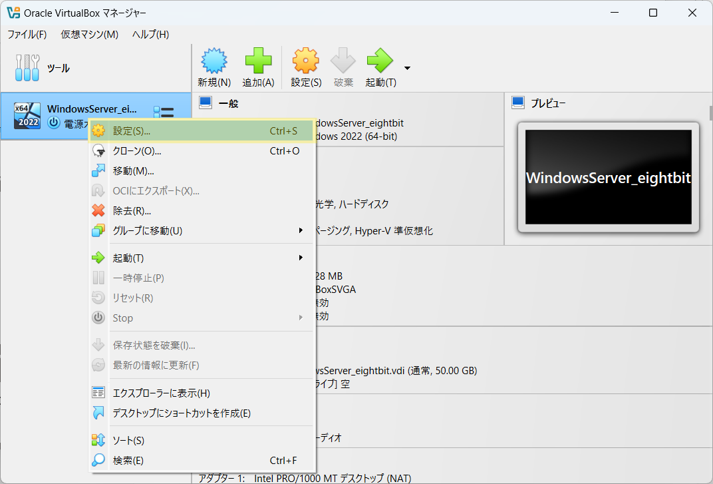
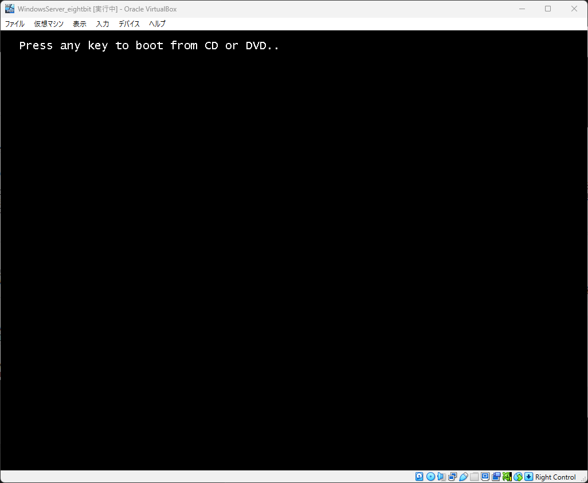
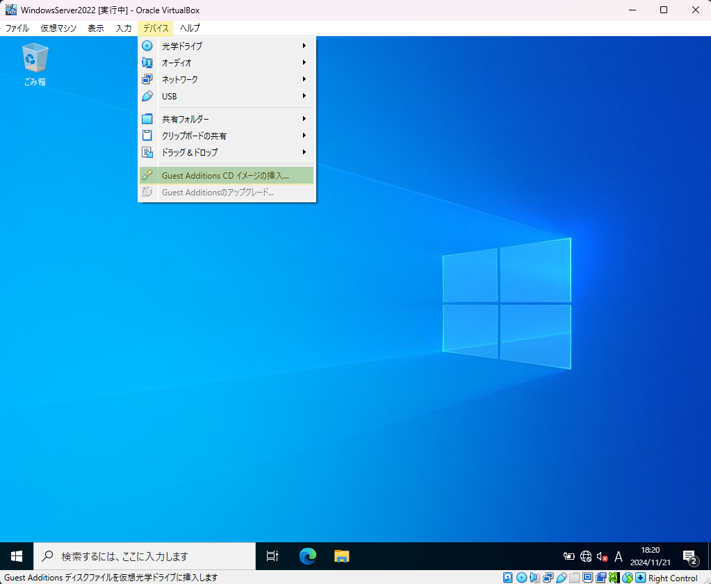

# WindowsServer

以下の手順に従い、WindowsServerを学習する環境を構築しましょう  

## WindowsServer

    
1. 導入

    

### 1. 導入

#### WindowsServerイメージファイル  

仮想マシンにインストールするサーバのイメージファイルです  
約 **5GB** のファイルですので、予めダウンロードしてデスクトップ等、わかりやすい場所に移動しておきましょう  

※実行する必要はありません

[WindowsServer OSイメージファイル](https://software-static.download.prss.microsoft.com/sg/download/888969d5-f34g-4e03-ac9d-1f9786c66749/SERVER_EVAL_x64FRE_ja-jp.iso)

#### WindowsOSイメージファイル  

仮想マシンにインストールするクライアントのイメージファイルです  
約 **5GB** のファイルですので、予めダウンロードしてデスクトップ等、わかりやすい場所に移動しておきましょう  

※実行する必要はありません

[Windows11 OSイメージファイル](https://software-static.download.prss.microsoft.com/dbazure/888969d5-f34g-4e03-ac9d-1f9786c66749/26100.1742.240906-0331.ge_release_svc_refresh_CLIENTENTERPRISEEVAL_OEMRET_x64FRE_ja-jp.iso)

#### VirtualBox

**まずはお使いのPCにインストールされているかを確認して下さい**  
仮想環境を構築するためのアプリケーションです  
WindowsPCの中に仮想的にWindowsServer OS(WindowsServer PC)を構築します  
ダウンロード完了したら実行し、インストールまで済ませましょう  

[VirtualBoxインストーラ](https://download.virtualbox.org/virtualbox/7.0.14/VirtualBox-7.0.14-161095-Win.exe)

    

    
2. 仮想マシン作成

    

### 2. 仮想マシン作成

**VirtualBoxマネージャ画面**  

VirtualBoxを起動し、以下の画面を表示したら**右上**の `新規` をクリック

**仮想マシン概要設定画面**  

黄色いハイライト部分を画面と同じ様に設定しましょう
- 名前 → 仮想マシンの名前(任意の名前で構いません)
- タイプ → **Microsoft Windows**
- バージョン → **Windows 2022 (64-bit)**

設定したら `次へ` をクリック

**ハードウェアリソース設定画面1**  

メモリ容量とCPU割当の設定画面です  

- メモリ容量 → 4096 MB
- プロセッサー数 → 2 (CPU)
- EFIを有効化(一部のOSのみ) → チェックを入れる

設定したら `次へ` をクリック

**ハードウェアリソース設定画面2**  

ストレージ容量設定画面です  
黄色ハイライトの箇所を `50.00 GB` に設定して `次へ` をクリック

**仮想マシン設定概要画面**

作成する仮想マシンの概要を確認する画面です  
以下の画像と比較し、大きな差異がない事を確認し、`完了` をクリック

**VirtualBoxマネージャ画面**  

左側に赤い帽子の項目が表示されます(これが一つの仮想マシンです)  
該当項目を右クリックし、`設定` をクリック

**仮想マシン設定画面(システム)**

画面左の `システム` をクリック > 画面右の **高度** タブをクリック

- `クリップボードの共有` をクリック > `双方向` を選択
- `ドラッグ&ドロップ` をクリック > `双方向` を選択

**仮想マシン設定画面(ストレージ)**

同画面左の `ストレージ` > `空` > 右上の`◎` を順にクリック

以下の選択項目からは `Choose a Disk File...` をクリックし、  
[導入](#1-windowsserverイメージファイル)でダウンロードしたWindowsServer OSのイメージファイルを選択します  

イメージファイルを選択後、元の画面に戻ります  
黄色ハイライト部分が `SERVER_EVAL_x64FRE_ja-jp_202...` のような表記になっている事を確認して下さい  

その後、 `Live CD/DVD` をクリックして、チェックを入れます

**仮想マシン設定画面(ネットワーク)**

同画面左の `ネットワーク` > `割り当て` のドロップダウンリストを開き、  
**ブリッジアダプター** を選択

その後 `名前` のドロップダウンリストを開き、`Realtek PCIe GbE Familly Controller` を選択  
最後に、画面右下の `OK` をクリックして下さい

:::danger
`Realtek PCIe GbE Familly Controller` がドロップダウンリストに存在しない場合は、講師へ連絡しましょう  
:::

以上で仮想マシンの作成は完了です  

    

    
3. WindowsServerのインストール

    

### 3. WindowsServerのインストール

以下の画面から作成した仮想マシンをクリックした状態で右上の `起動` をクリック

**仮想マシン画面**

仮想マシンは別ウィンドウで動作を確認することができます  
最初に以下の画面が表示されるので、一度画面をクリックし、`Enter` キーを押して下さい

 :::caution
仮想マシンの画面をクリックすると**ホストOS側(実際に使用しているPC側のWindows)のマウス**が動かせなくなります  
これは**右の** `Ctrl` キーを押すことで解消します  
 :::

**WindowsServerインストール画面**

1. しばらく待つと以下のような画面が表示されます  
    理由がない限り設定を変更せず、`続行` をクリック

    

2. 以下の画面になったら、 `今すぐインストール` をクリック
    

3. インストールするWindowsServerの種類(エディション)を選択します  

    エディションの指定がない場合は
    - Windows Server 20xx Standard Evaluation **(デスクトップエクスペリエンス)**

    `ServerCore` のインストール指示があった場合は、
    - Windows Server 20xx Standard Evaluation

    をクリックしましょう  
    その後、 `次へ` をクリック

    

4. この画面は、ソフトウェアライセンス条項の同意画面です  
    問題がなければ 画面下部の `Microsoft ソフトウェアライセンス条項に同意します。 ...` チェックボックスをクリックします  
    チェックが付いたら、 `次へ` をクリック

    

5. インストールの種類を選択します  
    今回は、下段の `カスタム:Microsoft Server オペレーティングシステムのみをインストール` をクリック

    

    :::note
    既にインストールされているWindowsServerのバージョンアップを実施する場合は  
    `アップグレード: ファイル、設定、およびアプリケーションを保持して ...` を選択します  
    :::

6. WindowsServer のインストール先を指定する画面です  
    理由がない限り変更はせず、 `次へ` をクリック
    

    :::note
    記憶領域(ハードディスクやSSD)が複数存在する場合や  
    1つの記憶領域を分割しWindowsServerをインストールする場合は、この画面で操作を実施します。
    :::

    インストールが開始されるので、完了するまで待ちます  
    

    インストール完了後、**Administrator** のパスワード設定画面が表示されます  
    任意のパスワードを2回入力
    

    最後に、以下のロック画面が表示されたらWindows Serverのインストールは完了です  
    

    :::tip
    ロック画面を解除して、WindowsServerへログインする場合、
    通常は `Ctrl` + `Alt` + `Delete`キー を同時押しする必要がありますが、仮想マシン上ではうまく動作しません  
    代わりに `右Ctrl` + `Delete`キー を同時押しします  
    ::::

    
4. Guest Additionsのインストール

    

### 4. Guest Additionsのインストール

**ホストOS** と **仮想マシン** 間でファイルの移動やコピー&ペーストを実施するために **Guest Additions** をインストールします  
予め作成した仮想マシンを起動しておきましょう。

1. 仮想マシンウィンドウのメニューから `デバイス` > `Guest Additions CD イメージの挿入...` を順にクリック  
これで、仮想マシンに `Guest Additions` のインストールデータが格納された **CD** を挿入したことになります  

    

2. タスクバーから `エクスプローラー`    をクリックして起動し  
    左ペインから `CDドライブ(D:) VirtualBox Guest Additions` をクリック  
    挿入された **CD** に格納されたデータを確認することができます  

    

3. `VBoxWindowsAdditions` をダブルクリックして起動  

    

4. ウィザードが開くので `Next` をクリック  

5. 以下画面になるまで、`Next` をクリックし、 `Install` をクリック  

6. `Finish` をクリック  
仮想マシンが自動で再起動するので、しばらく待ちます。  

以上でGuest Additionsのインストールは完了です  

:::note

研修中にホストPCから仮想マシンへ、ファイルの移動が必要になった場合は  
移動したいファイルを仮想マシンに向けて `ドラッグ&ドロップ` しましょう

:::

