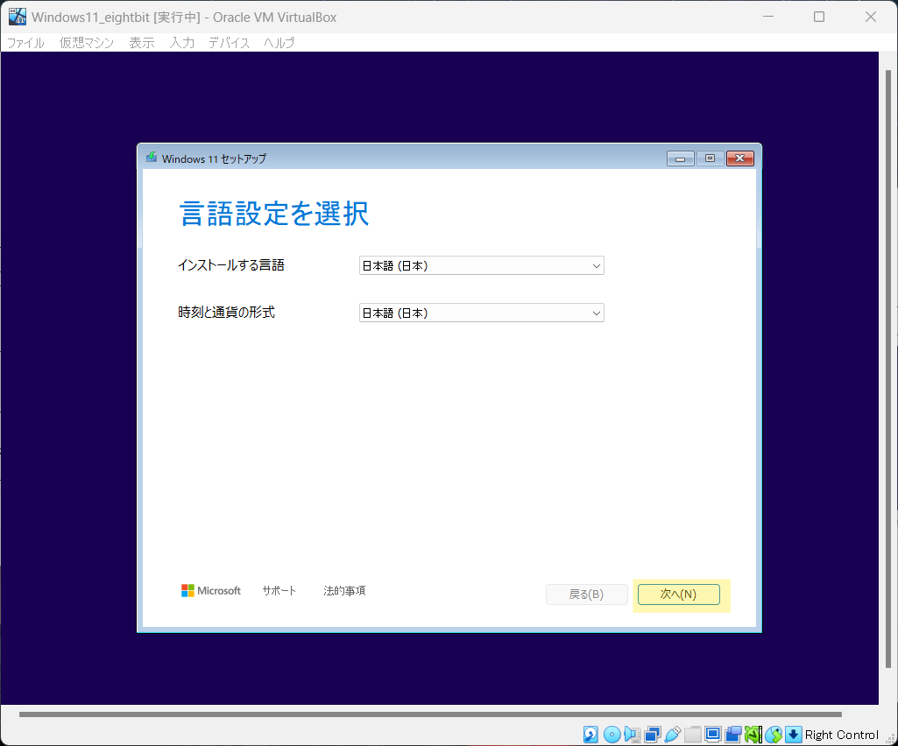
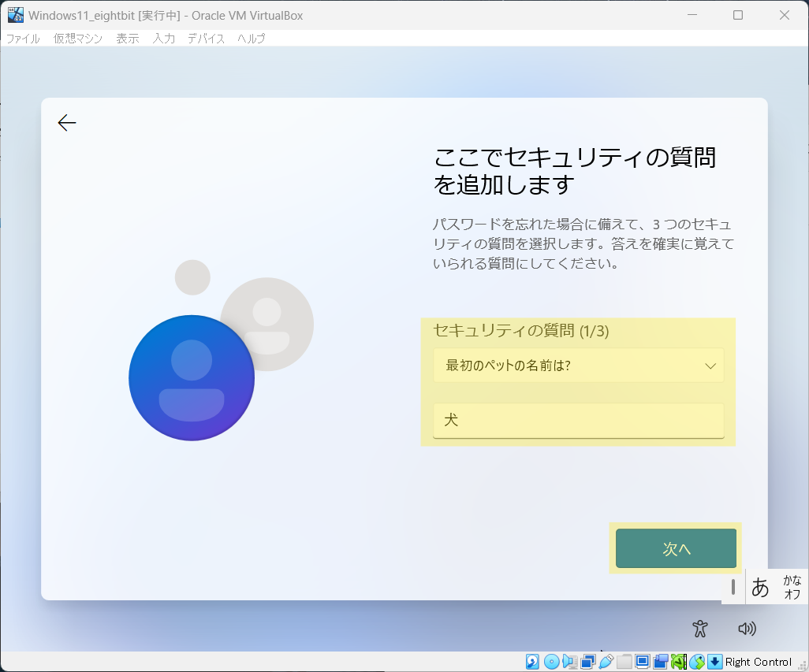

# クライアント

構築したWindowsの役割や機能は、クライアントを介して動作を確認します  
以下の手順の従い、Windowsをインストールしたクライアント用の仮想マシンを構築しましょう  

    
1. 仮想マシン作成

    

### 1. 仮想マシン作成

[Windowsの構築](http://localhost:3000/eightbit-saurus/docs/Windows/%E7%92%B0%E5%A2%83%E6%A7%8B%E7%AF%89/page1#windowsos%E3%82%A4%E3%83%A1%E3%83%BC%E3%82%B8%E3%83%95%E3%82%A1%E3%82%A4%E3%83%AB) でダウンロードした **WindowsOSイメージファイル** を使用して
以下の仮想マシンを作成しましょう  

#### 仮想マシン作成画面
- 仮想マシン概要
    - 名前 → 任意
    - タイプ → Microsoft Windows
    - バージョン → Windows 11(64-bit)
- ハードウェアリソース
    - メモリ容量 → 4096MB
    - プロセッサー数 → 2
    - EFIを有効化(一部のOSのみ) → チェックを入れる
    - ディスクサイズ: 30GB

#### 仮想マシン設定画面

- Windowsの構築と同様の設定

    
2. Windowsのインストール

    

### 2. Windowsのインストール

予め作成した仮想マシンを起動しておきましょう  

**仮想マシン画面**

最初に以下の画面が表示されるので、一度画面をクリックし、`Enter` キーを押して下さい

**Windowsインストール画面**

1. しばらく待つと言語の選択画面が表示されます  
    理由がない限り設定を変更せず、`次へ` をクリック

    

2. こちらの画面も理由がない限り設定を変更せず、`次へ` をクリック
    

3. Windowsをセットアップ方法を選択する画面です  

    今回は **新規インストール** を実施するので  
    `Windows xx のインストール` を選択 > `I agree everything will...` にチェックを入れる > `次へ` をクリック  
    の順で操作

    

    :::note
    既にインストールされているWindowsに不具合がある場合は  
    `PC を修復する` を選択することで、修復を試みることができます  
    :::

4. この画面は、ソフトウェアライセンス条項の同意画面です  
    問題がなければ `同意する` をクリック  

    

5. Windows のインストール先を指定する画面です  
    理由がない限り変更はせず、 `次へ` をクリック

    

6. インストール前の確認画面です  
    問題がなければ、`インストール` をクリック

    

    インストールが開始されるので、完了するまで待ちます  
    

7. インストール完了後、初期設定ウィザードが開始します  
    `日本`を選択して、`はい` をクリック

    

8. `はい` をクリック

    

8. `スキップ` をクリック

    

8. `インターネットに接続していません` をクリック

    

9. ユーザの名前を入力(任意の名前で構いません)して `次へ` をクリック  
    

10. 任意のパスワードを入力して `次へ` をクリック

    

11. 次の画面でパスワードの再入力を求められるので、再度入力して `次へ` をクリック

    

12. ユーザへログイン不可能な場合に使用するセキュリティの質問を設定する画面です  
    任意の質問と回答を設定後、`次へ` をクリック  
    この操作を計3回実施してください

    

13. プライバシー設定画面です  
    今回は設定を変更しないので `次へ` を複数回クリックし、画面を進めて行きます  

    

14. 最後に `同意` をクリックし、セットアップが完了するまでしばらく待ちます  

    

以上でWindowsのインストールは完了です  

    
3. 使用準備

    

インストールが完了したWindowsは、画面左下に以下の画像のような表示がされる場合があります  

    

この場合、インターネットを介したライセンスの有効化がされていない状態です  
以下の指示に従って一時的にインターネットへ接続して、有効化を完了させましょう  

1. 仮想マシンを起動した状態で、上部のメニューから `デバイス` > `ネットワーク` > `ネットワーク設定` をクリック  

    

2. `名前` のドロップダウンリストを開き、`Intel(R) Wireless-AC 9560` を選択後、画面右下の `OK` をクリックして下さい

    

3. 5分程度すると、画面右下が以下の表示になります  

    

4. 最後に、再度ネットワークの設定画面を開いて
    `名前` のドロップダウンリストを **元の設定** に戻してください  

    

