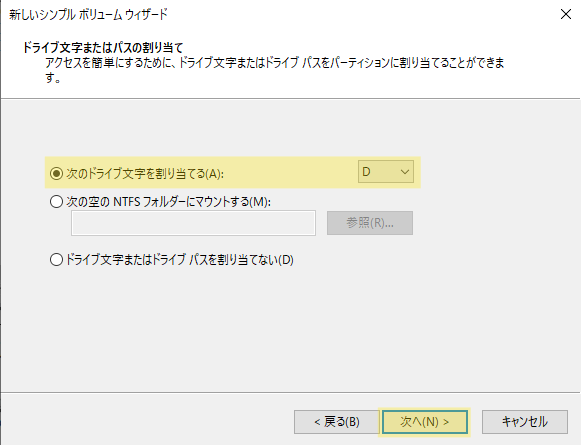
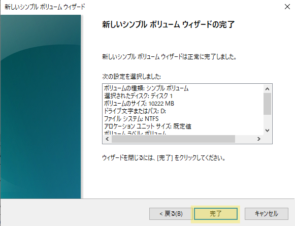

# ディスク構成

PC上の主要なデータはHDD(ハードディスク)やSSD(ソリッドステートドライブ)といった **記憶媒体** に保存されます  
記憶媒体をOSが管理することで、データの読み書きが可能になります  

WindowsOSでは記憶媒体のことを **ディスク** と呼び、予め定めた管理方式で管理します  

## ディスクの管理

### ディスクの管理方式

ディスクを管理する方式には以下の種類があります

- #### ベーシックディスク
    Windowsで一般的に利用されている方式で、シンプルにディスクを管理します  
    本研修でもベーシックディスクを利用した学習を行います  

- #### ダイナミックディスク
    ベーシックディスクよりも多機能で柔軟性のある方式です  
    多機能ゆえに扱いが難しく、現在では非推奨となっています  

### ディスクの記憶領域と区切り

ディスクは記憶領域を複数のスペースに区切ることができます  
この区切りのことを **ベーシックディスク** では `パーティション` と呼び、パーティションで区切られた各記憶領域のことを `ボリューム` と呼びます  

記憶領域を区切ることで、ボリュームごとに保存するデータを分け、整理することが可能です  
例えば、以下のようにWindowsOSのシステムデータとユーザのデータを、ボリュームごとに分けることができます  

### ドライブ

ボリュームに、管理しやすいようドライブレター(記号)を付加した領域を `ドライブ` と呼びます  

特にWindowsOSのシステムをインストールするドライブは、 ドライブレター `C:` が付加され  
一般的に `Cドライブ` と呼ばれます  

---

### 記憶媒体の増設

実機のサーバでは記憶媒体を増設し、記憶可能な領域を増やす作業を実施する場合があります  
この場合、記憶媒体をマシンに接続する作業の他に  
OS上で新しい記憶媒体を認識できるようディスクの初期設定を実施する必要があります  

構築したWindowsServerには、既に記憶媒体が1台搭載されていますが  
HDD を新たに仮想マシンへ増設して `Dドライブ` を追加作成してみましょう  
以下の手順に従い、作業を実施してください  

    
ディスクの構成変更

    

### 仮想マシンにHDDを追加

予めWindowsServerをシャットダウンして、仮想マシンの電源をオフにしておきましょう  

1. 仮想マシンの設定を開き、`ストレージ` 設定の画面で  
    **ハイライトされているボタン** > `ハードディスク` をクリック

    

2. 新たな仮想上のHDDを作成します  
    `作成` をクリック

    

3. HDDの容量を `10 GB` に設定し、 `完了` をクリック
    

4. **Not Attached** 配下にある作成したHDD > `選択` をクリック

    

5. 作成したHDDが一覧に追加されたことを確認して、 `OK` をクリック

    

### ディスクの管理

HDDの追加設定が完了したら、仮想マシンを起動してください  

1. サーバマネージャ > `ツール` > `コンピュータの管理` をクリック

2. 以下の画面が表示されるので、 `OK` をクリック

3. コンピュータの管理画面の左カラムから `記憶域` > `ディスクの管理` の順でクリックして **ディスクの管理画面** を表示します

4. ハイライトされている `CD-ROM 0` が、既に `Dドライブ` として設定されています  
    右クリックし、 `ドライブ文字とパスの変更` をクリック

    

    :::note
    `CD-ROM 0`は **CDドライブ** を指しており、CDにデータを読み書きできるドライブのことです
    :::

10. `CD-ROM 0` のドライブレターを `E:` へ変更します  
    `変更` をクリック

    

11. `次のドライブ文字を割り当てる` の項目で `E` を選択して、 `OK` ボタンをクリック

    

12. `はい` をクリック

    

13. `CD-ROM 0` が `Eドライブ` になっていることを確認

14. WindowsServerインストール時に、未割り当てに設定した領域を `Dドライブ` として割り当てます  
    `ディスク 1` に存在する `10.00GB 未割り当て` を 右クリック > `新たなシンプルボリューム` をクリック

    

15. `次へ` をクリック

    

16. `次へ` をクリック

    

17. `次のドライブ文字を割り当てる` の項目が `D` になっていることを確認して `次へ` をクリック

    

18. `次へ` をクリック

    

19. `完了` をクリック

    

20. `未割り当て`の領域が `ボリューム`に変更され、ボリューム一覧に `ボリューム(D:)` が存在することを確認

    

以上で、HDDの追加と `Dドライブ` の作成作業は終了です  

