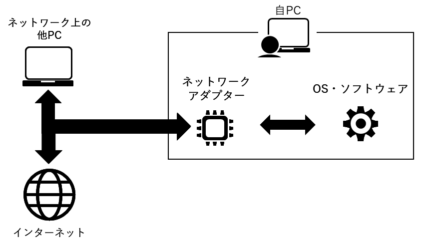
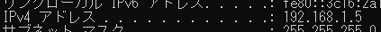

# 演習1 ネットワークコマンド

各演習のコマンドを実行した結果をスクリーンショットし  
演習が完了したら、講師へ提出しましょう  
結果が画面に収まらない場合は、結果の冒頭をスクリーンショットしましょう  

:::caution
この演習は仮想マシン上ではなく、ホストPC上のコマンドプロンプトで実施しましょう
:::

## ipconfig

### 演習1-1. TCP/IP の設定概要を確認する

ネットワーク情報の **概要** を表示します  

```batch title="TCP/IP の設定概要を確認する"
ping ipconfig
```

### 演習1-2. TCP/IP の設定を全て確認する

ネットワーク情報を全て表示します  

```batch title="オプション /all を付加してTCP/IP の設定を全て確認する"
ping ipconfig /all
```

## ping

### 演習1-3. ネットワークアダプター(NIC)へpingが通るか確認

ネットワークアダプター(NIC)は、PCに搭載されているネットワークとの接続を処理するハードウェアです  
アダプターごとにIPアドレスを割振ることができるので、IPアドレスをネットワーク上の *住所* とすると *ポスト* のような存在です  

研修中で実施している **静的IPアドレスの設定** はネットワークアダプターに静的なIPアドレスを設定しています  



ネットワークアダプターのIPアドレスは `ipconfig` コマンドで確認しましょう



```batch title="ネットワークアダプターのIPアドレス へ pingが通るか確認"
ping (ネットワークアダプターのIPアドレス)
```

## nslookup

### 演習1-4. ドメイン名からIPアドレスを検索

```batch title="google.co.jp のIPアドレスを確認"
nslookup google.co.jp
```

### 演習1-5. IPアドレスからドメイン名を検索

```batch title="142.250.199.99 のドメイン名を確認"
nslookup 142.250.199.99
```

:::note
IPアドレスに人間が覚えやすいように付けた別名を `ドメイン名` と呼びます  
:::

## tracert

### 演習1-6. ネットワーク経路を調査

```batch title="142.250.199.99 に到達するまでの経路を確認"
tracert 142.250.199.99
```

## route

### 演習1-7. ルーティングテーブルの確認

```batch title="ルーティングテーブルを表示"
route print
```