# WindowsServer基礎

    
導入

    

## 環境確認

### 1. WindowsServerイメージファイル  

仮想マシンにインストールするイメージファイルです  
約 **5GB** のファイルですので、予めダウンロードしてデスクトップ等、わかりやすい場所に移動しておきましょう  

※実行する必要はありません

[WindowsServer OSイメージファイル](https://software-static.download.prss.microsoft.com/sg/download/888969d5-f34g-4e03-ac9d-1f9786c66749/SERVER_EVAL_x64FRE_ja-jp.iso)

### 2. VirtualBox

**まずはお使いのPCにインストールされているかを確認して下さい**  
仮想環境を構築するためのアプリケーションです  
WindowsPCの中に仮想的にWindowsServer OS(WindowsServer PC)を構築します  
ダウンロード完了したら実行し、インストールまで済ませましょう  

[VirtualBoxインストーラ](https://download.virtualbox.org/virtualbox/7.0.14/VirtualBox-7.0.14-161095-Win.exe)

    

    
仮想マシン作成手順

    

## 仮想マシン作成

**VirtualBoxマネージャ画面**  

VirtualBoxを起動し、以下の画面を表示したら**右上**の `新規` をクリック

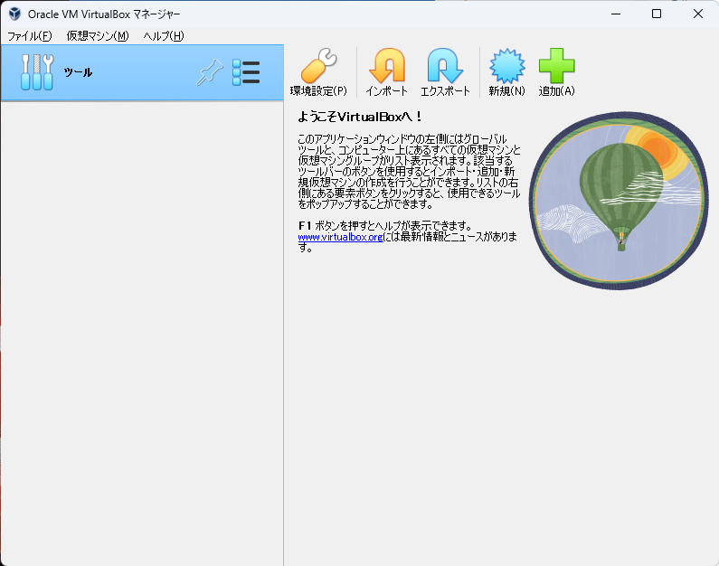

**仮想マシン概要設定画面**  

黄色いハイライト部分を画面と同じ様に設定しましょう
- 名前 → 仮想マシンの名前(任意の名前で構いません)
- タイプ → **Microsoft Windows**
- バージョン → **Windows 11*(64-bit)*

設定したら `次へ` をクリック

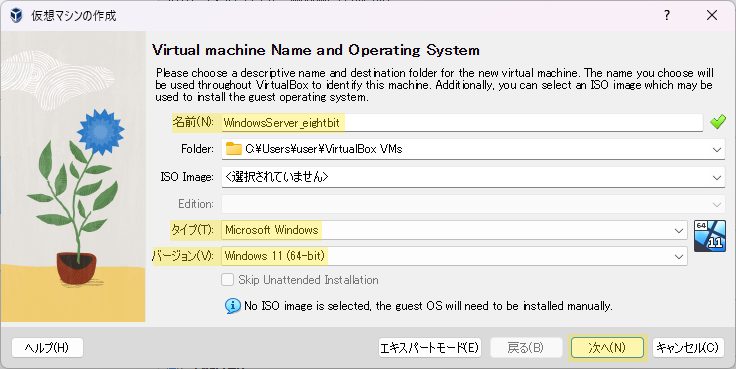

**ハードウェアリソース設定画面1**  

メモリ容量とCPU割当の設定画面です  

- メモリ容量 → 4096 MB
- Processors → 2 (CPU)
- Enable EFI(special OSes only) → チェックを入れる

設定したら `次へ` をクリック

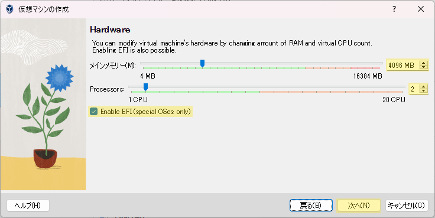

**ハードウェアリソース設定画面2**  

ストレージ容量設定画面です  
黄色ハイライトの箇所を `50.00 GB` に設定して `次へ` をクリック

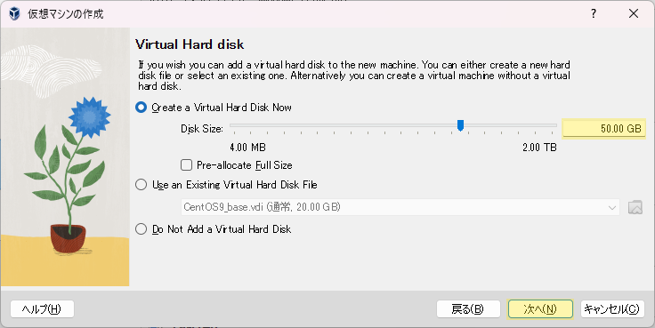

**仮想マシン設定概要画面**

作成する仮想マシンの概要を確認する画面です  
以下の画像と比較し、大きな差異がない事を確認し、`完了` をクリック

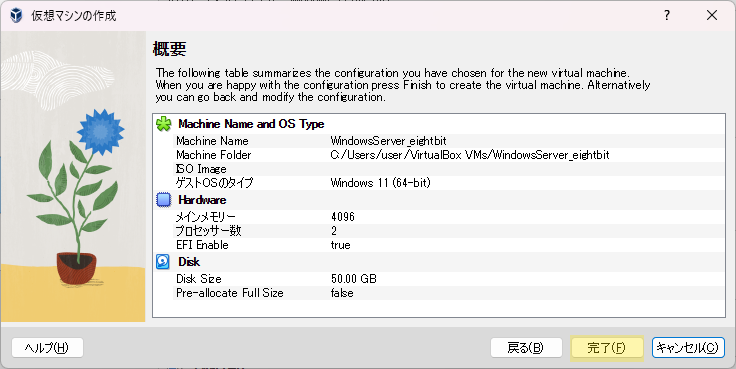

**VirtualBoxマネージャ画面**  

左側に赤い帽子の項目が表示されます(これが一つの仮想マシンです)  
該当項目を右クリックし、`設定` をクリック

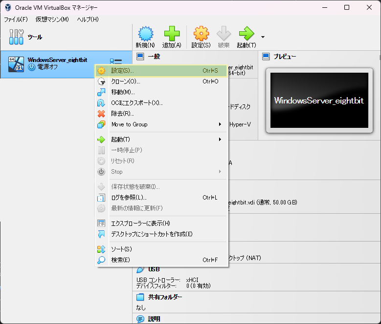

**仮想マシン設定画面(システム)**

画面左の `システム` をクリック  

- `起動順序` のリスト内で **フロッピー** をクリックして、チェックを **外す**  
- `チップセット` のドロップダウンリストを開き、**ICH9** を選択

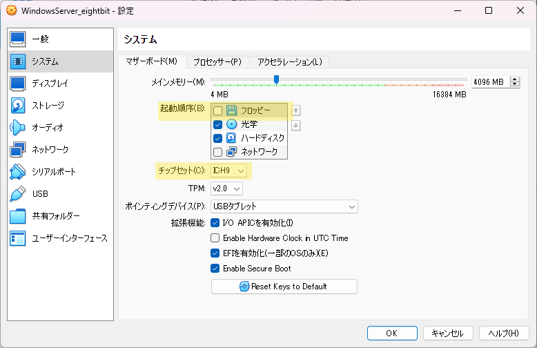

**仮想マシン設定画面(ディスプレイ)**

同画面左の `ディスプレイ` をクリック  

- `拡張機能` の **3Dアクセラレーションを有効化** をクリックして、チェックを **入れる**
- `ビデオメモリー` の値を **256 MB** に設定  

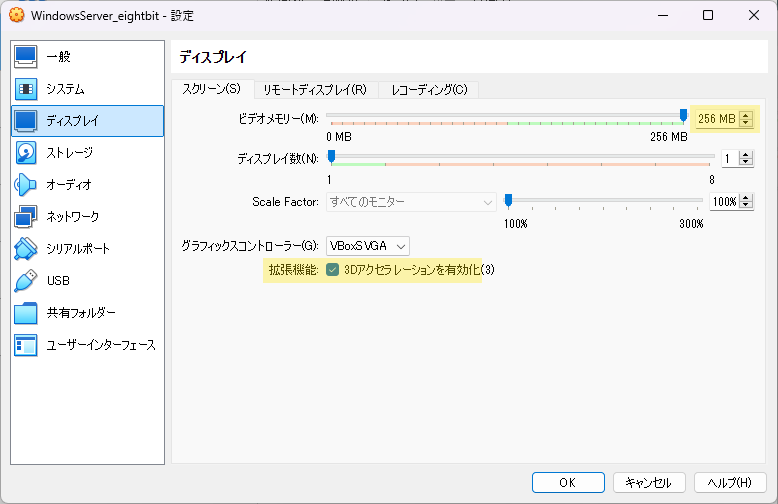

**仮想マシン設定画面(ストレージ)**

同画面左の `ストレージ` > `空` > 右上の`◎` を順にクリック

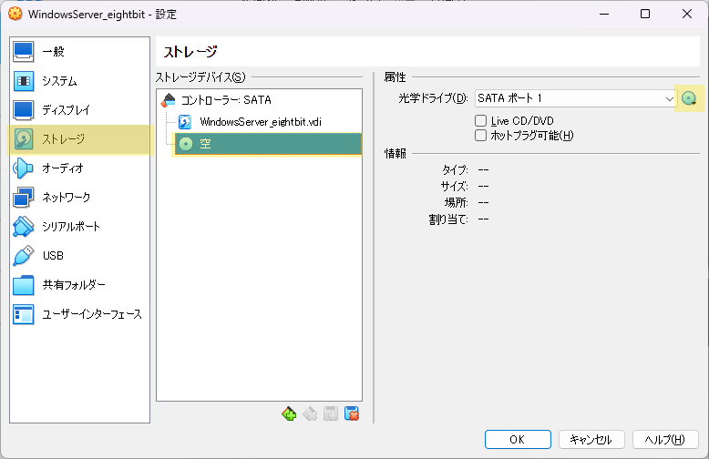

以下の選択項目からは `ディスクファイルを選択` をクリックし、  
[導入](#1-windowsserverイメージファイル)でダウンロードしたWindowsServer OSのイメージファイルを選択します  

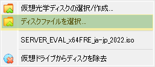

イメージファイルを選択後、元の画面に戻ります  
黄色ハイライト部分が `SERVER_EVAL_x64FRE_ja-jp_202...` のような表記になっている事を確認して下さい  

その後、 `Live CD/DVD` をクリックして、チェックを入れます

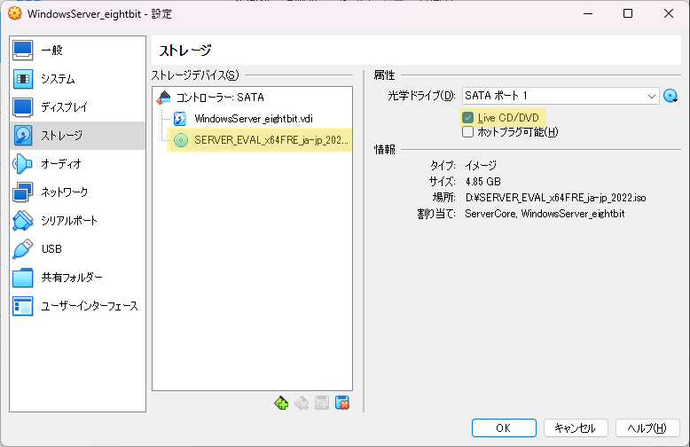

同画面左の `ネットワーク` > `割り当て` のドロップダウンリストを開き、  
**ブリッジアダプター** を選択

その後 `名前` のドロップダウンリストを開き、 **Ethernet** を含む項目を選択

最後に、画面右下の `OK` をクリックして下さい

:::danger
`名前` のドロップダウンリストで **Wi-fi** を含む項目を選択しないでください  
分からない点や気になる点がある場合は、講師に確認しましょう
:::

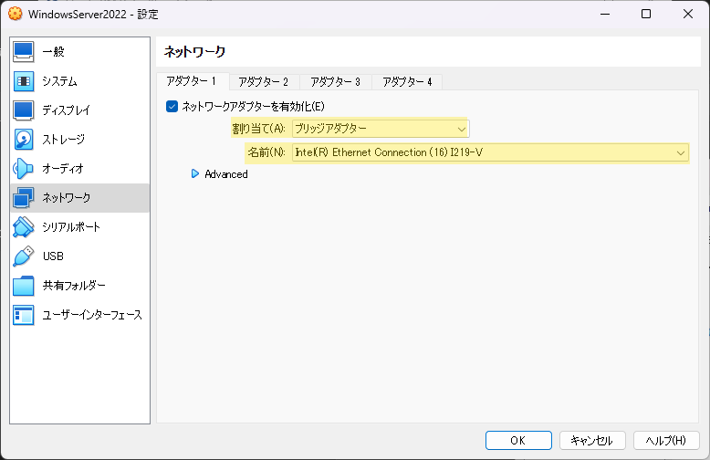

以上で仮想マシンの作成は完了です
    

