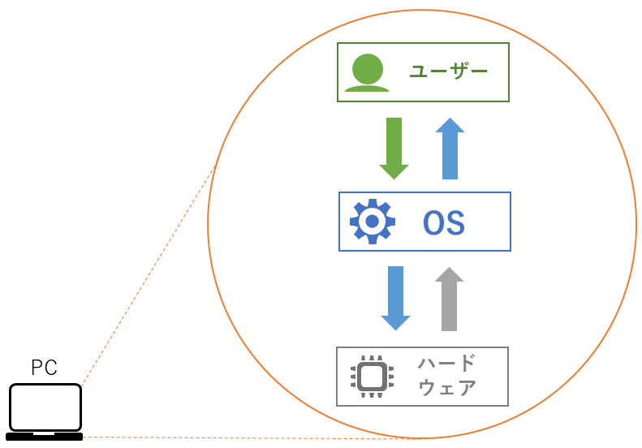

# WindowsServer概論

## 前提

### OSについて

ユーザがPCの **部品や周辺機器(ハードウェア)** を制御できるように、仲介役となるソフトウェアを `OS(オペレーティングシステム)` と呼びます  
つまり、PCにOSをインストールすることで、初めてユーザが利用できる状態となります  

OSには種類があり、PC向けのOSでは `Windows` や `macOS`  
スマートフォンでは `Android` や `iOS` といったOSがポピュラーです  

### サーバとクライアント

サーバとは、サービスや機能を提供する役割を持ったコンピュータのことを指します  

例えば、インターネット上ではSNSなどの様々なWebサービスを利用することができますが  
各Webサービスには必ずサーバが存在しており、利用者からの要求を基にサービスを提供しています  

この時、サービスの利用者が操作しているPCのことを **クライアント** もしくは **クライアントPC** と呼びます  

## WindowsServerとは

WindowsはMicrosoft社が販売しているOSの一種です  
全世界でトップのシェアを築いており、特に Windows 10 や Windows 11 といった一般PC向けのシリーズは、ビジネスシーンでも非常に多く利用されています  

これらをベースにサーバ向けにカスタマイズしたものが WindowsServer シリーズです  

WindowsServerは、一般PC向けのWindowsと同様のデザインや操作感を受け継いでおり  
Windowsを利用したことがある人であれば、比較的簡単にサーバを構築することができます  
