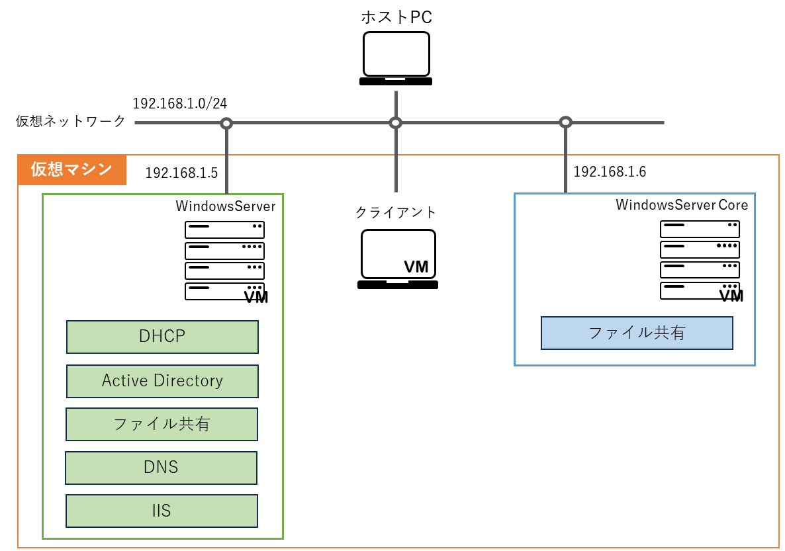

# ネットワーク・サーバ構成

本研修では、以下のネットワークとサーバの構成を目指します  

<!--
## DHCP
クライアントに対してIPアドレスやサブネットマスクといったネットワーク情報を割当てる役割 

## ActiveDirectory
WindowsServerの主要な役割の1つで、ユーザアカウントやコンピュータの情報や設定をサーバ上で一元管理することができる  
ユーザ(利用者)は、WindowsServerにアクセス可能なコンピュータであれば、自身のユーザアカウントでログインして、同一の環境で作業を実施することができる  

## ファイル共有
同一ネットワークに参加している特定のコンピュータへファイル(やフォルダ)を共有する役割  
この役割を持ったサーバを `ファイルサーバ` と呼ぶ

## DNS
IPアドレスとドメイン名を対応付ける役割 もしくは 役割を持ったサーバを指す  

## IIS
内部や外部のネットワークへWebサイトやWebサービスを公開する役割  
この役割を持ったサーバを `Webサーバ` と呼ぶ
-->
