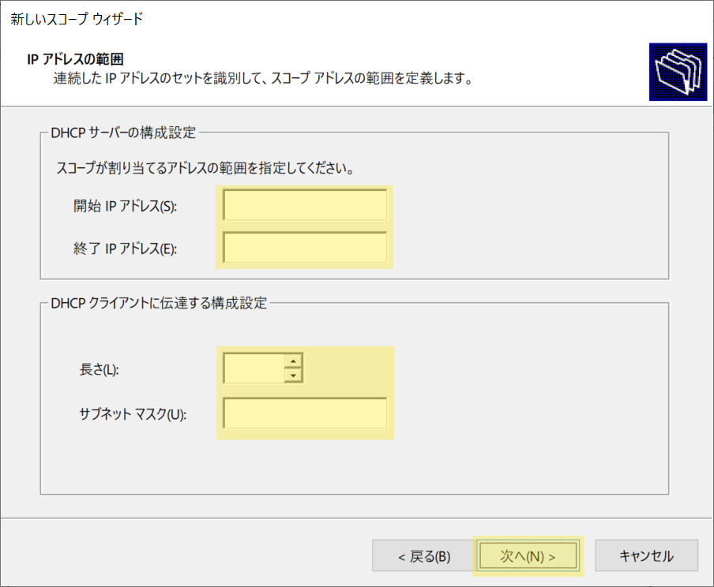
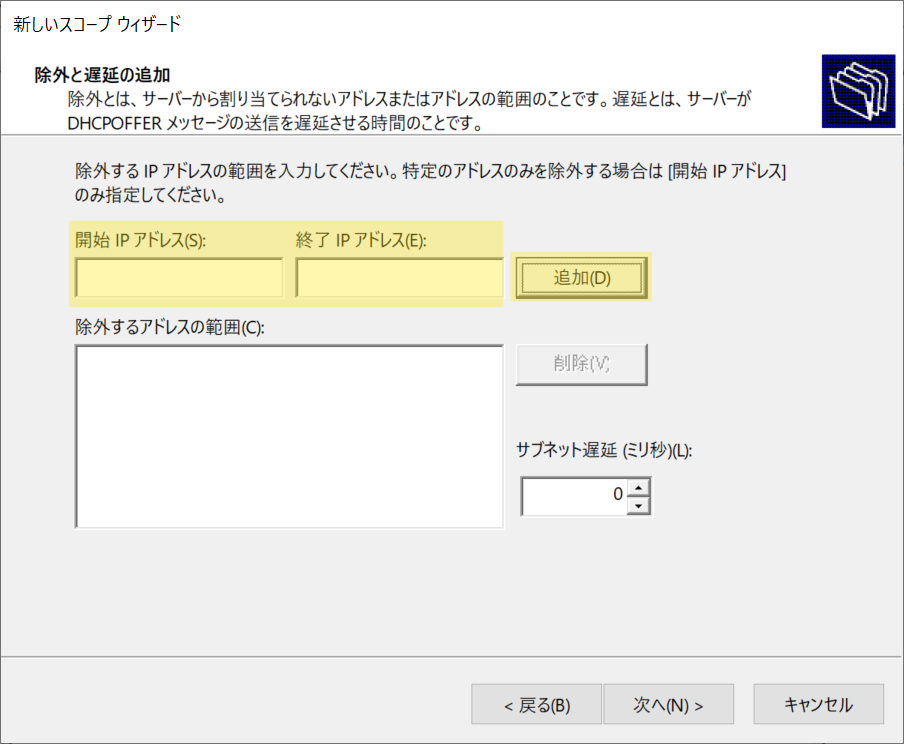
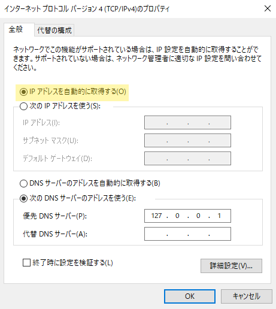

# DHCPサーバ

## IPアドレスの割当て
クライアントPCがネットワークへ接続する際、**IPアドレス** や **サブネットマスク** といったネットワーク情報を必要とします  

これらの情報はクライアントPCごとに **手動** で設定することができますが  
IPアドレスは同じネットワーク内の別PCと重複することのない、単一固定のIPアドレス = **静的IPアドレス** を割当てる必要があります  

そのため、IPアドレスの割当て状況の管理も必要となりますが  
大規模な企業ネットワーク等では現実的ではありません  

この問題をDHCPサーバを導入することで解決できます。

## DHCPサーバとは
DHCPサーバは、ネットワーク情報を管理し、適宜クライアントPCへ情報を割当てる機能を持つサーバです  

このサーバを利用できるよう設定されたクライアントPCは、IPアドレスを手動設定する必要がなく  
ネットワーク接続時に **未割当て状態** のIPアドレスがDHCPサーバから割当てられます  

この仕組みや、仕組みによって割当てられたIPアドレスのことを **動的IPアドレス** といいます

つまり、DHCPサーバが存在するネットワークでは、ユーザは「ネットワーク情報の設定」 や 「IPアドレスの割当て」 について意識することなく  
動的IPアドレス によって ネットワークへ接続することができます  

## DHCPサーバの構築

以下の手順に従って、WindowsServerへDHCPサーバを構築します  
黄色いハイライト部分を画面と同じ様に設定しましょう  

<details>
    <summary>1. インストール手順</summary>
    <div>

1. **サーバーマネージャー** を開き、画面右上の `管理(M)` > `役割と機能の追加` の順でクリック


2. `次へ` をクリック


3. `次へ` をクリック


4. `次へ` をクリック


5. **役割** のリストから、`DHCPサーバー` を選択


6. `機能の追加` をクリック


:::tip
DHCPサーバには静的IPアドレスが設定されている必要があります  
以下の画面が表示される場合は、先に静的IPアドレスの設定を実施しましょう


:::

7. **役割** のリスト内の `DHCPサーバ` にチェックが入っていることを確認して、`次へ` をクリック


8. `次へ`をクリック


9. `次へ`をクリック


10. インストール対象に **DHCPサーバー** が含まれていることを確認して、`インストール` をクリック


11. インストールが完了したら、`閉じる`をクリック


12. サービスマネージャーに戻り、画面右上の `🚩` をクリック > `DHCP 構成を完了する` をクリック


23. `コミット` をクリック


以上でDHCPサーバのインストールは完了です

</div>
</details>


<details>
    <summary>2. 構成手順</summary>
    <div>

1. **サーバーマネージャー** を開き、画面右上の `ツール(T)` > `DHCP` の順でクリック


2. 画面左のリスト内で、黄色いハイライト部分(<svg width="24" height="15" viewBox="0 0 24 18" fill="none" xmlns="http://www.w3.org/2000/svg"><path d="M7 10l5 5 5-5" stroke="currentColor" stroke-width="2" stroke-linecap="round" stroke-linejoin="round"></path></svg>)をクリックし、ツリーを展開する


3. **IPv4** を右クリックし、 `新しいスコープ(P)` をクリック


4. `次へ` をクリック


5. **名前(A)**　に任意のスコープ名を入力して、`次へ` をクリック


6. IPアドレスを割当てる範囲を指定します  
    以下の通りに入力して、`次へ` をクリック

    | 項目 |設定値|
    |:----|:----|
    |開始IPアドレス|192.168.1.2|
    |終了IPアドレス|192.168.1.254|
    |長さ|24|
    |サブネットマスク|255.255.255.0|

    

    :::note
    `192.168.1.1` はネットワークアドレス  
    `192.168.1.255` はブロードキャストアドレス となるため、範囲内に指定することはできません  
    :::

7. 次に、**手順6** で指定したIPアドレスの範囲から、割当てを除外する範囲を指定します  
    以下の通りに入力して、`追加` をクリック

    | 項目 | 設定値 |
    |:----|:----|
    |開始IPアドレス|192.168.1.2|
    |終了IPアドレス|192.168.1.9|

    

8. 割当てを除外する範囲がリストへ追加されたことを確認して、`次へ` をクリック


9. 各IPアドレスを割当てる期間を設定します  
    今回は初期設定の **8日** を指定して、`次へ` をクリック


10. `次へ` をクリック


11. IPアドレスと共にクライアントPCへ割当てる **デフォルトゲートウェイ** のIPアドレスを指定する画面です  
    講師から指示がない場合は、何も指定せず `次へ` をクリック


12. 同様にクライアントPCへ割当てる **親ドメイン** と **DNSサーバ** のIPアドレスを指定する画面です  
    講師から指示がない場合は、何も指定せず `次へ` をクリック


13. WINサーバを指定する画面です  
    今回はWINSサーバを利用しないため、何も指定せず `次へ` をクリック


14. `次へ` をクリック


15. `完了` をクリック


16. スコープがリストに追加されたことを確認します


以上でDHCPサーバの構築は完了です

</div>
</details>

<details>
    <summary>3. クライアントPCの設定</summary>
    <div>

クライアントPCがDHCPサーバからネットワーク情報の割当てを受けるためには設定を行う必要があります  

#### DHCP設定手順
1. **サーバーマネージャー** を開き、画面左の `ローカルサーバー` > `イーサネット`項目の **リンク** の順でクリック

    

2. `イーサネット`を右クリックし、`プロパティ` をクリック

    

3. `インターネット プロトコル バージョン4(TCP/IPv4)` を選択し、 `プロパティ` をクリック

    

4. `IPアドレスを自動的に選択する(O)`を選択し、`OK` をクリック

    

5. `閉じる` をクリック

    


#### ServerCore の場合

以下のコマンドを実行して、IPv4を `DHCP` に設定します  

```shell title=""
netsh interface ipv4 set dnsservers name="<ID>" source=dhcp
```

`<ID>` はクライアントPCと接続しているネットワークアダプターのIDに置き換えましょう  

</div>
</details> 


------------------

:::caution
以下は、ActiveDirectory導入後に必要な設定です  
講師から指示があるまで、実施は不要です  
:::

<details>
    <summary>DHCPの再設定</summary>
    <div>

#### 1. DHCPの承認
ADサーバを構築した場合、DHCPは動作が抑制されます  
これはドメイン内で意図せずDHCPがネットワーク情報の配信を実施することを防ぐためです  
DHCPを動作させるために、 **DHCPの承認** を行いましょう  

1. DHCPの管理ツールを開き、**サーバ** を右クリック > `承認` をクリック


以上でDHCPサーバが認証され、再び使用することができます  

---

#### 2. スコープの追加設定
ADサーバを導入したことで、DNSサーバが自動で構築されます  
DHCPサーバが配信するネットワーク情報に **DNSサーバ情報** を含めるように設定しましょう  

1. DHCPの管理ツールを開き、画面左のツリーを画像のように展開する


2. DHCPサーバ構成時に作成した `スコープ` を展開 > `スコープオプション` を右クリック > `オプションの構成` をクリック


3. リスト内の `006 DNSサーバー` にチェックを入れる

    

4. **サーバー名(S):** に **ADサーバのドメイン** を指定して、 `解決` をクリック

    

5. **IPアドレス(S):** に、ADサーバのIPアドレスが追加されたことを確認して、`追加` をクリック

    

6. リストへIPアドレスが追加されたことを確認して、`OK` をクリック

    

以上でDHCPサーバがDNSサーバの情報を配信するようになります

:::tip
設定完了後は、クライアントPCで `ipconfig /all` コマンドを実施し  
IPv4のIPアドレスと、DNSのIPアドレスが割当てられていることを確認しましょう
:::

</div>
</details>

