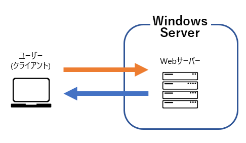

# IIS

## IISとは
IIS(Internet Information Services)は、WindowsServerで動作するWebサーバソフトウェアです  
Windowsと同様にMicrosoft社が開発しており、WindowsServerに限らず  
通常のWindowsOS上でも一部機能を利用することができます  

## WebサーバとIIS
Webサーバは **Webコンテンツ(WebページやWebアプリケーション)** を  
プライベートネットワークやインターネットに接続しているユーザへ提供するソフトウェアです  

PCやスマートフォンでGoogleや様々なSNSを利用する際も、WebサーバからWebコンテンツを提供されています  

ユーザは、提供されたWebコンテンツをEdgeやChrome、Safariといった  
**ブラウザ** や各種アプリケーションを通して閲覧しています  

つまり **IIS** をWindowsServer上に導入することで、同様にWebコンテンツを提供することができます  
ユーザは、これをブラウザ等を通して閲覧することができます  

## 特徴
Webサーバには、IISの他にも様々な種類があります  

- Nginx
- Apache
- LiteSpeed
 etc ...

それぞれWebコンテンツを提供することに変わりはありませんが、IISでは以下の特徴があります  
- Windows上で動作し、GUIで操作が可能
- C#やASP.NET等のMicrosoft製プログラミング言語・フレームワークで開発した、Webアプリケーションを扱える
- ActiveDirectoryやPoweShellとの連携が可能で、セキュリティ強化や管理が容易
- 公式リファレンスやサポートが豊富

## 1. 導入

[DHCPサーバ](./page2.md) の **1. インストール手順** を参考に、 **役割と機能の追加** から 役割:`Webサーバー(IIS)` を追加しましょう  

## 2. 動作確認

1. サーバ内の動作確認
ブラウザを起動し、`localhost` へアクセスします  
正しくインストールされている場合、テストページが表示されます  

2. クライアントPCでの動作確認
クライアントPCでブラウザを起動し、 `IISをインストールしたサーバのIPアドレス` へアクセスします  
正しく設定や環境構築がされている場合、サーバ内と同様にテストページが表示されます  

## 3. サイトの追加

予め [こちら](../javascript/files/js-practice-image.zip) をダウンロードし、解凍しましょう  
解凍したフォルダはWindowServer上の `C:\inethub` 上に配置してください  

1. **サーバーマネージャー** を開き、画面右上の `ツール(T)` > `インターネット インフォメーション サービス(IIS) マネージャー` の順でクリック

2. 画面左のツリーを画像の通りに展開後 `Default Web Site` を右クリック > `Webサイト` > `停止` をクリック

3. 画面左から、**サーバ** を右クリック > `Webサイトの追加...` をクリック

4. 画像の通りに入力し、 `OK` をクリック  

:::tip
`バインド '*:80' は別のサイトに割当てられています。` と表示される場合がありますが  
これは、**手順2** で無効化した `Default Web Site` と同じホストとポート設定となっているためです  
今回は、 `はい` をクリックして続行しましょう  
:::

5. [2. 動作確認](#2-動作確認) を再度実施し、新たなサイトが表示されることを確認

以上で、IISの導入と基本操作は完了です  