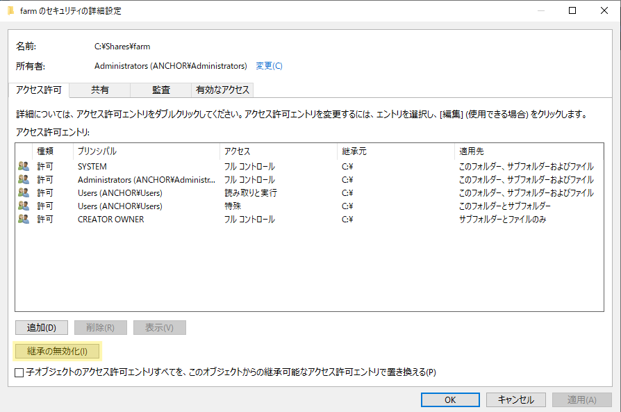
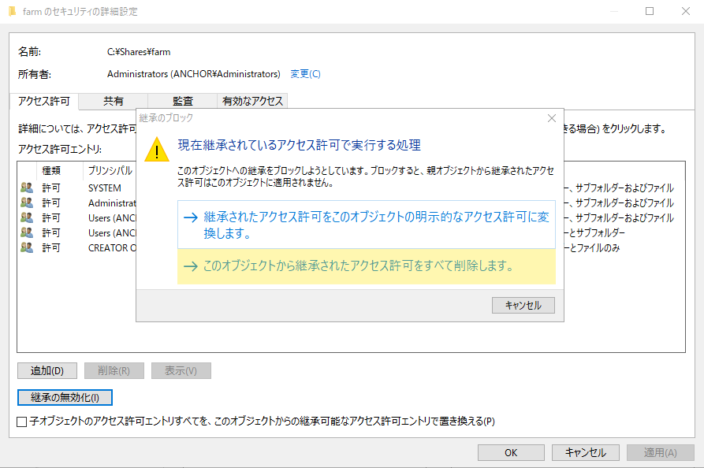
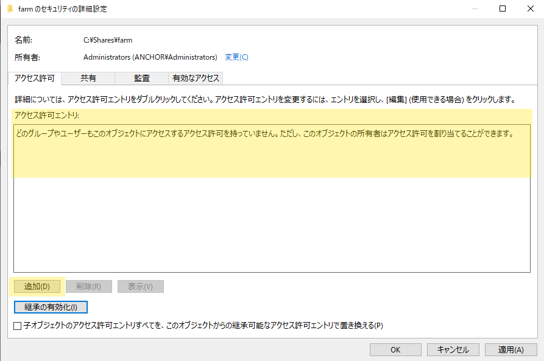
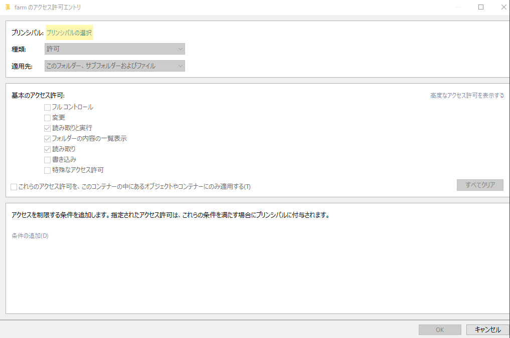
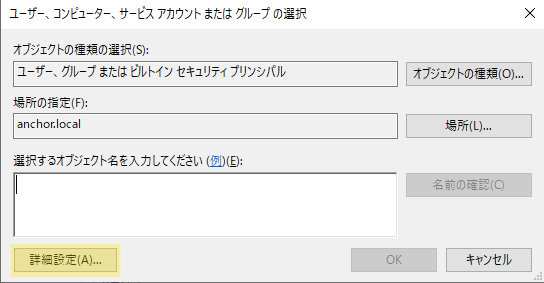
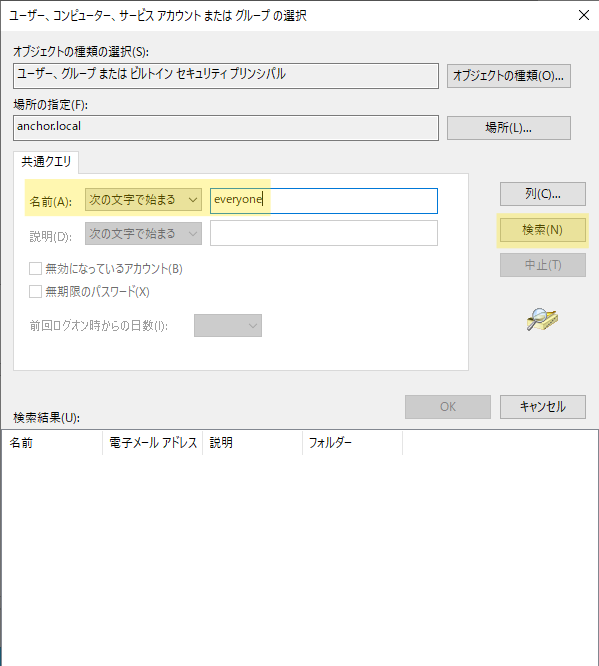
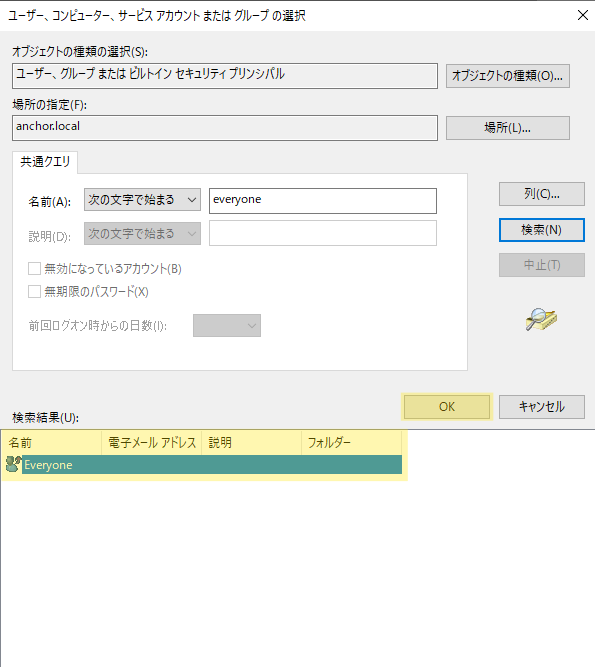
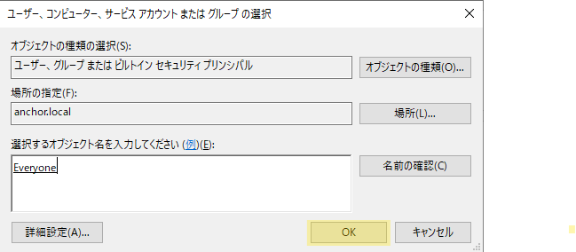
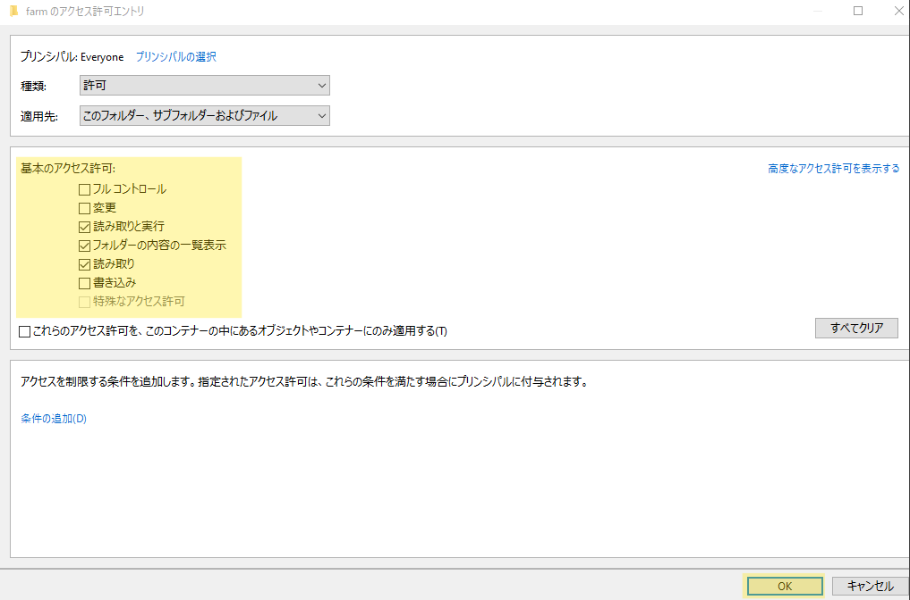
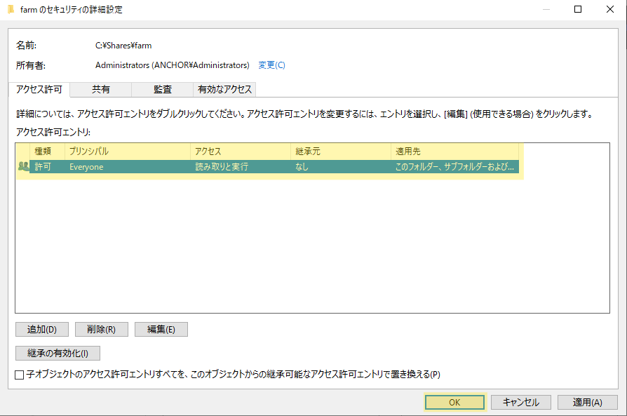

# ファイルサーバ補足

## セキュリティの詳細設定

**セキュリティの詳細設定**画面 では、オブジェクトにアクセス許可(アクセス権限)を付与することができます  
以下の手順通りに実施してみましょう

1. **セキュリティの詳細設定**画面 です  
`継承の無効化` をクリック

    

2. `このオブジェクトから継承されたアクセス許可をすべて削除します。` をクリック  

    

3. 一覧からすべてのアクセス許可が消えていることを確認し、 `追加` をクリック

    

    :::tip
    継承とは、アクセス許可の継承を指しています  
    アクセス許可を設定する共有フォルダの、親階層やさらに上流の階層で指定されているアクセス許可を引き継ぐことができる仕組みです  

    今回の場合 `Usersグループオブジェクト` に対してのアクセス許可が継承されているため  
    研修の進行上 **継承を無効化** します  
    本来は必要なアクセス許可に応じて、継承の有無を設定する必要があります  
    :::

4. アクセス許可の設定を追加します  
    `プリンシパルの選択` をクリック

    

5. アクセス許可を与えるオブジェクトを指定する画面です  
`詳細設定` をクリック

    

6. オブジェクトを詳細検索する画面です  
    今回は `everyone ユーザオブジェクト` を検索します  
    `名前` の欄へ `everyone` を指定 > `検索` をクリック

    

7. 検索結果に表示された `everyone` を選択 > `OK` をクリック

    

8. `OK` をクリック

    

9. ハイライト部でアクセス許可を設定します  
    画像の通りに設定し、 `OK` をクリック

    

10. アクセス許可の追加が全て完了したら、 `OK` をクリック

    

以上で、**セキュリティの詳細設定**画面 の設定は完了です

## アクセス許可について

アクセス許可には主に以下の種類が存在します  
必要なアクセス許可の範囲に応じて適切な項目を選択します  

|アクセス許可|説明|
|:----|:----|
|フルコントロール|すべてのアクセスを許可し、アクセス許可の変更行える|
|変更|読み取り・書き込み・ファイル削除が可能|
|読み取りと実行|ファイルを開いて実行は可能だが、変更はできない|
|フォルダーの内容の一覧表示|フォルダー内のファイルやサブフォルダーの一覧表示が可能|
|読み取り|ファイルやフォルダーを開くことは可能だが、変更はできない|
|書き込み|新しいファイルやフォルダーを作成できるが、既存のデータの変更はできない|
|特殊なアクセス許可|ユーザー定義の特定の操作のみ許可|
