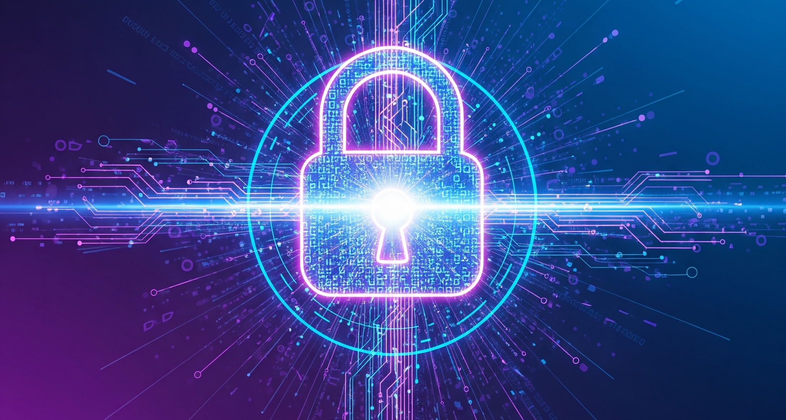

# 情報セキュリティ

情報セキュリティは、現代のビジネス環境において事務員にとって不可欠な知識です。  
この業界において、顧客情報、社内データ、財務記録など多種多様な機密情報を取り扱う機会が多いため、これらの情報を適切に保護することは極めて重要です。

## 情報セキュリティが重要な理由

情報セキュリティがおろそかになると、以下のような深刻な問題が発生する可能性があります。

| 項目                     | 内容                                                                                                                 |
| ------------------------ | -------------------------------------------------------------------------------------------------------------------- |
| 情報漏洩による信頼の失墜 | 顧客情報や企業秘密が外部に漏洩すれば、企業の信用は大きく損なわれます。一度失われた信用を取り戻すのは非常に困難です。 |
| 金銭的損害の発生         | 情報漏洩やサイバー攻撃によって、多額の賠償金や復旧費用が発生する可能性があります。                                   |
| 法的責任の追及           | 情報漏洩は、個人情報保護法などの法令違反につながり、企業だけでなく個人も法的責任を問われる可能性があります。         |
| 業務の中断               | マルウェア感染やシステム障害などにより、業務が一時的に停止し、企業活動に大きな支障をきたすことがあります。           |

## 心がけるべきこと

情報セキュリティを守るために、以下の点を常に意識してください。

### パスワードの厳重な管理

- 推測されにくい複雑なパスワードを設定し、定期的に変更しましょう。
- 複数のサービスで同じパスワードを使い回すのは避けましょう。
- パスワードは他人と共有せず、メモなどに書き残さないようにしましょう。

### 不審なメールや添付ファイルへの注意

- 差出人不明のメールや、心当たりのない添付ファイルは安易に開かないでください。
- 少しでも不審に感じたら、上司や担当部署に確認しましょう。
- フィッシング詐欺にも十分注意し、安易に個人情報を入力しないようにしましょう。

### 情報の取り扱いに関するルールの遵守

- 社内で定められた情報セキュリティポリシーやルールを遵守しましょう。
- USB メモリなどの外部記憶媒体の取り扱いには細心の注意を払いましょう。
- 機密情報を離席時にパソコンの画面に表示したままにしない、シュレッダーの活用など、日々の業務における情報管理を徹底しましょう。

### セキュリティ意識の向上

- 情報セキュリティに関する最新の脅威や対策について、常に学び続ける姿勢が重要です。
- 疑問に思うことがあれば、積極的に質問し、解決に努めましょう。

以下の動画を閲覧し、情報セキュリティに対する理解を深めましょう。

<iframe width="100%" height="500px" src="https://www.youtube.com/embed/utJlxUNlemE?si=eHS7AcLVtLfeJHk8" title="YouTube video player" frameBorder="0" allow="accelerometer; autoplay; clipboard-write; encrypted-media; gyroscope; picture-in-picture; web-share" referrerPolicy="strict-origin-when-cross-origin" allowFullScreen="true"></iframe>

## 確認テスト
動画視聴が完了したら、以下の確認テストに着手して下さい。

- [**確認テスト**](https://forms.gle/85p1MPr8WqXTh69v8)

わからない問題があれば動画を見返して確認しましょう。  
確認テストが完了したら担当講師までDMでその旨を伝えて下さい。

## 具体的な対策・対処法
以下のPDFも併せて確認しましょう。

<iframe src="/eightbit-saurus/assets/files/%E6%83%85%E5%A0%B1%E3%82%BB%E3%82%AD%E3%83%A5%E3%83%AA%E3%83%86%E3%82%A3%E7%A0%94%E4%BF%AE%E7%94%A8%E8%B3%87%E6%96%99-5461e502cb473a83756ae783e060ed70.pdf" width="100%" height="700px" >
</iframe>

[Security-PDF](./files/情報セキュリティ研修用資料.pdf)

## 最後に

情報セキュリティは、専門部署だけの問題ではありません。  
一人ひとりの意識と行動が、企業の情報を守る最後の砦となります。  
日々の業務において「本当に安全か？」という問いを常に持ち、情報セキュリティに対する高い意識を持って仕事に取り組みましょう。  

