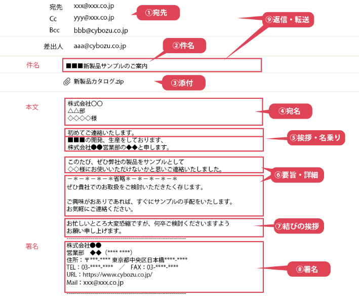

# ビジネスメールの書き方・文例


## ビジネスメールの正しい書き方、9つのマナー

ビジネスメールの正しい書き方に必要なのは、9つのマナー。  
これらは「宛先」「件名」「添付ファイル」「宛名」「挨拶と名乗り」「要旨と詳細」「結びの挨拶」「署名」「返信・転送」で構成されています。  
それぞれを詳しく見ていきましょう。





### ①宛先（To、Cc、Bcc）を正しく使い分ける
宛先は3種類あります。どれに入力しても相手に届きますが、それぞれに役割や見え方の違いがありますので、使い分けられるようになりましょう。

**To**は宛先です。複数のメールアドレスを入力することができます。  
宛先は、そのメールに対応して欲しい人にします。

**Cc**は、Carbon Copy（複写）の略です。複写ですから、Toの人のように対応を求めないものの、状況を把握しておいて欲しい人や情報を共有したい人のメールアドレスを入力します。

**Bcc**は、Blind Carbon Copy（見えない複写）の略です。  
ToやCcの宛先を入れた人に送ったことを知られたくない場合に使います。  
ToやCcに入れた人からは、Bccの人のメールアドレスは見えません。  
CcとBccの違いは、ほかの人から見えるか見えないかです。

ToとCcは、受け取った人全員にそれぞれのメールアドレスが見えます。  
しかしBccの場合、ToやCcの人はBccの人がメールを受け取ったことを知りません。  
Bccで受け取った人がToやCcの人に返信してしまうというミスが起こりえます。  
また、Bccで送るつもりがCcに入れてしまって情報漏洩するということもありますので、Bccは基本的には使わないことをおすすめします。  
仕事用であってもメールアドレスは個人情報ですから、取り扱いに十分注意しましょう。


### ②具体的な件名を付ける
件名は、具体的にしましょう。  
具体的でない件名は、パッと見ただけで用件がわかりません。  
後回しにされたり、迷惑メールだと思われてしまう可能性がある上、読まれずにゴミ箱へということにもなりかねません。

読んでもらえる件名にするには、「いつの」「何の」用件で、「どうしたいのか」「どうしてほしいのか」がわかるようにしましょう。  
件名がわかりやすければ、読んでもらいやすくなります。

#### 悪い例
- お願い（何のお願いなのかわからない）
- ご相談（何の相談なのかわからない）
- ご案内（何の案内なのかわからない）

#### 良い例
- お見積もり内容ご確認のお願い（〇〇社様用）
- お打ち合わせ日程調整のお願い（8/10 本社営業部向け）
- 新製品発売キャンペーンのご案内（9/1～9/30）


### ③添付ファイルの取り扱いに注意
添付ファイルの取り扱いで注意したいのは、ファイルサイズとファイル形式の2点です。  
相手の環境によって受け取れるファイルサイズの設定は異なります。  
ファイルサイズの合計が2MBを超える場合は、相手にあらかじめ送受信できるファイルサイズを聞いておきましょう。

相手がファイルに対応したアプリケーションを持っていない場合には、受信しても添付ファイルを開くことができません。  
図面や動画などのファイルについては、前もって相手に確認可能か聞いておきましょう。

また、添付ファイルは「添付し忘れ」や「誤添付」などのミスが起こりがちです。  
送信前の再確認が、ミスや情報漏洩を防ぎます。

### ④宛名は「会社名＋部署名＋氏名＋様」とするのが基本
相手の顔が見えないメールだからこそ、より丁寧な対応が求められます。  
宛名はその代表格で、相手の氏名を絶対に間違えないのが基本です。  
社外宛メールと社内宛メール、Ccを使う場合をそれぞれ見てみましょう。

- 社外宛メールの場合  
社外宛メールの宛名は「会社名＋部署名＋氏名＋様」とするのが基本です。会社名は（株）（有）などと略さず、「株式会社」「有限会社」と書きましょう。フルネームのほうが丁寧な印象を与えます。「〇〇社御中 ××様」は間違いで、会社名の後に個人名が続く場合、御中は必要ありません。

- 社内宛メールの場合  
社内宛メールの場合は「部署名＋氏名＋様」と書きましょう。親しい場合は、「様」を「さん」に変えてもいいでしょう。

- Ccを使う場合  
Ccを使用していることを強調する場合、括弧（）を使って宛名の下に書き添えます。そもそもの目的が情報共有で、大人数をCcに含めている場合には書き出す必要はありません。


#### 社外宛メールの宛名の例  
```
株式会社〇〇
営業部
課長
××××様
```

#### 社内宛メールの宛名の例
```
経理部
〇〇様
```

### ⑤挨拶と名乗りを入れる
宛名の次は、挨拶と名乗りです。  
挨拶は相手との関係や状況に応じて変えます。  
どんなときも気持ちよい挨拶を心がけましょう。  
社外メールでの名乗りは宛名と同様「会社名＋部署名＋氏名」とするのが基本です。  
社内メールの場合は「部署名＋名字」とします。


#### 社外宛メールの挨拶・名乗りの例
```
・基本
　いつもお世話になっております。〇〇商事〇〇課の〇〇です。
・状況に合わせて
　お忙しいところ失礼いたします。〇〇商事〇〇課の〇〇です。
・初めての連絡
　初めてご連絡いたします。〇〇商事〇〇課の〇〇です。
・返信
　ご連絡いただき、誠にありがとうございます。
```

#### 社内宛のメールの挨拶・名乗りの例
```
・基本
　お疲れ様です。〇〇課の〇〇です。

```

### ⑥要旨を先に伝え、その後に詳細を書く
ビジネスメールでは、まず要旨を先に伝え、その後に詳細を続けます。  
いつまでたっても結論がわからないメールは相手にストレスを与えてしまいますので、注意が必要です。  
反対に、最初に要旨を伝えることでメールの目的が明確になり、相手が内容を理解しやすくなります。

また、見やすいレイアウトも重要です。  
20～30文字で改行を入れ、段落と段落の間を空白で区切りましょう。  
情報量が多い場合は、箇条書きで情報を整理すると見やすくなります。


### ⑦結びの挨拶で締める
メールの結びは挨拶で締めます。  
挨拶に始まり挨拶に終わるのが、ビジネスメールのマナーです。  
結びの挨拶で念押しや心遣いをすることもできます。  
気持ちよい挨拶をする人だと思ってもらえるよう、挨拶を欠かさないようにしましょう。

#### 結びの挨拶の例
```
・基本
　何卒よろしくお願い申し上げます。
　引き続きどうぞよろしくお願いいたします。
・お願い
　お手数かとは思いますが、ご確認よろしくお願いいたします。
　お力添えのほど、よろしくお願いいたします。
・心遣い
　ご不明な点などございましたらお気軽にご連絡ください。
　ご多忙と存じますが、くれぐれもご自愛ください。
```

### ⑧メールには必ず署名を付ける
メールの署名とは、自分の氏名や所属、電話番号などの連絡先情報を記したものです。  
本文の最後に付けるのがマナーです。具体的には「会社名」「部署名」「氏名（読み仮名）」「電話番号」「FAX番号」「郵便番号・住所」「メールアドレス」「会社WebサイトへのURL」が挙げられます。

名刺と同程度の情報を載せておけば、面識のない相手にも連絡先を知らせることができます。  
最近では、担当や役職、部署異動などが頻繁に起こることもありますから、以前に交換した名刺より署名の方が新しくて確実だといえるでしょう。

### ⑨返信・転送のマナーを守る
メールを受信した場合、その後の対応には「返信」「全員に返信」「転送」の3つがあります。  
返信は、受信したメールの送り主だけに送信することです。  
全員に返信は、送り主をToとして、Ccに入っていた人がそのままCcに入ります。転送は、そのメールを受信していない人にメールを送ることです。

返信の場合には、件名に「Re:」などが付き、転送の場合には「Fw:」「Fwd:」などが付くので、返信や転送だとわかります。  
転送の場合には、メールを転送する理由を明記した上で元のメールを編集せずにそのまま送ります。  
それぞれの機能を理解して正しく使いましょう。

## 【シーン別】ビジネスメール文例集

ビジネスにはさまざまなシーンがありますが、その都度メールの書き方に悩む必要はありません。  
ビジネスメールにはシーンに応じた定型文がありますので、文例を上手に活用しましょう。


### 初めての相手へのメール
初めての相手にメールを送るシーンにはさまざまなものがあります。  
ここでは、新規開拓の営業メールを取り上げてみましょう。

```
件名：
■■■新製品サンプルのご案内

本文：
株式会社〇〇
△△部
◇◇◇◇様

初めてご連絡いたします。
■■■の開発、生産をしております、
株式会社●●営業部の◆◆と申します。

このたび、ぜひ弊社の製品をサンプルとして
◇◇様にお使いいただけないかと思いご連絡いたしました。
```

件名を具体的にし、メールの内容が予測できるようにしています。  
宛名を省略せず、氏名はフルネームで書き丁寧な印象を与えましょう。  
初めてのメールであることを伝えたうえで、名乗っています。  
用件を簡潔に伝えてから、相手のメリットを詳しく説明します。


### お礼・感謝のメール
感謝の一言が良好な関係を築きます。  
感謝の気持ちはなるべく早く伝えるほうがよいです。

```
件名：
昨日の打ち合わせの御礼／株式会社△△　▲▲

本文：
株式会社◯◯
●●様

いつもお世話になっております。
株式会社△△の▲▲です。

昨日はお忙しい中、貴重なお時間をいただき、誠にありがとうございました。
```

件名に「昨日の打ち合わせ」と「会社名」を入れることにより、相手にどの打ち合わせだったのかを思い出しやすくしています。  
要旨の冒頭に感謝の気持ちを書いてお礼を伝えましょう。  
感謝がくどくならないよう注意も必要です。


### 依頼・提案のメール
依頼や提案をスムーズにできれば、仕事がはかどります。  
相手の方が快く動いていただけるよう、判断内容を明確に、またこちらの要望を押し付けるのではなく判断をゆだねる文章にまとめましょう。


```
件名：
〇〇プロジェクト第1回お打ち合わせの日程調整のご依頼

本文：
株式会社◯◯
●●様

いつも大変お世話になっております。
株式会社△△の▲▲です。

昨日、お電話でご相談いたしました件について、
一度直接お打ち合わせをしたく存じます。
```

何の依頼・提案なのかがわかるような件名にします。  
要旨では、「自分が何を求めているのか」「相手に何をしてほしいのか」を最初の一文で書きます。  
相手に失礼のないよう、より丁寧な表現を心がけましょう。


### 謝罪メール
謝罪は直接訪問するのが基本ですが、時と場合に応じて、メールで謝罪する機会が増えています。  
謝罪の場合は、対応の早さと正確さが重要です。  
その後の取引に影響しないよう文面に配慮しましょう。

```
件名：
■■納品遅延のお詫び

本文：
株式会社◯◯
●●様

いつも大変お世話になっております。
株式会社△△の▲▲です。

先ほどお問い合わせいただきました■■につきまして、
納品が遅れており、大変ご迷惑をおかけしております。
```

件名は具体的で分かりやすくというのが基本です。  
挨拶と名乗りを終えたら、謝罪の気持ちを伝えます。  
理由や原因などはその後に続けましょう。  
対応によって信頼を損なうこともあれば、却って信頼を得る結果につながることもあります。


### メールを書いたら見直すことが大切
ビジネスメールの書き方の基本としてお伝えしたいことが、もうひとつあります。  
それは、大切な相手へのメールは、書いた後に少し時間を置いて、読み返してから送るというものです。  
そうすれば、客観的にメールの内容をチェックすることができます。  
メール送信前のチェックリストを用意してあるので、ぜひ活用ください。

丁寧な言葉遣いと相手への気遣いを忘れないようにすれば、自然と不快感を抱かせないメールが書けるようになるはずです。


### ◇メール送信前 チェックリスト
- 宛先（To、Cc、Bcc）は間違っていないか ？
- 件名は内容が一目で分かる具体なものになっているか？
- 添付ファイルは正しいものが添付されているか？
- 相手は添付ファイルを開けるか？（ファイルサイズ、ファイル形式）
- 宛名は「会社名＋部署名＋氏名＋様」となっているか？
- 書き出しの挨拶は、相手との関係性や送信のタイミングに合っているか？
- 名乗りは「会社名＋部署名＋氏名」になっているか？
- 本文を要旨から始めているか？
- 詳細は読みやすいレイアウトになっているか？  
・20～30文字で改行している  
・段落と段落の間を空白で区切る  
・必要に応じて箇条書きを使う  
- 結びの挨拶で終わっているか？
- 署名が付いているか？
- 誤字・脱字がないか？
- 失礼な表現になっていないか？