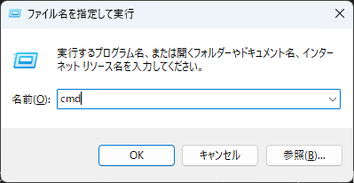
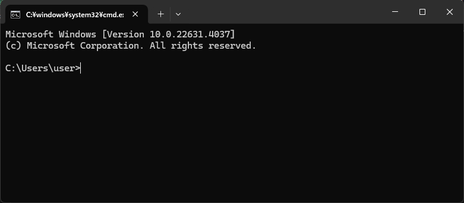
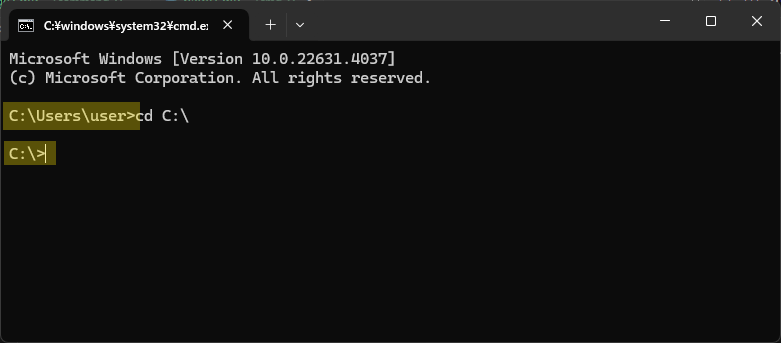

# コマンドプロンプト

コマンドプロンプトは、Windows上で `コマンド` を使用し様々な処理や設定等の操作ができる **CUI** のソフトウェアです  
コマンドを組み合わせることで、通常のマウス操作では不可能な操作を行うことも可能です  

## 起動方法

コマンドプロンプトを実際に起動してみましょう  
以下の手順の通りに操作を実施してください  

1. `Windowsキー + Rキー` を押下

2. **ファイル名を指定して実行** 画面に `cmd` を入力し、 **OK** をクリック

    

以下の **コマンドプロンプト** 画面が表示されたら、起動完了です  


## コマンド実行

まずは、実際に簡単なコマンドを実行しましょう  
コマンドプロンプトへ以下のコマンドを打ち込み、 `Enterキー` で実行します  

```shell title="cdコマンド"
cd C:\
```

実行すると、入力スペースが次の行へ移動し、以下の黄色でハイライトされた箇所が変化します  



### cdコマンド

上記で実行したコマンドを `cd`コマンド と呼びます  

マウスでファイル操作を実施する場合、特定の **ディレクトリ(フォルダ)** へ移動し、操作を実施します  
コマンドプロンプトでも同様に、特定のディレクトリへ移動し、ファイル操作等のコマンドを実行します  

この **特定のディレクトリへ移動する** コマンドが `cd`コマンド です  

`cd {移動したいディレクトリのパス}` と入力することで、指定したディレクトリへ **現在地** を移動することができます  
また、現在地のことを **カレントディレクトリ** と呼びます  

つまり、上記の `cd` コマンドでは `C:\` (Cドライブ直下) へ **カレントディレクトリ** を移動したことになります   