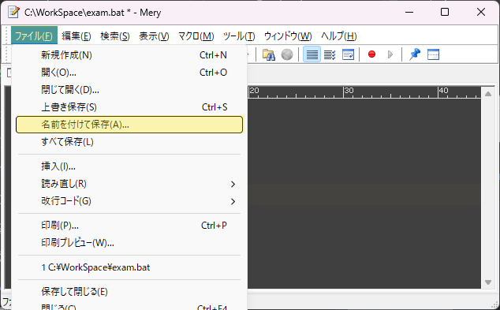
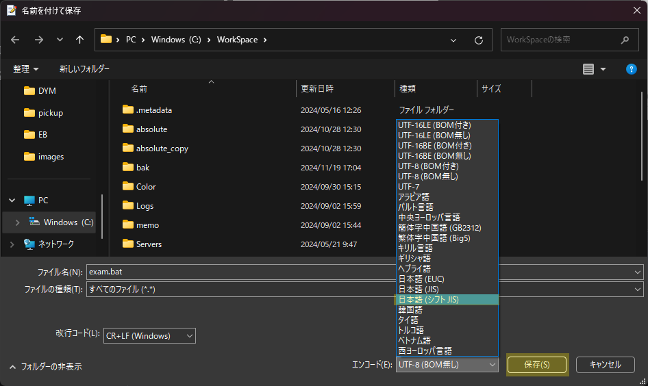
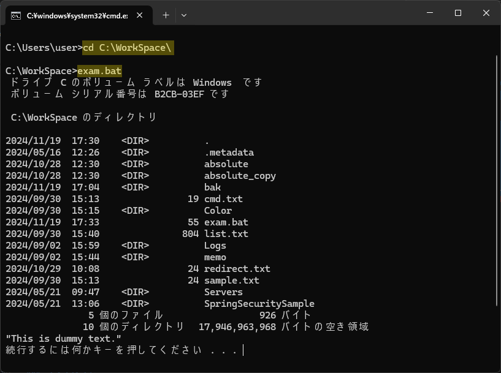

# バッチ

バッチは、コマンドプロンプトで実行できるコマンドの集まりを、`.bat`ファイル にまとめたものです  
これを実行することでコマンドを一括実行することができます  

## 作成

バッチには、コマンドを組み合わせて一連の処理を記述することができます  
以下の手順と画像のハイライトに従い、実際に作成してみましょう  

<details>
    <summary>作成手順</summary>
    <div>

1. Mery(もしくはVSCode等のテキストエディタ) を開き、以下のコマンド群をコピーペーストします  

    ```batch title="exam.bat"
    @echo off
    cd C:\WorkSpace
    dir
    type sample.txt
    pause
    ```

2. メニューから **ファイル** → **名前を付けて保存** を選択し、以下の通りにファイルを保存します  

    - 保存先: `C:\WorkSpace\`
    - ファイル名: `exam.bat`
    - エンコード: `日本語(シフトJIS)`

    
    


    :::tip
    エンコードは、ファイルで使用する **文字コード** の対応表を指します  
    コマンドプロンプトで使用されるデフォルトの文字コードは `Shift-JIS(シフトJIS)` であるため  
    バッチファイルのエンコードも `Shift-JIS` を指定する必要があります  
    :::

3. コマンドプロンプトにてバッチファイルのパスを指定することで、実行することができます  

    ```batch title="「C:\WorkSpace\」に移動して exam.bat を実行する"
    cd C:\WorkSpace\
    exam.bat
    ```

    


</div>
</details>

## 特殊コマンド

バッチを記述する場合、特殊なコマンドを使用することでユーザライクな処理を実行できます  

### リダイレクト

コマンドの後に `>` を利用することで、指定したファイルへ **コマンドの結果を出力** することできます  
ファイルが存在しない場合は、ファイルが新規作成されます  

```batch title="例"

echo "リダイレクトします" > redirect.txt

```

:::tip
コマンドを実行したら、既に学習したコマンドを駆使して必ず結果を確認しましょう  
確認方法が分からない場合は、講師へ連絡しましょう  
:::

### pause

`pause`を記述すると、ユーザが何かしらの入力を実施するまで、その行で一旦処理を待機させることができます  

通常、バッチの処理が全て完了すると自動でコマンドプロンプト画面が終了されますが  
処理の最後で `pause` を記述することでコマンドプロンプト画面は閉じず、待機することができます  

```batch title="例"

echo "バッチを実行しました"
pause

```

### @echo off

バッチ内でコマンドが実行される場合、コマンドプロンプト上にはコマンド入力行が表示されます  

```batch title="例"
dir
echo "バッチを実行しました"
pause
```

```title="出力結果"
C:\WorkSpace>echo "バッチを実行しました"
"バッチを実行しました"
```

バッチの冒頭に `@echo off` を記述することで、コマンド入力行を非表示にできます  

```batch title="例2"
@echo off
echo "バッチを実行しました"
pause
```

```title="出力結果"
"バッチを実行しました"
続行するには何かキーを押してください . . .
```