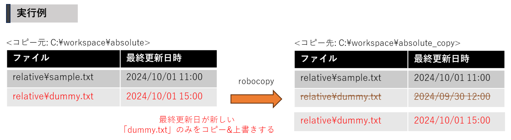
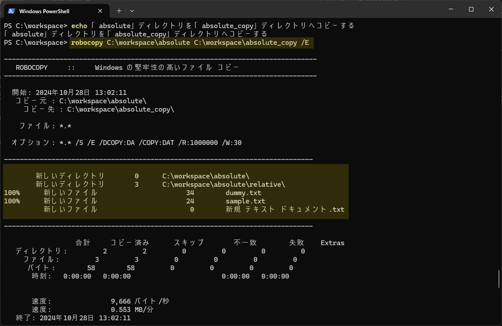
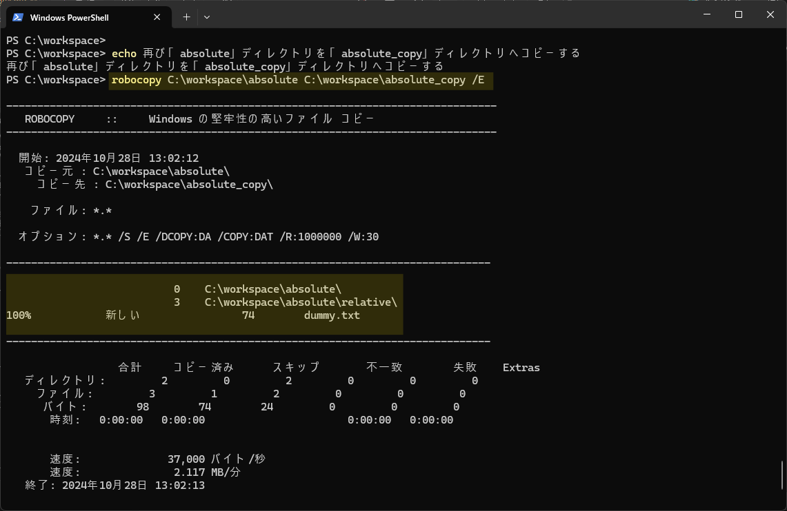
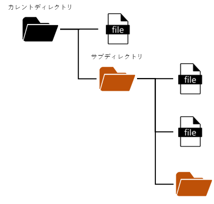
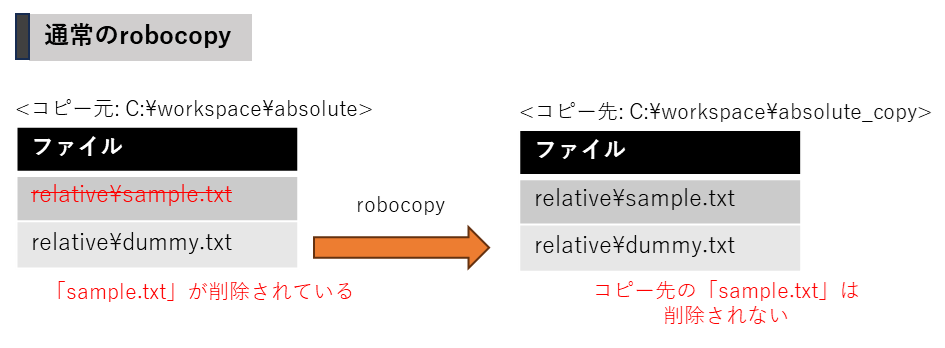
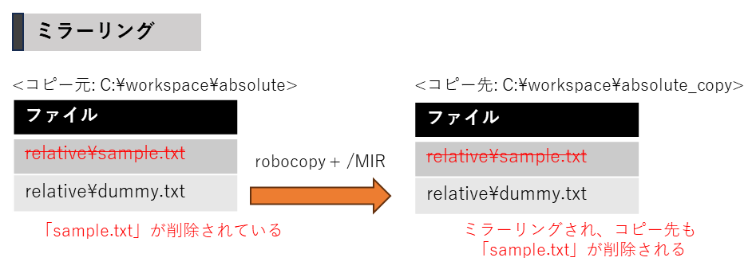
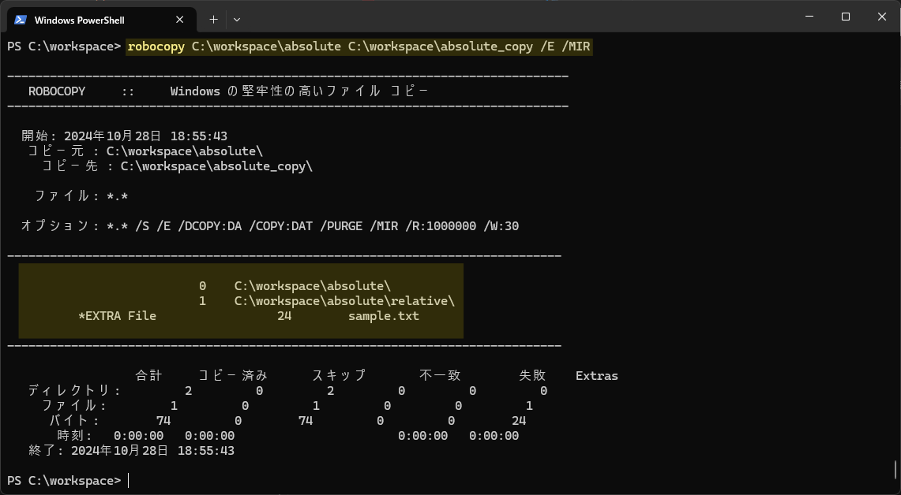
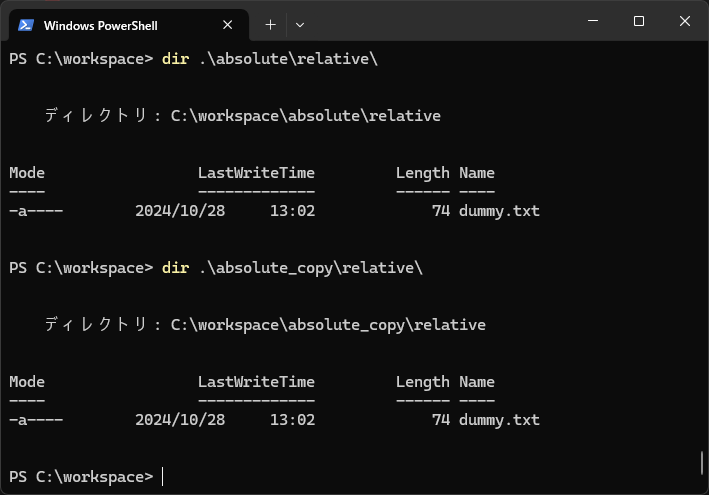

# コピーコマンド  

ファイルをコピーするためには `copy`コマンド を使用しますが、ディレクトリとその配下をコピーすることができません。  
ディレクトリをコピーする場合は、`robocopy`コマンドを利用します  

## robocopy

`robocopy` コマンドとは、`xcopy` コマンド に様々な機能を追加した強化版のようなコマンドです  
複雑な条件のコピーや、特殊なコピーを実施することができます  

以下の例では、`copy`コマンド と同様に単純なコピーを実施することができます。
ただし既に同名のファイルが存在する場合、**＜コピー先＞ よりも ＜コピー元＞ の最終更新日時が新しい** 場合に限り、上書きコピーが実施されます。
差分のみをコピーすることから **差分コピー** とも呼び、記録媒体(HDDやSSD)の差分バックアップに利用されます  

```powershell title="例"
echo [1] 「absolute」ディレクトリを「absolute_copy」ディレクトリへrobocopyする
robocopy C:\workspace\absolute C:\workspace\absolute_copy /E

echo [2] 「dummy.txt」ファイルを書き換え、＜コピー元＞ のファイルを更新する
"update dummy file!" >> C:\workspace\absolute\relative\dummy.txt

echo [3] 再び「absolute」ディレクトリを「absolute_copy」ディレクトリへrobocopyする
robocopy C:\workspace\absolute C:\workspace\absolute_copy /E
```

上記を実行することで、[3] では新しいデータが追加された差分 「dummy.txt」ファイル のみがコピーされます  
これによって無駄なコピー操作によるデータアクセスが発生せず、**コンピュータへの負荷を減らしている** とも言えます  





<details>
    <summary>実行結果例</summary>
    <div>

    - [1] 実行結果
    

    - [3] 実行結果
    

    </div>
</details>

<br/>

### オプション
また、上記例で `robocopy`コマンド の末尾に指定された `/E` は `robocopy`コマンド で使用できる **オプション** の1つで、**サブディレクトリを含めてコピー** します  

他にも多くのオプションが存在するので、 [こちら](https://learn.microsoft.com/ja-jp/windows-server/administration/windows-commands/robocopy) の公式リファレンスを参考にしましょう  

:::tip

ディレクトリの配下にあるディレクトリを `サブディレクトリ` と呼びます  



:::


### ミラーリング

通常の `robocopy`コマンド では、ファイルのコピーのみを行うため  
＜コピー元＞からファイルが削除された場合に、＜コピー先＞には削除したファイルが残ります  



<br/>

一方 `robocopy`コマンド に `/MIR` オプションを追加し実行することで  
＜コピー元＞と＜コピー先＞のファイルやディレクトリをミラーリング(同期)させることができます  
つまり＜コピー元＞からファイルが削除されている場合は、＜コピー先＞からもこのファイルは削除されます  

```powershell title="「absolute」ディレクトリを「absolute_copy」ディレクトリへミラーリングする"
robocopy C:\workspace\absolute C:\workspace\absolute_copy /E /MIR
```



<details>
    <summary>実行結果例</summary>
    <div>
- コマンド実行  


- 実行後のディレクトリ  


</div>
</details>