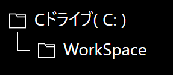
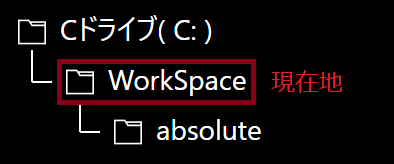
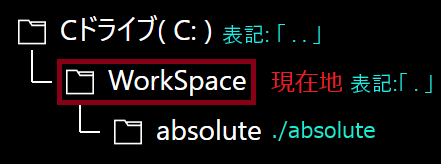

# パス

**パス** とは ディレクトリ(フォルダ)やファイルの位置を示す記法です  
身近なもので表すと住所のようなものです  

例えば `東京都豊島区東池袋1-18-1` をパスで表現すると  
`東京都\豊島区\東池袋\1-18-1` と `\(バックスラッシュ)` で地点ごとに区切った表記をします  

研修では **相対パス** や **絶対パス** という記法が登場しますので  
それぞれの違いや記法を覚えておきましょう  

## 絶対パス

ファイルやディレクトリの位置を **完全(絶対的)な経路** で示す記法を **絶対パス** と呼びます  
前述の住所を用いた例: `東京都\豊島区\東池袋\1-18-1` も絶対パスと言えます  

Windowsの場合は、絶対パスを記述する場合 `C:` や `D:` といったドライブ文字から始まり、以下の様に示します  



```powershell title="例: 「Cドライブ」配下の「WorkSpace」ディレクトリを 絶対パス で表す場合"
C:\WorkSpace
```

## 相対パス

ファイルやディレクトリを、現在のディレクトリから **相対的な経路** で示す記法を **相対パス** と呼びます  

例えば、前述した住所の例では `東京都\豊島区\東池袋\1-18-1` という絶対パスで表記されていました  
これを `東京都豊島区` に居る状態で **相対パス** として表現すると `東池袋\1-18-1` となります  

Windowsの場合も同様に表すことができます  



例えば、上記の階層で **WorkSpace**ディレクトリ を現在地とした場合  
以下のように示すことができます   

```powershell title="例: 現在地(C:\WorkSpace)配下の「absolute」ディレクトリを 相対パス で表す場合①"
.\absolute
```

もしくは

```powershell title="例: 現在地(C:\WorkSpace)配下の「absolute」ディレクトリを 相対パス で表す場合②"
absolute
```

:::tip

パス記法において `.`(ドット) は **現在地** を指します  
つまり `.\absolute` は **現在地配下の `absolute`ディレクトリ** を指します  

また、 `..` は 現在地から一つ上の階層(ディレクトリ)を指します  



:::