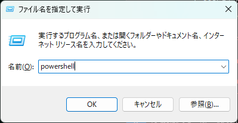
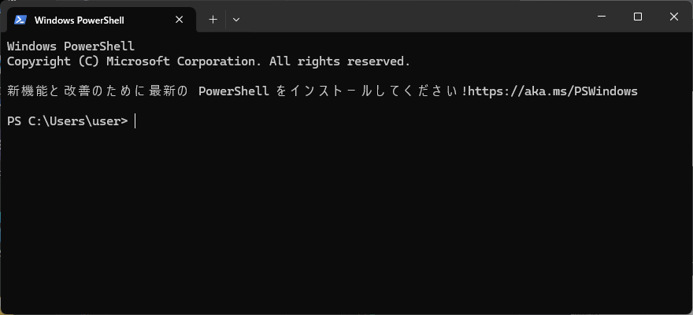
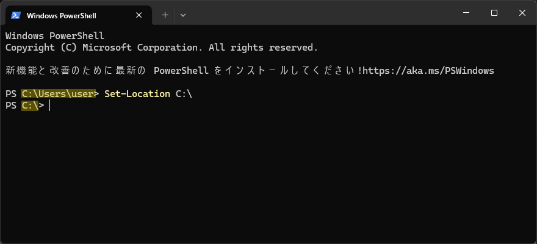

# PowerShell

PowerShellは `コマンドレット` を使用し様々な処理や設定等の操作ができる **CUI** のソフトウェアです  
コマンドレットを組み合わせることで、通常のマウス操作では不可能な操作を行うことも可能です  

## コマンドプロンプトとの違い

PowerShellは、**コマンドプロンプト** の後継CUIとして同様にMicrosoftが開発しており、Windowsには標準でインストールされています  
コマンドプロンプトで利用するコマンドも **Windows上においては** 問題なく使用することができます  

このような関係の両者には以下の違いがあります  

|            | コマンドプロンプト         | PowerShell                                     | 
| ---------- | -------------------------- | --------------------------------------------- | 
| 動作環境   | Windows                    | Windows、MacOS、Linux                          | 
| スクリプト | バッチ(.bat)               | スクリプト(.ps1)                                | 
|            | 複雑な処理の構築には不向き | オブジェクト指向で、複雑な処理を比較的安易に構築可能 | 

## 起動方法

PowerShellを実際に起動してみましょう  
以下の手順の通りに操作を実施してください  

1. `Windowsキー + Rキー` を押下

2. **ファイル名を指定して実行** 画面に `powershell` を入力し、 **OK** をクリック

    

以下の **PowerShell** 画面が表示されたら、起動完了です  


## コマンドレット実行

まずは、実際に簡単なコマンドレットを実行しましょう  
PowerShellへ以下のコマンドを打ち込み、 `Enterキー` で実行します  

```shell title="cdコマンド"
Set-Location C:\
```

実行すると、入力スペースが次の行へ移動し、以下の黄色でハイライトされた箇所が変化します  



### Set-Locationコマンドレット

上記で実行したコマンドレットを `Set-Location`コマンドレット と呼びます  

このコマンドレットは、コマンドプロンプトで **特定のディレクトリへ現在地を移動する** `cd`コマンド と同等の意味と処理を持ちます  

つまり、上記の `Set-Location` コマンドでは `C:\` (Cドライブ直下) へ **カレントディレクトリ** を移動したことになります   