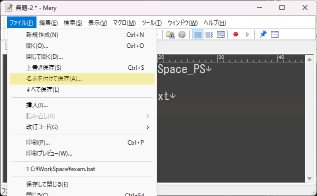
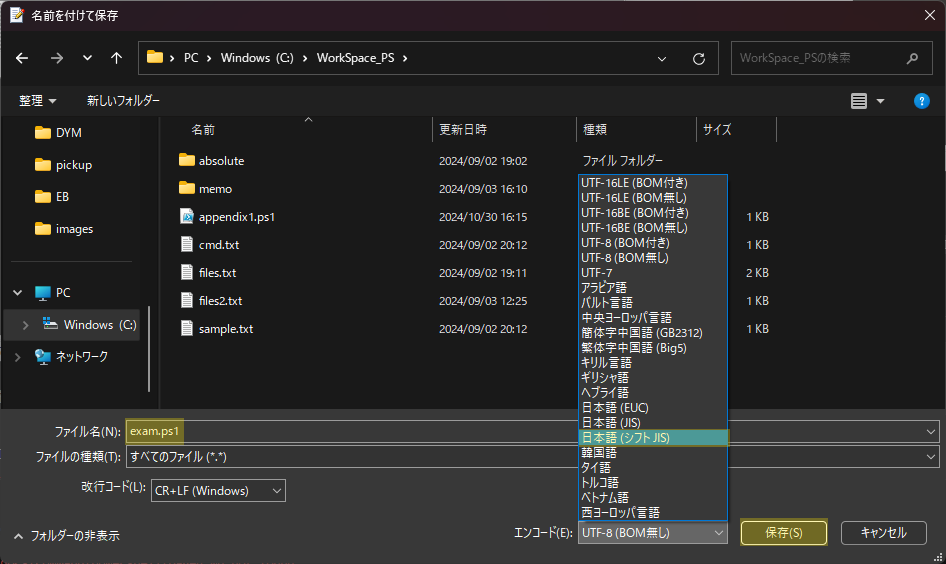
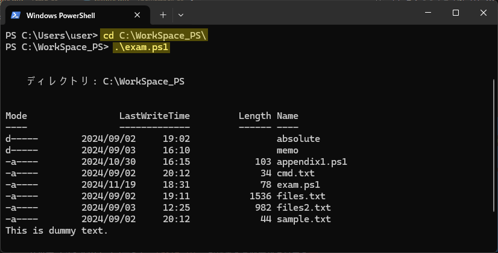

# スクリプト

スクリプトは、PowerShellで実行できるコマンドレットの集まりを、`.ps1`ファイル にまとめたものです  
これを実行することでコマンドレットを一括実行することができます  


:::caution
**スクリプト(.ps1)** は通常、初期設定では起動することができません  
エラーが発生し、スクリプトが実行できない場合は以下のコマンドレットを実行しましょう  
```powershell title=""
Set-ExecutionPolicy RemoteSigned
```

コマンドレットを実行したら、再度スクリプトを起動してください
:::

## 作成

スクリプトには、コマンドレットを組み合わせて一連の処理を記述することができます  
以下の手順と画像のハイライトに従い、実際に作成してみましょう  

<details>
    <summary>作成手順</summary>
    <div>

1. Mery(もしくはVSCode等のテキストエディタ) を開き、以下のコマンド群をコピーペーストします  

    ```powershell title="exam.ps1"
    Set-Location C:\WorkSpace_PS
    Get-ChildItem
    Get-Content sample.txt
    Read-Host
    ```

2. メニューから **ファイル** → **名前を付けて保存** を選択し、以下の通りにファイルを保存します  

    - 保存先: `C:\WorkSpace_PS\`
    - ファイル名: `exam.ps1`
    - エンコード: `日本語(シフトJIS)`

    
    


    :::tip
    エンコードは、ファイルで使用する **文字コード** の対応表を指します  
    PowerShellで使用されるデフォルトの文字コードは `Shift-JIS(シフトJIS)` であるため  
    スクリプトファイルのエンコードも `Shift-JIS` を指定する必要があります  
    :::

3. PowerShellにてスクリプトファイルのパスを指定することで、実行することができます  

    ```powershell title="「C:\WorkSpace\」に移動して exam.ps1 を実行する"
    cd C:\WorkSpace\
    .\exam.ps1
    ```

    

</div>
</details>

### Read-Host

`Read-Host`を記述すると、ユーザが何かしらの入力を実施するまで、その行で一旦処理を待機させることができます  

通常、スクリプトの処理が全て完了すると自動でPowerShell画面が終了されますが  
処理の最後で `Read-Host` を記述することでPowerShell画面は閉じず、待機することができます  

```powershell title="例"

Write-Output  "スクリプトを実行しました"
Read-Host please input any key...

```

:::tip
バッチでは、コマンドを実行するとコマンド入力行が表示されるため、非表示としたい場合は `@echo off` を記述する必要があります  
一方PowerShellは、初期設定で同等の機能が有効となっており、コマンド入力行が表示されません
:::