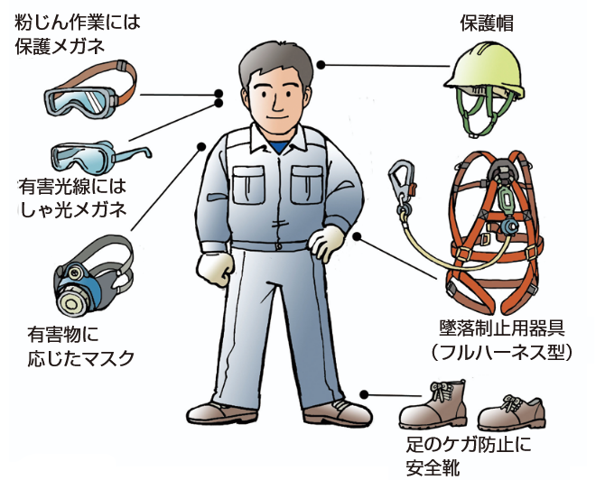
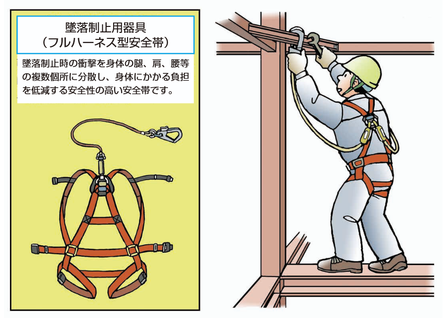

# はじめに

## 1. 安全衛生教育の必要性

建設業界は、他の産業と比較して労働災害が発生しやすい環境にあります 。  
施工管理の仕事は、工事の進捗や品質を管理するだけでなく、**そこで働くすべての人（職人さんや同僚）と自分自身の命を守ること**が最優先の責務です。  

このページでは、最低限現場に出る前に必ず知っておくべき「安全衛生」の基礎と、その重要性について説いています。

---

## 2. 安全衛生教育の法的義務と目的

### 2-1. 法律での決まり（雇入れ時教育）

労働安全衛生法により、会社は新しい従業員を雇い入れた際、業務に関する安全衛生教育を実施することが義務付けられています 。  
これは「知らなかった」では済まされない、**法律で定められたルール**です。

### 2-2. 建設現場の特殊性

建設現場では自社の社員だけでなく、多くの協力会社（サブコン）の作業員が同じ場所で混在して作業を行います 。  
そのため現場ごとの共通ルールや、元請け企業が定める安全基準を全員が守らなければ、事故を防ぐことはできません 。

:::caution
安全衛生教育はあなた自身を守るだけでなく、周囲の作業員を危険に晒さないための「現場の共通言語」を学ぶ場です 。
:::
---

## 3. 労働災害の現実と「不安全」の排除

### 3-1. 事故が起きる2つの原因

労働災害の多くは、以下の2つの要素が重なった時に発生します 。

1. **不安全状態**: 手すりがない、整理整頓がされていないなど、環境の欠陥 。
2. **不安全行動**: 保護具を使わない、近道をする、確認を怠るなど、人の誤った行動 。

施工管理者は、現場の「不安全状態」を取り除くと同時に、自分自身や職人さんが「不安全行動」をとらないよう管理・指導する役割があります。

### 3-2. 建設業の三大災害

建設業で特に多い死亡・死傷災害は以下の3つです 。

* **墜落・転落**: 足場や屋根からの落下 。  
  
(出典：厚生労働省)

* **建設機械・クレーン等による災害**: 重機への挟まれ、接触 。  
  
(出典：厚生労働省)

* **崩壊・倒壊**: 土砂崩れや足場の倒壊 。  
  
(出典：厚生労働省)

特に「墜落・転落」は死亡災害の多くを占めており、後述する「墜落制止用器具（フルハーネス）」の正しい使用が命を守る鍵となります 。

---

## 4. 現場での具体的行動規範（基本ルール）

事故を防ぐための、具体的な行動ルールを学びます。

### 4-1. 5S活動の徹底

安全の基本は「5S」から始まります。現場が片付いていなければ、転倒や事故のリスクが高まります 。

| 項目 | 意味 | 現場でのアクション例 |
| --- | --- | --- |
| **整理** | 必要なものと不要なものを分け、不要なものを捨てる | 廃材を分別して廃棄する |
| **整頓** | 決められた物を決められた場所に置く  | 工具を使用後、所定の位置に戻す |
| **清掃** | 常に掃除をして清潔に保つ  | 作業終了後の掃除を徹底する |
| **清潔** | 3S（整理・整頓・清掃）を維持する  | 常に綺麗な状態をキープする |
| **躾（しつけ）** | ルールを正しく守る習慣をつける  | 挨拶やルール遵守を習慣化する |

### 4-2. 服装と保護具

* **服装**: 現場にふさわしい、清潔感のある作業服を着用します。  
だらしない服装は巻き込まれ事故の原因になります 。

* **保護具**: ヘルメット（保護帽）、安全帯（墜落制止用器具）、安全靴は「命を守る最後の砦」です。    
必ず正しく着用しましょう 。

### 4-3. 報連相（ホウ・レン・ソウ）

現場で何か異常を感じたり事故が起きたりした場合は、速やかに上司や担当者に報告・連絡・相談を行ってください 。

* **遅刻・欠勤**: 必ず電話で連絡を入れる（無断欠勤は厳禁） 。
* **体調不良**: 無理をせず、すぐに申し出る 。

---

## 5. 重要な安全知識：墜落制止用器具と熱中症

### 5-1. フルハーネス型墜落制止用器具

法改正により、高さ2m以上の作業床がない箇所（建設業では一般的に5m以上推奨）では、原則として**フルハーネス型**の使用が義務付けられています 。

* **重要性**: 従来の「胴ベルト型」は墜落時の衝撃が腹部に集中し危険ですが、フルハーネス型は衝撃を肩や腿など全身に分散させます 。
* **2丁掛け**: フックの掛け替え時に無胴綱（命綱がない状態）にならないよう、2本のランヤードを使用します 。

### 5-2. 熱中症対策

夏の建設現場では熱中症のリスクが非常に高くなります。  
重症化すると死に至ることもあるため、予防が必須です 。

* **予防**: 喉が渇く前に水分・塩分を補給し、涼しい服装や休憩を心がける 。
* **対応**: 手足のしびれやめまいを感じたら、すぐに涼しい場所で休み、回復しない場合は病院へ搬送します 。

---

## 6. 施工管理（未経験・派遣）としての禁止事項

施工管理として現場に入る際、**やってはいけない業務**（適用除外業務）があります。  
労働者派遣法等により、派遣社員が建設業務（直接的な肉体労働）を行うことは禁止されています 。

**【絶対に行ってはいけない作業例】**

* 足場の組立・解体 
* 玉掛け（クレーンのフックに荷を掛ける作業） 
* コンクリートの打設 
* 電動工具（ドリル、サンダー等）の使用 
* 重機の運転 
* 建築・土木工事後のガラ出し（廃材処理） 

人手が足りないからといって手伝うことは契約違反になるだけでなく、慣れない作業による労働災害のリスクを高めます 。

---

## 7. まとめ

安全衛生教育は、単なる「ルールの暗記」ではありません。  
現場で働くすべての人々が、無事に家族の元へ帰るための学びです。

1. **ルールを守る**: 5S、保護具、立ち入り禁止区域などのルールを遵守する。
2. **危険を予知する**: 「かもしれない」と考え、作業前の点検やKY活動を徹底する 。
3. **報告する**: 異常や不安があれば、すぐに上司や担当者に相談する 。