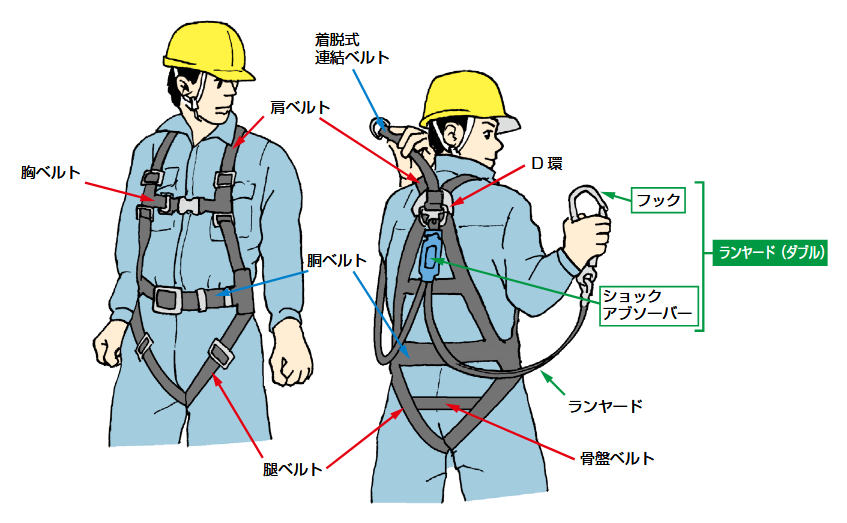
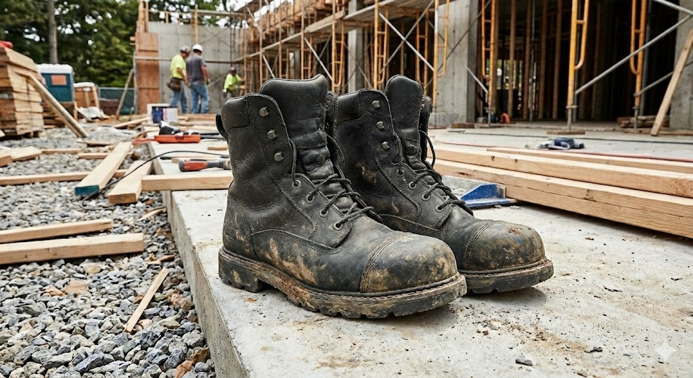
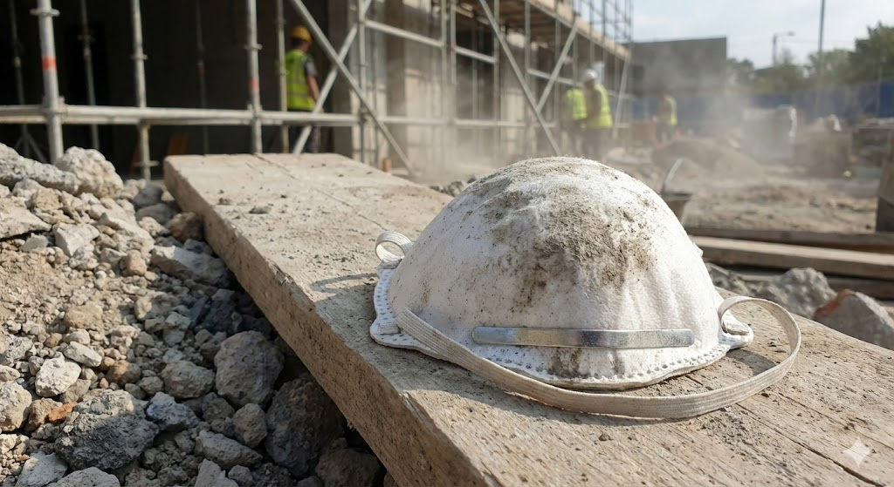

# 第2項：安全装置・有害物抑制装置・保護具

<iframe src="https://drive.google.com/file/d/1CycQQQRsljmWfYvQ_k19Ec0ji_cWoUqX/preview" width="640" height="360" allow="fullscreen"></iframe>

## 1. はじめに：命を守る3つの盾

建設現場には作業員を危険から守るための設備や道具が必ず備わっています。  
これらは大きく3つに分類されます。

1. **安全装置**: 機械の危険な動きから人を守る(カバー、センサー、ロック機能など)。
2. **有害物抑制装置**: 有害な環境から人を守る(換気装置、散水設備など)。
3. **保護具 (PPE)**: 最終的に自分の身を守る(ヘルメット、フルハーネス、安全靴など)。

施工管理者の役割は、これらの機能が**正しく働いているか**を確認し、不備や不正使用(無効化など)があれば即座に是正させることです。

---

## 2. 安全装置の性能と管理ポイント

機械や工具には、誤操作や接触による事故を防ぐ機能が備わっています。  
これらを「作業がしにくいから」といって外したり無効化することは労働安全衛生法違反であり、自殺行為と言えます。

### 2-1. 電動工具(丸ノコ・グラインダー)の安全装置

* **可動式接触予防装置(刃の覆い・安全カバー)**  
    * **性能**: 切断していない時はバネの力で刃を覆い、身体への接触を防ぐ装置です。
    * **危険な状態(管理ポイント)**:  
        * カバーがスムーズに動かない。
        * **【厳禁】** カバーを紐で縛ったり、楔(くさび)を挟んで**常に刃がむき出しの状態**に固定している 。
* **反発予防装置(割り刃)**
    * **性能**: 木材の切断時に材料が詰まり、機械が作業者側に跳ね返る「キックバック」を防ぎます。

### 2-2. クレーン・重機の安全装置

* **過巻防止装置**: フックを巻き上げすぎた際に、自動的に停止させ、ワイヤー切断や荷の落下を防ぎます 。
* **外れ止め装置(フックの爪)**: 玉掛け用ワイヤーロープがフックから外れるのを防ぎます。
* **管理ポイント**: バネが壊れていないか、変形していないかを使用前に確認させます 。
* **ロックレバー(安全レバー)**: バックホウ等の運転席にあるレバー。これを上げないと操作レバーが動かないようにする誤操作防止装置です。

### 2-3. インターロックと非常停止

* **インターロック**: 柵やカバーが開いていると機械が動かない、あるいは機械が動いているとカバーが開かない仕組みです。
* **非常停止ボタン**: 緊急時にボタンを押すだけで動力を遮断し、機械を急停止させる装置です。

:::caution **施工管理者の鉄則:**
「安全装置が邪魔だ」という職人の言い分を認めてはいけません。  
**安全装置の無効化は、即座に作業中止対象**です。
:::

---

## 3. 有害物抑制装置(換気・粉じん対策)

目に見えないガスや粉じんは、静かに健康を蝕みます。  
これらを除去・抑制する装置の知識です。

### 3-1. 局所排気装置・全体換気装置

有機溶剤(シンナー等)を使用する塗装作業や、アーク溶接作業では、有害なガスやヒュームが発生します。

:::tip 
固体物質の蒸気の凝固によって生じた微細な固体粒子をヒュームと呼びます。  
アーク溶接、金 属精錬、鋳造などの工程で、溶融金属から発生する金属ヒュームが代表的な例です。
:::

* **性能**: 有害物質を吸引し屋外へ排出、または新鮮な空気を送り込み濃度を下げます 。  
* **管理ポイント**:    
    * 屋内やタンク内作業では、必ず送風機(ポータブルファン)やダクトが設置され、**稼働しているか**を確認します 。  
    * 「暑いから」「うるさいから」といってスイッチを切らせてはいけません。

### 3-2. 湿潤化設備(散水)

解体工事やコンクリートのハツリ作業では、大量の粉じんが発生します。

* **取扱い**: 水を撒きながら作業を行い、粉じんの飛散を抑制します。  
作業員の肺を守るだけでなく、近隣トラブル防止にも必須です。

---

## 4. 保護具(PPE)の性能と正しい着用

保護具は「命を守る最後の砦」です。  
正しく着用しなければ無意味です。

### 4-1. 墜落制止用器具(旧：安全帯)

  
[(出典：厚生労働省)](https://www.mhlw.go.jp/new-info/kobetu/roudou/gyousei/anzen/dl/170131-1.pdf)

法改正により、原則として**フルハーネス型**の使用が義務付けられています 。

#### ① 種類の選定(高さの基準)

作業場所の高さに応じて、適切な器具を選定・指示する必要があります。

| 作業床の高さ | 種類 | 備考 |
| --- | --- | --- |
| **2m以上** | **原則 フルハーネス型** | 建設業では**5m以上は推奨**とされています 。 |
| **6.75m以下** | 胴ベルト型も可 | 建設業では5m以下の比較的低い場所でのみ使用が一般的 。 |

#### ② ショックアブソーバの選定

落下時の衝撃を吸収する装置です。  
フックを掛ける位置で種類が変わります。

* **第1種**: 腰より**高い位置**にフックを掛ける場合 。
* **第2種**: 足元など腰より**低い位置**にフックを掛ける場合 。
:::caution
※施工管理者は現場の状況を見て「ここは足元にしか掛ける場所がないから、第2種が必要だ」と判断できなければなりません。
:::

#### ③ 点検と廃棄基準

使用前に以下の状態であれば、即座に使用禁止・交換させてください。

* **ベルト**: 2mm以上の切り傷、摩耗、焼損がある 。
* **金具(D環・フック)**: 変形、サビ、リベットのガタツキがある 。
* **ランヤード**: ロープの素線切れ、キンク(ねじれ)がある 。
* **ショックアブソーバ**: 透明カバーが破れている、または**切断されている**(包装と勘違いして切る事例があるため注意) 。

### 4-2. 保護帽(ヘルメット)

  

* **性能**: 建設現場では**飛来・落下用**(物が落ちてきた時用)と**墜落時保護用**(自分が落ちた時用)の2つの検定に合格しているものを使用します 。
* ※内部に発泡スチロール等の衝撃吸収ライナーが入っているのが特徴です 。
* **耐用年数**: 外観に異常がなくても、PC/ABS等の樹脂製は**3年**で交換します(内装の着装体は1年) 。
* **着用**: あご紐のゆるみがないか確認します。転倒時にヘルメットが脱げては意味がありません 。

### 4-3. 安全靴

  

* **性能**: つま先に先芯(鉄や樹脂)が入っており、重量物の落下や、釘の踏み抜きから足を守ります。
* **管理**: かかとを踏んで履いている作業員がいたら注意してください。本来の機能が発揮されません。

### 4-4. 呼吸用保護具(マスク)

* **防じんマスク**: 粉じん作業で使用。フィルターが詰まったら交換が必要です。
* **防毒マスク**: 塗装や接着作業で使用。使用する有機溶剤の種類に合った**吸収缶**を選定する必要があります 。

---
## 5. 【ケーススタディ】事故実例

### ケース①：携帯用丸ノコの安全カバー固定による切創

> **＜事故の状況＞**  
> 内装工事中、ベニヤ板を切断していた作業員が、大腿部（太もも）を深く切り、出血多量で重傷を負った。

**【原因：安全装置の無効化】**

* 作業員は「カバーがあると切りにくい」という理由で、**可動式接触予防装置（安全カバー）を針金で縛り、常に刃が露出する状態で固定していた** 。
* キックバック（刃が材料に挟まり跳ね返る現象）が起きた際、カバーが閉じず、露出した回転刃が作業員の足に直撃した。

:::tip **【施工管理者のチェックポイント】**  
* **巡回時の視点**: 丸ノコを使用している作業員の手元を見ます。  
切り終わった瞬間にカバーが「パチン」と戻っているか？ 紐や楔（くさび）で固定されていないかを確認します 。  
* **指導**: 「電動のこぎりの刃の覆い等の安全装置を無効にしない」というルールを徹底させます 。
:::

### ケース②：クレーンの過巻防止装置の作動不良

> **＜事故の状況＞**  
> 移動式クレーンで資材を吊り上げ中、フックがアームの先端に激突。ワイヤーが切断され、吊り荷が落下し、下にいた玉掛け作業員が下敷きになった。

**【原因：管理不足】**

* **過巻防止装置**（巻き上げすぎを検知して自動停止する装置）のスイッチが錆びついており、作動しなかった。
* 作業開始前の点検が形骸化しており、故障が見過ごされていた。

:::tip **【施工管理者のチェックポイント】**
* **始業前点検**: 重機やクレーンを使用する前に、必ず「過巻防止装置」や「警報装置」が作動するかを点検表で確認させます。
:::

---

### ケース③：タンク内塗装作業での有機溶剤中毒

> **＜事故の状況＞**  
> 地下の貯水槽内で防水塗装を行っていた作業員2名が、作業開始から1時間後に意識を失って倒れた。

**【原因：装置の不使用・機能不足】**

* 送風機（全体換気装置）は設置されていたが、**「音がうるさい」という理由で作業員がスイッチを切っていた**。
* 閉鎖空間で有機溶剤（シンナー等）の濃度が急激に高まり、急性中毒を起こした。

:::tip **【施工管理者のチェックポイント】**
* **稼働確認**: 室内やピット内で有機溶剤を使用する場合、換気装置が**実際に動いているか**を確認します 。
* **区画**: 部外者が誤って入らないよう、立入禁止の区画と表示を行います 。
:::

---

### ケース④：不適切なランヤード使用による地面激突

> **＜事故の状況＞**  
> 高さ5mの鉄骨上で作業していた作業員が足を滑らせて墜落。フルハーネスを着用していたにもかかわらず、**地面に激突**し骨折した。

**【原因：選定ミス】**
* 作業員は、腰より高い位置にフックを掛けるための**第一種ショックアブソーバ**を使用していた 。
* しかし、現場には足元にしか掛ける場所がなく、足元にフックを掛けていた。
* この使い方は落下距離が長くなるため、第一種の性能を超えてしまい、さらに落下距離が伸びて地面に到達してしまった 。

:::tip **【施工管理者のチェックポイント】**
* **種類の確認**: 足元にフックを掛ける作業がある場合は、必ず**第二種**（タイプ2）のショックアブソーバを選定させます 。
* **高さの確認**: 建設業では5m以上の高さではフルハーネス型の使用が推奨されています 。
:::

### ケース⑤：ヘルメット（保護帽）の脱落による頭部強打

> **＜事故の状況＞**  
> 脚立からバランスを崩して転落した作業員が、落下中にヘルメットが脱げてしまい、生身の頭部を床に強打した。

**【原因：着用管理の不備】**
* **あご紐**（耳紐）が緩んでおり、さらにしっかりと締めていなかったため、衝撃で外れてしまった 。
* ヘルメット自体も耐用年数（樹脂製は3年）を超えた古いもので、衝撃吸収ライナーが劣化していた可能性がある 。

:::tip **【施工管理者のチェックポイント】**
* **服装点検**: 朝礼や巡回時にあご紐の長さが適切か、緩みがないかを確認します 。
* **劣化確認**: ヘルメットの内側を見て製造年月日や労検ラベルを確認し、耐用年数切れを使っていないかチェックします 。
:::

---

## 6. まとめ：施工管理者が現場で見るべき視点

皆さんが現場巡回時にチェックすべきは、以下の「3つの不備」です。

1. **「無効化」されていないか？**  
    * 電動工具のカバーを固定していないか？ クレーンの警報を切っていないか？
2. **「不適合」ではないか？**  
    * 高さがあるのに胴ベルト型を使っていないか？ 有機溶剤を使うのに普通のマスクをしていないか？
3. **「劣化」していないか？**  
    * ボロボロの安全帯や、耐用年数を過ぎたヘルメットを使っていないか？

道具は正しく使えば命を守りますが、使い方を誤れば無意味になります。  
**正しい道具を、正しく使う**環境を作ることが、施工管理者の重要な仕事です。