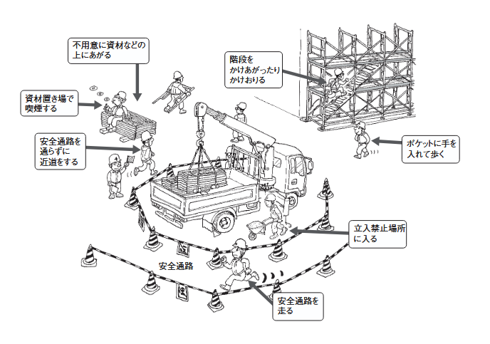

# 第3項：作業手順に関すること

## 1. はじめに：手順の必要性

建設現場は日々状況が変化します。  
その中で、全員がバラバラなやり方で作業をすると、予期せぬ事故が発生します。  
作業手順とは、**最も安全で、かつ効率的に作業を進めるための正解のルート**です。

施工管理者の役割は、作業員が自己流や近道で作業をしていないかを監視し、手順書に基づいた安全な施工を担保することです。

---

## 2. 「作業計画」と「作業手順書」の違い

現場には、安全を守るための計画書類があります。  
まずはこの違いを理解しましょう。

| 書類名 | 概要 | 施工管理者の役割 |
| --- | --- | --- |
| **作業計画書** | 工事全体の流れ、使用する機械、人員配置、安全対策などを定めた**全体計画**。 | 計画通りに重機が配置されているか、立入禁止区域が設定されているかを確認する。 |
| **作業手順書** | 一つひとつの作業（例：足場の組立、コンクリート打設）の**具体的なステップ**を示したもの。 | 職人さんが手順書の内容を理解しているか、手順を飛ばしていないかを確認する。 |

:::tip **Point:**
法令により、特定の危険作業（型枠支保工の組立、車両系建設機械の使用など）では、あらかじめ作業計画を定め、関係労働者に周知することが義務付けられています。
:::

---

## 3. 現場における「基本動作」の手順

専門的な作業だけでなく、現場内での「移動」や「合図」にも厳格な手順があります。

### 3-1. 安全な通行と移動

現場内は危険がいっぱいです。移動一つとっても「手順」があります。

* **安全通路の通行**: 「近道だから」といって資材置き場を突っ切ったり、重機の作業半径内を通ってはいけません。  
必ず指定された「安全通路」を通行します。
* **昇降設備の使用**: 足場を昇り降りする際は、必ず階段や昇降タラップを使用します。  
配管や枠組をよじ登る行為は厳禁です。
* **ポケットハンド禁止**: 転倒時に手がつけるよう、ポケットに手を入れて歩いてはいけません。

### 3-2. 合図と連絡（重機・クレーン）

重機オペレーターやクレーン運転士は、周囲の状況が完全に見えているわけではありません。

* **合図の統一**: クレーン作業では、指名された合図者（玉掛け者）が統一された合図を送ります。
* **アイコンタクト**: 重機の近くを通る際は、オペレーターとアイコンタクトを取り、**自分がここにいる**ことを認識してもらってから、停止を確認して通過します。

### 3-3. 整理整頓（4S）の手順

「片付け」も作業手順の一部です。

* **4S（整理・整頓・清掃・清潔）**: 作業終了後ではなく**作業中**に行うのが基本です。  
通路に物が置かれていると、つまづき転倒災害の原因になります 。
* **定位置管理**: 工具や資材は決められた場所に置くことで、探す無駄や紛失事故を防ぎます。

  
[出典：厚生労働省](https://www.mhlw.go.jp/content/11300000/000609001.pdf)

---

## 4. 事故を招く不安全行動と近道・省略

事故の多くは、慣れや焦りから**決められた手順を省略する**（近道行動）ことで発生します。

### 4-1. 非定常作業（トラブル対応）の危険性

機械が詰まった、モノが引っかかった等の**異常時**（非定常作業）に手順を無視して手を出した瞬間に事故は起きます。

:::danger **鉄則**
トラブル時は**止める・呼ぶ・待つ**を徹底させます。
1. 機械を**止める**（電源を切る）。
2. 責任者を**呼ぶ**（勝手に判断しない）。
3. 指示を**待つ**（安全が確認されるまで手を出さない）。
:::

### 4-2. よくある「手順無視」の事例

* **安全装置の無効化**: 「カバーが邪魔だ」といって、丸ノコの安全カバーを紐で縛って固定する。
* **保護具の省略**: 「暑いから」「ちょっとだけだから」といって、安全帯を使用せずに高所作業を行う。
* **合図の省略**: 誘導員を配置せず、周囲の確認を怠ったまま重機を後退させる。

:::tip **施工管理者の視点:**
 「ベテランだから大丈夫だろう」という思い込みは捨ててください。  
 ベテランほど「慣れ」による手順省略（近道行動）を起こしやすい傾向があります。
:::

---

## 5. 作業手順書の作成と活用（KY活動）

手順書は「作って終わり」ではありません。毎日の活動に落とし込む必要があります。

### 5-1. KY（危険予知）活動

作業開始前に、その日の作業手順の中に「どんな危険が潜んでいるか」をチームで話し合う活動です。

* **手順**:
1. **現状把握**: どのような作業をするのか？
2. **本質追求**: 危険のポイントはどこか？（例：開口部から落ちるかもしれない）
3. **対策樹立**: どうすれば防げるか？（例：安全帯を必ず使用する）
4. **目標設定**: 行動目標を決めて唱和する（指差呼称）。

### 5-2. 新規入場者教育との連携

新しい現場に入場する際は、その現場特有のルール（作業手順）を学ぶ「新規入場者教育」を受けます。  
自社の教育（雇入時教育）で学んだ基礎に加え、現場ごとのローカルルールを順守することが求められます 。

---

## 6. まとめ：施工管理者が現場で見るべきポイント

皆さんが現場巡回をする際、以下の視点で「手順」が守られているか確認してください。

1. **「我流」になっていないか？**
    * 作業手順書と違うやり方をしている作業員はいませんか？
2. **「省略」していないか？**
    * 安全確認や合図、点検を飛ばしていませんか？
3. **「無理」をしていないか？**
    * 予定より遅れているからといって、急いで作業を進めようとしていませんか？

**手順を守ることは、命を守ること**です。  
手順違反を見つけたら注意し、正しいやり方に戻すことが施工管理者の重要な使命です。

