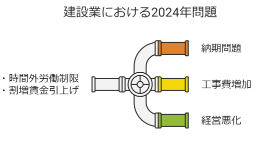
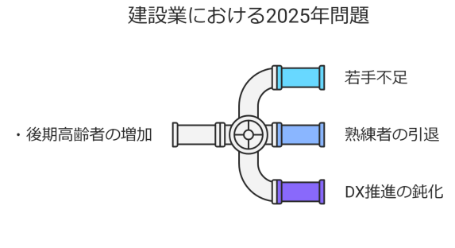
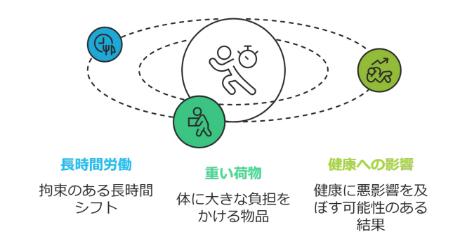
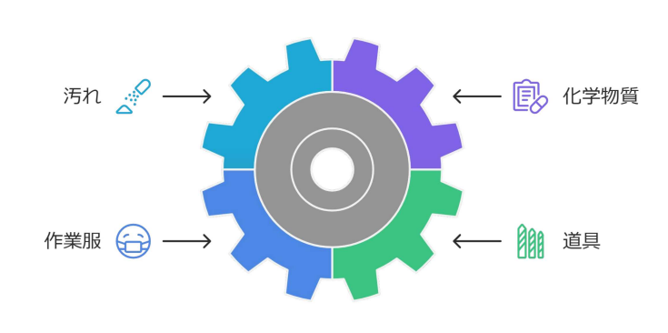
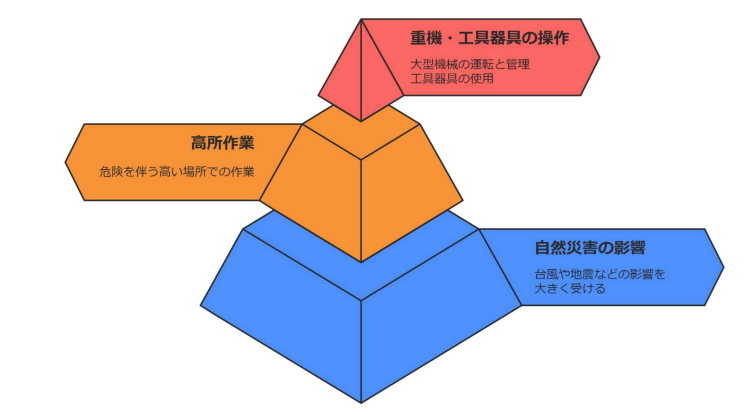
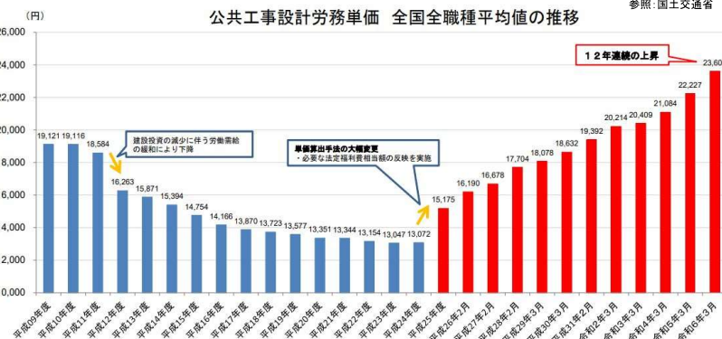
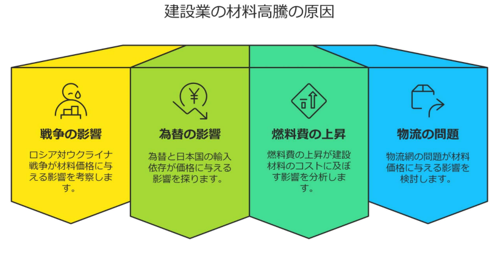

# 建設業界の課題

<iframe src="https://drive.google.com/file/d/1yPcn66Ya9mLBQaApoc4oNb1JB7j3NIdM/preview" width="640" height="360" allow="fullscreen"></iframe>

---

2020年のコロナパンデミックによって、様々な業界が影響を受けましたが、建設業界もその１つです。  
影響は受けたものの、2021年には建設業の需要が再度高まり、現在まで建設投資額は上昇傾向にあります。  
しかし、需要が高まっている中でも課題は多いです。

## 建築業における2024年問題

---

建設業界における「2024年問題」とは、2024年4月から「働き方改革関連法」が建設業にも本格適用され、時間外労働（残業時間）に罰則付きの上限規制が導入されたことで生じる諸問題を指します。  

### なぜ「2024年」だったのか？

働き方改革関連法は2019年に施行されましたが、建設業は「業務の特殊性（天候に左右される、工期が絶対である等）」や「慢性的な長時間労働」があったため、5年間の猶予期間が設けられていました。その猶予が終了したのが2024年4月です。

### 規制の具体的な内容

これまで建設業の残業時間は実質的に「無制限」に近い状態でしたが、現在は以下の制限が厳守されています。

| 区分 | 規制内容・詳細 |
| :--- | :--- |
| **原則** | **月45時間、年360時間以内** |
| **特別な事情がある場合（上限）** | ・年間の時間外労働は**720時間以内** ・月間の時間外労働は**100時間未満**（休日労働含む） ・複数月（2〜6ヶ月）の平均が**80時間以内** |
| **罰則** | 違反した場合、経営者に対して**「6ヶ月以下の懲役」**または**「30万円以下の罰金」**が科される可能性があります。 |

### 2024年問題が引き起こす具体的な影響

上記の規制によって、以下のような課題が表面化しています。

- **工期の長期化**: 1日の作業時間が制限されるため、これまでと同じ人手であれば、全体の工期を延ばさざるを得ません。
- **人手不足のさらなる深刻化**: 1人あたりの労働時間が減る分、同じ工事量をこなすには「より多くの人数」が必要になりますが、もともと若手不足・高齢化が進んでいるため、確保が困難です。
- **労働者の収入減少**: 残業代で稼いでいた現場作業員や若手社員にとって、残業抑制は手取り額の減少に直結し、離職を招くリスクがあります。
- **コスト（外注費）の上昇**: 人を増やすための募集費や、工期延長に伴う経費が増大し、工事金額全体を押し上げます。

## 建築業における2025年問題

---

建設業界における「2025年問題」とは、団塊の世代（1947〜1949年生まれ）が全員75歳以上の後期高齢者となることで、現場を支えてきた熟練技能者が一斉に引退し、深刻な人手不足と技術承継の断絶が起きることを指します。

### 2025年問題の核心：熟練技能者の大量引退

建設業は他産業に比べても高齢化が著しく、現場の「核」となる知識を持ったベテラン層に依存してきました。

- **技能の喪失**: 2025年を境に、複雑な図面を読み解く力や、現場の不測の事態に対応する「勘と経験」を持った職人が現場から消えてしまいます。
- **人手不足のピーク**: 2025年には、建設業全体で約40万〜90万人の労働力が不足すると予測されています。

### 具体的な3つの危機

この問題は、単に「人が足りない」だけではなく、以下の3つの連鎖的な危機を引き起こします。

- **技術承継のストップ**: 若手への教育が追いつかないままベテランがいなくなるため、日本の建設業が誇ってきた高い品質（クオリティ）を維持できなくなる恐れがあります。
- **インフラメンテナンスの限界**: 高度経済成長期に造られた道路や橋、ダムが一斉に老朽化を迎える時期と重なります。直すべきインフラは増えるのに、直せる人がいないという事態に陥ります。
- **倒産・廃業の増加（サブコン・町場）**: 特に高い専門性を持つサブコン（専門工事業者）において、後継者不在による黒字廃業が増え、ピラミッド構造の下支えが崩壊する危険があります。

## 深刻な人材不足

---

人口減少に伴い、労働人口者数も当然減少しています。  
建設業は3Kのイメージが強いため、若手から敬遠されており担い手不足が深刻となっています。  
若手の人材不足が深刻化する中で、原因となっているキーワードが、【3K】です。

### きつい

建設業界における「3K」のひとつである「きつい」は、単に「体を使う」ということだけでなく、肉体的・精神的・環境的な複数の負荷が重なっている状態を指します。

### きたない

建設現場は土や埃、化学物質などが多く、作業環境が汚れていることが一般的です。  
このため、「建設業の仕事は汚れている環境で働かなければならない」という概念が根付いてしまっています。

### きけん

建設業は高所作業や重機の操作など、危険が伴う作業が多いです。  
適切な安全対策が講じられていない場合、事故や怪我のリスクが高まります。

## 労務費の高騰

---

「労務費」とは、現場で働く職人さん（技能労働者）や現場監督などに支払われる「人件費」のことです。現在、これがかつてない勢いで上昇しており、経営を圧迫する大きな要因となっています。

### なぜ労務費が上がっているのか？

背景には「需要と供給」のバランスが極端に崩れていることがあります。

- **深刻な人材不足（供給不足）**: 2025年問題による熟練者の大量引退や、若手の入職者減少により、現場を動かせる人が物理的に足りていません。
- **「公共工事設計労務単価」の引き上げ**: 国（国土交通省）が、人材確保と「新3K（給与・休日・希望）」の実現のために、国が発注する工事の基準となる単価を12年連続で引き上げています。これが民間工事にも波及しています。
- **2024年問題への対応**: 残業上限が規制されたため、これまで1人でこなしていた作業量を2人で分担せざるを得ず、結果として支払う賃金の総額が増えています。
- **他業界との人材争奪戦**: 物流業や製造業など、同じように労働力不足に悩む他業界に人材が流れないよう、賃金を上げざるを得ない状況にあります。

### 労務費高騰がもたらす影響

労務費が上がると、建設プロジェクトの至る所に連鎖的な影響が出ます。

- **工事費（見積額）の上昇**: 建設コストの約3割〜4割を占めるのが労務費と言われています。これが上がることで、マンションの販売価格や企業のオフィス建築費用、公共事業の予算が跳ね上がっています。
- **建設会社の利益圧迫**: 数年前に固定金額で受注した長期プロジェクトの場合、その後の労務費高騰分を会社が負担することになり、赤字に陥るケースがあります。
- **人手不足倒産の増加**: 「仕事はあるのに、高い給料を払って職人さんを確保できないため、工事が進まず倒産する」という事態が実際に起きています。

## 材料費の高騰

---

労務費（人件費）の上昇が国内の構造的問題であるのに対し、材料費の高騰は世界情勢や経済の変化が複雑に絡み合っています。

### なぜ材料費が上がっているのか？

建設資材の価格が急騰した背景には、いくつかの大きな「ショック」が重なっています。

- **アイアンショック（鉄鋼価格の上昇）**: 世界的なインフラ需要の増加や、原材料である鉄鉱石・石炭の価格高騰により、鉄筋や鋼材の価格が跳ね上がりました。
- **ウッドショック（木材不足と高騰）**: コロナ禍での米国の住宅需要増や、ロシア・ウクライナ情勢による供給不安から、輸入木材を中心に価格が激しく変動しました。
- **エネルギー価格と輸送費の上昇**: セメントやガラス、タイルなどの製造には大量のエネルギーが必要です。燃料価格の上昇がそのまま製造コストや、現場へ運ぶための輸送費に転嫁されています。

### 具体的にどの材料に影響が出ているか

建物のあらゆる部位でコスト増が起きています。

- **構造材**: 鉄筋、コンクリート（セメント）、木材。
- **設備機器**: エアコン、給湯器、エレベーター。これらは半導体不足や銅価格の上昇により、価格だけでなく「納期遅延」も大きな問題となりました。
- **仕上げ材**: 石膏ボード、断熱材、サッシ（アルミ）。これらも原材料の輸入価格や電気代の上昇の影響を強く受けています。

### 材料費高騰がもたらす「負の影響」

- **利益の圧迫（逆ザヤ）**: ゼネコンやサブコンは、1年以上前に契約した金額で工事を進めることが多いため、その後の材料費高騰分を自社で吸収しきれず、赤字（逆ザヤ）になるケースが発生しています。
- **発注の見送り・延期**: デベロッパーや施主が、あまりの費用の高さに「今は建て時ではない」と判断し、計画を中止または延期する事態が相次いでいます。
- **予算オーバーによる仕様変更**: 当初の設計では使えたはずの高級な建材を、コスト削減（バリューエンジニアリング）のために安価な代替品へ変更せざるを得ない状況も増えています。