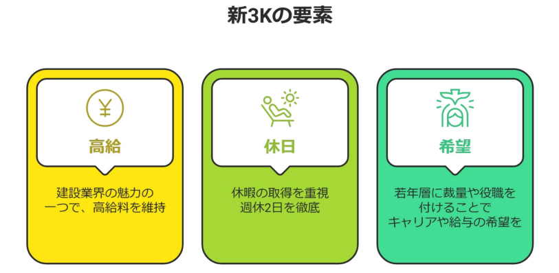
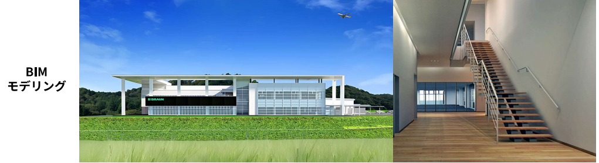
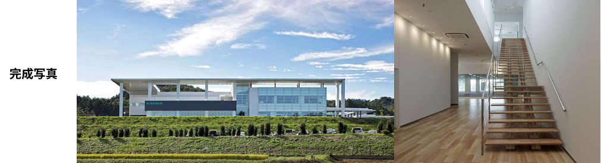
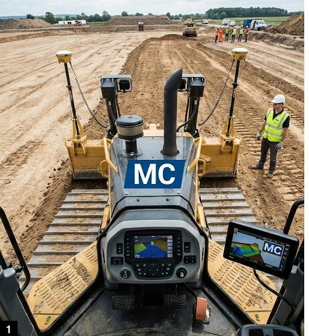
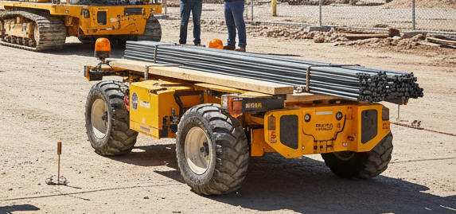
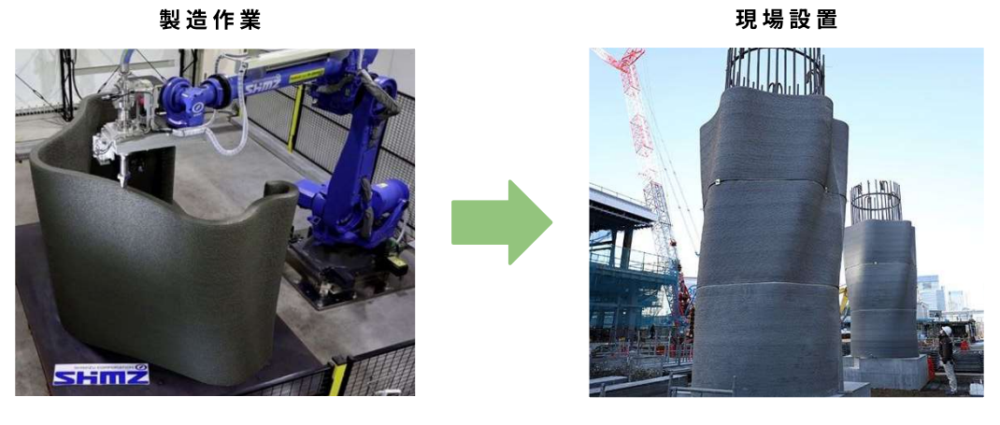
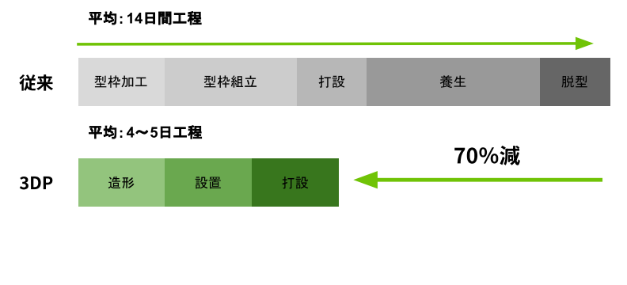

# 建設業の課題への対策

---

建設業界は今、「人海戦術」や「経験と勘」に頼る古いモデルから、デジタルと効率化を軸とした新しい産業へのアップデートを急いでいます。

## 「新3K」の実現による人材確保

---

深刻な人手不足と2025年問題に対処するため、従来の「3K（きつい・汚い・危険）」を払拭し、若者が定着できる環境を整備しています。

- **給与**: 労務費高騰分を適切に発注価格へ転嫁し、他業界に劣らない賃金水準と社会保険への加入を徹底します。
- **休日**: 「2024年問題」の解決策として、現場の「4週8閉所（完全週休2日）」を標準化し、ワークライフバランスを向上させます。
- **希望**: 最新技術の導入により、単なる力仕事ではなく「テクノロジーを使いこなす専門職」としての魅力を高め、キャリアパスを明確にします。

## DX（デジタルトランスフォーメーション）による生産性向上

---

限られた時間と人数で成果を出すため、デジタル技術を徹底活用します。  
単なる「IT化（紙をデータにする）」にとどまらず、デジタル技術を使って現場の働き方や施工プロセスそのものを根底から変えることを指します。

### BIM（Building Information Modeling）の活用

  
  {/* 左側：画像エリア（位置を文章の上端に合わせる） */}
  

    
  

  {/* 右側：テキストエリア */}
  

    

      BIMとは、単なる3次元の立体図面を作成するツールではなく、コンピューター上の3Dモデルに建物の材料、価格、性能、そして施工工程といった膨大な「属性情報」を詰め込んだ建物のデータベースです。
    

    

      従来のCADが「線を組み合わせて平面的な図面を引く」ための道具だったのに対し、BIMは「デジタル空間上で先に建物を組み立てる」という全く新しい概念に基づいています。
    

    

      最大の特徴はデータの一貫性にあり、モデルの一部を修正すれば、連動している平面図や立面図、さらには見積書に至るまでがリアルタイムで自動更新されるため、設計の不整合を根本から防ぐことができます。
    

    

      「2024年問題」や「深刻な人手不足」を突破するためには、BIMによる効率化はもはや避けて通れません。現場での無駄な作業を削ぎ落とし、限られた時間で高品質な建物を造り上げるBIMは、建設業界が「新3K（給与・休日・希望）」を実現するための強力な武器となっています。
    

    

      以下の画像が示す通り、モデリングデータと完成写真が寸分違わず一致する精密な施工管理こそが、これからの建設業界のスタンダードとなります。
    

  

 

**BIMのメリットとデメリット**
| 項目 | メリット（生産性向上・利点） | デメリット（課題・ハードル） |
| :--- | :--- | :--- |
| **品質・精度** | **干渉チェックでミスを激減** 着工前にデジタル上で「柱と配管の衝突」などを発見できるため、現場での手戻りがなくなる。 | **データの整合性維持の負担** 入力する情報の精度が低いと、結果として間違った図面や見積もりが出てしまう。 |
| **意思決定** | **迅速な合意形成と可視化** 3DパースやVRで完成イメージを共有できるため、施主や近隣住民との打ち合わせがスムーズになる。 | **関係者間のIT格差** 自社だけ導入しても、下請けや設計事務所が未対応だと、データの連携が途切れてしまう。 |
| **コスト・管理** | **精緻な積算と維持管理への活用** 材料の数量を自動算出。完成後も修繕履歴の管理データとして長く活用できる。 | **高額な初期投資** 高性能PC、高価なソフトライセンス、高速ネットワーク環境の整備に多額の費用がかかる。 |
| **働き方改革** | **工期短縮と現場監督の負担軽減** シミュレーションにより効率的な工程が組める。2024年問題の解決に向けた強力な武器になる。 | **人材育成の学習コスト** 操作が高度で習得に時間がかかる。使いこなせる専門人材の確保や教育が極めて困難。 |

 

:::tip
**CAD**  
CAD（Computer Aided Design）とは、コンピューターを用いて設計や図面作成を行うシステムのことです。日本語では「コンピューター支援設計」と呼ばれます。  

かつて建築士や設計者は製図台に向かい、手書きで図面を引いていましたが、CADの登場によってパソコン上で正確かつ効率的に図面を作成することが可能になりました。CADは単なるデジタルの筆記用具ではなく、線や円などの幾何学的なデータを数値として扱うため、ミリ単位の正確な設計が容易に行える点が最大の特徴です。 

建設業界においては、建物の平面図、立面図、断面図などを描くために不可欠なツールとなっており、作成したデータは簡単に修正や複製ができるため、設計変更が多い現場でも迅速に対応できる利点があります。  
また、データとして共有できるため、設計者から施工会社、協力会社へとスムーズに情報を伝達する役割も担っています。
:::

### 施工管理アプリによる事務作業の削減

これまで現場監督の仕事は、日中の現場での指示出しに加え、帰社後に数時間かけて行う膨大な事務作業がセットになっていました。これが「きつい」と言われる要因の一つでしたが、施工管理アプリはこの事務作業を「現場にいながら」完結させることで、労働時間の短縮を実現しています。  

このようなデジタル化は、資料にある**「2024年問題」への対策として極めて有効です。  
事務作業という「直接建物を作らない時間」を削減することで、現場監督が安全管理や品質管理といった本来の重要業務に集中できる環境を整え、結果として「新3K（給与・休日・希望）」の実現に寄与しています。  

具体的に削減される事務作業は以下の通りです。

- **写真管理の自動化**: 従来は、現場で撮った何百枚ものデジカメ写真を事務所でパソコンに取り込み、一つずつ仕分けして台帳に貼り付けていました。アプリを使えば、スマートフォンで撮影した瞬間にクラウド上で自動整理され、工事写真台帳が即座に作成されるため、帰社後の仕分け作業が不要になります。
- **図面持ち歩きの解消とリアルタイム共有** : 重くてかさばる大量の紙図面を持ち歩く代わりに、タブレット一台に全ての最新図面を集約できます。現場で気づいた修正指示をアプリ上で図面に書き込めば、事務所のスタッフや他の職人とリアルタイムで共有されるため、連絡ミスによる「やり直し」や説明のための移動時間が削減されます。
- **書類作成（日報・報告書）の効率化**: 現場の合間や移動時間に、スマートフォンで進捗を入力するだけで日報が作成されます。音声入力機能を活用すれば、手が離せない状況でも文字入力が可能となり、事務所に戻ってからパソコンに向かう時間を大幅に削ることができます。

### ICT建機と自動化技術

ICT建機と自動化技術は、衛星測位システム（GNSS）やセンサーを駆使して建設機械の操作を高度にデジタル化したものであり、建設現場の生産性を根本から変える可能性を秘めています。  
この技術の核となるのは、重機のモニターに設計図との差を表示してオペレーターを導く「マシンガイダンス（MG）」と、設計データに合わせてバケットなどの動きを半自動で制御する「マシンコントロール（MC）」の2つの機能です。 

- **MG（マシンガイダンス）**:MGは、いわば「建設重機用のカーナビゲーション」です。重機の運転席に設置されたモニターに、設計図上の目標値と、現在のバケットやブレードの刃先の位置をリアルタイムで表示します。 オペレーターはこの画面の指示を見ながら、設計通りの高さや角度になるよう自らの手で操作を行います。これにより、熟練の勘に頼らずとも正確な施工が可能になりますが、最終的な操作の主体はあくまで人間です。

- **MC（マシンコントロール）**:MCは、MGの機能に加えて、重機の操作を「自動または半自動で制御」する高度な技術です。設計データに連動して油圧システムが作動し、刃先が設計した高さに達するとそれ以上深く掘らないように止まったり、複雑な斜面に合わせて自動でブレードの角度が固定されたりします。 オペレーターはレバーを引くなどの単純な操作を行うだけで、機械が複雑な微調整を自動で肩代わりしてくれるため、経験の浅い若手でも熟練者並みの精度で施工を完遂できます。

ICT建機の導入により、従来は熟練のオペレーターにしかできなかったミリ単位の正確な施工を若手でも行えるようになるため、深刻な人材不足や技術継承の課題に対する極めて有効な解決策となります。  
また、重機自体が設計図に対する自らの位置を正確に把握しているため、現場に大量の杭や目印を設置する「丁張り」という手間のかかる準備作業が大幅に不要となり、作業効率が40〜50％向上した事例も報告されています。  

こうした自動化技術は、資料にある「2024年問題」や「新3K」の実現においても大きな役割を果たします。  
作業時間が劇的に短縮されることで、従業員の休日を増やし「4週8閉所」を維持しやすくなるだけでなく、重機の周囲で計測作業を行う人を減らせるため、接触事故のリスクが下がり現場の安全性も飛躍的に向上します。  
デジタル技術を駆使して、より安全に、かつ短時間で高精度な成果を出すICT建機は、これからの建設現場に欠かせない標準的な設備となりつつあります。

:::note  
**自動化技術の広がり**  
現在では重機だけでなく、さらに高度な自動化が進んでいます。

- **自動搬送ロボット**: 資材を指定された場所まで自動で運ぶロボットの導入が進んでいます。
- **自律走行・遠隔操作**: 人が乗らずにプログラム通りに稼働する重機や、事務所からゲームコントローラーのような装置で現場の重機を動かす「遠隔操作」も実用化されつつあります。これにより、資料にある「きつい・きたない・きけん」な環境に直接入らずに作業を行うことが可能になります。

 

:::

### 建設用3Dプリンティングによる抜本的効率化

建設用3Dプリンティングは、コンピューター上の3Dモデルデータに基づき、専用のノズルからコンクリートなどの材料を層状に積み上げて構造物を自動で造形する技術であり、建設業界の生産性を根本から覆す可能性を秘めています。  

この技術の最大のメリットは工期の劇的な短縮にあり、従来の鉄筋コンクリート造で不可欠だった「型枠」の組み立てや解体といった工程を省略できるため、工期を約70%も削減することが可能です。

また、深刻な人手不足や熟練技能者の引退といった課題に対しても、少人数のオペレーターで施工を完遂できる「省人化」という形で直接的な解決策を提示します。  
労務費の削減や材料ロスの抑制といったコスト面での利点に加え、従来の工法では困難だった複雑な曲線デザインも容易に実現できるため、建設業をよりクリエイティブな職種へと変貌させ、若者が魅力を感じる「新3K（希望）」の実現にも大きく寄与します。

このように、建設用3Dプリンティングは「工期・人手・コスト」という業界の三大課題を同時に解決する抜本的な効率化の切り札といえます。

:::tip
**3Dプリンタ住宅**  
3Dプリンター住宅は、大型の造形機を用いてコンクリートなどの材料を層状に積み上げることで、家を「印刷」するように構築する次世代の住まいです。

従来の住宅建築に不可欠だった「型枠」の組み立てや解体、さらに多くの職人による手作業を大幅に省くことができるため、資料にある「人手不足」や「工期不足」を解消する画期的な技術として注目されています。  
最大の魅力は、24時間以内という驚異的なスピードで家を完成させられる点や、300万〜500万円台という車を買うような感覚で手に入る圧倒的な低価格にあります。

**主な施工事例**
- **「スフィア（Sphere）」**: 10平米程度のドーム型建築で、わずか23時間12分という施工時間を達成し、別荘や離れとしての活用が進んでいます。
- **「フジツボ（fujitsubo）」**: 国内初の3Dプリンター造による一般住宅（平屋・50平米）で、550万円という低価格を実現しながら、実際に夫婦2人が住める居住性能を備えています。
- **「被災地支援住宅」**: 能登半島地震などの復興支援として、現地で迅速に住まいを供給するためのプロジェクトにも活用されています。

このように、3Dプリンター住宅は「安く・早く・自由に」建てるという新しい選択肢を提示し、建設業界の「新3K（希望）」を象徴する技術となりつつあります。
:::