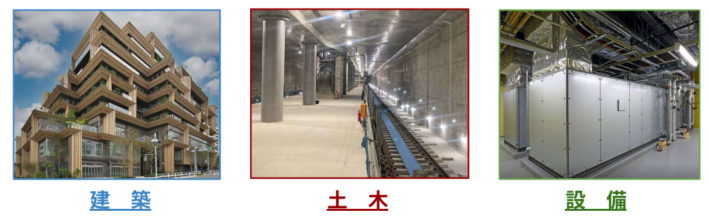
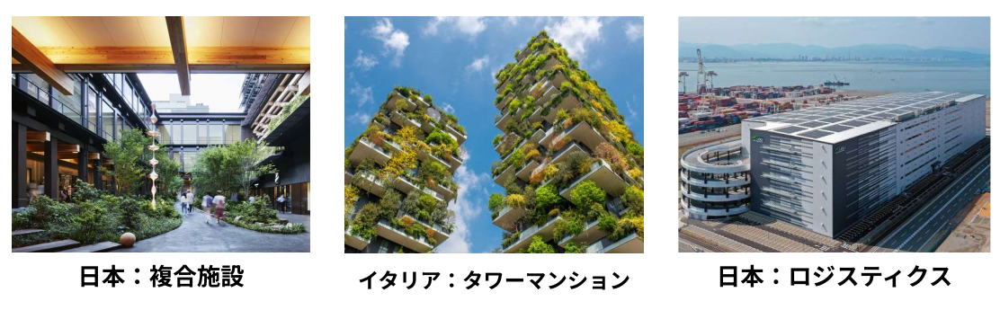
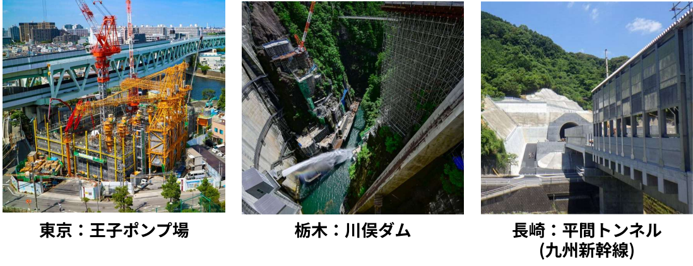
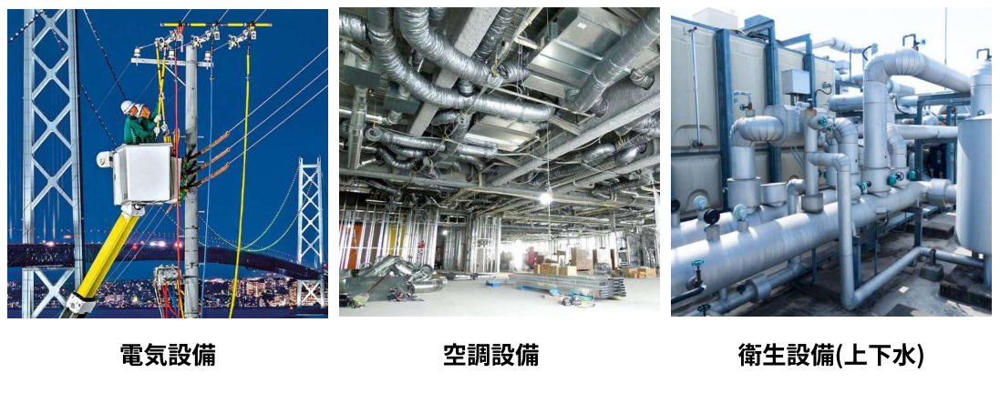

# 建設業の分類

<iframe src="https://drive.google.com/file/d/1nRDAW4-bdivbPqz1CRCy6bQoy5vPYwuL/preview" width="640" height="360" allow="fullscreen"></iframe>

---

建設業界は、私たちの生活を支える空間やインフラをどのように作り上げるかという役割の違いで、「建築」「土木」「設備」の３分類に分けられます。

## 建築

---

字のごとく建物を築く分野です。耐久性も重要ですが、デザイン性も注力される分野です。  
建物はそれぞれに作られた目的や機能があり、その意図がはたされるように造らなければなりません。  
目的別に以下のように分類できます。

- **住宅系**：戸建て住宅、アパート、マンション(共同住宅)
- **商業系**：オフィスビル、商業施設、店舗、工場
- **公共施設系**：役所、病院

## 土木

---

土木は建築に比べて公共物を構造していく分野です。  
代表的な工事は、トンネル工事・ダム工事で、身近な工事は道路工事や地下鉄工事です。

## 設備

---

設備は建築、土木に比べゼロから構造物を造るわけではありません。  
既存の構造物に対して生活に必要な設備であったり、使用する上で必要な設備を施工していく分野になります。

 

| 分類 | 役割・目的 | 主な建造物・対象 | 主な作業環境 |
| :--- | :--- | :--- | :--- |
| **建築** | 人が過ごす「空間」の創造。居住性や意匠を重視。 | 住宅、ビル、学校、商業施設、病院など | 地面より上の構造物。都市部や住宅地。 |
| **土木** | 社会を支える「インフラ」の構築。公共の安全を追求。 | 道路、橋、ダム、トンネル、堤防、空港など | 屋外。山・川・海などの広大な自然環境。 |
| **設備** | 建物に「命」を吹き込む。水・電気・空気を循環させる。 | 電気配線、空調、給排水、消防、通信設備など | 天井裏、床下、壁内、機械室などの狭小空間。 |
