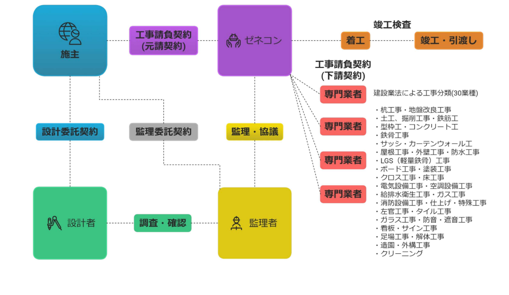
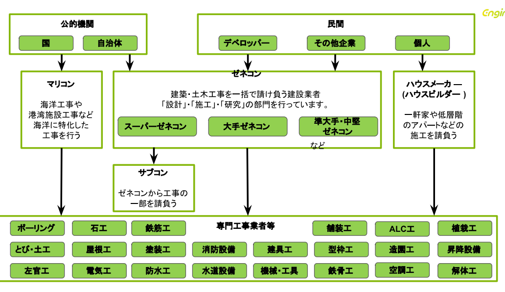

# あまり知られていない企画～着工まで

---

建物が実際に現場で作り始められる（着工）よりも前の、非常に重要かつ緻密な準備プロセスについて解説します。

## 建設業の仕組み　フロー

---

建設プロジェクトの始まりから建物完成・引渡しまでの流れについて解説します。  
下図のように、建設業は多くの専門家が「契約」と「協力」によってリレー形式でバトンを繋ぎ、一つの大きな建造物を完成させる仕組みになっています。

### プロジェクトに関わる主要な4つのプレーヤー

「施主」「監理者」「ゼネコン」「専門業者」の役割と関係性について解説します。

- **施主(発注者)**：プロジェクトの「オーナー」であり、家を建てたい個人や、ビルを建てたい企業、公共施設を依頼する官公庁などがこれに当たります。
- **監理者（チェック役）**：施主の代理人として、工事が設計図通りに正しく行われているかを第三者の立場で厳しく確認する役割です。
- **ゼネコン（施工者・元請け）**：施主から工事を丸ごと引き受け、現場全体の運営を統括する「総合建設業者」です。
- **専門業者（サブコン・下請け）**：ゼネコンから特定の工程を請け負い、実際に手を動かして形にする技術集団です。

### プロジェクトに関わる主要な4者の契約

建物を建てる際には、中心となる「施主（発注者）」が以下の関係者と個別に契約を結ぶことでプロジェクトがスタートします。

- **設計委託契約**: 施主が設計者に建物の図面作成を依頼する契約です 。
- **監理委託契約**: 施主が監理者に、工事が設計通りに進んでいるかチェックを依頼する契約です 。
- **工事請負契約（元請契約）**: 施主がゼネコンに、実際の建物を建設することを依頼する契約です 。

### 施工の体制（ピラミッド構造）

ゼネコンは、施主から請け負った工事を自社だけで行うのではなく、専門的な技術を持つ多くの会社と協力して現場を動かします。

- **下請契約**: ゼネコン（元請け）が、特定の工事（電気や内装など）を専門業者（サブコン）へ発注する契約です 。
- **監理・協議**: 工事中、ゼネコンは監理者と密に協議を行い、設計図の意図が正しく現場に反映されているかを確認し合います 。

### 着工から引渡しまでの流れ

実際の現場作業は、以下のプロセスで進みます。

- **着工**: 契約に基づき、現場での工事が開始されます 。
- **専門業者による施工**: 建設業法で定められた30の業種（杭工事、鉄筋工、電気設備工事、左官工事など）が、工程に合わせて次々と現場に入り、建物を形にしていきます 。
- **竣工検査**: 全ての工事が終わると、設計図通りにできているか、品質に問題がないかを最終確認します 。
- **竣工・引渡し**: 検査をパスした後、完成した建物が施主に引き渡されます 。

### 施工管理の役割

施工管理は上図の「施工（着工〜竣工）」のフェーズ全体を網羅し、すべての関係者の中心をつなぐ非常に重要な役割を担っています。

**契約上の位置づけ**  
施工管理（現場監督）は、施主と工事請負契約を結んだ「ゼネコン（施工者）」側の代表として現場に立ちます。ゼネコンが「専門業者」を指揮し、「監理者」と協議するその「実行役の主体」が施工管理職です。

**役割の範囲**  
施工管理の仕事は、単に工事中だけでなく、準備段階から引渡しまで広範囲にわたります。

  {/* 着工前 */}
  

    
      ・着工前（準備）：
    
    

      設計図を読み込み、予算を立て、専門業者（サブコン）を選定し、詳細な施工計画（工程表など）を作成します。
    

  

  {/* 施工中 */}
  

    
      ・施工中（メイン業務）：
    
    

      現場の最前線で「安全・品質・工程・原価」の4つを管理します。 
      専門業者が設計通りに作っているかチェックする（品質管理）。 
      事故が起きないよう指示を出す（安全管理）。 
      スケジュールが遅れないよう調整する（工程管理）。
    

  

  {/* 竣工・引渡し */}
  

    
      ・竣工・引渡し：
    
    

      検査に立ち会い、完成した建物を施主に引き渡すための最終確認を行います。
    

  

**誰と誰の間にいるのか？**  
施工管理は、いわば「現場のオーケストラの指揮者」です。  
フロー図上の以下の関係をすべてつなぎ合わせる「結節点」に位置しています。

- **ゼネコン vs 監理者**: 「設計図の通りに作っています」という報告と確認。
- **ゼネコン vs 専門業者**: 「いつ、どこで、誰が、何を作るか」という具体的な作業指示。
- **ゼネコン vs 近隣住民**: 工事による騒音や安全への配慮・説明。

## 公的・民間の分類

建設工事の依頼主である「発注者」の2つの大きな区分、「公的機関（公共工事）」と「民間（民間工事）」について解説します。  
この分類は、そのプロジェクトが「税金などを用いて公共の利益のために行われるか」あるいは「民間企業の利益や個人の生活のために行われるか」という目的の違いに基づいています。  
誰が工事を依頼し、誰がそれをまとめ、誰が実際に施工するのかという業界の全体像は、以下の3つの階層に分けられます。

### 発注者の分類（工事を依頼する側）

工事の依頼主は、大きく「公的機関」と「民間」に分けられます 。

- **公的機関**: 国や自治体などが、道路や公共施設などのために依頼します 。
- **民間**: デベロッパー（開発業者）、一般企業、そして家を建てる個人などが含まれます 。

### ゼネコンとハウスメーカー（工事をまとめる側）

発注者から直接工事を請け負う「元請け」の分類です。

- **ゼネコン**: 建築・土木工事を一括で請け負い、「設計」「施工」「研究」の部門を持ちます 。規模によって「スーパーゼネコン」「大手ゼネコン」「準大手・中堅ゼネコン」に分かれます 。
- **マリコン**: 海洋工事や港湾施設など、海に関する工事に特化した建設業者です 。
- **ハウスメーカー（ハウスビルダー）**: 一軒家や低層のアパートなどの施工を専門に請け負います 。

### サブコンと専門工事業者（実際に作る側）

ゼネコンなどの元請けから、工事の一部を専門的に請け負う「下請け」の分類です 。 建設業法に基づく多種多様な専門工事業者が、それぞれの技術を提供します。

- **構造・骨組み**: 石工、鉄筋工、とび・土工、型枠工、鉄骨工など 。
- **外装・内装**: 屋根工、左官工、塗装工、防水工、タイル・レンガ（ALC）など 。
- **設備**: 電気工、消防設備、水道設備、空調工、昇降設備など 。
- **その他**: ボーリング、舗装工、造園工、植栽工、解体工など

### 施工管理の役割

**異なる階層をつなぐ「司令塔」**  
施工管理は、ピラミッドの頂点にいる「発注者（公的・民間）」と、底辺で実作業を行う「専門工事業者（サブコン）」の間に立ち、双方の橋渡しをします。

- **発注者に対して**: 工事の進捗を報告し、品質を保証する責任を負います。
- **専門業者に対して**: 現場での具体的な指示出しや、異なる業者間の作業調整を行います。

**多種多様な「専門技術」の統合**  
上図では、構造・骨組み（鉄筋、とび等）、外装・内装（左官、塗装等）、設備（電気、空調等）といった膨大な専門業種がリストアップされています。   
施工管理は、これらのバラバラな専門職種を一つのチームとしてまとめ上げる役割を担います。  
例えば、「内装業者が入る前に、電気配線が終わっているか」といった工程のパズルを組み合わせ、現場が止まらないように管理します。

**「現場の経営者」としての4大管理**  
施工管理は、単に工事を見るだけでなく、このピラミッド全体の最適化（マネジメント）を行います。

- **品質・工程**: 多くの専門業者が入れ替わる中で、仕上がりの精度を保ち、期限（工期）を守らせます。
- **安全・原価**: 危険な作業が多い専門業者に安全な環境を提供し、かつ会社としての利益が出るようにコストをコントロールします。