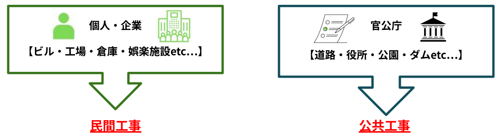
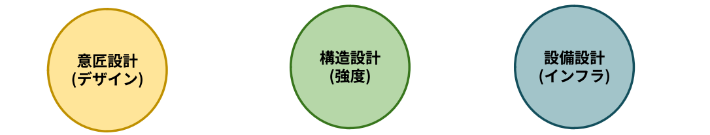
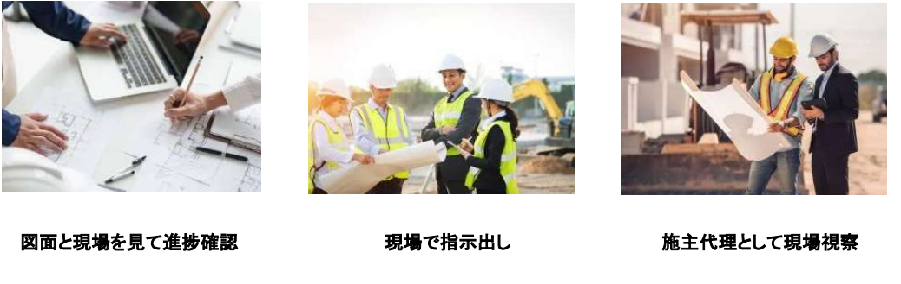
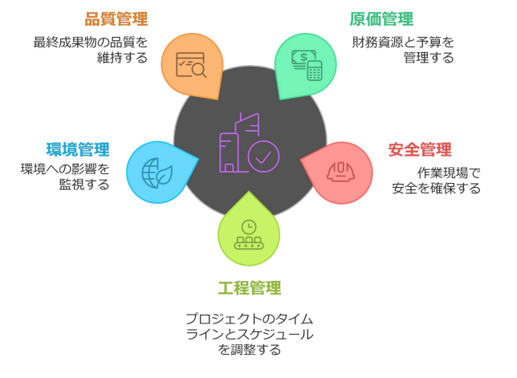
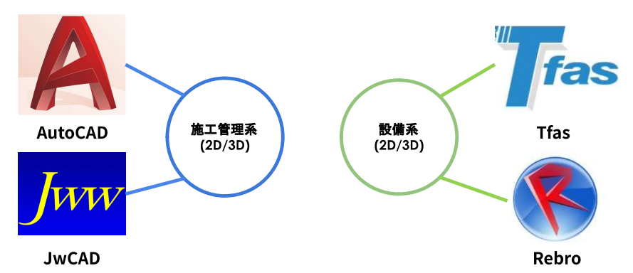
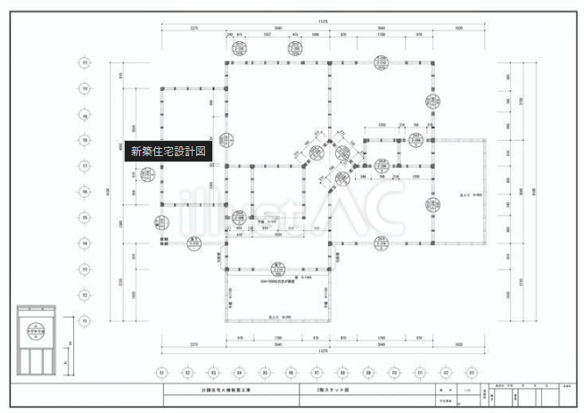
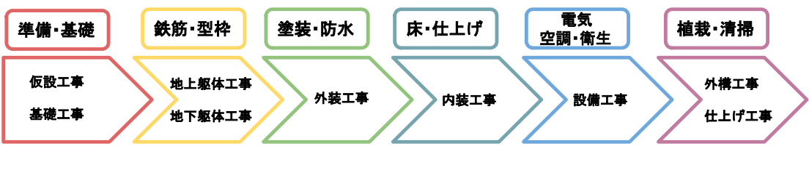

# 職種・サブコンの役割

<iframe src="https://drive.google.com/file/d/1zdwY4NZxvClrhKiQxKHx86PWGN32DddX/preview" width="640" height="360" allow="fullscreen"></iframe>

---

建設プロジェクトに関わる主要な職種の役割を詳しく解説します。  
これらの職種は、大きく「つくる計画を立てるチーム」と「実際に形にするチーム」に分かれ、連携して一つの建物を完成させます。

## 発注者

---

工事を発注する人・企業で、施主と呼んだり、書類などでは建築主と表記します。  
発注者がいなければ、そもそも建設工事が始まらないため、非常に重要な立場です。

### 発注者の定義と役割

プロジェクトの意思決定を行い、資金を提供する役割として、建設工事を建築会社（ゼネコンなど）に依頼し、その対価を支払う個人や団体のことです。  

- **ビジョンの決定**: 「どんな建物を、何のために建てるか」という目的を決めます。
- **契約の主体**: 設計者、監理者、施工者（元請け）とそれぞれ個別に契約を結びます。
- **最終承認**: 完成した建物が、依頼した通りにできているかを確認し、受け取ります。

### 発注者の2つの分類

発注者はその性質によって大きく「公的機関」と「民間機関」の2つに分類されています。

まず公的機関は、国や地方自治体、日本道路公団などが該当し、主に国民や住民から集めた税金を財源として工事を依頼します。  
この分類による工事は「公共工事」と呼ばれ、道路、橋、ダム、トンネル、あるいは役所や公立学校といった、社会全体の利益となるインフラや公共施設を整備・維持することが主な目的です。  
税金を用いるため、工事の依頼先を決める際には公平な「入札」というプロセスが必要となり、品質管理や法的な手続きに対しても非常に高い透明性と厳格さが求められます。

一方で民間は、不動産デベロッパー、鉄道会社、一般企業、そして個人などが発注者となります。  
こちらは企業がビジネスとして利益を上げるため、あるいは個人が生活を送るために、自己資金や銀行からの融資を財源として工事を依頼します。  
この分類による工事は「民間工事」と呼ばれ、オフィスビル、工場、商業施設、高層マンション、個人住宅などが代表例です。公共工事に比べると、市場のニーズに合わせたデザイン性や経済的な効率、そして早期完成に向けたスピード感がより強く追求される傾向にあります。

| 項目 | 公的機関（公共工事） | 民間（民間工事） |
| :--- | :--- | :--- |
| **主な発注元** | 国、都道府県、市区町村、官公庁など | デベロッパー、一般企業、個人など |
| **主な財源** | 国民の税金、公共予算 | 自己資金、銀行融資（民間財源） |
| **主な目的** | 社会インフラ整備、公共の利益、防災 | 収益化、ビジネス拠点確保、個人の居住 |
| **代表的な建造物** | 道路、橋、ダム、トンネル、公立学校 | オフィスビル、マンション、工場、戸建て |
| **業者選定方法** | 公平性を担保するための「入札」制度 | 実績や信頼性に基づく自由な契約 |
| **主な特徴** | 厳格な品質管理、高い透明性 | デザイン性、経済効率、スピード重視 |

このように、発注者がどちらの分類に属するかによって、建設されるものの目的や求められるルール、さらには社会における役割が明確に異なっています

:::note
**施工管理との関わり**  
施工管理者が「誰から依頼を受けて仕事をするのか」という契約の根幹が示されています。民間・公共どちらの現場であっても、発注者のニーズを理解し、予算と目的に合わせた管理を行うことが施工管理の第一歩となります。
:::

## 設計者

---

設計者は、発注者からの要望を聞き、決められている法律の範囲で建物を設計し、その専門領域によって大きく3つの担当に分かれています。

### 意匠設計

意匠設計は、建物の「外観・間取り・使い勝手」をデザインし、発注者の理想を具体的な図面に落とし込む役割です。   
単に見た目を美しくするだけでなく、建築基準法などの法令を守り、快適で安全な空間を構成するプロデューサーのような存在です。

また、建物の強度を計算する「構造設計」や、電気・水道を計画する「設備設計」を一つのデザインにまとめ上げる調整役も担います。  
現場では、施工管理者が工事を進めるための「正解」となる図面を提供し、完成までデザインの責任を持ちます。

### 構造設計

構造設計は、地震や台風などの自然災害に対して建物が壊れないよう、数学的な計算で「強さ」を担保する役割です。  
意匠設計が描いたデザインに基づき、柱の太さや梁の配置、鉄筋の量などを緻密に決定し、建物の骨組みを設計します。

人が安全に過ごすための土台となる安全性を支えており、意匠設計や設備設計と連携しながら、何十年も建ち続けるための強固な構造を作り上げます。  
現場では、施工管理者がこの構造図に従って、正しく強固な骨組みが作られているかを確認します。

### 設備設計

設備設計は、建物の中に「命」を吹き込むために、電気・水・空気などのライフラインを計画する役割です。  
具体的には、照明やコンセントなどの電気設備、トイレやキッチンへの給排水設備、エアコンや換気などの空調設備、さらにはスプリンクラーなどの消防設備といった、人が快適かつ安全に過ごすための機能を設計します。

意匠設計者が考えた空間の美しさを損なわないよう、天井裏や壁の内側に効率よく配管や配線を収めるパズルのような調整も行います。  
現場では、施工管理者がこの設備図を基に、複雑なパイプや配線が他の構造物とぶつからないよう管理し、建物が正常に機能する状態を作り上げます。

| 設計の種類 | 主な役割 | 重視するポイント | 施工管理との関わり |
| :--- | :--- | :--- | :--- |
| **意匠設計** | 建物の外観、間取り、デザイン、使い勝手の計画。 | 美しさ・機能性・居住性・建築基準法の遵守。 | 仕上げの素材や色の決定、部屋の配置などの基準となる。 |
| **構造設計** | 地震や台風に耐えるための骨組み、強さの計算。 | 安全性・耐震性・耐久性・構造計算の正確さ。 | 柱の太さ、鉄筋の量、コンクリートの強度などの基準となる。 |
| **設備設計** | 電気、水道、空調などのライフラインの計画。 | 快適性・利便性・エネルギー効率・消防安全。 | 配線・配管のルート確認、機器の設置位置などの基準となる。 |

 

:::note
**施工管理との関わり**  
施工管理（現場監督）にとって、設計者は**「図面というルールの作成者」**です。現場で図面通りに進められない問題が発生した際には、設計者に確認（質疑）を行い、指示を仰ぎながら工事を進めます。  
また、設計者がそのまま**「監理者（チェック役）」**を兼ねることも多く、その場合は施工管理者が正しく工事をしているかを厳しく検査する立場にもなります。
:::

## 工事管理者

---

「施工管理者（現場監督）」と名前が似ていますが、役割は全く異なります。工事監理者は、発注者の代理人として、現場を第三者の視点で厳しくチェックする「検査役」です。

### 工事監理者の主な役割

工事監理者は、現場が「設計図通りに作られているか」をプロの目で確認します。主な仕事は以下の通りです。

- **設計図との照合**: 施工業者が作成した図面や、実際に現場で使われている材料が、設計図の指定通り（品質・性能）であるかを確認します。  
- **工事の立ち会い**: 基礎のコンクリートを流し込む際や、鉄筋を組み終わった際など、建物が完成すると隠れてしまう重要な工程に立ち会い、手抜きがないか検査します。  
- **発注者への報告**: 工事の進捗状況や、検査の結果を正しく発注者に伝えます。  

### 施工管理者（現場監督）との違い

工事監理者と施工管理者の最大の違いは、プロジェクトにおける「立場」と「目的」にあります。

工事監理者は、発注者（施主）の代理人として、あくまで「第三者の視点」から現場を厳しくチェックすることが役割です。  
具体的には、建築士事務所などに所属する専門家が、工事が設計図通りに正しく行われているか、材料の品質に問題はないかをプロの目で確認し、品質の正当性を保証する「検査役」を担います。

対する施工管理者は、ゼネコンなどの工事請負会社に所属し、現場を実際に動かす「運営の責任者」です。  
職人の手配や安全の確保、スケジュールの調整、工事費用の管理など、建物が完成するまでの全プロセスを円滑に進めるための実務（マネジメント）を一身に引き受けます。

これらを一言で言えば、工事監理者は設計図というルールが守られているかを確認する「レフェリー」のような存在であり、施工管理者はチーム（現場）を勝利（完成）へと導く「監督」のような存在であるといえます。  
現場では、施工管理者が行った作業を工事監理者が検査し、合格を出すことで次の工程へ進めるという、相互に補完し合う関係性が保たれています。

| 項目 | 工事監理者（監理） | 施工管理者（管理） |
| :--- | :--- | :--- |
| **立場** | 発注者（施主）の代理人 | 施工会社（ゼネコン）の責任者 |
| **主な役割** | 設計図通りに進んでいるかの「検査」 | 現場をスムーズに動かす「運営」 |
| **目的** | 建物の品質を保証すること | 予算・工期・安全を守り完成させること |
| **主な業務** | 材料の確認、工程ごとの検査・立ち会い | 職人の手配、資材発注、安全指導、工程調整 |
| **例えるなら** | 正しいルールで進んでいるか見る**「審判」** | チームを指揮して勝利を目指す**「監督」** |

 

:::note
**施工管理との関わり**   
現場において、施工管理者は工事監理者から「合格」をもらわないと次の工程に進めません。  
例えば、鉄筋を組み終わった後に監理者の検査を受け、合格して初めてコンクリートを流すことができます。  
このように、工事監理者は「建物の品質を保証するための最後の砦」として、非常に重要な責任を負っています。
:::

## 施工管理者(現場監督)

---

施工管理者は、ゼネコンなどの施工会社を代表して現場に常駐し、工事が「安全に」「期日通りに」「正しい品質で」「赤字を出さずに」完成するよう、すべてを指揮・統括する責任者です。

### 施工管理者の主な役割（5大管理）

現場を動かすために、以下の5つの柱を中心にマネジメントを行います。

- **工程管理**: 多くの専門業者（サブコン）の作業順序をパズルのように組み合わせ、工期（締め切り）までに建物を完成させるスケジュール管理です。
- **品質管理**: 設計図や仕様書で定められた通りの強さや精度、見た目が確保されているか、写真や計測で記録・確認します。
- **安全管理**: 高所作業や重機が動く危険な現場で、職人がケガをしないよう、設備の点検や安全ルールの徹底を図ります。
- **原価管理**: 決められた予算内で工事を終えられるよう、材料費や人件費などのコストをコントロールします。
- **環境管理**:工事が周辺住民や地球環境に与える負荷を最小限に抑える活動します。

### 現場における立ち位置
施工管理者は発注者・設計者からの依頼を、30業種にも及ぶ専門業者の技術によって具現化させる「結節点」です。  
職人たちに直接指示を出すだけでなく、近隣住民への説明や、行政への書類提出、設計者との図面確認など、対外的な交渉もすべて担います。  
いわば、建設現場という期間限定の会社の「若き経営者」のような存在です。

## 現場事務

---

現場で発生するお金の管理や、契約に関連する実務などの事務処理全般を行う、縁の下の力持ちです。  
請求書や契約書の管理、技術者が業務しやすいようにバックアップします。  
特殊な現場では、語学の翻訳などもする場合があります。

:::tip
**言葉の架け橋**  
外資系プロジェクトや外国人労働者が多い現場では、現場事務や施工管理者が「言葉の架け橋」を担うことがあります。  
海外の設計者や発注者に対し、現場の技術的な進捗を英語で報告したり、難解な契約書類や図面を翻訳して現場へ共有したりします。  
また、職人向けの安全教育を通訳・翻訳することで、言語の壁による事故を防ぎ、円滑な運営を支える重要な役割を果たします。
:::

### 事務・経理面のサポート
現場で発生するお金の管理や、契約に関連する実務を行います。

- **経費精算・予算管理**: 現場で発生した経費の処理や、協力会社（サブコン）への支払いに関する伝票作成など、原価管理の一部をサポートします。
- **契約手続き**: 専門業者との契約書類の整理や、新規入場者の名簿管理などを行います。

### 書類作成と管理（コンプライアンス）
建設現場では、法的に義務付けられた膨大な書類（安全書類など）が発生します。

- **安全・法務書類の整理**: 職人が現場に入る際に必要な「新規入場者教育」の資料準備や、労働安全衛生法に関わる書類の不備をチェックし、保管します。
- **行政への提出書類**: 道路使用許可や騒音・振動に関する報告書など、役所へ提出する書類の作成をサポートします。

### 環境整備と窓口業務
現場の雰囲気を良くし、スムーズな運営を助ける「縁の下の持ち主」です。

- **来客・電話対応**: 発注者や近隣住民、近隣の役所関係者などの来客対応を行います。
- **備品管理・福利厚生**: 事務所の消耗品管理や、職人たちが利用する休憩所の清掃・環境整備など、現場全体のホスピタリティを担います。

:::note
**施工管理との関わり**  
現場事務は、施工管理者が現場での指揮・監督に専念できるよう、事務所での経理、契約、書類管理を一手に引き受けるパートナーです。  
施工管理者が現場で決定した発注内容を正確な書類に落とし込むことで、会社の予算管理や法的な手続きを支えます。  
また、施工管理者の代わりに電話や来客の一次対応を行い、近隣住民や発注者との窓口になることで現場の円滑な運営を助けます。  
:::

## CADオペレーター

---

CADオペレーターは、設計者や施工管理者の指示を受け、専用ソフト（CAD）を使用して建物の正確な図面を作成・修正する職種です。  
基本的に製図においては補助的な業務であり、紙図面をいかに正確に、素早くPC上に書き写せるか、といったことがポイントになります。

:::tip
**施工管理系と設備系**  
施工管理系CADと設備系CADの違いは、その図面が「建物の骨組みや全体を仕上げるため」のものか、「水や電気といったライフラインを機能させるため」のものかという目的にあります。

施工管理系CADは、主にコンクリートの形状やタイルの割り付け、外壁の構成など、建物の器そのものを作るための「躯体図」や「平面詳細図」の作成に特化しています。  
現場監督が使いやすいよう、測量データとの連携や、工程ごとの進捗を書き込める汎用性の高い機能が重視されます。

一方で設備系CADは、複雑に入り組む配管、ダクト、配線を効率よく配置することに特化した専門性の高いソフトです。  
配管の太さに応じた継手の自動生成や、水が流れる勾配の計算、さらには照明の照度計算といったシミュレーション機能が備わっています。

最大の違いは調整の視点にあります。施工管理系CADは建物全体の「寸法と位置」を確定させるのが主な役割ですが、設備系CADはその確定した空間の中で、膨大な数のパイプや配線が互いにぶつからないようにパズルのように収める「干渉回避」が主な役割となります。
:::

### 設計図を「施工図」へと進化させる
設計者が作成した「設計図」は、建物の完成イメージを示すものですが、そのままでは細かな配管や鉄筋の組み方まで網羅されていないことがあります。  
CADオペレーターは、施工管理者の指示のもと、実際に現場で職人が作業するために必要な、より詳細な「施工図（工作図）」を作成します。

### 進化する役割（BIMへの対応）
最近では、平面的な2D図面だけでなく、3次元モデルを活用するBIM（ビム）が普及しています。  
CADオペレーターは、建物をコンピューター上で立体的に組み立て、配管と柱がぶつかっていないかなどを事前にシミュレーションする高度な役割も担うようになっています。

:::note
**施工管理との関わり**  
施工管理者が「現場の状況や変更点」を伝え、CADオペレーターがそれを「正確な図面（施工図）」に落とし込むという、現場の設計・修正における二人三脚の関係です。  
現場で発生する「図面と実物のズレ」や「配管の干渉」といった問題を、施工管理者の指示のもとCADオペレーターが即座に図面へ反映させることで、職人の作業ミスや手戻りを防ぎます。
:::

## 専門業者(職人)

---

専門業者は特定の工事（電気、水道、鉄筋、内装など）に特化した高度な技能を持つプロフェッショナル集団です。
ゼネコンの施工管理者が「指揮官」なら、専門業者は実際に建物を組み立てる「技術者」です。

### 業種の種類（多種多様なプロたち）

一つの現場には30種類以上の業種が集まります。

- **躯体（くたい）系**: 建物の骨組みを作る「鉄筋工」「型枠大工」「左官工」など。
- **設備（せつび）系**: 電気、水道、空調などのライフラインを整える「電気工」「配管工」など。
- **仕上げ系**: 内装の壁紙を貼る「表具工」、床を仕上げる「床仕上げ工」など。

### 「職長（しょくちょう）」が現場をまとめる

それぞれの専門業者チームには、「職長」と呼ばれるリーダーがいます。  
施工管理者は一人ひとりの職人に直接指示を出すのではなく、この職長と打ち合わせを行い、その日の作業内容や安全ルールを共有します。  
職長は自分のチームの職人たちにその指示を伝え、高い品質で作業を完遂させる責任を負います。

:::note
**施工管理との関わり**  
専門業者はその道のベテランであり、施工管理者よりも現場の細かい技術に詳しいことが多々あります。  
そのため、施工管理者は単に命令するのではなく、「どうすればこの図面を効率よく形にできるか」を専門業者に相談し、知恵を借りることも重要です。  
お互いの専門性を尊重し合うことが、良い建物を作る鍵となります。
:::