# サブコンの役割(空気・空調・衛生)

---

設備系の専門業者(サブコン)の具体的な業務内容について解説します。

## 電気設備工事

---

電気工事は、電気を中心としたインフラ設備を整える役目を担っています。  
建物内外で使用する電気工作物へ送電するための送電線や配電盤、電力機器、電柱などに施工を行う工事です。　  
電気工事は、発電所から送られてきた高い電圧の電気を、建物内で安全に使える状態（100Vや200V）に変換し、照明やコンセント、機械へとつなぐ重要な役割を担います。

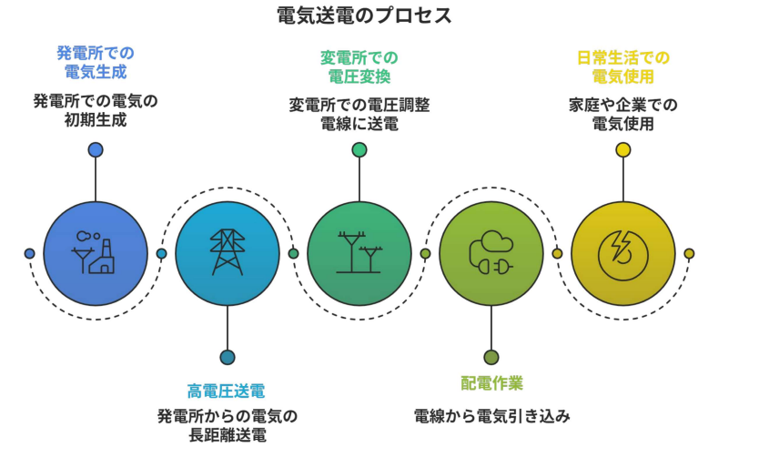

### 幹線工事

  
  {/* 左側：テキストエリア */}
  

    
【概要】

    

      幹線工事とは、受変電設備（キュービクル）から各階の分電盤、動力制御盤、大型機器へと電気のメインルートを構築する作業です。建物全体に張り巡らされる回路の中で、最も太く大きな電力を運ぶ「大動脈」を形作る工程と言えます。
    

    
【目的】

    

      外部から供給された膨大なエネルギーを、建物内の隅々まで安全かつ効率的に送り届けるインフラを確立することにあります。この幹線が、照明やコンセントへつながる建物の機能と信頼性の土台となります。
    

    
【各種ポイント】

    

      ・施工面：垂直貫通部が火災時の煙突にならないよう「延焼防止処理」を徹底する。 
      ・品質面：通電前に「メガー（絶縁抵抗測定器）」で漏電リスクがないか厳密に検査する。 
    

  

  {/* 右側：画像エリア（上下中央揃え） */}
  

    
  

- **受変電設備**  

  
  {/* 左側：画像エリア（文章の高さに追従） */}
  

    
  

  {/* 右側：テキストエリア */}
  

    

      受変電設備とは、電力会社から供給される高電圧の電気を受け取り、建物内の照明やコンセントで安全に使用できる電圧まで下げるための装置一式を指し、一般的に「キュービクル」という金属製の箱に収められています。
    

    

      その最大の目的は、電気を使いやすい形に変換するだけでなく、万が一建物内で漏電などのトラブルが発生した際に、その影響が建物の外（電力網）まで広がらないよう電気を遮断し、安全を確保する「防波堤」としての役割を果たすことにあります。
    

    

      施工管理上のポイントとしては、機器が非常に重く大きいため、クレーン等を用いた搬入経路の確保や設置場所の検討が重要となります。また、高電圧を扱うため、感電事故を防ぐための接地（アース）が確実になされているか、また将来の点検・交換がスムーズに行えるだけのメンテナンススペースが確保されているかを厳密に確認する必要があります。
    

  

 

**延焼防止処理**

延焼防止処理とは、火災の際に壁や床を貫通する電線管やケーブルを伝って、火や煙が隣の部屋や上の階へ燃え広がるのを防ぐための処置です。建物には火災を一定範囲に封じ込めるための「防火区画」がありますが、配線のためにどうしても生じてしまう区画の「隙間」を、耐火パテなどの特殊な材料で埋めることで火の通り道を遮断します。  
最大の目的は、火災の拡大を食い止めることで避難時間を確保し、建物全体の被害を最小限に抑えることにあります。特に縦方向に伸びる配線ルートは煙突のように火を吸い上げやすいため、この処理が人命を守るための極めて重要な防波堤となります。  
施工管理上のポイントは、国が認めた「認定工法」通りの材料と手順で隙間なく充填されているかを厳密に確認することです。一度壁や天井に隠れると後から確認できないため、施工状況を工程ごとに写真に収めて確実に記録を残すことが、安全性を証明する上で不可欠な業務となります。

**絶縁抵抗**

絶縁抵抗とは、電気が本来通るべき電線（回路）の外へ漏れ出さないよう、被覆などによってどれだけ遮断（絶縁）されているかを示す抵抗値のことです。電気が漏れる「漏電」を防ぐための性能指標であり、この値が高いほど絶縁状態が良好で安全であることを意味します。

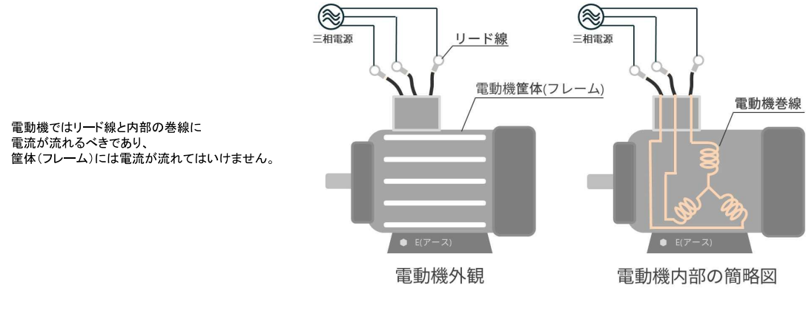

最大の目的は、感電事故や漏電による火災を未然に防ぎ、電気設備の安全性を確保することにあります。特に湿気の多い場所や経年劣化が進んだ配線では絶縁性能が低下しやすいため、定期的な測定が法律で義務付けられています。  
施工管理上のポイントは、「メガー」と呼ばれる専用の絶縁抵抗計を用いて測定を行い、技術基準で定められた基準値（例えば100V回路なら0.1MΩ以上など）をクリアしているか厳格に確認することです。

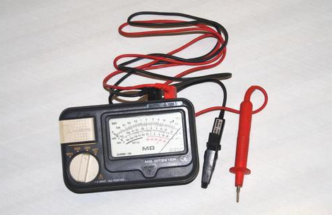

:::note
- **電動機(モーター)**  
電動機（モーター）とは、供給された電気エネルギーを回転などの機械的な動きへと変換する動力装置のことで、ビル内ではエアコンの送風機や給排水ポンプ、エレベーターといった主要設備の駆動源として機能しています。  
施工管理においては、始動時に流れる大きな電流に配線が耐えられるかの確認や、内部の巻線が劣化して漏電していないかをメガーで測定する品質検査が不可欠です。  

- **三相交流電源**  
三相交流電源とは、電圧のタイミング（位相）を少しずつずらした3つの波形（交流）を1セットにして送る電気の供給方式です。家庭用のコンセントに届いている「単相交流」が1本の波で送電するのと異なり、3本の電線（実際には接地線を含め4本などの場合もあります）を使って、より大きなエネルギーを効率よく運ぶことができます。  
最大の目的は、エレベーター、大型エアコンのコンプレッサー、給排水ポンプといった「大きな力を必要とする機器」を安定して動かすことにあります。  
施工管理上のポイントは、3本の配線の接続順序（相順）を厳密に管理することです。接続の順番を一つでも入れ替えると、接続したモーターが設計とは逆の方向に回転してしまいます。ポンプやファンが逆回転すると、水が送れなかったり機器が故障したりするため、通電前には「相回転計（検相器）」を用いて、正しい順序で電気が来ているかを必ず確認します。

- **電動機巻線**  
電動機巻線とは、モーターの内部に緻密に巻き付けられた銅線の束のことで、ここに電気が流れることで磁力が発生し、モーターを回転させる力を生み出します。

- **リード線**  
リード線とは、このモーター内部の巻線と、建物の壁などから来ている外部の電源配線とを接続するために、モーター本体から外に引き出されている短い電線のことです。巻線は非常に細い線が何重にも巻かれているため、そのままでは外部配線とつなぐことができません。そのため、接続しやすい太さと強度を持ったリード線が仲介役としてあらかじめ取り付けられています。
:::

### 配線工事

  
  {/* 左側：テキストエリア */}
  

    
【概要】

    

      配管・配線工事とは、建物の骨組み完成後に、電気が通るための「道（管）」を作り、その中に「電線（ケーブル）」を通す作業です。コンクリート内部や天井裏など、あらゆる場所に電気の網を張り巡らせる基本工程です。
    

    
【目的】

    

      電線を衝撃や湿気、害虫から守り、安全に電気を供給し続けることにあります。また、「管」を通すことで将来的な断線トラブルや容量変更の際、壁を壊さずに電線の引き直しができる「メンテナンス性」も確保します。
    

    
【各種ポイント】

    

      ・管材の使い分け：電線そのものを保護し、安全・効率的に配線するため、天井裏に適した「PF管」、コンクリート埋設専用の「CD管」、衝撃に強い「金属管」を用途に合わせて正しく選定します。 
      ・品質管理：通線時に電線を傷つけないよう「曲げ半径」が急すぎないか確認します。 
      ・施工の堅牢性：コンクリート打設時に接続部が外れないよう、強固な固定を徹底します。
    

  

  {/* 右側：画像エリア（文章の高さに一致） */}
  

    
  

- **PF管**

{/* このままDocusaurusの .mdx ファイルに貼り付けて使用可能です */}

  
  {/* 左側：画像エリア（右側のテキスト量に合わせて画像が自動でリサイズされます） */}
  

    
  

  {/* 右側：テキストエリア（justifyContent: 'flex-start' により上端から綺麗に並びます） */}
  

    

      PF管とは、プラスチック製でジャバラ状の構造を持ち、手で自由に曲げることができる柔軟な電線保護管のことです。自由なルートが必要な場所で便利で、後から電線を引き直しやすいのが最大の利点です。
    

    

      この管の主な目的は、壁内や天井裏を通る電線を衝撃や摩擦から守ることに加え、万が一火がついても自然に消える「自己消火性」によって火災の拡大を防ぐことにあります。
    

    

      施工管理上のポイントは、見た目が似ていても自己消火性のないオレンジ色の「CD管」と混同せず、露出配管や天井裏には必ずPF管を使用するよう徹底することです。また、管を曲げる際には中の電線を傷つけないよう適切な曲げ半径を確保し、ボックスとの接続部からノロ（コンクリートの汁）などが浸入しないよう確実に固定・処理することが、将来の漏電トラブルを防ぐために重要となります。
    

  

**VE管**

  
  {/* 左側：テキストエリア（上端を画像と完全に一致させる設定） */}
  

    

      VE管とは、プラスチック素材で作られたまっすぐで硬い電線保護管のことです。柔軟性のあるPF管とは異なり、形状が固定されているため、見た目が整いやすく、衝撃やサビにも強いという特徴があります。曲げるためにはエルボやユニオン継手が必要です。
    

    

      この管の主な目的は、湿気の多い場所や屋外、工場の壁面といった「露出配管」が必要な場所において、電線を外部環境から守りつつ、建物の美観を維持することにあります。絶縁性に優れているため、管自体が電気を通さないという安全上の利点も持っています。
    

    

      施工管理上のポイントは、温度変化による管の伸縮を考慮し、適切に「伸縮カップリング」を設置して破損を防ぐことです。また、接続部には専用の接着剤を使い、水やゴミが浸入しないよう確実に固定されているかを確認するとともに、現場で熱を加えて曲げ加工を行う際には、管を焦がしたり断面を潰したりしていないかを厳しくチェックすることが重要です。
    

  

  {/* 右側：画像エリア（左側の文章の高さに合わせて自動伸縮） */}
  

    
  

:::tip
**エルボとユニオン継手**  
エルボとユニオン継手は、どちらも電線管や配管を接続するために欠かせない「継手（つぎて）」と呼ばれる部材ですが、その役割は大きく異なります。  
エルボは、配管のルートをL字型に「曲げる」ために使用される部材です。まっすぐな管だけでは対応できない建物の角や壁面に沿って配管を曲げる際に、エルボを仲介させることでスムーズに方向を転換させます。  
対してユニオン継手は、管同士を「切り離し可能につなぐ」ための部材です。中央のナットを回すだけで管を回転させずに接続・分離ができるため、将来のメンテナンスや機器の交換、あるいは配管の最終的な締め込み作業を容易にするために設置されます。

  
  {/* 左側：エルボの画像 */}
  

    
  

  {/* 右側：ユニオンの画像 */}
  

    
  

:::

**CD管**

  
  {/* 左側：テキストエリア（上寄せ・高さ同期） */}
  

    

      CD管（コンバインドダクト管）とは、プラスチック製でジャバラ状の構造を持つ電線保護管で、現場で容易に判別できるよう一般的にオレンジ色に着色されています。打設後は管が固定されるため、再配線はほぼ不可能になります。
    

    

      この管の主な目的は、コンクリート構造物の内部に配線用の通り道を確保することにあります。PF管に比べて安価で耐食性に優れているため、コンクリートの中に完全に埋めてしまう「埋設」専用の材料として、建築現場で広く活用されています。
    

    

      施工管理上の最重要ポイントは、CD管には火が移ると燃え続ける「自己消火性がない」という性質を理解し、露出配管や天井裏での使用を避け、必ずコンクリート埋設部のみに使用されるよう徹底することです。また、コンクリート打設の重圧で管が潰れたり、接続部からセメント液が浸入したりしないよう、鉄筋への強固な固定と確実なジョイント処理を確認することが、将来の通線トラブルを防ぐ鍵となります。
    

  

  {/* 右側：画像エリア（幅を抑えつつ高さを揃える） */}
  

    
  

### 弱電設備工事

  
  {/* 左側：画像エリア（文章の高さに合わせて自動調整） */}
  

    
  

  {/* 右側：テキストエリア（上寄せ・高密度） */}
  

    
【概要】

    

      弱電設備工事とは、電話、LAN、テレビ、インターホン、放送、自動火災報知設備といった「情報の伝達」を目的とした設備の工事を指します。強電（100V〜）とは異なり、低い電圧や微弱な信号を扱うのが特徴です。
    

    
【目的】

    

      建物内の通信環境を整え、安全性と利便性を確保することにあります。火災警報、来客確認、高速ネットワークなど、現代の建物が機能するために不可欠なインフラを提供します。
    

    
【各種ポイント】

    

      ・ノイズ対策：繊細な信号を守るため、強電ケーブルとの離隔距離を厳格に保ちます。 
      ・識別管理：配線の種類が多いため、IDF（中間配線盤）等での色分けやラベル表示を徹底し、結線ミスを防ぎます。
    

  

:::tip
**実際の作業現場**

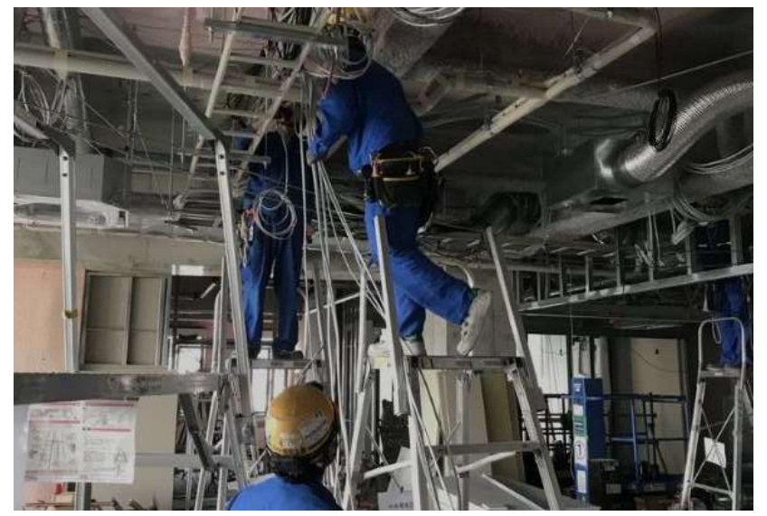
:::

## 空調設備工事

---

空調設備工事とは、建物内で過ごす人々にとって「快適で健康的な環境」を作り出すために、建物内の温度、湿度、空気の清浄度、気流を適切に調整するための機器や配管、ダクトを設置する工事です。

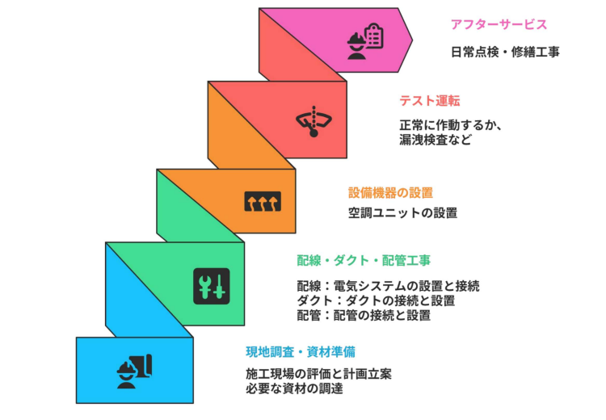

### 冷媒配管工事

  
  {/* 左側：テキストエリア（画像と1:1の比率に調整） */}
  

    
【概要】

    

      冷媒配管工事とは、室外機と室内機の間で「冷媒ガス」を循環させるための銅管を設置する作業です。エアコンは、この配管内を通る冷媒が液体から気体へと変化する際の熱移動を利用して、室内の温度を調節します。
    

    
【目的】

    

      最大の目的は、建物内の「熱を移動させるサイクル」を確立することにあります。冷房時は室内の熱を奪って外へ捨て、暖房時は外の熱を取り込んで室内へ運ぶという、空調の心臓部としての機能を支える極めて重要なインフラです。
    

    
【各種ポイント】

    

      ・気密性の確保：ガス漏れを防ぐため、接続後に窒素ガスで圧力をかけ、数日間保持する「気密試験」が不可欠です。 
      ・保温施工：天井裏での結露発生を防ぐため、配管全体を「保温材」で隙間なく覆い、接続箇所も確実に処理します。 
      ・真空引き：故障の原因となる水分や不純物を除くため、真空ポンプを用いて配管内をクリーンな状態に保ちます。
    

  

  {/* 右側：画像エリア（サイズを大きく設定） */}
  

    
  

**冷媒**

冷媒とは、エアコンや冷蔵庫の内部を循環しながら熱を運ぶ役割を担うガス状の物質のことです。  
この物質の主な目的は、液体から気体へと姿を変える際に周囲の熱を奪ったり、逆に気体から液体に戻る際に熱を放出したりする性質を利用して、室内の温度を自在にコントロールすることにあります。  
施工管理上のポイントは、冷媒ガスがわずかでも漏れ出すと空調が効かなくなるだけでなく、地球温暖化の大きな原因にもなるため、配管接続部の気密性を厳格に管理することです。  
また、冷媒の種類によって必要な圧力や扱い方が異なるため、設計通りのガスが正しく充填されているかを確認するとともに、将来の修理や廃棄に備えて、フロン排出抑制法に基づいた適切な記録と管理を行うことが施工管理者の重要な務めとなります。

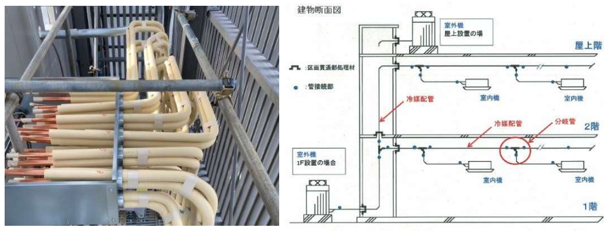

### ドレン配管工事

  
  {/* 左側：テキストエリア（上寄せ・高さ同期） */}
  

    
【概要】

    

      ドレン配管工事とは、エアコンが冷房運転時に発生させる「結露水（ドレン水）」を、建物の外や専用の排水溝まで導くための配管を設置する作業です。
    

    
【目的】

    

      最大の目的は、室内機の中に溜まる水を滞りなく排出し、天井裏や室内への「水漏れ」を未然に防ぐことにあります。排水が滞ると、天井材の汚損やOA機器の故障といった深刻な二次被害を招く原因となります。
    

    
【ポイント】

    

      ・適切な下り勾配：水の自重で流すため、施工する業者の判断で、1/100以上の下り勾配を維持し、逆勾配やたわみを防ぎます。 
      ・結露防止（保温）：排出される冷たい水による配管表面の結露を防ぐため、全体を保温材で隙間なく覆います。 
      ・通水試験の実施：隠蔽（いんぺい）される前に、実際に水を流してスムーズな排水と漏れの有無を確認し、記録を残します。
    

  

  {/* 右側：画像エリア（幅を抑えて高さを揃える） */}
  

    
  

:::tip
**自然勾配(1/100以上)を確保する設計**

1/100以上の下り勾配とは、100進んだら1下がるというもので1%勾配と表現されます。ドレン配管のサイズ換算すると1m(100センチ)進むごとに最低1センチ高さが下がるようにするという意味です。

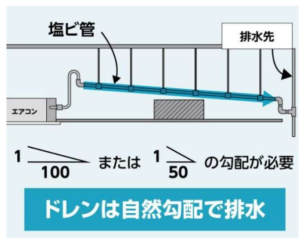
:::

### 機器据付工事

  
  {/* 左側：画像エリア（文章の長さに合わせて高さを100%同期・大きめ設定） */}
  

    
  

  {/* 右側：テキストエリア（上寄せ・高密度） */}
  

    
【概要】

    

      機器据付工事とは、仕上げ段階で照明器具、コンセント、スイッチ、感知器、分電盤、空調機などの「機器本体」を取り付ける作業です。電気を使える状態にする最終的なセッティングに当たります。
    

    
【目的】

    

      建物内の各エリアに「電気の機能」を実際に提供することにあります。配線という「道」に「出口」を設けることで、初めて利便性と安全性が完成します。
    

    
【ポイント】

    

      ・位置と精度の管理：スイッチ等の高さや水平をミリ単位で厳密に管理し、建物の品質を確保します。 
      ・耐震・脱落防止：重量物（照明や分電盤）が地震で落下しないよう、補強材へ確実に固定します。 
      ・最終動作確認：設置後の通電試験や絶縁抵抗測定を行い、設計通りの動作を一つひとつ検査します。
    

  

**施工後の振動・騒音対策**

施工後の対策とは、建物が完成して実際に運用が始まった際、エアコンの室外機や給排水ポンプなどの機器が発する音や振動が、利用者の不快感や近隣トラブルにならないよう施す処置が必要です。  
具体的な対策として、回転体を持つ機器の足元に防振ゴムやスプリングを正しく設置することや、配管との接続部に振動を吸収するフレキシブルジョイント（キャンバス継手）を使用することがあります。  
また、引き渡し前の試運転時に騒音測定を行い、設計通りの静粛性が確保されているかを客観的に確認することが不可欠です。

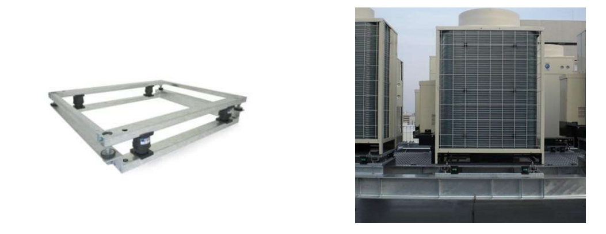

:::tip
**実際の作業現場**

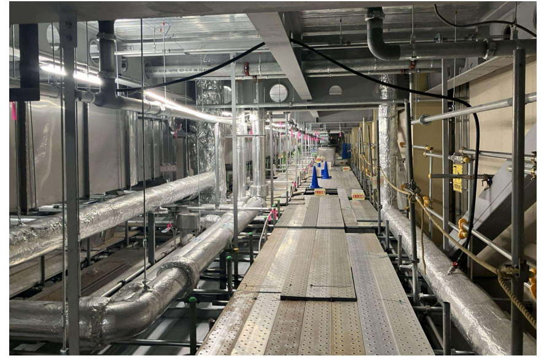
:::

## 衛生設備工事

---

衛生設備工事とは、建物内で安全な水・お湯を使用し、汚れた水を適切に排出するためのインフラを整える工事です。受水槽、ポンプ、各種配管、そしてトイレや洗面器などの衛生器具の設置が含まれます。  
私たちの日常生活の質に直接影響し、適切な衛生設備が整っていないと健康リスクが増大します。

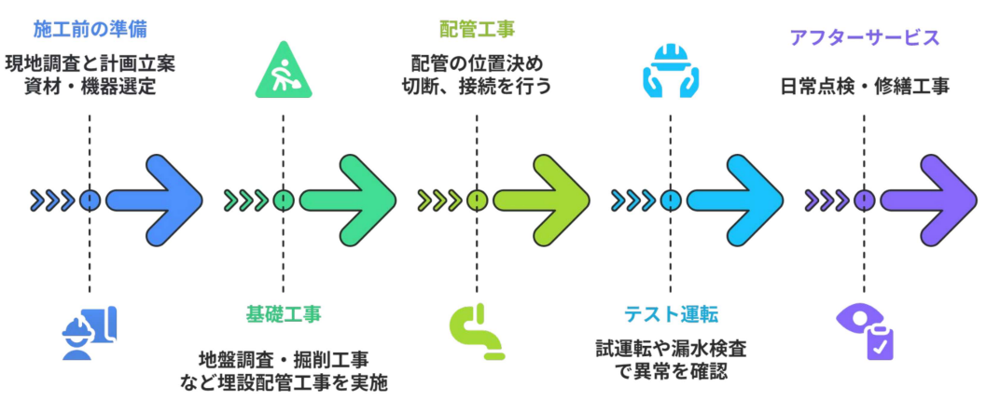

### 給水配管工事(上水)

**【概要】**
給水配管工事とは、水道本管から引き込まれた水を、受水槽やポンプ、配管を経由して、キッチン、浴室、トイレといった建物内の各水まわりまで運ぶための通り道を構築する工事です。

**【目的】**
最大の目的は、建物内のどこでも「必要な時に、安全な水が、適切な勢いで出る」環境を整えることです。単に水を運ぶだけでなく、衛生面を損なわずに安定した水圧を維持し、人々の日常生活や消火活動、産業活動を支えることが役割です。

**【ポイント】**

- 漏水の絶対防止（水圧試験）: 配管の接続部にわずかな隙間があっても、水圧によって漏水が発生します。そのため、仕上げ前に配管内に高い圧力をかけ、一定時間経過しても圧力が下がらないことを確認する「水圧試験」の立会いが必須です。  
- クロスコネクションの禁止: 飲み水の管（上水）と、それ以外の管（中水や井戸水など）を直接つないではいけないという厳格なルールがあります。これらが混ざると汚染の原因になるため、ルートの確実な分離を確認します。  
- ウォーターハンマー対策: 急に蛇口を閉めた際に「ドン」という衝撃音（ウォーターハンマー）が発生し、配管を痛めることがあります。これを防ぐための緩衝装置の設置や、配管が振動しないよう支持金具で強固に固定されているかを確認します。  
- 結露・凍結防止（保温施工）: 冷たい水が通る配管は、夏場に結露して天井を濡らし、冬場は凍結して破裂する恐れがあります。これを防ぐため、配管全体を保温材できれいに覆う施工が品質管理の重要ポイントです。

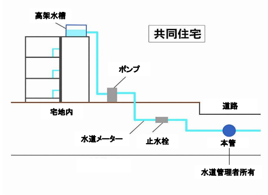

**配管材の選定**

長期にわたって漏水や腐食を防ぎ、安全な給排水環境を確保するために配管材の選定は非常に重要な工程です。

- 架橋ポリエチレン管  
柔軟性があり施工性に優れた樹脂製の管です 。現場での誤接続を防ぐため、「水は青色」「湯は赤色」と色分けして使い分けられます 。
- ステンレス鋼管  
非常に錆びにくく、耐久性と耐圧性の両面に優れているのが特徴です 。高い品質が求められる箇所や、高圧がかかる部位などで重宝されます。

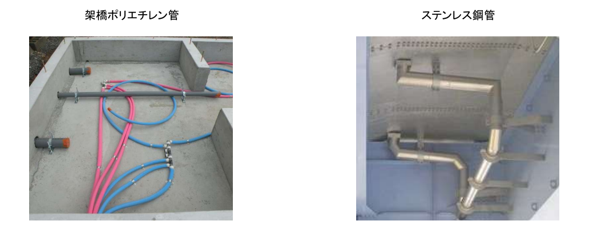

### 排水配管工事(下水)

**【概要】**  
排水配管工事とは、トイレ、洗面所、キッチンなどから出る汚れた水を、公共下水道や浄化槽まで導くための配管を設置する作業です。給水管とは異なり、基本的にはポンプなどの動力を使わず、重力を利用して水を流す仕組みが一般的です。

**【目的】**  
最大の目的は、建物内の衛生環境を維持し、不快な「悪臭」や「衛生害虫」の侵入を防ぎながら、汚水を滞りなく屋外へ排出することにあります。排水がスムーズに行われないと、溢水（あふれ）による浸水被害や、建物の腐食、健康被害を招く原因となります。

**【ポイント】**  

- 統の完全分離: 衛生面やメンテナンス性の観点から、汚水と雑排水などの各系統が途中で混ざり合わないよう、確実に分離して配管されているかを確認します 。
- 適切な下り勾配の確保: 排水は重力を利用して流すため、管のサイズに応じた正確な傾斜が必要です 。勾配が不十分だと水が停滞し、詰まりや悪臭の原因となるため、水平器などを用いた厳格な管理が求められます 。  
騒音・振動対策: 排水時に発生する流水音が階下や隣室の騒音トラブルにならないよう、必要に応じて遮音材の巻き付けや、建物への振動を抑える防振支持が適切になされているかを管理します 。  
- 気密性と接合の確認: 排水や通気の漏れは建物へのダメージや不快な臭気の原因となります。接続部が確実な方法で接合されているか、竣工前の試験で漏れがないことを証明することが品質管理の要となります

**排水管の分離と経路**

  
  {/* 左側：テキストエリア（画像と高さを同期し、上寄せ） */}
  

    

      排水配管工事では、建物内の衛生環境を維持するために、汚水（トイレなど）と雑排水（キッチン・洗面など）を途中で交差させずに分離して配管することが極めて重要です。
    

    

      それぞれの管に分かれて排出された水は、最終的に敷地内の排水管や公共汚水ますを経由して、道路下の下水道本管へと集約され、処理場へ運ばれます。
    

    

      排水時の流水音が生活の妨げにならないよう遮音材を巻いたり、振動を防ぐための支持金具を適切に設置したりといった配管音対策を施すことも重要になります。
    

  

  {/* 右側：画像エリア（大きめ設定・高さ100%同期） */}
  

    
  

**給排水ラインの全体図**

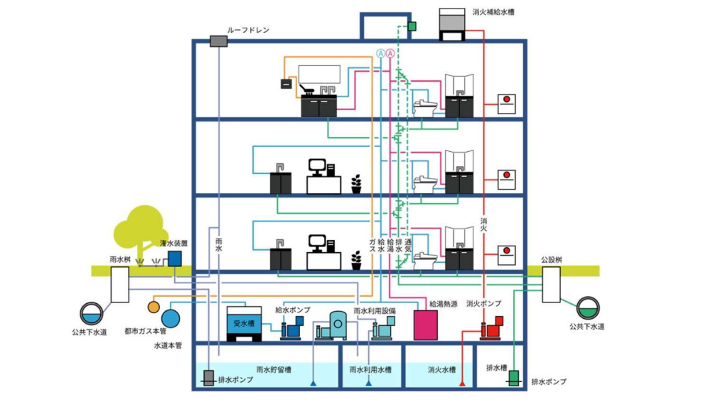

## その他設備

---

電気・空調・衛生設備以外にも設備工事は発生します。  
上記以外の設備も人々が生活をする上で欠かせない設備であり、使用者の命を守るためにも必要なものといえます。

### 消防設備工事

  
  {/* 左側：画像エリア（文章の長さに合わせて高さを100%同期・大きめ設定） */}
  

    
  

  {/* 右側：テキストエリア（上寄せ・高密度） */}
  

    
【概要】

    

      消防設備工事とは、火災を察知し、消火・避難を支援する設備を設置する工事です。スプリンクラー、消火栓、火災報知機、誘導灯、消火ポンプなどが含まれます。
    

    
【目的】

    

      最大の目的は「人命の保護」と「財産の保全」です。「消火・警報・避難」の3機能を確実に作動させ、建物の安全性を担保することが絶対条件となります。
    

    
【ポイント】

    

      ・法令遵守と検査：消防法に基づき正確に設置し、消防署による「消防検査」の承認を確実に得るための厳格な管理を行います。 
      ・他設備との連動：火災時に空調を停止（防煙連動）させるなど、他業種との複雑な連動制御が正しく動作するかを確認します。 
      ・メンテナンス性：非常時の確実な動作のため、点検のしやすさや十分な保守スペースの確保を考慮して施工します。
    

  

### 昇降設備工事

  
  {/* 左側：テキストエリア（画像と高さを同期し、上寄せ） */}
  

    
【概要】

    

      昇降設備工事は、建物内の垂直移動を円滑にする設備を導入する作業です。乗用・荷物用エレベーター、工事用エレベーター、エスカレーター、機械式駐車場などの設置が含まれます。
    

    
【目的】

    

      移動の利便性向上とバリアフリー環境の実現が主な役割です。人や物の流れを効率化して建物の機能を最大化し、建設中においては資材の垂直運搬により工事の進捗を支えます。
    

    
【ポイント】

    

      ・安全精度と法遵守：建築基準法等の厳しい規制を遵守し、利用者の生命を守るための極めて高い設置精度を確保します。 
      ・工程管理の連携：工事用エレベーターの設置・解体は他業種の搬入計画に直結するため、現場全体との密接な連携が不可欠です。 
      ・静粛性の確保：駆動部の振動や音が居室に響かないよう、設計通りの防振・遮音対策がなされているかを厳密に確認します。
    

  

  {/* 右側：画像エリア（大きめ設定・高さ100%同期） */}
  

    
  

