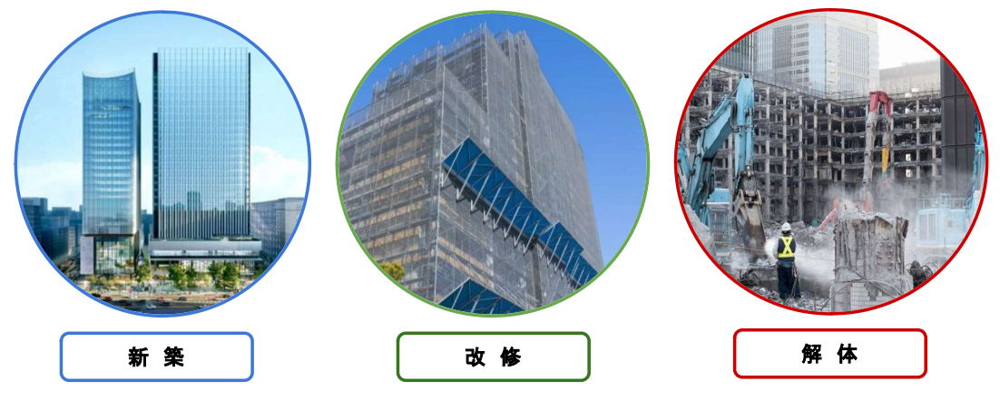
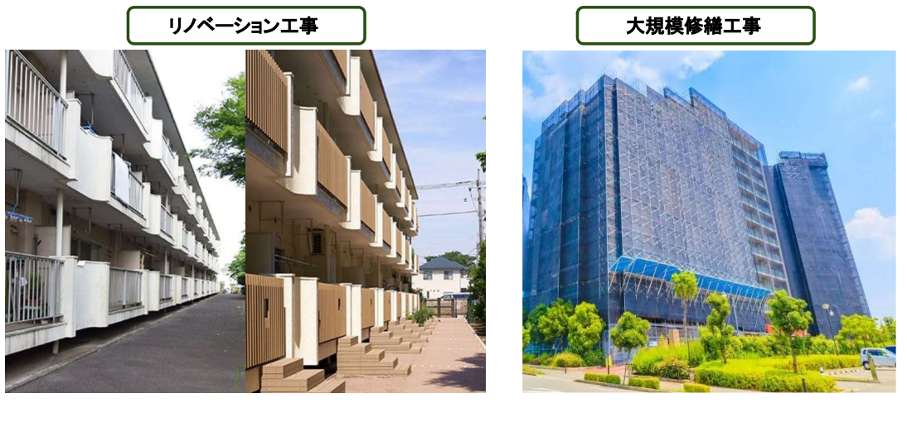
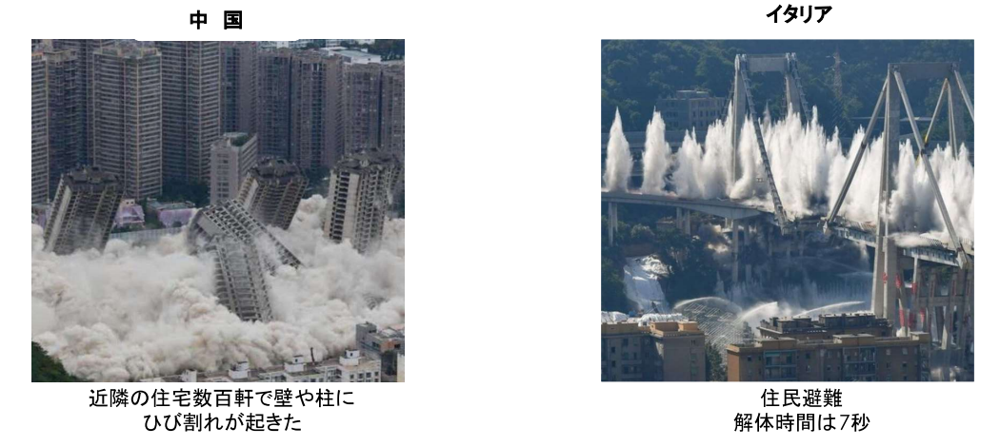

# 工事分類・内容について

<iframe src="https://drive.google.com/file/d/1dptV_5yHnvOAgLzL_6fN4pPR8E_3Dtms/preview" width="640" height="360" allow="fullscreen"></iframe>

---

建設業は単に新しいものを造るだけでなく、古くなったものを壊し、再び新しい価値を創造する**「スクラップ＆ビルド」**のサイクルで成り立っています 。  
工事は大きく分けて、何もない状態から造り上げる「新築」、既存の建物をより良くする「改修」、そして役割を終えた建物を安全に取り除く「解体」の3つに分類されます 。

## 新築工事

---

新築工事は、何もない更地に建物や構造物をゼロから構築する工事です。既存の建物に制約されることがないため、最新の技術や効率的な施工計画を自由に反映させやすいという特徴があります。一方で、土地の境界確認や地盤・土壌の調査、さらには工事の振動が周囲に与える影響を把握するための近隣家屋調査など、着工前の入念な事前準備が不可欠です。

この工事は、人々の生活や経済活動の拠点となる新しい価値を創造するだけでなく、老朽化した建物を壊して新しく作り直す「スクラップ＆ビルド」の「ビルド（再構築）」としての役割も担っています。

施工管理においては、数年にわたる長い工期の中で、膨大な材料費や労務費を適切にコントロールする高度な原価管理が求められます。また、法令に基づいた耐震性や耐火性を確保するために、極めて厳格な品質基準をクリアし続けることが、建物の安全性と信頼性を担保する要となります。

## 改修工事

---

改修工事は、すでに完成している建物の悪い部分を直したり、時代や用途に合わせて機能をアップグレードしたりする工事です。  
老朽化した外壁の塗り替えや防水工事といった「大規模修繕」のほか、間取りの変更や設備を一新する「リノベーション」もこれに含まれます。  
新築工事と大きく異なるのは、居住者や利用者が建物内にいる状態で工事を進める場合があることで、騒音・振動への配慮や安全確保がより一層重要となります。

### 耐震補強工事

改修工事の中でも、地震大国である日本において非常に重要なのが耐震補強です。これには大きく分けて3つの工法があります。

- **耐震**: 壁を増やしたり、柱に鋼板を巻いたりして建物の強度を高める。
- **制震**: 建物の内部に「ダンパー」などの揺れを吸収する装置を組み込む。
- **免震**: 建物と地盤の間にゴムなどの装置を入れ、揺れを直接伝えないようにする。

## 解体工事

---

「スクラップ＆ビルド」の「スクラップ」にあたる工程が解体工事です。単に建物を壊すだけでなく、周囲への騒音や粉塵の影響を最小限に抑え、アスベストなどの有害物質が含まれている場合は適切に処理しながら安全に進める必要があります。  
また、古い建物では当時の設計図や施工図が無いこともあり、躯体(鉄骨や鉄筋)の強度が不明な場合があるため、解体工事を実施する際は、事前の調査と計画が必須となります。

### 階上解体工法

  
  {/* 左側：テキストエリア（画像と高さを同期し、上寄せ） */}
  

    

      階上解体工法は、主に都市部の高層ビルや敷地が狭い現場で採用される、建物の屋上から順に壊していく手法です。大型のクレーンで重機を屋上へ吊り上げ、下の階へと掘り進むように解体します。地上からの重機が届かない40m超の建物や、敷地が狭い現場で非常に有効です。
    

    

      最も注意すべき点は、重機の荷重に対する建物の補強です。重機が乗るフロアの崩落を防ぐため、下の数フロアにわたって「サポート（鋼製支柱）」を立て、重さを分散して支える必要があります。
    

    

      廃材はエレベーターシャフト等を利用して地上へ荷下ろしします。高所作業となるため、防音パネルや養生シートで外周を厳重に覆い、部材の飛散や粉塵、騒音を最小限に抑える安全管理が欠かせません。
    

  

  {/* 右側：画像エリア（大きめ設定・高さ100%同期） */}
  

    
  

### 超高層解体工法

  
  {/* 左側：画像エリア（文章の長さに合わせて高さを100%同期・大きめ設定） */}
  

    
  

  {/* 右側：テキストエリア（上寄せ・高さ同期） */}
  

    

      超高層解体工法は、高さ100mを超えるビルの解体を、周囲への影響を最小限に抑えて進める高度な技術です。最上部に「キャップ」のような移動式屋根を設置し、閉鎖空間の中で作業を進めるのが特徴です。
    

    

      内部で天井クレーンや小型重機を使用してフロアを解体し、終わるとジャッキで屋根全体を一段ずつ下げる「ジャッキダウン方式」などが採用されます。これにより、高所からの部材落下リスクを極限まで低減します。
    

    

      騒音や粉塵が外部に漏れにくく、近隣住民への環境負荷を大幅に抑えられるため、都市部の建て替えにおいて非常に有効です。また、天候に左右されず作業を継続できる利点もあります。
    

  

:::tip
**アスベスト**

アスベストは、耐火性や断熱性に優れた天然の鉱物繊維で、かつては建材に広く使用されていましたが、吸入による深刻な健康被害が判明したため現在は全面的に使用が禁止されています。

アスベストは非常に細い繊維状の鉱物であるため、飛散したものを吸い込むことで肺の奥深くまで到達し、長期間（数十年の潜伏期間）を経て以下のような深刻な疾患を引き起こす原因となります。  
これらの健康被害は、一度吸い込むと体外に排出されにくく、発症まで20年〜50年と非常に長い時間がかかることが特徴です。
- 石綿肺: 肺が線維化して硬くなり、呼吸機能が低下する病気です。
- 肺がん: 肺に吸い込まれた繊維が組織を刺激し続け、がんを発生させます。
- 悪性中皮腫: 肺を包む胸膜などにできる希少ながんで、アスベスト吸入との関連性が非常に高いとされています。

解体や改修工事の際には、事前の含有調査と結果の掲示・報告が法律で義務付けられており、もし含まれている場合は、周囲への飛散を防ぐために作業場所を完全に隔離し、負圧機や防護服を使用した特殊な環境下で除去を行わなければなりません。  
施工管理者は、除去されたアスベストが「特別管理産業廃棄物」として適切に処理されるまでを厳格に管理し、作業員と近隣住民の安全を確保する極めて重い責任を担っています。

  
  {/* 左側：アスベストの画像（原因） */}
  

    
  

  {/* 右側：健康被害を受ける人物の画像（結果） */}
  

    
  

:::