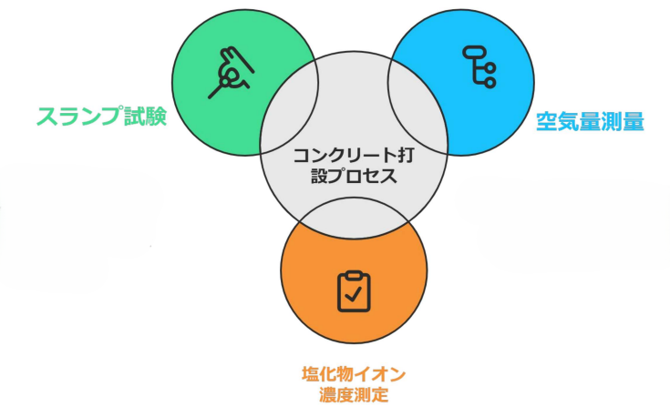
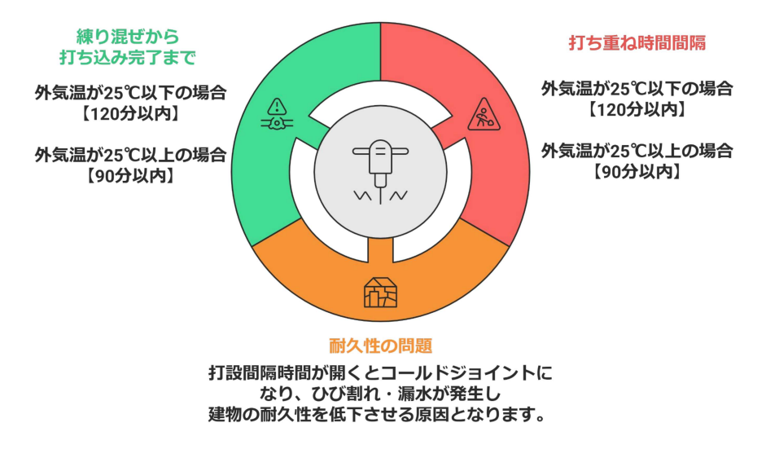
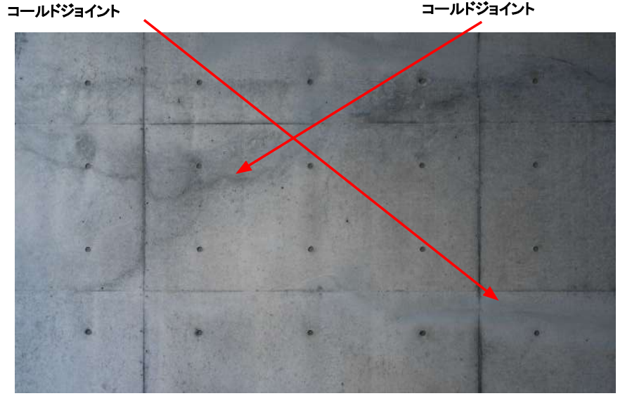
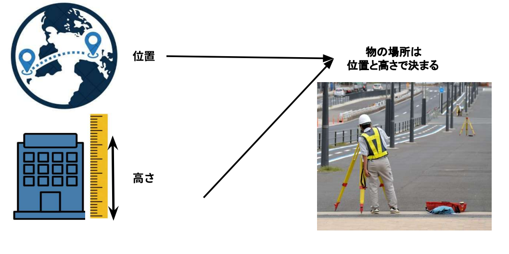
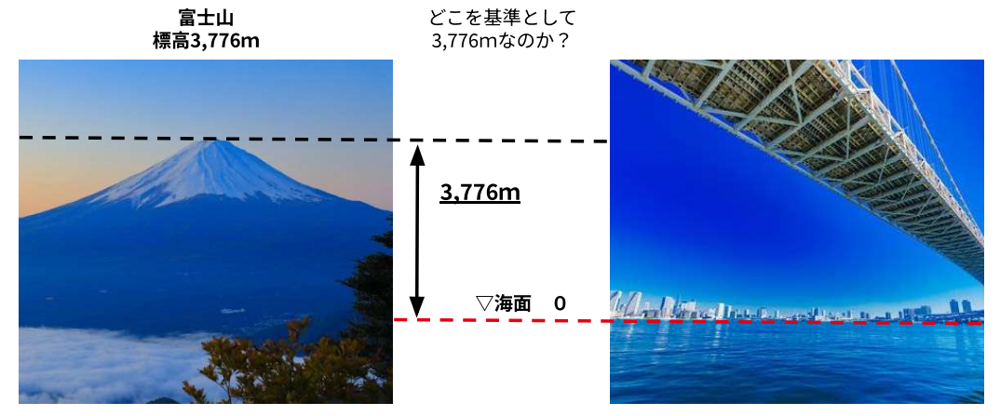
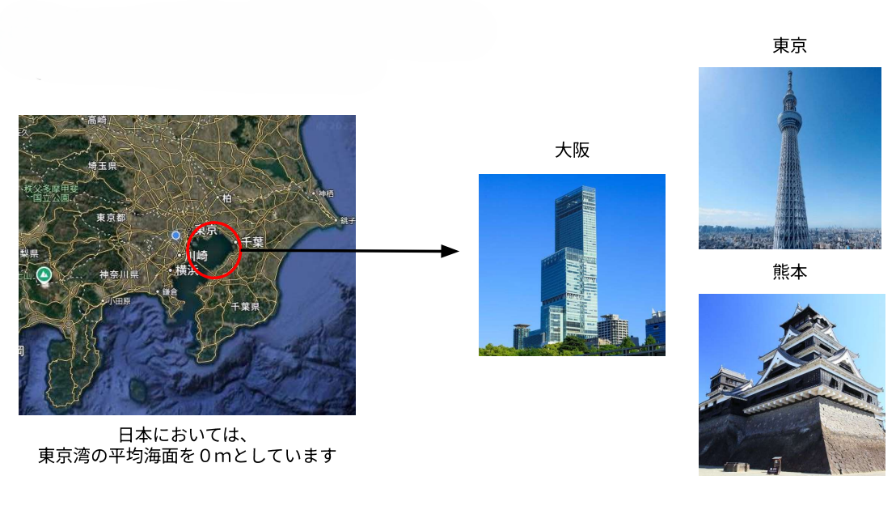
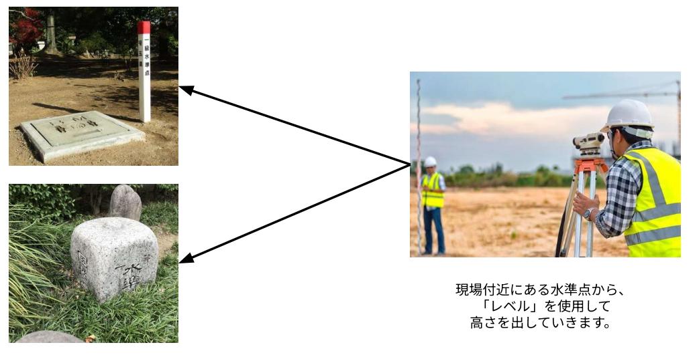
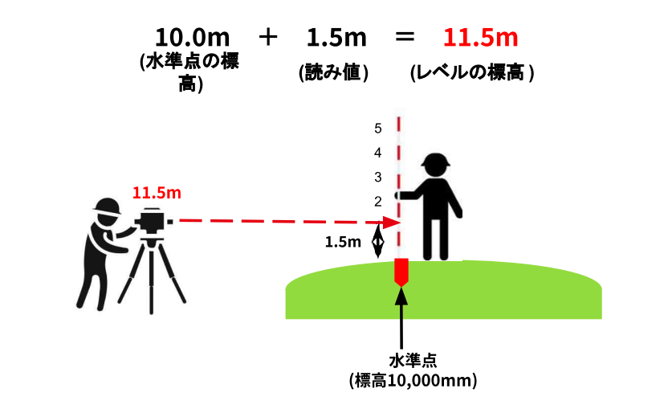
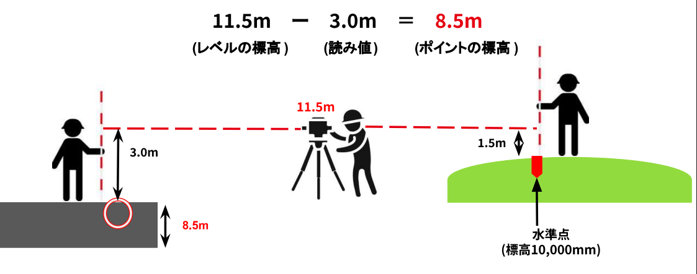

# 工事内容

---

建設工事内容を一部抜粋して、コンクリート打設工事と測量業務について解説します。

## コンクリート打設工事

---

コンクリート打設工事は、建物の骨組みを造る工程です。工場から届いた生コンクリートは、まず現場で「受入検査」を受けます。ここではスランプ試験（柔らかさ）、空気量、塩分濃度を測定し、設計通りの品質であるかを確認します。  
合格した生コンはポンプ車で型枠へ流し込まれますが、これには厳格な「時間制限」があります。外気温25℃以下なら120分、25℃超なら90分以内に打ち終えなければなりません。この時間を過ぎてしまうと、新旧の層が一体化しない「コールドジョイント」という致命的な欠陥（ひび割れや漏水の原因）が生じます。  
作業中は、バイブレーター（振動機）を使用して内部の空気を抜き、型枠の隅々まで密着させる「締め固め」を行います。最後に表面を平らに整え、適切な温度と湿度で保護する「養生」を行うことで、設計通りの強度を持つ構造体が完成します。

### コンクリートの生成と施工の流れ

**コンクリートの生成**

  
  {/* 左側：テキストエリア（画像と高さを同期し、上寄せ） */}
  

    

      コンクリートは、水、骨材（砂・砂利）、セメントの3つを主原料として作られます。これらを練り混ぜた状態のものを「生コンクリート（生コン）」と呼びます。
    

    

      その品質は建物の強度や寿命に直結するため、現場に届いた際には厳格な試験が行われます。特に、セメントと水の化学反応によって強度が決まるため、材料の配合比率（配合報告書）の確認が施工管理上の重要なステップとなります。
    

  

  {/* 右側：画像エリア（図解を見やすく大きく表示） */}
  

    
  

**施工の流れ**

  
  {/* 左側：画像エリア（工程フロー図） */}
  

    
  

  {/* 右側：テキストエリア（上寄せ・高さ同期） */}
  

    

      コンクリート打設工事は以下のステップですすんでいきます。
    

    

      まず、工事は「生コンクリート（生コン）」の発注から始まります。現場に到着した生コンは、そのまま使用するのではなく、「受入検査」によって品質を確認します。この検査をクリアして初めて、実際の打ち込み作業が可能になります。
    

    

      打ち込みの工程では、コンクリートポンプ車などを使って型枠の中に生コンを流し込みます。この際、内部に空洞が残らないよう、バイブレーターで振動を与えて締め固め、最後は表面を平らに整える「均し（ならし）」作業を行います。
    

    

      また、打設後の「養生（ようじょう）」も重要です。コンクリートが所定の強度を発揮するまで、急激な乾燥や温度変化から保護し、適切な湿潤状態を保つことが、ひび割れのない丈夫な構造体を造るための必須条件となります。
    

  

### コンクリート受入検査

工場から現場に届いたばかりの生コンクリート（生コン）は、その品質が建物の強度や寿命に直結するため、型枠に流し込む前に必ず「受入検査」を行います。主な検査項目は以下の通りです。

**スランプ試験**  
生コンの「柔らかさ（流動性）」を測る試験です。スランプコーンという円錐形の筒に生コンを詰め、筒を引き上げた際に生コンの頂部がどれだけ下がったか（スランプ値）を測定します。値が大きすぎると水分が多くて強度が不足し、小さすぎると硬すぎて型枠の隅々まで行き渡らなくなります。

**空気量測定**  
コンクリートの中に含まれる空気の割合を専用の測定器で測ります。空気量が多すぎると強度が低下し、少なすぎると冬場の凍結融解に対する耐久性が弱まってしまいます。

**塩化物イオン濃度測定**  
生コンに含まれる塩分（塩化物）の量を測定します。塩分が多いと、将来的にコンクリート内部の鉄筋を錆びさせてしまい、建物の崩壊を招く恐れがあるため、厳しい制限値が設けられています。

### 打ち込み時間とコールドジョイント

コンクリートは工場で練り混ぜられてから現場で打ち込みを完了させるまでに、品質を保つための厳格な時間制限が設けられています。具体的には、外気温が25℃以下の場合は120分以内、外気温が25℃を超える場合は90分以内に全ての作業を終えなければなりません。

この制限時間を守る必要があるのは、「コールドジョイント」の発生を防ぐためです。打設の間隔が開きすぎてしまうと、先に打ち込んだコンクリートが硬化し始め、後からうち重ねたコンクリートと一体化しなくなります。この時、新旧のコンクリートの間に生じる不連続な継ぎ目がコールドジョイントです。

コールドジョイントが発生すると、そこが弱点となって将来的にひび割れや漏水を引き起こし、最終的に建物の耐久性を著しく低下させる要因となります。そのため、施工管理においては生コン車の到着間隔や打設スピードを正確にコントロールし、この時間制限を厳守することが極めて重要です。

:::tip
**もしコールドジョイントが発生してしまったら**  
コールドジョイントは、新旧のコンクリートが完全に一体化せず、内部に「層」ができてしまった状態です。そのまま放置すると水の通り道になり、中の鉄筋を錆びさせてしまうため、以下のような処置が検討されます。

**軽微な場合（表面的な継ぎ目）**  
表面にうっすらと筋が見える程度の軽微なものであれば、表面を清掃した後にエポキシ樹脂などを注入・塗布して、外部からの水や空気の侵入を遮断します。

**漏水の恐れがある場合**  
継ぎ目から水が漏れるリスクがある場合は、V字型に溝を掘る「Vカット」を行い、そこに止水材や補修用のモルタルを充填します。これにより、物理的に水の経路を塞ぎます。

**構造的な欠陥となる場合（深い亀裂）**  
コンクリートの深部まで一体化しておらず、強度が不足すると判断された場合は、より深刻な対策が必要です。

- 樹脂注入工法: 内部までしっかりとエポキシ樹脂を圧入し、新旧のコンクリートを強力に接着させます。
- 部材の打ち直し: 状況があまりにひどい（ジャンカを併発している、強度が明らかに足りない等）場合は、残念ながらその部分を解体して、再度コンクリートを打ち直す判断が下されることもあります。
:::

## 測量

---

測量とは、地表面上の形や高さ、位置関係を正確に測定する業務です 。建物や道路などを建設する際、「どこに」「どのように」作るかを正しく決定するために不可欠な工程であり、物の場所は「位置」と「高さ」の2つの要素によって決まります 。

### 標高

建設工事において、建物や道路を設計通りの高さに造ることは、排水計画やバリアフリー、周辺構造物との整合性を保つために極めて重要です。
測量の世界では、高さのことを一般的に「標高」と呼びます。 

**標高の定義と日本の基準**

標高を決めるための世界共通の「0m（基準面）」は海面に設定されています。  
しかし、場所によって海面の「高さ」は違いますし、満潮や干潮でも海面の位置は変わります。

そこで、日本では、東京湾の平均海面（T.P.：Tokyo Peil）を標高 0mの基準として定めています。波や潮汐によって常に変動する実際の海面ではなく、長期間の観測データに基づいた平均値を基準面としています。

**日本水準原点**

東京湾の海面を直接現場で測ることは現実的ではないため、その基準を地上に固定化したものが、東京都千代田区にある「日本水準原点」です。  
この日本水準原点を起点として、全国の主要な道路沿いなどには**「水準点」**と呼ばれる標識が設置されています。国土地理院によって正確な標高が管理されており、建設現場の近くにある水準点を利用することで、現場独自の「仮ベンチマーク（KBM）」を設置し、工事の基準となる高さを決定します。
- **役割**: 全国のあらゆる高さ測量の「大元」となる点です。
- **標高**: 現在、日本水準原点の標高は 0mと定められています（※震災などの地殻変動により修正されることがあります）。

### 標高出し

現場では、既知の標高を持つ点（水準点やベンチマーク）を基準にして、オートレベル（水平を見る機械）とスタッフ（目盛りが付いた標尺）を使い、新しい地点の標高を計算で求めます。このプロセスは2つのステップに分かれます。  
レベルの高さを固定したまま「足して、引く」というシンプルな計算を繰り返すことで、広い現場内のあらゆる場所に正確な高さを伝えていくことができます。

**機械高（レベル自体の標高）を求める**

まず、レベルを三脚に据え付け、標高が分かっている「水準点」にスタッフを立てて数値を読み取ります。この読み取った値を、水準点の標高に足すことで、レベルの視準線の高さ（機械高）を算出します。

- 計算式：水準点の標高 ＋ スタッフの読み値（後視） ＝ 機械高
- 例： 水準点の標高が10.0mで、スタッフの目盛りが1.5mだった場合、機械高は11.5mとなります。

**目的のポイントの標高を求める**

次に、機械（レベル）を動かさずに、高さを知りたい新しい地点（目的のポイント）にスタッフを移動させ、その目盛りを読み取ります。先ほど求めた「機械高」から、この新しい読み値を引くことで、その地点の標高が判明します。

- 計算式：機械高 － スタッフの読み値（前視） ＝ ポイントの標高
- 例：機械高11.5mの状態で、新しい地点のスタッフの目盛りが3.0mだった場合、その地点の標高は8.5mとなります。

