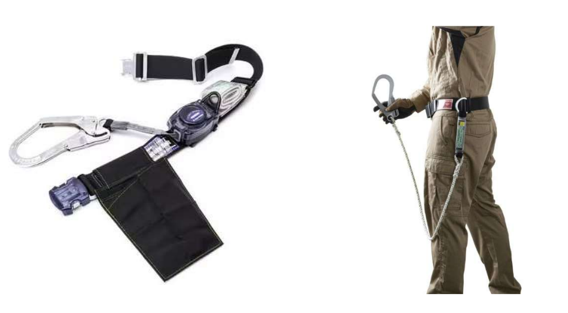
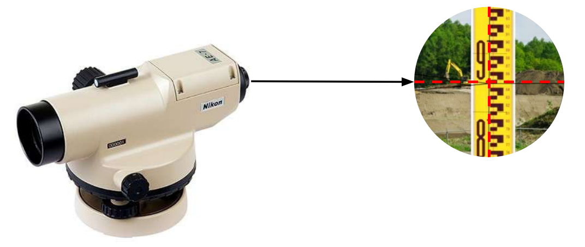
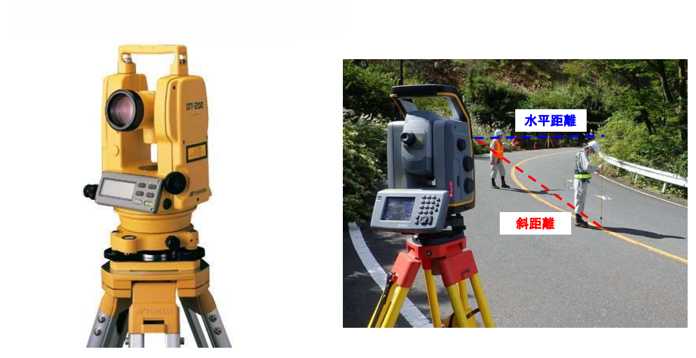
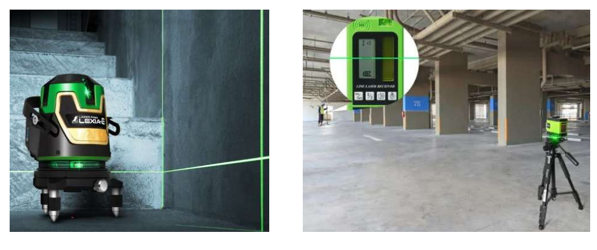

# 現場工具・機材

---

工事現場でよく使用されている工具や機材について説明します。  
建設現場では、作業効率の向上だけでなく、作業員の安全を確保するために多種多様な機材が使用されています。

## 落下制止用器具

---

高所作業における墜落事故を防ぐため、墜落制止用器具の着用が厳格に定められています。

### 胴ベルト

胴ベルト型は、腰に巻くベルト一本で体を支えるタイプの墜落制止用器具です。  
以前は主流でしたが、現在は安全性の観点から「フルハーネス型」の使用が原則となっており、胴ベルト型が使用できる範囲は限定されています。

**使用が認められる条件**  
胴ベルト型を使用できるのは、以下の条件をすべて満たす場合に限られます。

- 作業床の高さ: 6.75m以下（建設業では5m以下を推奨）であること。
- 落下時のリスク: 万が一落下した際、地面に激突するおそれがある（フルハーネスだと紐が長すぎて地面に届いてしまう）場合。
- U字吊りの禁止: 柱に回し掛けして体重を預ける「U字吊り」の状態での使用は、墜落制止用器具としては認められていません

**注意点とリスク**  
胴ベルト型は、墜落時に衝撃が腰一本に集中するため、内臓損傷や脊椎損傷のリスクが高いことが指摘されています。また、宙吊り状態になった際に体が「くの字」になり、救助を待つ間に呼吸が困難になる危険性もあります。  
施工管理者は、現場の作業高さや状況を確認し、適切な器具が選択されているか、また器具の耐用年数が過ぎていないか（一般的にベルトやランヤードは3年程度）を厳格に管理する必要があります。

### フルハーネス

  
  {/* 左側：テキストエリア（画像と高さを同期し、上寄せ） */}
  

    

      フルハーネス型は、肩・腿・胸など、全身を複数のベルトで保持するタイプの安全帯です。 
      従来の「胴ベルト型」に比べ、万が一の落下の際にも全身で衝撃を受け止めることができるため、人体へのダメー　ジを大幅に軽減できるのが最大の特徴です。 
      労働安全衛生法の改正により、高所作業においてはこのフルハーネス型の着用が原則義務付けられています。
    

  

  {/* 右側：画像エリア（詳細が見えるよう大きく表示） */}
  

    
  

**着用の義務化ルール**  
法令により、高所作業において墜落制止用器具を用いる場合は**「フルハーネス型」を使用することが原則**となっています。

- 建設業での基準: 地面までの高さが 5mを超える箇所 で作業する場合は、必ずフルハーネス型を選定しなければなりません。
- 一般的な基準: 作業床の高さが 6.75mを超える 場合は、全業種共通でフルハーネス型が義務付けられています。

**安全性のメリット**

  
  {/* 左側：画像エリア（衝撃過重の分散図） */}
  

    
  

  {/* 右側：テキストエリア（上寄せ・高さ同期） */}
  

    

      

        <strong>・衝撃の分散：</strong>
        画像にある通り、墜落時の衝撃が腿（1.58kN）や肩（0.52kN〜0.7kN）など、全身の強固な骨格部分に分散されます。これにより、特定の部位への過度な負担を抑え、内臓損傷などの致命的なリスクを劇的に低減します。
      

      
      

        <strong>・救助までの姿勢：</strong>
        万が一宙吊りになった際も、体が垂直に近い姿勢で保持されます。胴ベルト型のように身体が「くの字」に折れ曲がることがないため、圧迫による呼吸困難を防ぎ、救助を待つ間の生存率を高めます。
      

    

  

**主要な構成部品**
- ランヤード: 命綱の部分です。
- ショックアブソーバ: 墜落時の衝撃を吸収する装置で、フルハーネスには必須の部品です。
- フック: 足場などの構造物に引っ掛ける金具です。

### 落下制止用器具の利用高さ

高所作業において墜落事故を防ぐための器具は、作業場所の高さによって使用すべき種類が法律や推奨基準で決まっています 。

  
  {/* 左側：テキストエリア（画像と高さを同期し、上寄せ） */}
  

    

      <strong>原則は「フルハーネス型」(高さ2m以上)</strong> 
      作業床の高さが2m以上となる箇所で作業を行う場合は、フルハーネス型の使用が原則です。 
      万が一の墜落時に衝撃を全身に分散させ、身体へのダメージを最小限に抑えるためです。
    

    

      <strong>「胴ベルト型」が使用可能なケース</strong> 
      作業床の高さが2m～6.75mの範囲内であり、かつ以下の条件に当てはまる場合に限り、胴ベルト型の使用が認められています。
    

    

      ・<strong>地面に衝突するおそれがある場合：</strong>
      フルハーネス型ではランヤード(命綱)が長すぎて、墜落が止まる前に地面に到達してしまうような状況などです。
    

  

  {/* 右側：画像エリア（高さ基準の図解・大きめ設定） */}
  

    
  

**建設業における独自基準**  
建設現場においては、より安全性を高めるため、作業床の高さが5m以上であればフルハーネス型を使用することが強く推奨されています。  
施工管理者は、その日の作業場所の正確な高さを把握し、作業員が適切な器具を選択・装着しているかを常に確認しなければなりません。

## オートレベル

---

オートレベルは、2点間の「高低差」を測ったり、水平な基準線を出すために使用される光学機器です。  
デジタル表示で数値を読み取る「電子レベル」もありますが、電源が不要で扱いやすいオートレベルは、今でも多くの現場で主役として使われています。

### 主な機能と特徴
オートレベルの最大の特徴は、内部に「自動補正機構（コンペンセーター）」が組み込まれている点です。三脚に据え付けた際、円形気泡管を使ってある程度水平に設置すれば、内部の振り子機構によって視準線が自動的に完全な水平に保たれます。これにより、精度の高い測量を迅速に行うことができます。

### 使い方と仕組み
基本的には、2人1組で作業を行います。  
望遠鏡を覗くと十字の線が見え、その水平線がスタッフのどの目盛りを指しているかを読み取ります。「標高出し」の計算は、この読み取った数値をもとに行われます。

- 観測者：望遠鏡（オートレベル）を覗き、目盛りを読み取ります。
- 補助者：測定したい地点に「スタッフ（アルミ製の大きな定規）」を垂直に立てます。

### 現場での用途
- 基礎の高さ確認：コンクリートを流し込む高さが正しいか確認します。
- 床の水平確認：建物内部の床が平らになっているかをチェックします。
- 排水勾配の確認：雨水が流れるように、道路や管に適切な傾斜がついているかを測ります。

## トランシット(トータルステーション)

---

トランシットは、角度や距離を精密に測定するための測量機器です。現在では、距離測定機能が一体化した「トータルステーション（TS）」と呼ばれるタイプが主流となっています。  
オートレベルと同様に非常に精密な機械であるため、強い衝撃を与えないように扱うことや、定期的な校正（ズレの調整）が欠かせません。

### 主な機能  
オートレベルが「高さ」を測るためのものだったのに対し、トランシットは主に「水平角」と「鉛直角（上下の角度）」を測るために使用されます。

- 水平角の測定: 建物の壁面が隣の境界線に対して何度傾いているか、正確な直角（90度）はどこか、などを割り出します。
- 鉛直角の測定: 構造物の垂直度を確認したり、勾配（傾き）を測定したりします。

### トータルステーション（TS）への進化  
「トランシット」の機能をさらに進化させたのがトータルステーションです。これ一台で以下の3つを同時に測定できます。

- 角度（水平・垂直）
- 距離（レーザーや光を使ってミリ単位で測定）
- 座標（あらかじめ登録した座標データに基づき、特定の地点を指し示す）

### 現場での主な用途

- 墨出し（すみだし）: 設計図通りの位置を現場の床や地面に書き写します。
- 位置の確認: 柱や杭が設計通りの座標に配置されているかチェックします。
- 建ち（たち）直し: 鉄骨の柱などが地面に対して垂直に立っているかを確認します。

## レーザーレベル(レーザー墨出し器)

---

レーザーレベルは、水平や垂直の基準となる赤い（または緑色の）レーザー光を壁や床、天井に照射する精密機器です。

### 主な機能と役割  
この機器の最大の役割は、現場に「基準線」を引くこと（墨出し）です。

- 水平ライン: 壁にぐるりと水平な光を出すことで、棚の高さやコンセントの位置を揃える基準になります。
- 垂直ライン: 柱がまっすぐ立っているか、壁のボードが垂直かを確認できます。
- 地墨（ちずみ）: 天井の特定の点から真下の床へ、垂直なポイントを下ろす際にも使われます。

### オートレベルとの違い  
オートレベルが望遠鏡を覗いて「点」で高さを測るのに対し、レーザーレベルは空間に「線」として基準を映し出します。  
これにより、一人でも広範囲の基準を同時に確認しながら作業を進めることができ、非常に効率的です。

### 使用時の注意点

- 設置の安定性: わずかな振動でもレーザーが揺れてしまうため、安定した場所に三脚を立てて設置します。
- 受光器の使用: 太陽光が差し込む明るい場所や、レーザーが届きにくい遠距離では、光を目視するのが難しいため、音で高さを知らせる「受光器」を併用します。

### 現場での活用例

- 内装工事: 壁紙を貼る前のボード設置、システムキッチンの取り付け。
- 電気・設備工事: 照明器具の配置、配管の高さ設定。
- タイル工事: タイルが真っ直ぐきれいに並ぶようにガイドとして使用。

## メジャー・コンベックス

---

コンベックス（巻尺）は、薄い鋼製のテープをケースに収納した道具で、建設現場のあらゆる場面で「長さ」を測るために使用されます。

### 現場での呼び名  
正式名称は「コンベックスルール」と言いますが、現場では単に「コンベックス」「メジャー」「スケール」などと呼ばれます。施工管理者にとって、筆記用具と同様に肌身離さず持ち歩く必須アイテムです。

### 主な特徴と機能
- テープの剛性: 鋼製のテープは湾曲しており、一人で測る際にも途中で折れ曲がらずにピンと伸びるようになっています。
- 爪（つめ）の動き: 先端の爪はわざと数ミリ動くようになっています（移動爪）。これにより、爪を引っ掛けて測る時と、壁に押し当てて測る時の両方で、爪自身の厚みを補正して正確な寸法が測れるよう工夫されています。

### 施工管理における活用例
- 出来形（できがた）管理: 出来上がった構造物の寸法が設計図通りかを確認し、証拠写真（配筋検査や仕上げ検査など）を撮影する際に、コンベックスを当てて数値を記録します。
- 材料の確認: 搬入された鉄筋の太さや、内装ボードの厚みなどが発注通りかを確認します。

### 使用上の注意
- 怪我の防止: テープは薄い鋼製でエッジが鋭いため、勢いよく巻き戻すと手を切る恐れがあります。指でブレーキをかけながらゆっくり戻すのが基本です。
- 精度の維持: テープが折れたりサビたりすると正確な測定ができなくなるため、水に濡れたら拭き取るなどの手入れが欠かせません。