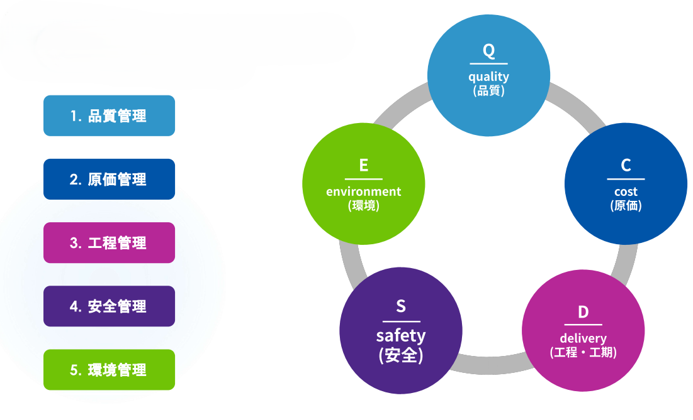

# 5大管理業務

---

施工管理者の仕事は、単に現場を眺めることではなく、以下の5つの要素を高いレベルでバランスよくコントロールすることにあります。  
これら5つはすべて繋がっており、どれか一つが欠けても良い建物は建ちません。例えば、無理に「工程」を早めようとすれば「安全」や「品質」が疎かになるリスクが高まります。

**品質管理（Quality）**  
建物の価値そのものを決定づけるのが品質管理です。コンクリートの打設や測量のように、後からやり直しがきかない作業において、設計図通りの数値が出ているかを厳格に確認します。  
この際、単に「正しく作った」と言うだけでなく、証拠写真や検査データを書類として残すことで、将来にわたって建物の安全性を保証する責任を負います。

**原価管理（Cost）**  
工程管理と表裏一体なのが原価管理です。工事には膨大な予算が動きますが、無駄な残業代や資材のロスが発生すれば、すぐに赤字に転落してしまいます。  
施工管理者は、常に最新の進捗状況をコストに換算し、いかに効率よく、かつ無駄を省いて利益を確保するかという経営者的な視点を持って現場を動かします。

**工程管理（Time）**  
工程管理は、いわば工事の「時間軸」のコントロールです。単に工程表を眺めるだけでなく、天候による作業の中断や、職人不足、資材の納入遅延といった日々発生する予測不能な事態を先読みし、パズルを組み替えるように作業順序を再構築します。  
一箇所の遅れが建物全体の完成を遅らせるため、常に全体を見渡す広い視野が求められます。

**安全管理（Safety）**  
これらすべての土台となるのが安全管理です。どれほど素晴らしい建物が安く早く完成しても、現場で事故が起きてしまえばその価値は失われます。  
フルハーネスの着用徹底といった直接的な指導はもちろん、作業員が無理な姿勢で作業をしていないか、足場にガタつきはないかなど、現場の小さな危険の芽を摘み取っていく粘り強い観察力が必要です。

**環境管理（Environment）**  
近年特に重要視されているのが環境管理です。建設現場は騒音、振動、粉塵など、周辺住民の生活を脅かす要因を多く抱えています。  
また、現場から出る廃材を適切に分別し、再資源化することも施工管理者の義務です。地域社会からの信頼を勝ち取ることが、スムーズな工事進行には欠かせません。