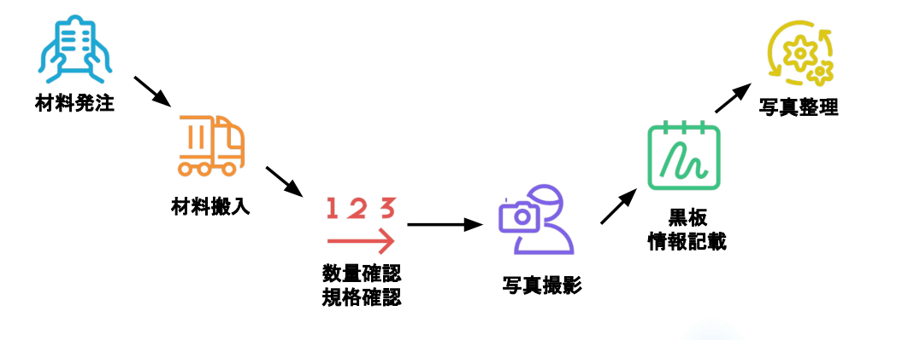
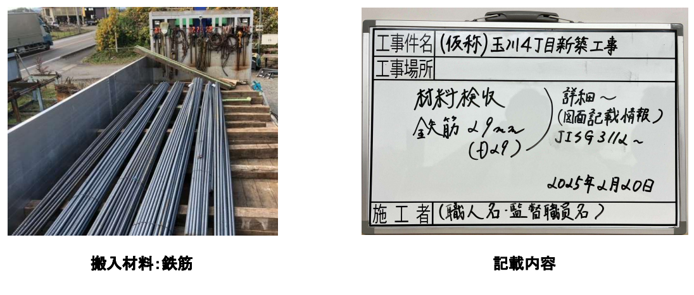
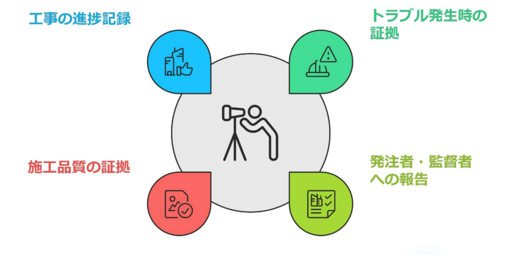
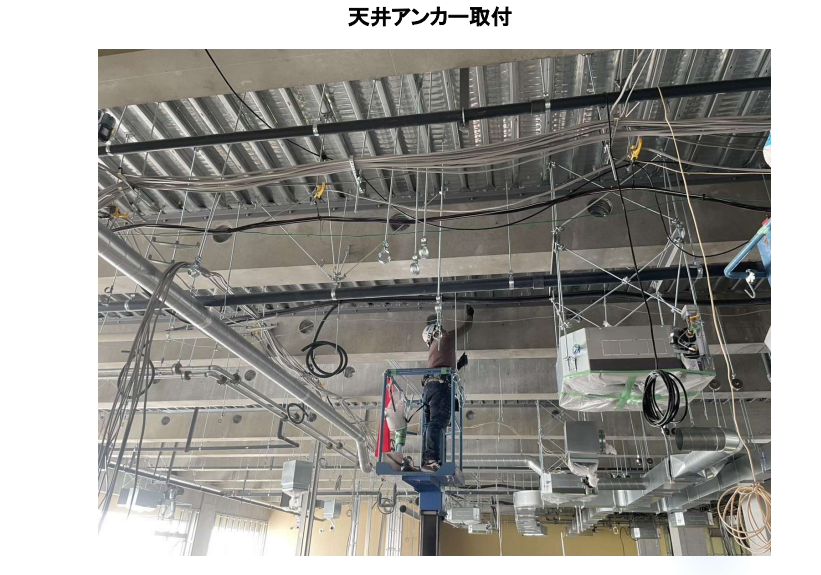
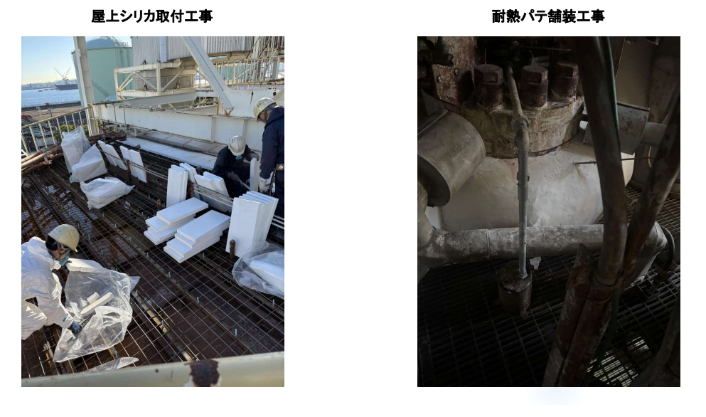
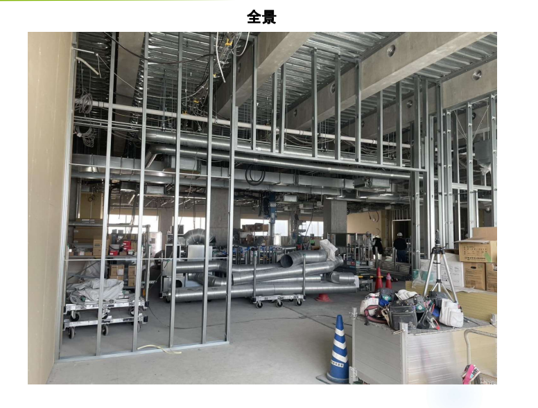

# 品質管理

---

品質管理とは、設計図書に基づいて、耐震性や耐火性などの法令基準を満たした建物を建設するために、その成果物の品質を維持・管理する業務です。  
品質管理に「これくらいで大丈夫だろう」という妥協は一切禁物です。数値で証明できないものは、品質として認められません 。材料の1ミリ、コンクリートの10分の遅れが建物の寿命を左右することを意識することが重要です。

- **目的**:：最終成果物の品質を維持し、安全性を確保すること。
- **役割**： 発注者に対して、図面通りに正しく施工されたことを客観的な数値と証拠（写真）で証明する責任があります 。

## 材料検収

---

現場に搬入される材料が、設計仕様と合致しているかを確認する「材料検収」は品質管理の第一歩です。

### 材料検収のフロー

**材料発注・搬入**  
計画に基づき、適切なタイミングで材料を受け入れます。

**数量・規格確認**  
納品書と現物を照らし合わせ、数量と規格（JISマークの有無など）を厳しくチェックします。

**黒板情報の記載**  
工事件名、材料名、規格、日付、施工者名を黒板に明記します。

**写真撮影・整理**  
検収の様子を正確に撮影し、証拠として分類保存します。

### 鉄筋の検収例

**検収の全体像と写真記録**  
材料搬入時には、まず搬入された資材の全体像を撮影し、工事写真としての証拠を残します。

- 搬入状況の確認: トラック等で搬入された鉄筋の全体を撮影し、数量や荷姿に異常がないかを確認します 。
- 工事黒板の併写: 写真には必ず黒板を入れ、以下の情報を明記します 。  
　・工事件名（例：玉川4丁目新築工事）  
　・項目名（材料検収）  
　・材料名・規格（鉄筋 29mm / D29 / SD390 など）  
　・設計根拠（JIS G 3112などの図面記載情報）
　・撮影日（2025年2月20日）

**規格およびJISマークの確認**  
搬入された鉄筋が信頼できる規格品であることを証明するため、製品タグを詳細に確認し、アップで撮影します。

  
  {/* 左側：テキストエリア（画像と高さを同期し、上寄せ） */}
  

    

      <ul style={{ listStyleType: 'disc', paddingLeft: '20px' }}>
        <li style={{ marginBottom: '12px' }}>
          <strong>JIS規格の確認：</strong> 
          鉄筋の結束ごとに付いているタグで「JISマーク」の有無を確認し、JIS G 3112などの規格に適合していることを記録します [cite: 15]。
        </li>
        <li style={{ marginBottom: '0' }}>
          <strong>ラベル情報の照合：</strong> 
          タグに記載された「強度区分（SD390など）」「寸法（D29）」「長さ」「本数」「製造メーカー名」が注文内容および設計図書と一致するかを厳しくチェックします [cite: 14, 15]。
        </li>
      </ul>
    

  

  {/* 右側：画像エリア（JISラベルのアップ・大きめ設定） */}
  

    
  

:::tip
**JIS**  
一言で言うと、「日本国内で通用する、モノづくりの共通ルール」のことです。 正式名称は「日本産業規格（Japanese Industrial Standards）」といいます。  
例えば、A社のボルトとB社のナットを組み合わせようとしたとき、サイズがバラバラだったら困ると思います。日本中で誰が作っても、同じ品質・同じサイズ・同じ強度になるように決められた「ものさしの基準」がJISです。
:::

**計測器による実測確認**  
目視確認だけでなく、計測器を用いて「実物」の精度を確認します。

  
  {/* 左側：画像エリア（ノギスによる実測風景・大きめ設定） */}
  

    
  

  {/* 右側：テキストエリア（画像と高さを同期し、上寄せ） */}
  

    

      材料の規格確認に加え、実測による精度の検証を行います [cite: 14, 15]。
    

    

      <ul style={{ listStyleType: 'disc', paddingLeft: '20px' }}>
        <li style={{ marginBottom: '12px' }}>
          <strong>寸法の計測：</strong> 
          ノギスを使用して、鉄筋の呼び名（D29）に対する実際の径が許容範囲内にあるかを確認し、その計測状況を撮影します [cite: 15]。
        </li>
        <li style={{ marginBottom: '0' }}>
          <strong>品質の証明：</strong> 
          この実測写真があることで、単に届いたものを並べただけでなく、施工管理者が自ら品質を確認したという強力な証拠になります [cite: 16, 22]。
        </li>
      </ul>
    

  

## 写真管理

---

施工管理の5大管理業務の一つである品質管理において、写真は「設計図通りに施工されたか」を証明する最も重要な不可視部分の証拠となります。 特に完成後に隠れてしまう部分（隠蔽部）は、写真がなければ手抜き工事がないことを証明できません。

### 工事写真の4つの役割

- **進捗記録**: いつ、どのような順序で施工されたかの記録。
- **施工品質の証拠**: 配筋状況や配管の勾配など、完成後に隠れる部分の合格証。
- **トラブル時の証拠**: 不具合が発生した際、当時の施工状況を振り返るための材料。
- **報告用資料**: 発注者や監理者へ適正な施工を報告・納品するため。

### 現場写真から学ぶ管理ポイント

**天井アンカー取付（高所作業・隠蔽部）**
- 管理の視点： 天井が張られると見えなくなるアンカーの打設位置や本数を記録します。
- 撮影のポイント①： 施工範囲と作業状況がわかるように撮影します。
- 撮影のポイント②： アンカーの打設深さや種類がわかるよう、スケール（メジャー）を当てて撮影します。 
- 注意点： 高所作業車を使用しているため、安全帯（フルハーネス型）の着用状況も記録に残し、安全管理の証拠とします。

**屋上シリカ取付・耐熱パテ舗装（特殊工事・材料証明）**

- 管理の視点： 使用されている材料が仕様書通り（シリカボード、耐熱パテ）であることを証明します。
- 撮影のポイント①：搬入時に材料の製品ラベルや規格がわかるアップの写真を撮影します。 (材料検収)
- 撮影のポイント②： パテの塗布厚や、ボードの貼り合わせ状況など、施工途中の状況を記録します。(工程)

**全景（進捗管理・環境管理）**

- 管理の視点： 現場全体の整理整頓状況（環境管理）と、現在の工程（delivery）の進捗を一度に把握するための写真です。 
- 撮影のポイント①：毎回同じアングル（定点）で撮影することで、日々の進捗が比較しやすくなります。 
- 撮影のポイント②：LGS（軽量鉄骨）の立ち上がり状況や、ダクト・配管の先行配管状況を記録します。

## 正しい工事写真の撮り方(4つのルール)  
品質を証明するための写真には、以下の情報が正確に含まれている必要があります。 

- **黒板の活用**： 「工事件名」「工種」「測点（場所）」「設計値」「実測値」を明記します。 
- **比較対象を入れる**： 大きさや高さを証明するために、スタッフ（定規）やコンベックスを当てて撮影します。 
- **「着工前・施工中・完了」の比較**： 変化がわかるように撮影し、ストーリーを作ります。 
- **整理の即時性**： 撮影した写真は、その日のうちに図面番号や工種ごとにフォルダ分けし、報告書としてまとめられる状態にします。