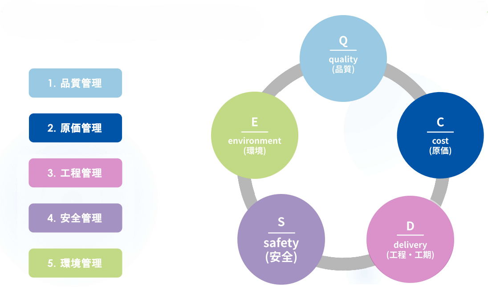
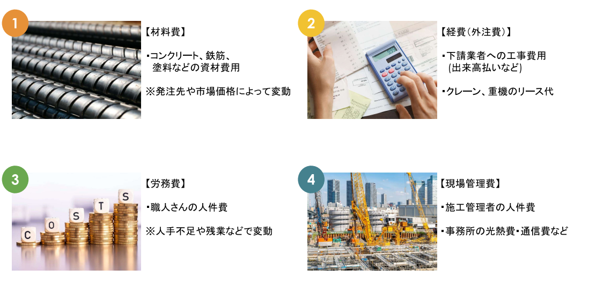

# 原価管理

---

一言で言うと、「決められた予算（実行予算）の中で、工事を完成させるためのコントロール」です。  
建築の仕事は、契約した時点で「もらえるお金（受注金額）」が決まっています。

**利益 ＝ 受注金額 － 実際にかかったコスト（実行原価）**

つまり、工事中にかかるお金（原価）をいかに抑えるか、あるいは無駄を省くかが、会社に残る利益を決めます。

## 原価管理の「4要素」

---

工事現場でお金が出ていく先は、大きく分けて4つあります。これを「4要素」と呼びます。

| 項目 | 要素内容 | 現場監督の工夫ポイント |
| :--- | :--- | :--- |
| **材料費** | コンクリート、鉄筋、木材などの代金 | 材料の無駄な発注を防ぐ。JIS規格品を安く仕入れる工夫。 |
| **外注費** | 職人さんや専門工事業者への支払い | 段取りを良くして、手戻り（やり直し）を防ぐ。 |
| **労務費** | 現場で直接雇用する作業員の給与 | 作業効率を上げ、工期（人工数）を短縮する。 |
| **経費** | 重機のリース料、電気代、仮設トイレなど | レンタル品の早期返却、現場の節電を徹底する。 |

 

## 具体的な「手順」と「管理手法」

---

現場では「実行予算書」と「原価管理表（コストレポート）」という2つの書類を主に使います。

- 予算と実績の比較： 例えば、コンクリート代として100万円予算を組んでいたのに、途中で80万円使ってしまった場合。残りの工事が半分以上あるなら「このままだと赤字になる！」と早期に気づくことが大切です。
- 出来高管理： 「お金をいくら払ったか」だけでなく、「工事が何％終わったか（出来高）」とセットで見ることが重要です。

### 手順の全体像

原価管理の手順は、「目標を決める（予算）→ 使った分を記録する（実績）→ 差額を分析して手を打つ（是正）」という3ステップです。

**実行予算の作成**  
工事が始まる前に、会社が契約した金額（受注額）とは別に、「実際にこの金額で工事を終わらせる」という社内目標金額を決めます。これが「実行予算」です。

**原価の発生と集計**  
工事が始まると、毎日お金が発生します。これらをカテゴリーごとに集計していきます。

- 材料費： 納品書（いつ、何が、どれだけ届いたか）をチェック。
- 外注費： 職人さんの請求書を確認。
- 労務費： 自社の作業員が何日入ったか（人工数）を確認。

**月次原価管理**  
毎月末に、「その月までにいくら使ったか（累計実績）」と「予算」を突き合わせます。

### 具体的な管理手法

現場では主に以下の2つの考え方を使って管理します。

**出来高管理**  
単に「今月100万円払った」という数字だけを見るのではなく、「予定していた作業のうち、何％が終わったか（出来高）」とセットで考えます。

- 例： 半分（50%）終わる予定で、予算の60%のお金を使っていたら「赤字気味だな」と判断します。

**項目別管理**  
お金を「何に使ったか」で細かく分けて管理します。

- 主要材料の管理： 生コンや鉄筋など、金額が大きいものは「歩留まり（ぶどまり：無駄なく使えたか）」を厳しく見ます。
- 人工管理： 「当初100人で終わるはずの作業に、今120人使っていないか？」と、人の動きを数字で見ます。

### 具体的なツール：原価管理表（コストレポート）

多くの現場では、エクセルや専用のシステムを使って「原価管理表」を作成します。

### 実行予算・実績対照表

現場の収支状況を正確に把握するために、予算残高と今後の予測数値を常に突き合わせます。

| 項目 | 実行予算 (A) | 当月実績 (B) | 累計実績 (C) | 予算残高 (A-C) | 予測（着地） |
| :--- | :--- | :--- | :--- | :--- | :--- |
| **鉄筋工事** | 500万円 | 100万円 | 450万円 | 50万円 | 520万円 (赤字予測) |
| **型枠工事** | 800万円 | 200万円 | 400万円 | 400万円 | 780万円 (黒字予測) |

 

:::info 管理のポイント：予測（着地）の重要性
累計実績（C）が予算（A）を上回る前に、早期に**「予測」**を立てることが重要です。
- **鉄筋工事の例**: 残高が50万円しかないのに対し、残りの作業量を計算すると70万円かかる見込みであれば、その時点で「20万円の赤字」と予測できます。
- **対策**: この予測が出た段階で、ロスを減らすための工法変更や、業者との再交渉など、具体的なアクションを起こす必要があります。
:::

:::tip
**PDCAサイクル**  
一言で言うと、「計画を立て、実行し、ズレをチェックして、改善する」という一連のループのことです。 建設現場では、このサイクルを「1日単位」「1週間単位」「1ヶ月単位」で回し続けることで、大きなトラブルを防ぎます。

**Plan（計画）：全ての基本**  
工事が始まる前に、「どう進めるか」を徹底的に練ります。  
**Do（実施）：計画に基づいた作業**  
計画に沿って、実際に職人さんに動いてもらいます。  
**Check（確認）：理想と現実の比較**  
「計画（Plan）」と「実際（Do）」にどれくらいの差があるかを確認します。  
**Action（改善・処置）：軌道修正**  
Checkで見つけた「ズレ」をどう直すか決めます。
:::