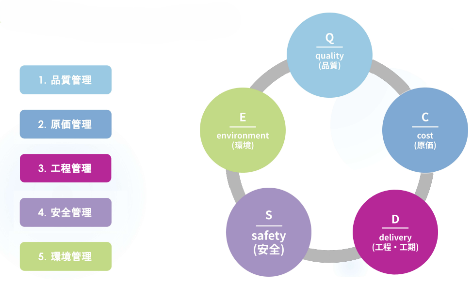
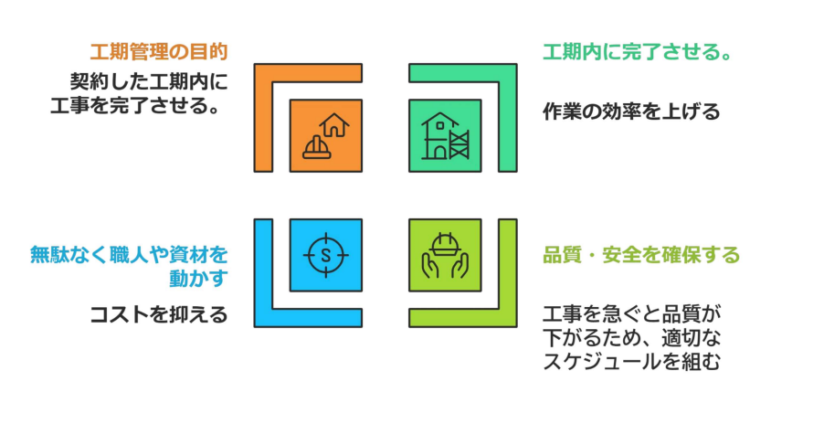
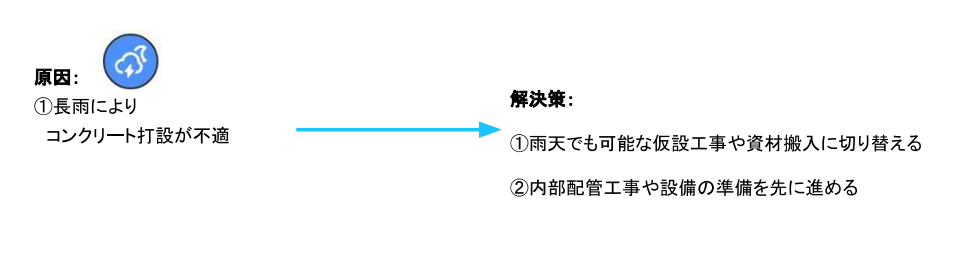
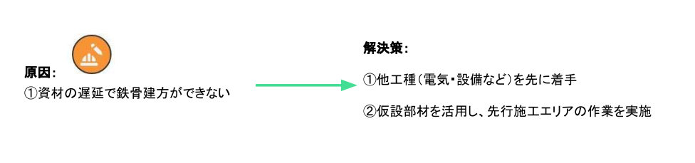

# 工程管理

---

工程管理は、工事を計画通りに進めるためのスケジュール管理の仕事です。  
施工管理の５大管理の中でも特に重要で、工期を守るために計画を立て、進捗をチェックし、調整していく役割を担います。

## 工程管理の目的

---

工程管理の目的を一言でいうと、「限られたリソース（人・モノ・時間）を最大活用して、契約通りに完成させること」です。これをさらに3つに分解して考えてみましょう。

### 社会的信用を守る「工期遵守」

建設工事において、工期（締め切り）を守ることは最大の使命です。すべての建物には、その完成を待っている人がいます。住宅であれば家族の新しい生活が始まる日、商業施設であればオープン日、公共工事であれば供用開始日が厳格に決まっています。もし一日でも完成が遅れれば、お客様の人生設計やビジネスに甚大な被害を与え、会社の信頼は一瞬で崩れてしまいます。工期を守ることは、プロとして「お客様との約束を果たす」という、最も基本的で重要な社会的責任なのです。

### 「安全と品質」を守るための環境づくり
意外に思われるかもしれませんが、工程管理の本当の目的は「現場を急がせないこと」にあります。計画がずさんで工期が押し迫ると、現場には焦りが生まれます。焦りは、安全確認の省略や無理な作業を招き、重大な事故を引き起こす原因となります。また、品質の面でも、コンクリートが固まるのを待つ「養生期間」などの必要な時間を削れば、建物の強度は保てません。ゆとりを持って整えられた工程は、職人さんが落ち着いて、安全に、そして正しい手順で丁寧な仕事を遂行するための「防波堤」となるのです。

### 無駄なコストを抑える「経済性の向上」
現場を効率よく動かすことは、会社の利益に直結します。現場には、職人さん、資材、重機という多くのリソースが集まりますが、これらを遊ばせておく時間はすべて「損失」となります。「前の作業が終わっていないから仕事ができない」という手待ちの時間や、資材が届かずに現場が止まる状況をゼロに近づけることが、無駄な人件費や経費を削ることに繋がります。適切な順序でパズルを組み上げるように工程を管理することで、最小のコストで最大の成果を上げる、効率的な現場運営が可能になります。

### トラブルに備える「リスク管理」
建設現場は「生き物」と言われるほど、天候や予期せぬトラブルに左右されます。あらかじめ緻密な工程を立てておく目的は、変化が起きたときに「どこで調整できるか」を即座に判断するためです。計画があるからこそ、雨で一日遅れたとしても「次の作業を前倒ししよう」「ここで予備日を使おう」といった軌道修正が可能になります。工程管理とは、将来起こりうるリスクを予測し、何が起きても最終的なゴール（竣工）にたどり着くための航海図を作成することなのです。

## 工程管理の具体例と「リカバリー」の技術

---

現場では、当初立てた計画（Plan）通りに進まないことが多々あります。その際、ただ「休み」にするのではなく、「今できることは何か」を見つけてパズルを組み替えることが工程管理の腕の見せ所です。

### 事例1：悪天候（長雨）による工程変更

コンクリート打設は、雨が降ると品質に悪影響を及ぼすため、中止せざるを得ません。しかし、そのまま現場を止めてしまうと工期が遅れてしまいます。

**現場の判断**

屋外での打設をあきらめ、雨の影響を受けない作業に職人さんの配置をスライドさせます。

**具体的な解決策**

- 雨天でも可能な仮設工事（足場の整備など）や、資材搬入に切り替えます。
- 建物の内部が進んでいる場合は、内部の配管工事や設備の準備を前倒しで進めます。

### 事例2：資材の遅延による工程変更

届くはずの鉄骨が来ない」といった資材のトラブルも現場では起こり得ます。メインの作業（鉄骨建方）が止まると大ダメージですが、ここでも柔軟な組み替えが必要です。

**現場の判断**

「鉄骨が立たないと何もできない」と決めつけず、鉄骨がなくても進められるエリアや工種を探します。

**具体的な解決策**

- 鉄骨工事に付随する電気・設備などの他工種を先に着手させます。
- 全てのエリアが止まるのを防ぐため、仮設部材を活用して、先行して施工できるエリアの作業を割り出します。

## 工程表

---

一言で言うと、「いつ、誰が、どこで、何の作業をするかを可視化した計画図」です。工事を計画通りに進め、安全かつ品質の高い建物を期限（工期）内に完成させるために使用します。

### 全体工程表

現場の「最終ゴール」を定める最重要の工程表です。

[工程表（マスタースケジュール）をダウンロードする](./link/master_schedule.csv)

**作成方法**
- 逆算の思考： 竣工（完成）から逆算して、主要な工種（土工、躯体、内装、設備など）の期間を割り振ります 。
- マイルストーンの設置： 「コンクリート打設完了」「足場解体」など、動かせない大きな節目を先に決めます。

**見方のポイント**
- クリティカルパス： その作業が遅れると全体が遅れる「重要ルート」を確認します。
- 工種の連動： 基礎工事→地上躯体工事→外装・内装工事というバトンリレーの流れを読み取ります 。

**使い方**
- 発注者や上司への報告、近隣への説明資料として使用し、プロジェクトが健全なスピードで進んでいるかを確認します。

### 月間工程表

「1ヶ月先の準備」をするための、実務的な工程表です。

[工程表（マンスリースケジュール）をダウンロードする](./link/monthly_schedule.csv)

**作成方法**
- 資材搬入の落とし込み： トラックの進入時間や荷揚げのタイミングを書き込みます。
- 人員配置の予測： どの時期にどの業者が何人必要になるかを想定します。

**見方のポイント**
- 業者の重なり（ラップ）： 狭い現場内で複数の業者がぶつからないか、先行・後続の関係をチェックします。

**使い方**
- 職長会議での共有： 各協力会社のリーダー（職長）に配り、人員確保や資材発注の準備を促します。
- プランBの準備： 雨天時に屋外作業（コンクリート打設など）ができない場合、屋内の配管工事や仮設工事に切り替えられるよう、予備の計画を意識しておきます。

### 週間工程表

「今日と明日の安全と作業」を指示するための、最も生きた工程表です。

[工程表（ウィークリースケジュール）をダウンロードする](./link/weekly_schedule.csv)

**作成方法**
- 日次単位の精緻化： 1日ごとの作業内容を確定させます。
- 具体的な数量： 「生コン何台」「クレーンの使用時間」など、リソースを分刻み・台数単位で管理します。

**見方のポイント**
- 作業エリアの重複： 「同じ部屋で別の業者が作業していないか」を確認し、安全を確保します。

**使い方**
- 朝礼での指示： 職人全員の前で今日のゴールと注意事項を伝えます。
- 即時修正： 資材の遅延などが発生した際、他工種を先に着手させるなど、その場で解決策を打ち出します。