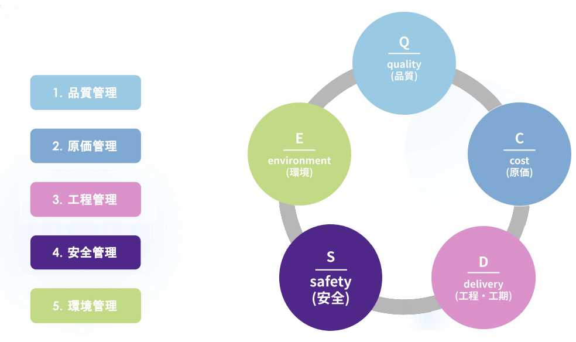
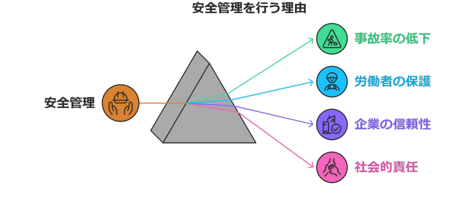
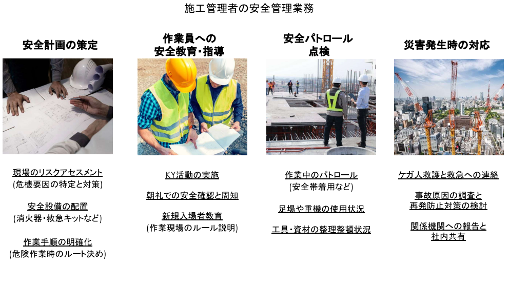
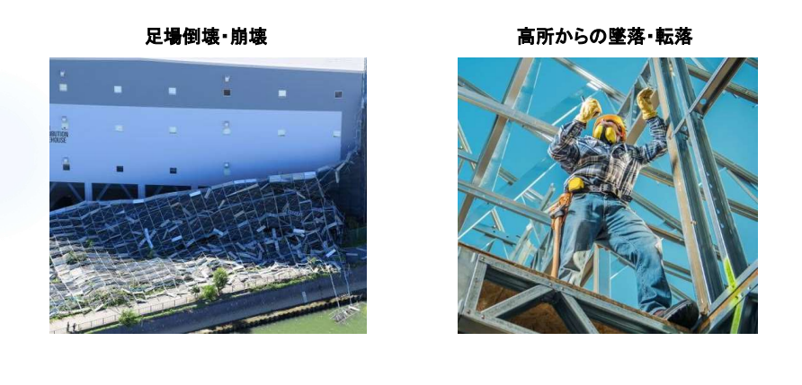
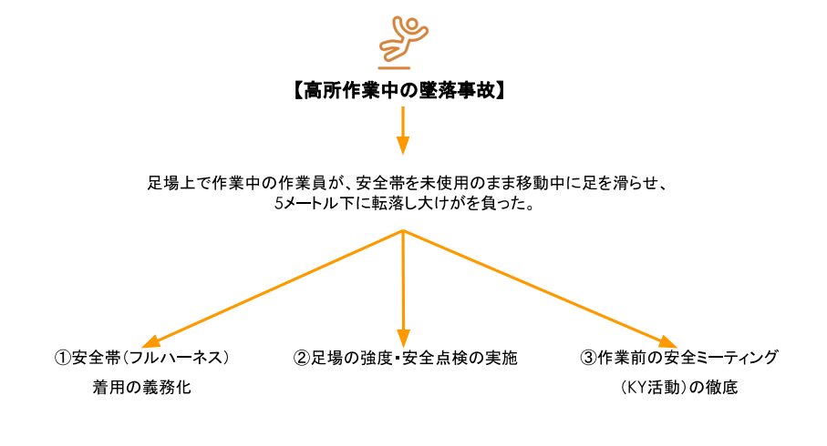
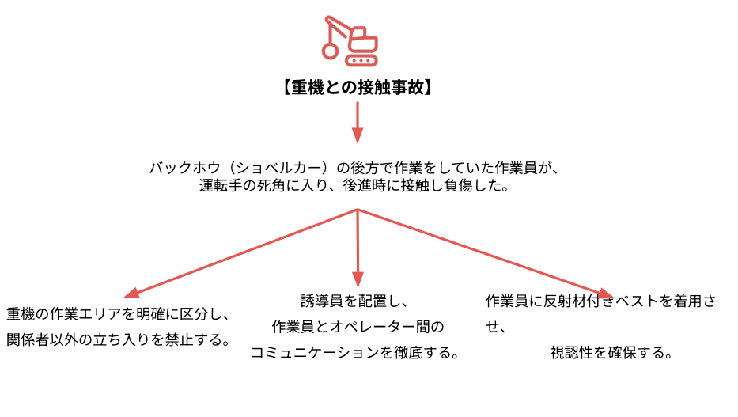
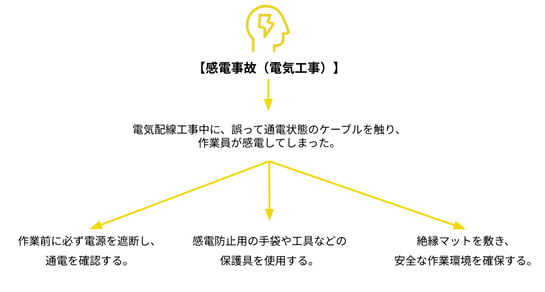

# 安全管理

<iframe src="https://drive.google.com/file/d/11rsarscIAzHzwWc4LvgeVHi55f02wyN3/preview" width="640" height="360" allow="fullscreen"></iframe>

---

安全管理は、建設現場において労働災害を防止し、作業員の命と健康を守るための管理業務です。  
施工管理者は、安全な作業環境を確保し、事故を未然に防ぐために適切な計画と指導を行う責任があります。

## 安全管理の目的

---

「働く人々の命と健康を守り、事故のない職場環境を維持すること」です。建設業は高所作業や重機の操作など、一歩間違えれば重大な事故に繋がる「きけん」と隣り合わせの職場です。そのため、適切な安全対策を講じることで事故や怪我のリスクを最小限に抑えることが、施工管理者の最大の責務となります。

### 働く人々の「命と健康」を絶対的に守る

安全管理の最大の目的は、現場に関わるすべての人が、怪我なく笑顔で家族のもとへ帰れるようにすることです。建設現場は、高所作業や重機の操作など、常に「きけん」と隣り合わせです。

**重大事故の防止**  
高所からの転落や重機との接触は、命に関わる重大な事故に直結します。

**健康管理**  
事故だけでなく、過度な長時間労働や有害物質による健康被害を防ぐことも、広い意味での安全管理に含まれます。

### 工事の円滑な進行（工程管理）を支える

「安全第一」という言葉がありますが、これは「安全を優先すれば工程が遅れてもいい」という意味ではありません。実は、安全こそが予定通りの完成（工期遵守）を実現するための最短ルートなのです。

**事項による停滞の防止**  
万が一現場で事故が発生すれば、工事は即座にストップします。警察や労働基準監督署の調査が入り、数週間から数ヶ月現場が止まることも珍しくありません。

**手戻りの防止**  
焦りによる不安全な作業は、ミスや手直しを誘発します。安全で丁寧な作業こそが、最も効率的であることを理解しましょう 。

### 企業の「社会的信用」を維持する

現代において、事故を起こす企業は社会的な信頼を瞬時に失います。

**受注への影響**  
公共工事などでは、過去の事故歴（安全成績）が厳しくチェックされます。一度の重大事故で、数年間の指名停止になることもあります。

**人材の確保**  
安全対策が疎かな現場には、良い職人さんは集まりません 。誰もが「安心して働ける会社」で仕事をしたいと思うのは当然のことです。

### 経営の「経済的損失」を最小限に抑える

事故が起きると、莫大なコストが発生し、原価管理が破綻します。

**直接的な損失**  
損害賠償金、治療費、壊れた資機材の修理費などがあります。

**間接的な損失**  
工期遅延による違約金や、労災保険料の上昇。 安全管理を徹底することは、結果として会社の利益を守ること（経済性の向上）に繋がります 。

## 施工管理者の安全管理実務

---

施工管理者の安全管理業務は、事故が起きる前の「予防」から、万が一の「対応」まで多岐にわたります。

### 安全計画の策定（事前の準備）

工事が始まる前に、「どうすれば安全に作業できるか」というルールを決める段階です。

**現場のリスクアセスメント**  
現場に潜む危険（高所、重機など）を特定し、あらかじめ対策を練ります。

**安全設備の配置**  
消火器や救急キット、バリケードなどをどこに置くか計画します。

**作業手順の明確化**   
危険な作業をする際のルートや手順を決め、誰がやっても安全な状態を作ります。

### 作業員への安全教育・指導（周知徹底）

決めたルールを職人さん一人ひとりに伝え、守ってもらうための活動です。

**KY（危険予知）活動の実施**  
作業前に「どんな危険があるか」を話し合い、意識を高めます。

**朝礼での安全確認と周知**  
毎朝、その日の危険ポイントを全員に共有します。

**新規入場者教育**  
初めて現場に来た人に、その現場独自のルールを徹底して教えます。

### 安全パトロール・点検（現場での確認）

作業が始まったら、自分の足で現場を歩き、不安全な状態がないか厳しくチェックします。

**作業中のパトロール**  
安全帯（フルハーネス等）を正しく使っているか、不安全な行動をしていないかを見回ります。

**足場や重機の使用状況**  
設備が壊れていないか、重機の周囲に立ち入り禁止措置がされているかを確認します。

**工具・資材の整理整頓**  
現場が散らかっていると転倒事故に繋がるため、「整理・整頓・清掃・片付け」を徹底させます。

### 災害発生時の対応（緊急時の行動）

万が一、事故や災害が起きてしまった時の初動対応です。

**ケガ人救護と救急への連絡**  
何よりも人命救助を最優先し、迅速に通報を行います。

**事故原因の調査と再発防止策**  
なぜ事故が起きたのかを突き止め、二度と起こさないための対策を立てます。

**関係機関への報告と社内共有**  
労働基準監督署などの関係機関へ報告し、情報を共有します。

## 安全管理上のミス

---

台風などの天候によるアクシデントやヒューマンエラーによるアクシデントは全国の現場で起きています。  
現場で事故が起きた際は原因究明が行われ、「労災」などの認定をされることもあります。中には怪我ではなく、死亡事故なども起こるため、施工管理の安全管理は重要事項といえます。

### 計画・判断におけるミス
現場監督が最も陥りやすいのが、「無理な工程」や「誤った状況判断」によるミスです。

**悪天候下での無理な強行**  
長雨などで足元が滑りやすい状況や視界が悪い中で、コンクリート打設などの作業を強行することは重大なミスに繋がります。天候が不順な場合は「雨天でも可能な内部作業や仮設工事」に切り替える柔軟な判断が求められます。

**リスクアセスメントの不足**  
作業着手前に「現場のどこにどのような危険があるか」を特定しきれていないケースです。特に「作業手順の明確化」を怠ると、職人さんが自己流の危険なルートで移動するといったミスを誘発します。

### 高所作業におけるミス

建設現場の事故で最も多いのが「墜落・転落」です 。

**墜落制止用器具（フルハーネス）の選定・使用ミス**  
作業床の高さが2m以上の場合は、原則としてフルハーネス型を使用しなければなりません 。

- ミスの事例： 6.75mを超える高さで、慣れているからと胴ベルト型を使用させてしまうこと 。
- ミスの事例： 建設業の推奨基準である「5m以上でのフルハーネス着用」を徹底できていないこと 。

**足場・手すりの点検漏れ**  
安全パトロールにおいて、手すりの外れや足場板の隙間を見逃すことは、施工管理者の重大な過失となります。

### 重機・環境管理におけるミス

人の動きだけでなく、機械や現場の「状態」を管理しきれないことで起きるミスです。

**作業半径内への立ち入り許容**  
重機や工具の操作中は接触事故のリスクが高いため 、立入禁止措置の徹底が必要です。安全パトロールでの点検不足により、作業員が重機に近づきすぎるのを放置することは厳禁です。

**「きたない」現場の放置**  
建設現場は土や埃、化学物質で汚れやすい環境ですが 、整理整頓（清掃・片付け）を怠ることは、単に見栄えが悪いだけでなく、つまずきや転倒、転落事故の直接的な原因となります。

### 重大事故の２つの典型的な事例

建設現場では、適切な安全対策が講じられていない場合、一瞬にして事故や怪我のリスクが現実のものとなります。

**足場倒壊・崩壊に繋がる管理ミス**

「足場倒壊」は、周辺住民や通行人を巻き込む恐れもある極めて危険な事故です。

- 設計・計画のミス：足場の組み立て前に、壁との固定（壁つなぎ）の間隔や強度が十分か、風圧を考慮した設計になっているかを確認しきれなかったミスです。
- 点検・是正のミス：施工管理者の重要な業務である「安全パトロール・点検」において、足場や重機の使用状況、部材の緩みを見逃してしまったことが原因となります。
- 環境判断のミス：強風や長雨といった自然災害の影響を軽視し、補強や作業中止の判断を誤ることも、こうした崩壊を招く大きなミスです。

**高所からの墜落・転落を招く管理ミス**

「高所作業」は、建設現場の事故の中で最も頻度が高く、命に直結します。

- 保護具の使用指導ミス：作業床の高さが2m以上の場合、原則としてフルハーネス型の墜落制止用器具の使用が義務付けられています 。職人さんが「面倒だから」「慣れているから」と保護具を使わない不安全行動を、管理者がパトロールで是正できなかったことは重大な管理ミスです。
- 作業手順・ルールの周知不足： 朝礼やTBM（ツールボックスミーティング）において、その日の危険箇所や安全な移動ルートを正確に伝えていなかったミスです。
- 「きけん」への感度不足： 「きけん（危険を伴う高い場所での作業）」に対する想像力が欠けており 、手すりの未設置や開口部の養生不足を放置したことが、墜落事故という最悪のミスを招きます。

## 労災事例と安全管理

---

実際に発生した労災事例と安全対策について解説します。

### 高所作業中の墜落事故

建設現場で最も多いのが、足場などからの墜落・転落です。一瞬の油断が取り返しのつかない大怪我に繋がります。

**労災事例**  
足場上で作業中の作業員が、墜落制止用器具（フルハーネス等）を使用しないまま移動。その際に足を滑らせ、約5メートル下に転落して大怪我を負いました。

**徹底対策**

- 器具着用の義務化： 作業床の高さが2メートル以上の場合は、原則としてフルハーネス型の墜落制止用器具を使用させます 。
- 設備の安全点検： 施工管理者の業務として、足場の強度や手すりの設置状況をパトロールで厳しくチェックします。
- KY（危険予知）活動の徹底： 作業前に「ここで足を滑らせるかもしれない」という具体的な危険を全員で話し合い、意識を高めます。

### 重機（バックホウ）との接触事故

ショベルカーなどの大型重機の周囲は、オペレーターの死角が多く、接触すれば命に関わります 。

**労災事例**  
バックホウ（ショベルカー）の後方で作業していた作業員が、運転手の死角に入り込んでしまいました。重機の後退時に接触し、負傷しました。

**徹底対策**

- 立ち入り禁止の徹底： 重機の作業エリアをバリケード等で明確に区分し、関係者以外を絶対に入れないようにします。
- 誘導員の配置： 誘導員を必ず配置し、作業員とオペレーター間のコミュニケーション（合図）を徹底させます。
- 視認性の確保： 作業員に反射材付きベストを着用させ、オペレーターから見えやすくします。

### 感電事故（電気工事）

目に見えない電気の扱いは、手順を一つ飛ばすだけで致命的な事故になります。

**労災事例**  
電気配線工事中に、誤って通電状態（電気が流れている状態）のケーブルに触れてしまい、作業員が感電しました。

**徹底対策**

- 電源の遮断確認： 作業前に必ずブレーカーを落とし、検電器などで「本当に電気が来ていないか」を確認します。
- 絶縁保護具の使用： 感電防止用の絶縁手袋や絶縁工具を使用します。
- 環境整備： 絶縁マットを敷くなど、万が一の際にも電流が体に流れない安全な作業環境を整えます。