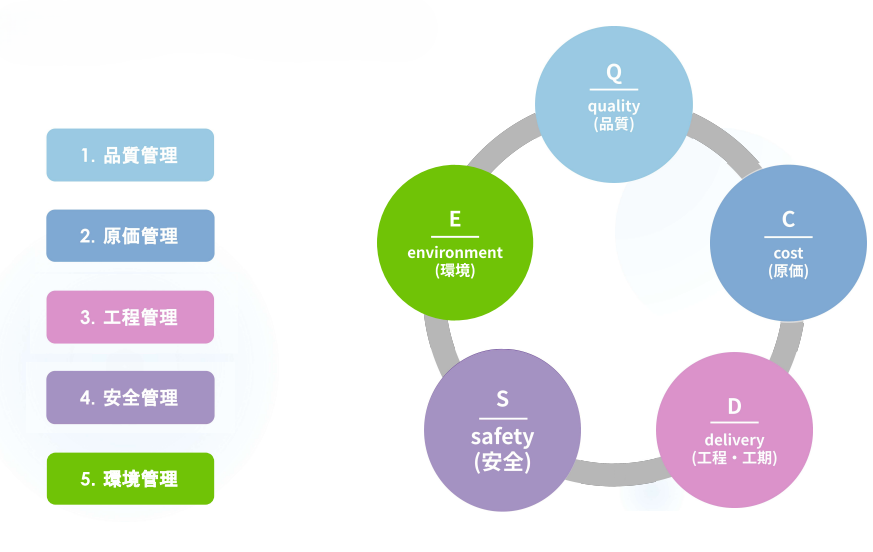
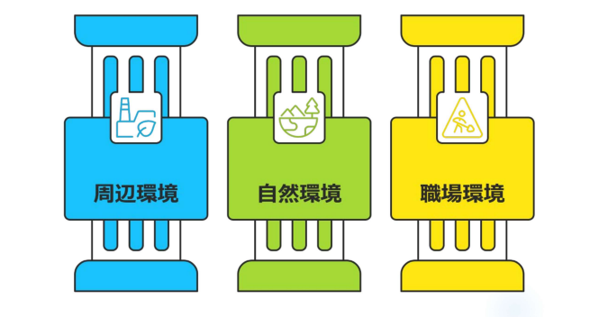
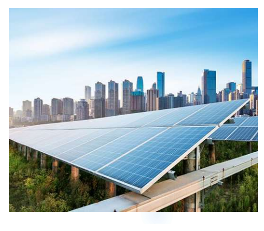
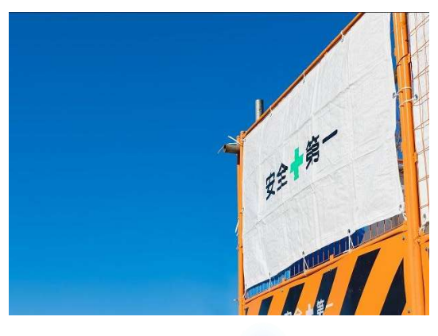

# 環境管理

---

環境管理とは、主に、「周辺環境」「自然環境」「職場環境」への配慮や対策を意味します。  
建設工事によって周囲に騒音や振動の被害を与えないように、また工事によって自然環境を損なうことがないように対策を講じる必要があります。

## 周辺環境管理

---

  
  {/* 左側：テキストエリア（画像と高さを同期し、上寄せ） */}
  

    

      現場では、近隣の方々への配慮が不可欠です。仮囲いアートや周辺の清掃などを通して、視覚的な面からイメージアップや景観の向上に努めます。
    

    

      環境管理とは、<strong>「工事が周辺環境や人々に与えるマイナスの影響（公害・不便）を監視・制御し、良好な関係を保つこと」</strong>を指します。
    

    
    

      現場監督の役割は、設計図通りに建てるだけでなく、現場の外に対しても「安心」を提供することにあります。
    

  

  {/* 右側：画像エリア（仮囲いアートや景観向上の取り組み・大きめ設定） */}
  

    
  

### 管理すべき「4大項目」と対策

**騒音・振動の抑制**  
重機の稼働、解体、杭打ちなどは大きな音と揺れを伴います。

- 低騒音型機器の採用： 可能な限り「低騒音型・低振動型」の建設機械を選定します。
- 防音設備の設置： 現場の周囲を高い防音パネルや防音シートで囲い、音が漏れるのを防ぎます。
- 作業時間の遵守： 早朝や夜間の作業を避け、事前の説明会等で周知した作業時間を厳守します。

**粉塵（ふんじん）・汚れの防止**  
土砂の運搬やコンクリートの切断で発生する「ホコリ」への対策です。

- 散水の徹底： 乾燥した日はこまめに水をまき、砂ぼこりが舞うのを防ぎます。
- 車両のタイヤ洗浄： 現場から出るダンプカーなどのタイヤを泥落としや洗浄機で清掃し、道路を汚さないようにします 。

**廃棄物の適正処理（産廃管理）**  
現場から出るゴミを正しく仕分け、適切に処分することです。

- 分別の徹底： コンクリート殻、木くず、金属くずなどを現場内で厳格に分別します。
- リサイクルの推進： 可能な限り資源として再利用できるルートを確保し、「循環型社会」に貢献します。

**水質・土壌汚染の防止**  
雨水や工事用排水が、油や泥を含んだまま公共の排水路に流れないようにします。

- 沈砂池の設置： 泥水を一旦溜めて砂を沈殿させてから放流します。
- 養生の徹底： 長雨（悪天候）の際は、特に土砂の流出が起きやすいため、ブルーシート等での養生や排水溝の点検が不可欠です。

### きれいな現場」が生む3つのメリット
環境管理（整理・整頓・清掃・片付け）を徹底することは、単なるマナー以上の価値を生みます。

**近隣クレームの抑止**  
現場が整然としているだけで、「しっかり管理されている安心な現場だ」という印象を与え、苦情を未然に防ぎます。

**安全性の向上**  
現場内外が清掃されていると、つまずきや転倒、車両の接触事故のリスクが劇的に下がります。

**業界イメージの刷新（新3K）**  
かつての「きたない」イメージを払拭し、「休日・給与・希望」が持てる清潔な職場環境を実現します

## 自然環境管理

---

  
  {/* 左側：テキストエリア（画像と高さを同期し、上寄せ） */}
  

    

      工事では水質、土壌などの汚染を防ぐための対策を講じることも重要です。施工に関しては、サステナブル建築などの環境に配慮した建造物が注目されています。
    

    

      これにより、自然環境を保護し、持続可能な開発を促進することができます。また、建設工事が周辺の自然環境に与える負荷（汚染や破壊）を最小限に抑え、生態系のバランスを維持することも重要です。
    

    
    

      これは法律を守るだけでなく、企業の社会的責任（CSR）を果たす上でも極めて重要です。
    

  

  {/* 右側：画像エリア（自然保護やサステナブル建築のイメージ・大きめ設定） */}
  

    
  

### 管理すべき主要な3項目と対策

**水質汚染の防止**  
工事現場からの排水が、河川や海、地下水を汚さないように管理します。

- 濁水（だくすい）対策： 掘削作業などで発生した泥水は、そのまま流さず「沈砂池（ちんさち）」や「ろ過装置」を通して、砂や不純物を沈殿させてから放流します。
- 油流出の防止： 重機や発電機の燃料が漏れ出さないよう、防油堤を設置したり、万が一に備えて「オイルフェンス」や「吸着マット」を常備したりします。
- 天候への配慮： 資料110Pにあるような長雨（悪天候）の際は、特に土砂の流出リスクが高まるため、排水溝の詰まりがないか、養生シートがめくれていないかを事前に確認します。

**大気汚染・粉塵（ふんじん）の抑制**  
工事に伴う排気ガスや、乾燥した土が舞い上がるのを防ぎます。

- 粉塵対策： 風が強い日や乾燥した時期は、こまめに「散水」を行い、砂ぼこりが近隣の植物や住民の健康に影響を与えないようにします。
- 排ガス対策： 最新の排出ガス規制に適合した建設機械を選定し、アイドリングストップを徹底させます。

**土壌汚染・生態系の保護**  
現場の土を汚さないこと、そしてその土地に住む生き物への配慮です。

- 廃棄物の適正管理： 産業廃棄物を厳格に分別し、地中に埋めたり、有害物質が漏れ出したりしないよう管理します。
- 希少種への配慮： 工事区域内に希少な植物や生物が生息している場合、移植したり、保護柵を設けたりして、その土地の生態系を壊さないように配慮します。

### 「自然環境管理」を支える現場の習慣

**整理・整頓・清掃・片付け（4S）**  
現場が「きたない」状態は、単に見た目が悪いだけでなく、油漏れなどの異変に気づくのを遅らせます。常に清掃されている現場こそが、自然環境を守る第一歩です。

**異常の早期発見**  
毎日の「安全パトロール」では、作業員の安全だけでなく、排水の濁りや機械からの油漏れといった「環境の異常」にも目を光らせます。

**法規制の遵守**  
廃棄物処理法や水質汚濁防止法など、関わる法律を正しく理解し、適正な手続き（マニフェストの発行など）を行います。

## 職場環境管理

---

  
  {/* 左側：テキストエリア（画像と高さを同期し、上寄せ） */}
  

    

      働きやすい環境を整えることも、施工管理の大切な仕事です。作業員の健康管理や暑さ・寒さ対策、休憩時間や休日の管理にも配慮が必要です。
    

    

      良好な職場環境は、不注意による事故を防ぎ、結果として品質や工程の向上にも繋がります。
    

    
    

      「人が作る」建設現場において、作業員のコンディション維持は、最も効率的なリスクマネジメントとなります。
    

  

  {/* 右側：画像エリア（熱中症対策や休憩所の整備イメージ・大きめ設定） */}
  

    
  

### 管理すべき主要な5項目

**整理・整頓・清掃・片付け（4S）**  
職場環境管理の基本中の基本です。

- 対策： 通路や作業床に端材や工具を放置せず、常にクリアな状態を保ちます。
- 効果： つまずきや転倒事故を防止するだけでなく、必要な道具がすぐに見つかることで作業効率が劇的に上がります。

**衛生施設（トイレ・休憩所）の整備**  
「きたない」現場と言われないための重要なポイントです。

- 対策①： 快適なトイレ（簡易水洗や女性専用設置など）を設置し、定期的に清掃します。
- 対策②： 休憩所には冷暖房、清潔な飲料水、手洗い場を完備し、しっかり身体を休められる環境を作ります。

**熱中症・寒冷対策**  
季節に応じた体調管理のサポートです。

- 対策①： 夏場はミスト扇風機や塩分タブレットの配布、WBGT（暑さ指数）の計測による休憩時間の調整を行います。
- 対策②： 冬場はジェットヒーターの設置や防寒具の着用を推奨します。

**騒音・振動・粉塵の内部対策**  
作業員自身の健康被害（難聴やじん肺など）を防ぎます。

- 対策①： 粉塵が発生する作業（切断・研磨など）では、集塵機付き工具の使用や防塵マスクの着用を徹底させます。
- 対策②： 騒音が激しい場所では耳栓の着用を指導します。

**メンタルヘルスとコミュニケーション**  
目に見えない「心の環境」の管理です。

- 対策①： 新規入場者教育を通じて、現場のルールだけでなく「相談しやすい雰囲気」を作ります。
- 対策②： 毎朝の朝礼やKY（危険予知）活動で、作業員の表情や顔色を確認し、体調不良や悩みにいち早く気づけるようにします。

