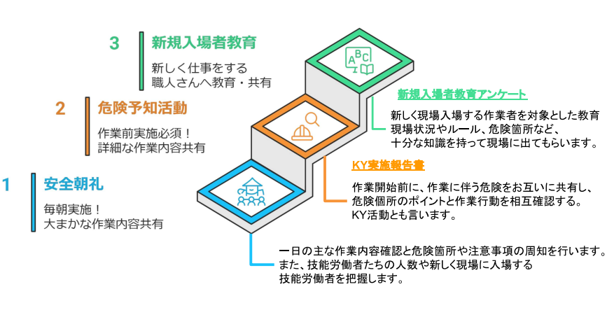

# 朝礼・KY・教育

---

施工管理者が行う安全管理業務の中でも、作業員への直接的な指導・周知は事故防止の要となります。

## 安全朝礼

---

一日の始まりを告げる「安全朝礼」は、単なる出席確認ではありません。  
現場監督にとっては、その日の「安全」と「工程」という2つのハンドルを握り、現場全員のベクトルを合わせる極めて重要なマネジメント業務です。

### 安全朝礼の目的

**情報の共有と意識の統一**  
その日の現場全体の動きを全員に伝え、バラバラの意識を「一つのチーム」にまとめます。

**「仕事モード」へのスイッチ**  
ラジオ体操や唱和を通じて、心身を作業に適した状態に切り替えさせます。

**リスクの事前排除**  
各業者の作業エリアの重複や危険箇所を朝の時点で明確にし、事故の芽を摘みます。

### 朝礼で必ず伝えるべき「5つの柱」

**当日の主な作業内容**  
どのエリアで、誰が、何をするのかを具体的に伝えます。

**人数と新規入場者の把握** 
現場に何人いるか、初めて来た人は誰かを全員で共有します。

**危険箇所と注意事項**  
資料にあるような「高所作業」や「重機作業」のエリアなど、特に注意すべきポイントを指示します。

**工程の変更（リカバリー）**  
雨天などで作業を切り替える場合、その理由と新しい作業手順を伝えます。

**連絡事項**  
資材搬入のタイミングや、近隣への配慮（環境管理）に関する注意事項を伝えます。

### 効果的な朝礼の進め方（標準フロー）

**ラジオ体操**  
身体の柔軟性を高め、転倒やケガを防止します。

**安全目標の唱和**  
今月のスローガンなどを全員で復唱し、意識を高めます。

**各職長からの報告**  
監督が一方的に話すのではなく、各業者のリーダーに「今日の作業と安全ポイント」を喋らせます。これにより責任感を持たせます。

**監督による総括指示**  
全体の交通整理を行い、資料 にある「安全計画」に基づいた最終的なルール徹底を求めます。

## 危険予知活動(KY活動)

---

作業開始前に、その日の作業に潜む「きけん」をメンバー全員で話し合い、対策（行動目標）を決めて共有する活動のことです。   
単に「気をつける」だけでなく、「どこに」「どのような」危険があり、「どう行動するか」を具体的に決めるのがポイントです。

### KY活動の進め方（4つのステップ）

**現状把握（どんな危険が潜んでいるか？）**  
作業内容を詳細に確認し、起こりうるトラブルを出し合います。  
例：足場上での移動中に足を滑らせて転落する。

**本質追求（これが一番危ない！）**  
出された危険の中で、最も重大な事故に繋がりそうなものを特定します。

**対策樹立（どうすれば防げるか？）**  
具体的なルールを決めます。  
例：移動時は常にフルハーネスを親綱にかけ、足元を確認しながら歩く。

**目標設定（私たちはこうする！）**  
チーム全員で守る「指差し呼称」の目標を決めます。  
例：「足元ヨシ！ハーネスヨシ！ご安全に！」

### KY実施報告書

KY活動の結果は必ず「KY実施報告書」として記録に残します。  
KY活動（危険予知活動）を行った証として、また現場の安全状態を記録する公的書類として極めて重要なものになります。

[KY実施報告書(例)をダウンロードする](./link/KY実施報告書(例).xlsx)

**役割**
- 安全意識の共有: 作業前にチーム全員で危険箇所を特定し、対策を文章化することで、記憶に定着させます。
- 責任の明確化: 「誰が」「どの作業を」担当し、安全のために「何をするか」を明確にします。
- 公的な証明: 万が一事故が起きた際、事前に適切な安全教育と危険予知が行われていたかを確認する重要な証拠書類となります。

**報告書に記載すべき主な項目**

安全管理の基本であるKY活動は、形骸化させないことが重要です。記録内容が具体的であるか、以下の視点で確認します。

| 項目 | 記載内容のポイント | 監督のチェック視点 |
| :--- | :--- | :--- |
| **作業内容** | 「3F外部足場での型枠解体」など、場所と内容を具体的に書く。 | 今日の予定（工程表）と一致しているか？ |
| **潜んでいる危険** | 「移動中に足元を滑らせ、5m下に転落する」など具体的に。 | 現場の状況に即した「生きた危険」が書かれているか？ |
| **安全対策・行動目標** | 「親綱にハーネスを完全使用！足元ヨシ！」など。 | 具体的で、全員が実践可能な内容になっているか？ |
| **人員・有資格者** | 作業員の名前と、クレーン等の有資格者の確認。 | 無資格者が危険な作業に従事していないか？ |

## 新規入場者教育

---

### 新規入場者教育の目的

**現場特有のリスクの周知**  
初めて現場に来た人は、どこに開口部（穴）があるか、どこで重機が動いているかを知りません。

**安全意識の共有**  
現場独自のルールを理解してもらい、十分な知識を持ってから作業に入ってもらうことで、初日の事故を防ぎます。

**信頼関係の構築**  
監督と職人さんが最初に顔を合わせる場であり、安全への姿勢（品格）を示す場でもあります。

### 教育で必ず伝えるべき「5つの重要項目」

**現場の概要とルール**  
現場の名称、工期、そしてヘルメットやフルハーネスの着用ルールなどを説明します。

**危険箇所の周知**  
資料にあるような「墜落・転落のリスクが高い場所」や「重機の立ち入り禁止区域」を地図（図面）を使って具体的に示します。

**避難経路と緊急連絡体制**  
万が一、地震や事故が起きた際の集合場所や、監督・救急への連絡先を教えます。

**環境管理・マナー**  
喫煙場所、休憩所、トイレの使用方法や、周辺住民への挨拶・騒音防止といった「環境管理」のルールを伝えます。

**不安全行動の禁止**  
感電事故の事例 などを挙げ、無資格作業や通電箇所の確認不足が命取りになることを厳しく伝えます。

### 教育の進め方と必要書類

**アンケート・問診の実施**  
新規入場者教育アンケートを活用し、経験年数や健康状態（二日酔いや寝不足がないか）を確認します。

**送り出し教育の確認**  
所属会社でどのような教育を受けてきたかを確認します。

**教育の記録**  
教育を行った証拠として、受講者の署名を記録に残します。