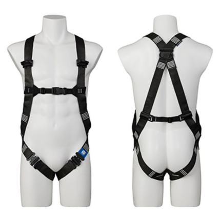
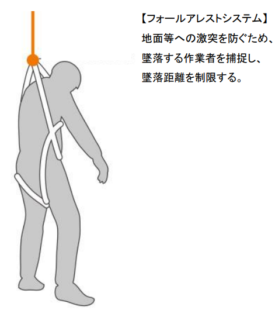
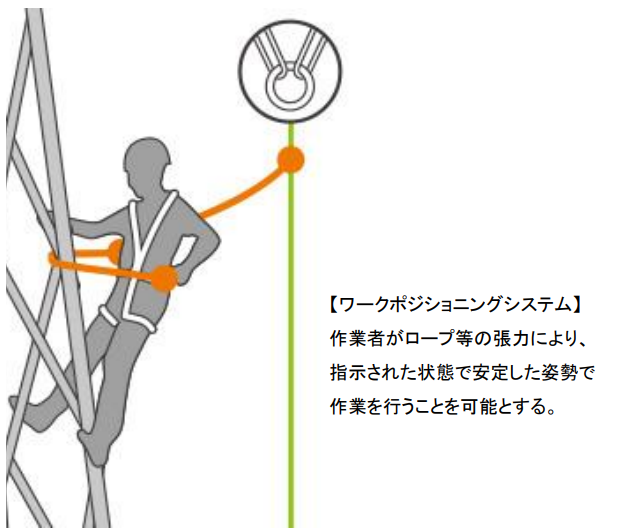
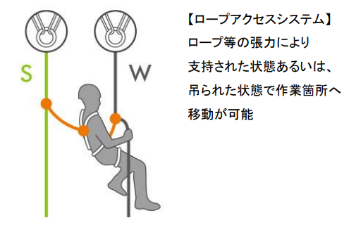
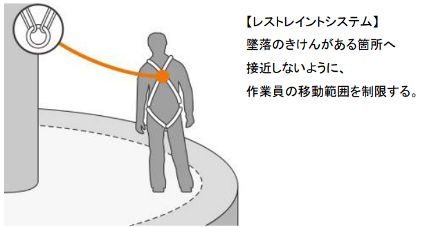

# 法令の改定

従来、高所作業で使用されてきた「安全帯」は、法令の改正により、**名称・位置づけ・使用ルールが大きく見直されました。**

この改正により、

- 「安全帯」という呼び方が法令上廃止されたこと
- フルハーネス型の使用が**原則**とされたこと
- 作業者に対する**特別教育の実施が義務化**されたこと

が明確に定められました。

**【改正法令の施行日：2019年（平成31年）2月1日】**

---

## 法令名称・規格の変更について

改正法令の施行日以降、法令上の名称は「安全帯」から**「墜落制止用器具」** に変更されました。

この名称変更は単なる言い換えではなく、  
**「墜落を防ぐ」ことを前提とした性能・構造を求める**という法令上の考え方の変更を意味しています。

これに伴い、

- 対象となる器具の種類
- 器具に求められる性能基準
- 使用方法や教育内容

についても見直しが行われ、従来使用されていた器具の中には、**法令上認められなくなったもの**も存在します。

1. **フルハーネス型**  

    **○（認められる）**  
    肩・腿・胴部を含めて**身体全体で墜落時の衝撃を分散**する構造の器具。  
    現在の法令では**原則として使用が求められる**墜落制止用器具であり、高所作業において最も安全性が高い。

   
   

2. **胴ベルト（1本つり）**  

    **○（条件付きで認められる）**  
    腰部に装着し、**1点で身体を支持する構造**の墜落制止用器具。  
    一定条件下では使用可能だが、墜落時の身体への負荷が大きいため、**フルハーネス型の使用が困難な場合に限って認められる**。
   
   .png)

:::tip 胴ベルト（1本つり）が認められるシーンとは。
原則として、高所作業ではフルハーネス型の使用が求められますが、  
以下のような状況では、例外的に胴ベルト（1本つり）の使用が認められる場合があります。

- 作業床が極端に狭く、フルハーネス型を装着すると作業が著しく困難になる場合  
  （例：足場幅が非常に狭い場所での作業）
- フルハーネス型を装着することで、かえって安全性が低下すると判断される作業環境  
  （例：器具が引っ掛かりやすく、転倒や挟まれの危険が高まる構造）
- 設備や構造の都合上、フルハーネス型を適切に取り付けられる支持点が確保できない場合
- リスク評価を実施し、手すりの設置、作業床の確保、立入制限などの 代替的な安全措置が講じられている場合

「作業が楽だから」「慣れているから」といった理由は、  
フルハーネス型の使用が困難な場合には該当しません。
:::

3. **胴ベルト型（U字つり）**

    **×（認められない）**   
    　
    **作業姿勢保持を目的とした器具であり、墜落を制止する性能を有しない**ため、法令上の「墜落制止用器具」には該当しない。

   .png)

## 墜落防止システムの種類

高所作業における安全対策は、「どのように作業者の墜落を防ぐか」という考え方に基づき、複数の墜落防止システムに分類されます。
代表的な4つのシステムについて、その目的と役割を整理します。

### フォールアレストシステム（墜落制止）
フォールアレストシステムは、万が一作業者が墜落した場合に、その落下を制止することを目的としたシステムです。主にフルハーネス型の墜落制止用器具を使用し、墜落時の衝撃を身体全体で受け止めることで、地面や下層階への激突を防止します。このシステムでは、墜落そのものは発生し得るものの、墜落距離を最小限に抑えるという考え方が基本となります。　　

  

### ワークポジショニングシステム（作業位置保持）
ワークポジショニングシステムは、作業者の姿勢を安定させ、両手を使った作業を可能にすることを目的としたシステムです。ロープやランヤードにより身体を支持し、指定された位置・姿勢を維持した状態で作業を行います。あくまで姿勢保持が主目的であり、墜落を制止する性能は前提としていないため、単独での使用では墜落防止対策としては不十分です。

  

### ロープアクセスシステム
ロープアクセスシステムは、ロープにより身体を支持・懸垂した状態で作業箇所へ移動するシステムです。支持ロープと安全ロープを併用し、作業者自身がロープを操作して上下・移動を行う点が特徴で、足場を設置できない場所での点検や補修作業などに用いられます。一方で、作業の自由度が高い分、高度な知識・技能・手順管理が求められます。

  

### レストレイントシステム（移動制限）
レストレイントシステムは、作業者が危険区域に到達できないよう、あらかじめ移動範囲そのものを制限するシステムです。ランヤードの長さを調整することで、墜落の可能性がある場所へ近づけないようにし、墜落そのものを発生させないという考え方に基づいています。

  

:::tip フルハーネス型使用の考え方
一般に、高さ2m以上の箇所で行う建設作業においては、墜落防止措置を講じることが義務付けられています。
この墜落防止措置としては、原則としてフルハーネス型の墜落制止用器具を使用します。

また、柱上作業などで胴ベルトを使用する場合であっても、それは姿勢保持を目的としたものであり、  
別途、墜落制止用器具による墜落防止措置が必要とされます。。
 :::

