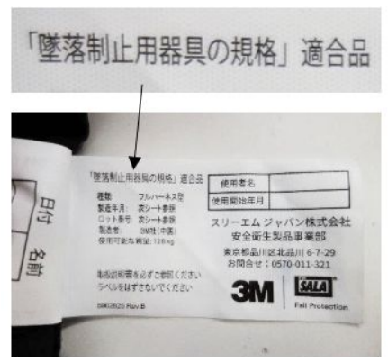
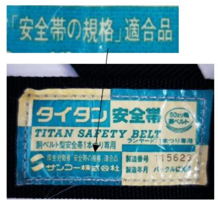

# 法令の改定②

## フルハーネス型が原則とされた背景

墜落制止用器具は、法令改正により **「フルハーネス型の使用が原則」** とされました。  
これは単なる器具の変更ではなく、**墜落時の人体への影響を最小限に抑える**という考え方に基づくものです。

従来から使用されてきた胴ベルト型については、  
墜落時に身体の一部に荷重が集中し、**受ける衝撃が大きくなる危険性**が指摘されてきました。

こうした背景から、国際的にはすでに  
**ISO規格やEN規格（EU：欧州連合の統一規格）において、フルハーネス型の使用が基本**とされており、  
日本においても、これらの国際的な安全基準を踏まえた制度改正が行われました。

---

## 墜落制止時の衝撃荷重に関する規格の違い

墜落制止用器具の改正では、  
**墜落時に人体へ加わる衝撃荷重（kN）** についても見直しが行われています。

| 規格 | 対象器具 | 衝撃荷重の上限 |
|------|----------|----------------|
| 旧：安全帯規格 | 胴ベルト型 | 8kN以下 |
| 旧：安全帯規格 | フルハーネス型 | 8kN以下 |
| 新：墜落制止用器具規格 | 胴ベルト型（一本つり） | 4kN以下 |
| 新：墜落制止用器具規格 | フルハーネス型 | 6kN以下 |

※ 1kN ≒ 102kgの力に相当します。

このように、新しい規格では  
**フルハーネス型・胴ベルト型それぞれに応じた、より厳しい衝撃荷重の基準**が設定されています。

---

## 胴ベルト型が例外的に認められている理由

一般に「高所作業」とされる**高さ2m以上**の作業では、墜落防止措置を講じることが義務付けられています。

ただし、日本の作業環境や実態を踏まえ、  
**日本独自の規格として、一定条件下では胴ベルト型（一本つり）の使用も認められています。**

具体的には、**作業床の高さが6.75m以下**の場合、 地面への衝突に対しては、  
**D環の位置が低い胴ベルト型の方が有利となるケースがある**と考えられるためです。

このため、以下のような整理が採られています。

- 原則：フルハーネス型を使用  
- 例外：高さ6.75m以下で、条件を満たす場合に限り胴ベルト型（一本つり）を使用可能  

---

## 安全衛生特別教育が必要となる作業について

法令の改正により、一定の高所作業に従事する労働者に対しては、事前に「安全衛生特別教育」を実施することが義務付けられました。

この特別教育が求められる背景には、フルハーネス型墜落制止用器具を使用する作業が、  
使い方や判断を誤った場合に重大な墜落災害につながりやすい、**危険性の高い作業である**という考え方があります。

### 特別教育の対象となる作業の考え方

特別教育が必要かどうかは、単に「高い場所で作業するかどうか」だけで判断されるものではありません。

法令上は、  **高さが2m以上の箇所で、作業床を設けることが困難な状況において、フルハーネス型墜落制止用器具を使用して行う作業**  が対象とされています（ロープ高所作業を除く）。

つまり、高さ・作業環境・使用する器具という複数の条件が重なったときに特別教育が必要になる、という整理になります。

### なぜ特別教育が必要とされたのか

フルハーネス型は、正しく使用すれば非常に有効な安全対策ですが、一方で、取付設備の選定やランヤードの種類、墜落距離や衝撃荷重の考え方を誤ると、**「装着しているにもかかわらず事故が発生する」**　ケースがあります。

このため、注意書きや経験則だけに頼るのではなく、作業に就く前に、体系的に知識と技能を身につけさせる必要があると判断され、  
法令に基づく特別教育が義務化されました。

---

## 安全衛生特別教育とは

安全衛生特別教育とは、労働者が危険性または有害性の高い作業に従事するにあたり、必要な安全衛生上の知識および技能を、**事前に確実に習得させるための教育**です。

この教育は、事業者が責任をもって実施することが求められており特別教育を受けていない労働者を、対象となる作業に従事させることはできません。

### 特別教育の目的と位置づけ

特別教育の目的は、単にルールや手順を覚えさせることではありません。
作業者自身が、「どこに危険があるのか」「どのような条件で事故につながるのか」 を理解したうえで行動できる状態にすること、そして事業場全体として、墜落災害が発生しにくい作業環境をつくることが目的です。

フルハーネス型墜落制止用器具に関する教育は、数ある安全衛生教育の中でも、**高所作業特有の危険性に直接対応する特別教育**として位置づけられています。

---

## 新規格と旧規格の見分け方

現場で使用できる器具かどうかを判断する際は、外観や使用感ではなく、**製品本体に表示されているラベルの表記**を確認します。
製品のベルト部分やタグ、ラベルなどに「墜落制止用器具の規格 適合品」「墜落制止用器具」といった表記があるものは、新規格に適合した器具です。

### 新規格（使用可能）

 
上画像のように　**「墜落制止用器具の規格」** と明記されているものは、法令改正後の新規格に適合しています。
一方で、ラベルに **「安全帯の規格 適合品」**　**「安全帯」** といった表記のみがある器具は、旧規格に該当します。

### 旧規格（使用不可）

このような表示の器具は、**2022年1月2日以降、使用することができません。**
