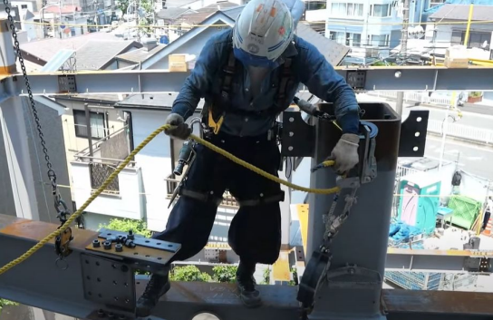
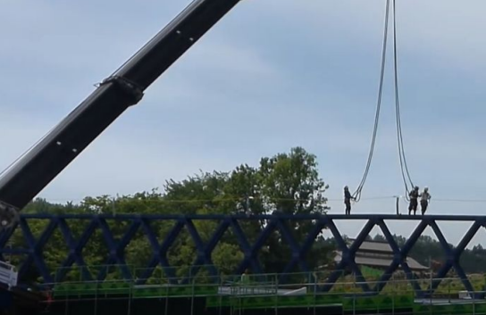
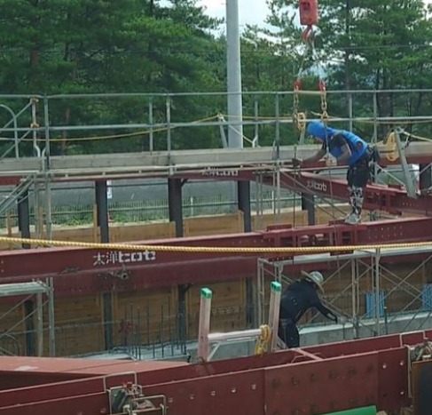
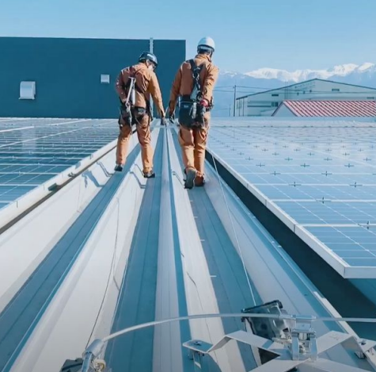
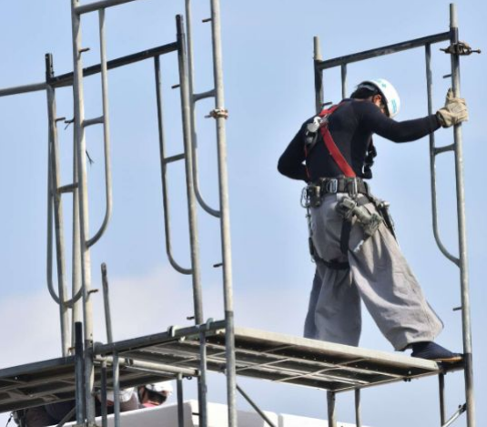
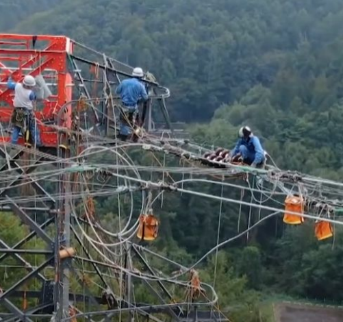

# 第1章　作業に関する知識

## 1. この章で扱う「作業」とは

この章でいう「作業」とは、**労働安全衛生規則 第36条 第41号**で定められている  
**フルハーネス型墜落制止用器具特別教育の対象となる作業**を指します。

具体的には、次の条件に当てはまる作業です。

- 高さが **2メートル以上** の場所で行う作業であること  
- 作業床（足場や床など）を設けることが **困難な場所** であること  
- 墜落時の危険を防止するため、  
  **フルハーネス型の墜落制止用器具を使用して行う作業** であること  

これらの条件を満たす作業では、万が一の墜落事故が重大災害につながるおそれがあるため、  
作業に従事する前に **特別教育の受講** が義務付けられています。

---

## 2. フルハーネス型墜落制止用器具を使用する理由

高所作業では、足を滑らせる、バランスを崩す、資材に引っかかるなど、  
**予期せぬタイミングで墜落が発生する可能性**があります。

フルハーネス型墜落制止用器具は、

- 墜落時の衝撃を **身体全体で分散** できる  
- 内臓や腰への負担を軽減できる  
- 墜落後の姿勢が比較的安定し、二次災害を防ぎやすい  

といった特徴があり、現在では高所作業における **基本的な安全対策** とされています。

---

## 3. 対象となる作業の具体例

以下は、フルハーネス型墜落制止用器具を使用して行われる代表的な作業例です。

### 鉄骨建方作業

建物の骨組みとなる鉄骨を組み立てる作業です。  
足場を設けにくい高所での作業が多く、梁や柱の上を移動しながら作業を行うため、常に墜落の危険があります。
そのため、作業者はフルハーネス型墜落制止用器具を着用し、確実に安全を確保した状態で作業を行います。

### 橋梁付属作業

橋梁（橋）の建設や補修に伴い、高所で付属設備の取り付けや点検を行う作業です。
クレーンを使用した作業や、地上から離れた位置での作業が多く、足場を設置できない場合も少なくありません。
このような環境では、**フルハーネス型墜落制止用器具の使用が不可欠** となります。

### 土留め支保工

土留め支保工とは、掘削工事において、**土砂の崩壊を防止するために設置される仮設構造物**を指します。
支保工の設置・解体作業は、次のような特徴があります。

- 掘削された深い場所での作業となる  
- 足場や作業床を十分に確保できない場合がある  
- 鋼材の上を移動しながら作業を行うことが多い  

このような環境では、足を踏み外したり、バランスを崩した場合に**墜落や転落事故につながる危険性**があります。  
そのため、作業床の設置が困難な場合には、フルハーネス型墜落制止用器具を使用し、確実に身体を保持した状態で作業を行う必要があります。

### 屋根作業

屋根作業は、建物の新築・改修・点検などにおいて、**屋根上で行われるすべての作業**を指します。

屋根上は次のようなことから非常に危険性の高い作業環境です。

- 高さが2メートルを超える場合が多い  
- 勾配があり、足を滑らせやすい  
- 端部や開口部が近く、転落の危険が高い  

特に、足場を設置できない、または設置が困難な場合には、  
フルハーネス型墜落制止用器具を使用して作業を行うことが求められます。

### 足場組立作業

足場組立作業とは、建設工事や改修工事において、**作業床や通路となる足場を組み立て・解体する作業**を指します。  

足場の組立作業には、次のような特徴があります。

- 作業の初期段階では、十分な作業床が確保されていない  
- 部材の上を移動しながら作業を行う場面が多い  
- 高さが増すにつれて、墜落時の危険性が大きくなる  

特に、手すりや床材が未設置の状態では、足を踏み外した場合に **直接墜落につながる危険**があります。  
このような状況で作業床の設置が困難な場合には、フルハーネス型墜落制止用器具を使用し、作業者自身の安全を確保しながら作業を行う必要があります。

### 送電線架線作業

送電線架線作業とは、鉄塔や支持構造物の間に**送電線を張り渡す作業**を指します。

この作業は、次のことから高所作業の中でも特に危険性が高い作業の一つです。

- 地上から大きく離れた高所で行われる  
- 作業床を設置することが極めて困難  
- 足元が不安定な構造物上での作業となる  
 
万が一、足を滑らせたり体勢を崩した場合、 重大な墜落災害につながるおそれがあるためフルハーネス型墜落制止用器具の使用が不可欠となります。
