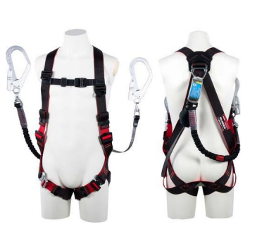
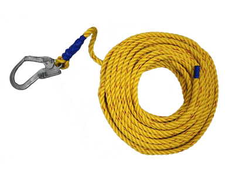
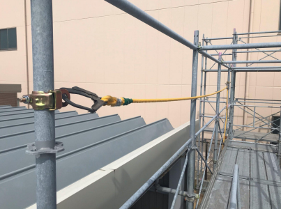
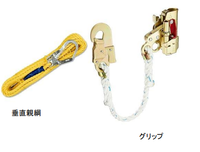
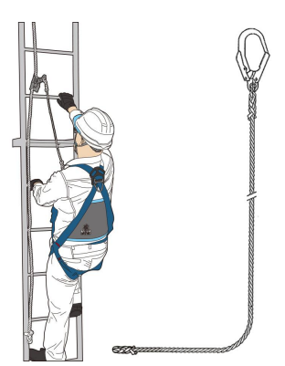
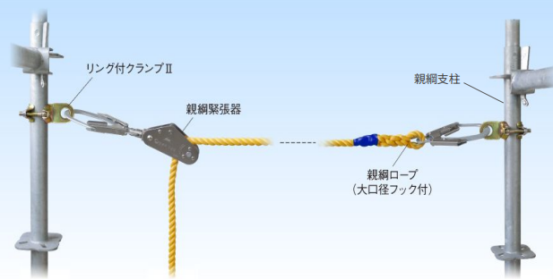
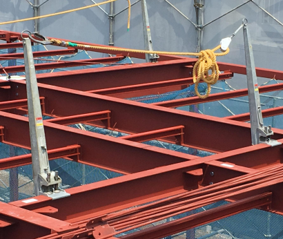
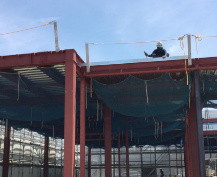

# 第1章　作業に関する知識 
---

## ①フルハーネス型墜落制止用器具

### 器具の説明（構造と役割）

フルハーネス型墜落制止用器具とは、**墜落を制止する際に、身体にかかる荷重を肩・腰部・腿部など複数の部位で分散して支持する構造**を持つ墜落制止用器具です。
身体をベルトで包み込むように装着することで、墜落時の衝撃が一箇所に集中することを防ぐ設計となっています。

### 構造の特徴

フルハーネス型墜落制止用器具は、主に次の部材で構成されています。

- 肩部ベルト  
- 胴部（腰部）ベルト  
- 腿部（もも）ベルト  
- 背中または胸部の接続金具  
- ランヤード（器具と構造物をつなぐ部材）  

これらの部材により、墜落時の荷重を**身体全体で受け止める構造**となっています。   
従来の胴ベルト型は、腰部のみで身体を支える構造のため、墜落時に腰や内臓へ大きな負担が集中する危険がありました。
フルハーネス型は荷重を複数箇所で分散できるため、墜落時の人体への影響を軽減できることから現在では高所作業における **基本の器具** とされています。

### 使用イメージ

.png)

フルハーネス型墜落制止用器具は高所作業中に作業者が墜落しないよう**構造物と作業者をランヤードで接続した状態で使用**されます。

## ②胴ベルト型(1本吊り)落下制止用器具(ロープ式)

### 器具の説明

落下制止用器具.png)

胴ベルト型（1本つり）墜落制止用器具とは、**身体の腰部に装着する胴ベルトと、1本のランヤードで構成される墜落制止用器具**です。  
作業者は胴ベルトを腰部に装着し、ランヤードのフックを構造物に取り付けて使用します。

### 使用イメージ

.png)

作業中は、作業者の腰部と構造物が **1本のランヤードで接続された状態** となります。
墜落が発生した場合は、腰部を中心として身体が制止されます。

### ロープ式の特徴
ロープ式ランヤードは、**長さが固定されており、自動で調整されない**という特徴があります。  
そのため、次のような点に注意が必要です。
- ロープのたるみが生じやすい  
- 使用状況によって墜落距離が大きくなる場合がある  

## ③胴ベルト型（1本つり）墜落制止用器具（巻き取り式）

### 器具の説明

落下制止用器具②.png)

胴ベルト型（1本つり・巻き取り式）墜落制止用器具とは、  
**身体の腰部に装着する胴ベルトと、巻き取り機構を備えたランヤードで構成される墜落制止用器具**です。
ランヤードは巻き取り器により常に引き出し・巻き取りが行われ、作業者の動きに合わせて長さが調整されます。

### 使用イメージ

.png)

作業中は、作業者の腰部と構造物が **巻き取り式ランヤードで接続された状態** となります。
墜落が発生した場合は巻き取り機構とショックアブソーバにより墜落距離や衝撃が抑えられます。

###  巻き取り式ランヤードの特徴

巻き取り式ランヤードは、次のような特徴があります。

- ランヤードの長さが自動で調整される  
- たるみが生じにくい  
- 墜落距離を小さく抑えやすい

そのため、ロープ式と比べてフックの掛け替え頻度が少なく安定した状態で作業しやすい構造となっています。

## ④胴ベルト型（U字吊り）

### 器具の説明

.png)

胴ベルト型（U字吊り）とは、**柱上作業などで作業姿勢を保持するために使用されるワークポジショニング用の保護具**です。
胴ベルトを腰部に装着し、U字状のロープを構造物に回して使用します。
ロープの長さは、**伸縮調節器により作業に適した長さに調整**して使用します。

### 使用イメージ

.png)

U字吊りは作業者の身体を構造物に預けることで、両手を使った作業を可能にするための器具です。  
主に電柱や鋼柱などの柱上作業で使用されます。

### U字吊りの特徴と注意点

U字吊り用のロープは、使用時に構造物と直接接触するため、摩耗や損傷が生じやすい特徴があります。  
また、U字吊りは **墜落を制止するための器具ではありません**。  
そのため、高所で作業を行う場合は、  **別途、墜落制止用器具を併用する必要があります**。

---

## 墜落制止用器具の取り付け設備等

### ① 親綱

親綱とは、高所作業において、  
**墜落制止用器具を引っ掛けて使用するためのロープ**です。

作業者は、フルハーネス型墜落制止用器具やランヤードを  
この親綱に取り付けて作業を行います。

### 使用イメージ

親綱は、柱や支柱などの構造物間に張り渡して設置され、作業者の移動に合わせてランヤードを掛け替えながら使用します。　　
墜落制止用器具の性能を十分に発揮させるための  
**重要な取り付け設備**です。

## ②垂直親綱・グリップ

垂直親綱とは、**建物や足場などに垂直方向に設置されるロープ**で、昇降作業時に墜落制止用器具を取り付けて使用する設備です。グリップは、この垂直親綱に取り付けて使用する器具で、作業者の移動に合わせて上下に移動します。

### 使用イメージ

垂直親綱・グリップは、はしごや昇降設備を使用して上下移動を行う際に使用されます。  
作業者は、フルハーネス型墜落制止用器具のランヤードをグリップに接続し、昇降に合わせてグリップを移動させます。

垂直親綱およびグリップは、**昇降中の墜落防止を目的とした取り付け設備**です。

次のような事に気を付けて使用する必要があります。
- 垂直方向に確実に設置されていること  
- 規定に適合したグリップを使用すること  

## 墜落制止用器具の取り付け設備等

### ① 水平親綱・親綱緊張器および親綱支柱

水平親綱とは、**鉄骨建方作業や足場組立、低層住宅の屋根上作業などにおいて、水平方向に移動する際に墜落制止用器具のフックを取り付けるためのロープ** です。
作業者は、フルハーネス型墜落制止用器具のランヤードをこの水平親綱に接続して作業を行います。

**親綱支柱**により一定の高さで支持され、**親綱緊張器**によって適切な張力が与えられた状態で設置されます。
これにより、親綱のたるみが抑えられ万一墜落が発生した場合でも落下距離を小さくする効果があります。

### 使用イメージ

水平親綱は、作業者が梁上や屋根上を移動する際に、ランヤードを掛け替えながら使用される水平方向の移動時における墜落防止を目的とした取り付け設備です。
使用にあたっては親綱支柱が確実に固定され親綱が適切な張力で設置されていることに注意する必要があります。