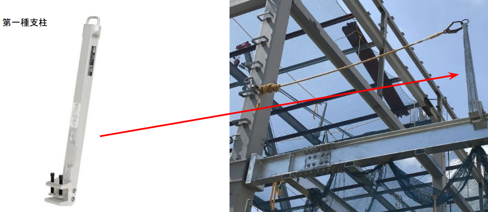
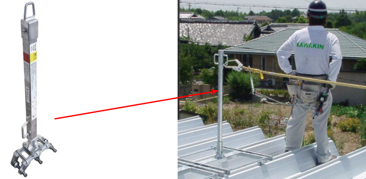
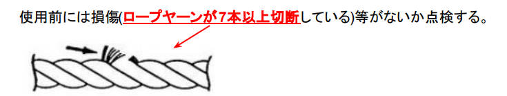
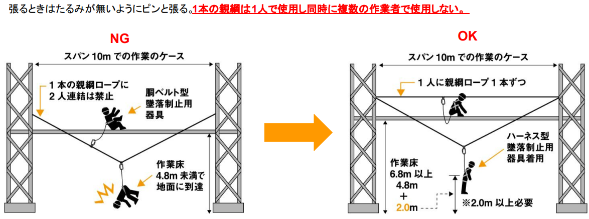
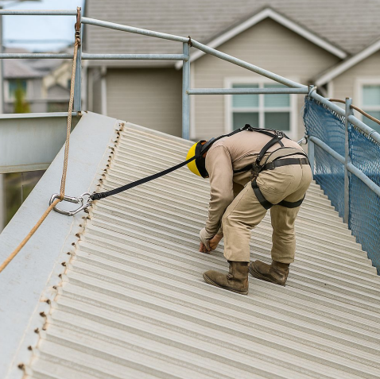
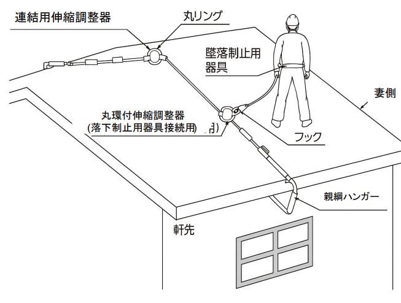
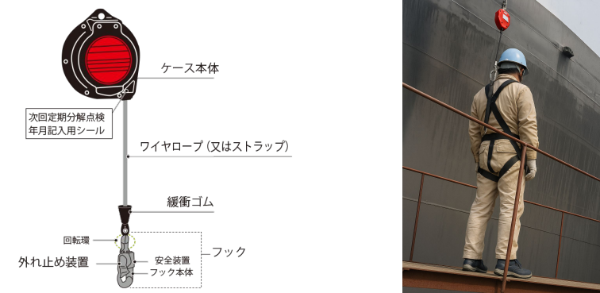

# 第1章　作業に関する知識 
---

## ④ 支柱の種類

ここからは、親綱を安全に使用するために必要な　**「支柱」**　について説明します。
支柱は、親綱を所定の高さで保持し、墜落制止用器具を確実に機能させるための取り付け設備です。作業内容や設置環境に応じて、支柱の種類を使い分ける必要があります。

---

### 第1種支柱

第1種支柱は、鉄骨建方作業や足場組立作業など、**高所で親綱を常設または連続して使用する作業**に用いられる支柱です。

梁上作業などで作業者が水平方向に移動する際に、親綱を高い位置で安定して支持することを目的としています。
第1種支柱は、地面や建物の構造体に確実に固定して使用することを前提とした構造となっており、作業中に支柱が動いたり外れたりしないことが求められます。

### 強度の目安（参考）

第1種支柱では、**支柱本体および支持金具に5kN以上の強度**が求められます。
5kNとは、**体重約500kg相当の力に耐えられる強度**の目安であり、高所作業において発生する大きな荷重を想定した数値です。

---

### 第2種支柱

第2種支柱は、主に **低層住宅の屋根上作業**などにおいて、親綱を仮設的に設置するために使用される支柱です。

屋根材や下地を傷めにくい構造となっており、比較的短時間の作業や限定された範囲での作業に適しています。
作業環境に応じて設置・撤去を行いながら使用する点が第1種支柱との大きな違いです。

---

### 第1種支柱と第2種支柱の使い分け

支柱は、作業内容と設置環境に応じて、次のように使い分けます。

| 項目 | 第1種支柱 | 第2種支柱 |
|---|---|---|
| 主な作業 | 鉄骨建方・足場組立など | 低層住宅の屋根上作業 |
| 親綱の使用 | 常設・連続使用 | 仮設・限定使用 |
| 設置方法 | 構造体に確実に固定 | 屋根上に仮設設置 |
| 強度の考え方 | 5kN以上 | 作業条件に応じた設計 |
| 使用期間 | 比較的長期間 | 比較的短時間 |

---

###  親綱を使用する際の注意

親綱には、使用目的に応じて次の仕様が求められます。

- ワイヤーロープ：直径 **9mm以上10mm以下**
- 合成繊維ロープ：直径 **16mm以上**

使用前には、**規格を満たしていること**や、摩耗・損傷などの異常がないことを点検します。

---

### 親綱の張り方

親綱を張る際は、**たるみが出ないよう、ピンと張ること**が基本です。
また、親綱の使用には次のルールがあります。

- **1本の親綱は1人で使用する**
- **1本の親綱を同時に複数人で使用しない**

#### 親綱使用時のNG例・OK例

**■NG例（スパン10mでの作業）**

- 1本の親綱を2人で同時に使用している  
- 親綱のたるみが大きい  
- 墜落時に作業床や地面へ到達するおそれがある  

このような使い方は、**墜落距離が大きくなり、危険**です。

**■OK例（スパン10mでの作業）**

- 作業者1人につき親綱を1本使用  
- 親綱を適切に張り、たるみを抑えている  
- 墜落時も地面や下部構造物に接触しない  

このように、**親綱の張り方と使用人数を守ること**が重要です。

---

### 屋根作業での親綱使用

屋根作業やその他の傾斜面作業では**屋根親綱支柱**を使用し、水平方向に親綱を設置して作業を行います。
作業者はフルハーネス型墜落制止用器具を着用し親綱に連結して作業します。

#### 親綱ハンガーの役割

親綱ハンガーは、主に屋根作業などにおいて、**親綱を適切な高さと張力で設置するための装置**です。  
軒先部分にハンガーを掛け、頂部に設けられた **連結用伸縮調整器** を操作することで、親綱の長さや張り具合を調整しながら設置します。

屋根作業では、そのまま親綱を張ると高さが不足したり十分な張力を確保できない場合があります。  
親綱ハンガーを使用することで作業者の移動に適した高さに親綱を保持したるみの少ない状態で設置することが可能となります。

#### 安全ブロックの役割

安全ブロックは、高所作業において使用される**墜落制止用器具の一種**です。

主にビルなどの建設現場に設置され、先端のフックを作業者の安全帯（フルハーネス型墜落制止用器具）の接続環に取り付けて使用します。
安全ブロック内部には、ワイヤーロープ（またはストラップ）を自動で巻き取る機構が備えられており、作業者の動きに合わせてロープが伸び縮みします。  
万一、作業者が足を滑らせて墜落した場合には内部の制動機構が作動し、ワイヤーロープの急激な引き出しを停止させることで墜落を制止します。
安全ブロックに使用されるワイヤーロープの長さは作業内容や設置場所に応じて種類があり、 使用する現場条件に適したものを選定する必要があります。

---

