# 第1章　作業に関する知識 
---

## ⑤ 墜落制止用器具の取り付け設備と点検・整備

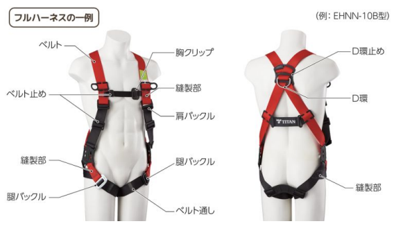

墜落制止用器具は、**墜落のおそれがある箇所で、適切に取り付けて使用してはじめて効果を発揮**します。

いくら墜落制止用器具を所持していても使用する箇所に墜落の危険がなければ意味がありません。 また、墜落の危険がある場合でも取り付ける設備が不完全であったりそもそも取り付ける場所がなければ、十分な安全性は確保できません。

そのため、墜落制止用器具を使用する前には、**取り付け設備が設置されているか**、**設備に不備や異常がないか**を確認し必ず点検を実施する必要があります。

---

## 作業に用いる設備の点検および整備の方法  
### フルハーネス型墜落制止用器具（ベルト部の点検）

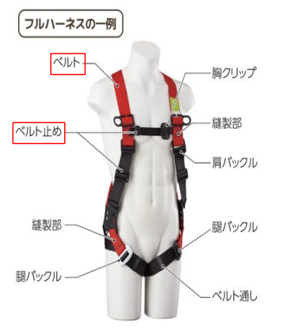

フルハーネス型墜落制止用器具は、ベルト部分によって作業者の身体を保持し墜落時の衝撃を分散する構造となっています。
そのため、ベルトに損傷がある場合本来の性能を発揮できないおそれがあります。 
使用前には、必ずベルトの状態を点検します。

#### ■切り傷・焼損・溶融
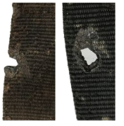  

ベルトには、次のような損傷がないかを確認します。
- **2mm以上の切り傷があるもの**
- **2mm以上の焼損・溶融が確認できるもの**

#### ■摩耗・擦り切れ
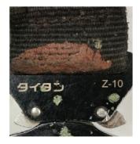

- **2mm以上の摩耗**
- **繊維が擦り切れている状態**

摩耗や擦り切れが進行すると墜落時にベルトが破断する危険があります。  
このような状態が確認された場合も、使用を中止します。

#### ■薬品・塗料の付着
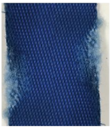

ベルトに、薬品や塗料などが付着していないかを確認します。

- **2mm以上の範囲で付着しているもの**  

薬品や塗料が付着すると、ベルトの繊維が劣化し、強度が低下するおそれがあります。

#### ■摩滅・傷（装着部の確認）
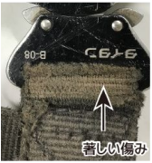

バックル付近など、  **ベルト同士が噛み合う部分**に摩滅や傷がないかを確認します。特に、次の状態は注意が必要です。

- ベルトの噛合部が著しく摩滅している  
- 正しく装着して力を加えても、  
  **ベルトがずれて緩む状態**になっている  

このような場合、作業中や墜落時にベルトが保持できなくなるおそれがあります。

---

### フルハーネス型墜落制止用器具（縫製部の点検）

フルハーネス型墜落制止用器具では、  
ベルト同士を固定するために縫製部（縫い目）が設けられています。

縫製部はベルトに加わる力を保持する重要な部分であり異常がある場合には、墜落時に破断するおそれがあります。

#### ■縫糸の切断・ゆるみ

![縫製部の損傷例（縫糸の切断・ゆるみ）](../cat2_img/縫製部の損傷例（縫糸の切断・ゆるみ）.png

縫製部の縫糸に切断や著しいゆるみがないかを確認します。

- **縫糸が1箇所以上切断しているもの**  
- 縫い目がほつれ、ゆるみが生じているもの  

これらが確認された場合縫製部が本来の強度を保てないおそれがあります。

#### ■縫製部の摩耗

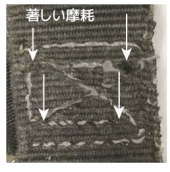

縫製部に摩耗や擦り切れがないかを確認します。

- **縫糸の摩耗が著しいもの**  
- 縫い目が薄くなり、  
  ベルトとの境目が不明瞭になっているもの  

縫製部が摩耗すると墜落時の荷重に耐えられず縫製部から破断する危険があります。

---

### フルハーネス型墜落制止用器具（バックルの点検）

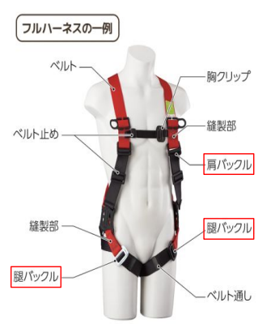

バックルは、フルハーネスを身体に確実に固定するための重要な部品です。  
バックルに異常がある場合、作業中に緩んだり、墜落時に保持できなくなるおそれがあります。

#### ■摩滅・傷

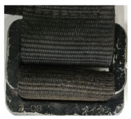

バックル本体やベルトが通る部分に、摩滅や傷がないかを確認します。

- **深さ1mm以上の摩滅・傷があるもの**  
- **亀裂が認められるもの**

#### ■錆（さび）

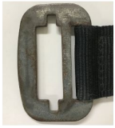

バックル全体に、錆が発生していないかを確認します。

- **バックル全体に錆が発生しているもの**

錆が進行すると、正常な動作ができなくなるおそれがあります。  

#### ■リベット部の摩耗・ガタつき

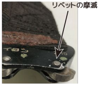

バックルを固定しているリベット部分に、摩耗やガタつきがないかを確認します。

- **リベットのカシメ部が2分の1以上摩耗しているもの**  
- リベット部にガタつきや変形があるもの  

これらが認められる場合、バックルが確実に固定できないおそれがあります。

#### ■動作不良（締まり具合・爪の状態）

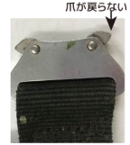

バックルを実際に操作し正しく装着・固定できるかを確認します。

- 奥まで差し込めないもの  
- 差し込んでもロックがかからないもの  
- 爪が戻らない、動きが悪いもの  
- バネが折損・脱落しているもの  

このような状態のバックルは、作業中に外れる危険があります。

#### ■正しく結合できないもの

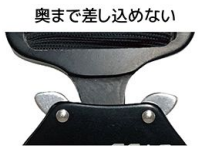

バックルを装着する際、正しく差し込み確実に結合できるかを確認します。

- 奥まで差し込めないもの  
- 差し込んでもロックがかからないもの  

このような状態では作業中や墜落時に外れるおそれがあります。

#### ■腐食

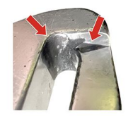

バックル本体に腐食が発生していないかを確認します。

- **腐食が認められるもの**

腐食が進行するとバックルの強度が低下するおそれがあります。  

#### ■亀裂

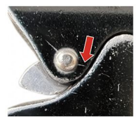　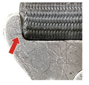

バックル本体や可動部、ベルトが接触する金属部分に目視で確認できる亀裂がないかを確認します。

- **目視で確認できる亀裂があるもの**

亀裂がある場合、使用中や墜落時に破断するおそれがあります。

---

### フルハーネス型墜落制止用器具（D環の点検）

D環は、ランヤードや安全ブロックなどを接続するための金具であり、墜落時には大きな荷重が直接かかる重要な部品です。

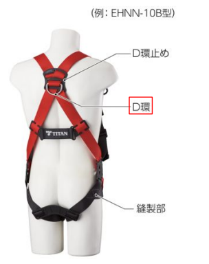　

#### ■摩滅・傷

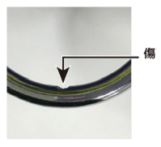

D環の表面に、摩滅や傷がないかを確認します。

- **深さ1mm以上の摩滅・傷があるもの**  
- **亀裂が認められるもの**

これらが確認された場合、強度が低下しているおそれがあります。

#### ■錆（さび）

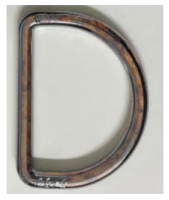

D環全体に、錆が発生していないかを確認します。

- **全体に錆が発生しているもの**

錆が進行すると、D環の強度が低下するおそれがあります。  

#### ■変形

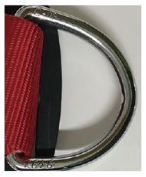

D環の形状が、新品時と比べて変形していないかを確認します。

- **目視で確認できる変形があるもの**

変形がある場合、ランヤードやフックが正しく掛からず、外れや破断につながるおそれがあります。

#### ■参考（新品時の状態）

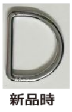

新品時のD環は、 左右対称で、歪みや凹みがない形状をしています。  
点検時は、新品時の形状と比較しながら確認します。

---

### フルハーネス型墜落制止用器具（D環止めの点検）

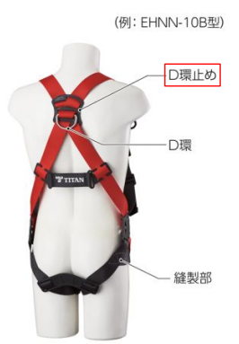

D環止めはフルハーネス背部にある **D環を所定の位置に固定するための部品** です。
使用中にD環がずれたり外れたりしないよう保持する役割があります。

D環止めに異常がある場合、D環が正しい位置で機能せず墜落時の安全性に影響を及ぼすおそれがあります。

#### ■割れ・破損

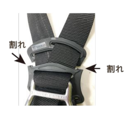

D環止め本体に、割れや破損がないかを確認します。

- **D環止めが割れているもの**  
- **割れによりD環を固定できないもの**

これらが確認された場合使用中にD環が外れたり位置がずれるおそれがあります。

---

