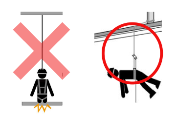
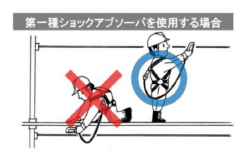
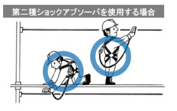
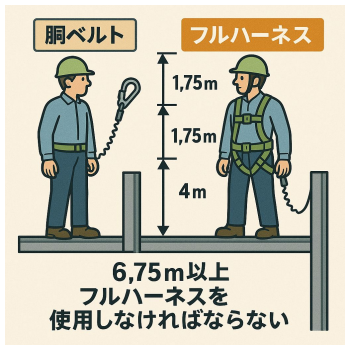
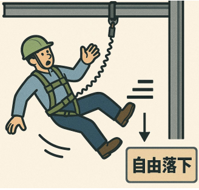
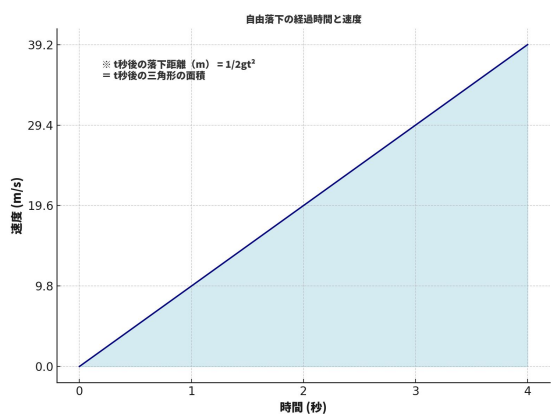
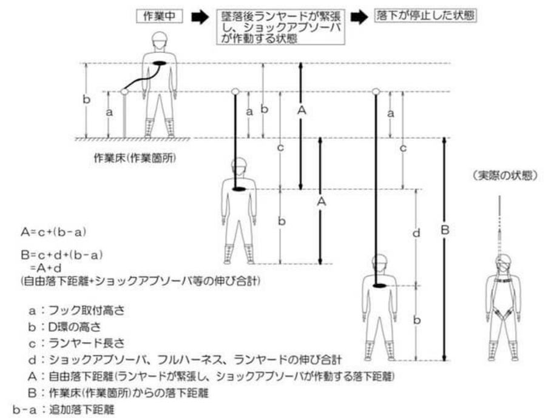

# 第1章　作業に関する知識 
---

## 墜落制止用器具使用時の転落災害状況

### 年度別の発生状況

| 年度 | 建設業死亡者数 | 墜落・転落事件数 | 墜落・転落が占める割合 | 備考・重点項目 |
|---|---:|---:|---:|---|
| 2023年 | 223人 | 204件 | 約91% | フルハーネス着用義務化後の初年度。フック未使用事例が多発 |
| 2024年 | 232人 | 77件 | 約33.2%（死亡事故内） | 一人親方を含む **39/57人** が墜落事故により死亡 |

---

### 2023年（墜落・転落の主な発生事例）

| 順位 | 発生場所・作業内容 | 件数 | 割合 |
|---:|---|---:|---:|
| 1 | 屋根・屋上等の端・開口部からの墜落 | 87件 | 約33% |
| 2 | 足場からの墜落 | 50件 | 約19% |
| 3 | はり・けた（架材）からの墜落 | 25件 | 約10% |
| 4 | はしご・脚立等からの墜落 | 20件 | 約10% |
| 5 | 建築物・構築物からの墜落 | 14件 | 約5% |

---

### 2024年（墜落・転落の主な発生事例）

| 順位 | 発生場所・作業内容 | 件数 | 割合 |
|---:|---|---:|---:|
| 1 | 開口部・端部からの墜落 | 52件 | 約30% |
| 2 | はしご・脚立等からの墜落 | 20件 | 約25% |
| 3 | 梁・桁・構造物上からの墜落 | 17件 | 約10% |
| 4 | 足場・屋上・屋根からの墜落 | 14件 | 約20% |
| 5 | 建築・構築物上などその他高所作業 | 9件 | 約5% |

### ポイント整理

- 墜落・転落事故は **屋根・開口部・足場** に集中している  
- フルハーネス制度導入後も、  
  **フック未使用・取り付け不備** による事故が継続して発生  
- 特に一人作業・一人親方を含む現場では、  
  墜落事故が **死亡事故に直結しやすい** 傾向がある

---

### 墜落制止用器具と取り付け設備に関する重要事項

墜落制止用器具の取り付け設備がまったく無い状態または設備が不十分・不完全な状態で、高所作業（**高さ2m以上で墜落の危険がある作業**）を行わせることは、事故の有無に関係なく、その時点で違法です。

たとえ作業者本人が **「大丈夫だから」と判断し、自ら進んで危険な作業を行った場合であっても**、「作業者を安全な状態で働かせる」という事業者（会社）の責任が軽くなることは一切ありません。

また、現場で実際に作業を行うにあたり、事業者（会社）から 作業の指揮・監督を任されている管理監督者（例：職長、現場責任者など）についても、責任を問われる場合が多くあります。

---

### 取り付け設備に関する労働安全衛生法上の責任の考え方（例）

高所作業における墜落防止対策では、  「誰が、どの段階で責任を負うのか」が問題となります。  
以下は、取り付け設備に関して **よくあるケース別の責任の考え方の例** です。

**■case1**  
本来は親綱を張るべき作業現場であるにもかかわらず、会社がそのような設備を用意しておらず、フックを掛ける場所がない状態で作業をさせた。
この場合、**取り付け設備を準備しなかった事業者の責任が最も重い** と考えられます。

**■case2**  
親綱設備は施工者によって現場に搬入されていたが、「少しの間だけだから大丈夫」と判断し、設置しないまま作業を行わせた。
この場合、**現場で作業の指揮・判断を行った管理監督者の責任が重くなる**  
と考えられます。

**■case3**  
点検を怠り、劣化・損傷した親綱を作業者に使用させた結果、墜落時に親綱が切れて作業者が地面に激突した。

この場合、- 不良品を使用させたことに対する **会社としての責任**  
- 点検を怠った **現場監督者　　
- 点検担当者の実務上の責任**

などが問われる可能性があります。

:::warning  注意点
上記はあくまで **一般的な目安** であり、実際の労働安全衛生法違反や送検事例では、個別の状況に応じて判断され、さまざまなケースがあります。
また、労働安全衛生法は主に **事業者責任を重く問う法律** ですが実際に災害が発生した際、**最も大きな被害を受けるのは作業者自身** です。
そのため、**自分を守ってくれるものをしっかり点検し、指示が無くても安全な作業を行うことは当然のことです。**
:::

---

### 取り付け設備等の点検項目と廃棄基準（例）

安全に作業を行うため、**墜落制止用器具および取り付け設備は必ず点検を実施**します。
点検の結果、**以下の廃棄基準に該当するものは使用せず、新品に取り替えます。**

### ■親綱・子綱

| 点検項目 | 廃棄基準 |
|---|---|
| 損傷の有無 | ・ロープヤーンが **7本以上切断** しているもの |
| 摩耗の有無 | ・**著しく摩耗** しているもの |
| 型崩れの有無 | ・型崩れ（ねじれ・コブ状）が発生しているもの |
| さつま編みの緩み・抜け | ・編みの緩みや抜けが発生しているもの |
| 薬品・塗料の付着 | ・薬品や塗料が付着し、**硬化しているもの** |
| シンプルな変形 | ・明らかな変形があるもの、脱落しているもの |

---

### ■緊張器

| 点検項目 | 廃棄基準 |
|---|---|
| 伸縮機能の良否 | ・伸縮機能が困難なもの   ・作動が悪いもの |
| ばねの破損・脱落 | ・破損または脱落して **把持できないもの** |
| 押爪の摩耗 | ・押爪先端の凹凸が **1/2以上減っているもの** |
| 錆の有無 | ・全体に錆が発生しているもの |
| 変形の有無 | ・目視で判断できる変形があるもの |
| 傷の有無 | ・**深さ1mm以上の傷** があるもの  ・微細な亀裂があるもの |
| リベットの摩滅・ガタつき | ・頭部やカシメ部が **1/2程度摩滅** しているもの ・ガタつきがあるもの |

### ■フック金具（カラビナ含む）

| 点検項目 | 廃棄基準 |
|---|---|
| 機能の異常 | ・安全装置や外れ止め装置が確実に作動しないもの  ・ばねが破損・脱落しているもの |
| 変形の有無 | ・目視で判断できる変形があるもの |
| 傷の有無 | ・**深さ1mm以上の傷** があるもの ・微細な亀裂があるもの |
| 錆の有無 | ・全体に錆が発生しているもの |
| 腐食の有無 | ・白錆（腐食）が発生しているもの |
| リベットの摩滅・ガタつき | ・頭部やカシメ部が **1/2程度摩滅** しているもの ・ガタつきがあるもの |

### ■安全ブロック

| 点検項目 | 廃棄基準 |
|---|---|
| ロック機能 | ・ロック機能が正常に作動しないもの |
| ストラップの巻き込み・繰り出し | ・スムーズに巻き込み・繰り出ししないもの |
| 本体の割れ・変形 | ・**3mm以上の割れ** があるもの ・目視で判断できる変形があるもの |
| ストラップの損傷 | ・損傷、焼損、擦り切れにより芯材が露出しているもの |
| 薬品・塗料の付着 | ・薬品や塗料が付着し、硬化しているもの |
| ストラップの変形 | ・全長にわたり、ねじれ・変形・波打ちがあるもの |
| 縫製糸の切断 | ・縫製糸が **1か所以上切断** しているもの |

### ■伸縮調節器・カラビナ・リング類

| 点検項目 | 廃棄基準 |
|---|---|
| 伸縮機能 | ・伸縮機能が困難なもの ・作動が悪いもの |
| ばねの破損 | ・破損または脱落して把持できないもの |
| 押爪の摩耗 | ・押爪先端の凹凸が **1/2以上減っているもの** |
| 錆の有無 | ・全体に錆が発生しているもの |
| 変形の有無 | ・目視で判断できる変形があるもの |
| 傷の有無 | ・**深さ1mm以上の傷** があるもの ・微細な亀裂があるもの |
| リベットの摩滅・ガタつき | ・頭部やカシメ部が **1/2程度摩滅** しているもの ・ガタつきがあるもの |

### ■スライド（垂直親綱用グリップ）

| 点検項目 | 廃棄基準 |
|---|---|
| 錆の有無 | ・全体に錆が発生しているもの |
| 変形の有無 | ・目視で判断できる変形があるもの |
| 傷の有無 | ・**深さ1mm以上の傷** があるもの ・微細な亀裂があるもの |
| リベットの摩滅・ガタつき | ・頭部やカシメ部が **1/2程度摩滅** しているもの ・ガタつきがあるもの |

### ■その他の取り付け設備（親綱支柱・H鋼用クランプ等）

以下に該当するものは **使用してはいけません**。

- 墜落衝撃を受けたもの  
- 著しい変形、または腐食等の損傷があるもの  
- 締め付けボルトに損傷、または付着物があるもの  
- ロープ、ベルト、ストラップ部に損傷があるもの  
- その他、目視で明らかに機能へ影響を及ぼす劣化・損傷が認められるもの

---

## 作業方法

ここでいう「作業方法」とは、 **高さ2m以上の作業床を設けることが困難な場所**において、どのようにして **墜落・転落災害から身を守りながら作業を行うか**、その考え方と方法を指します。

各種作業を安全に行うためには、墜落制止用器具などの **保護具** や、親綱・支柱などの **取り付け設備** の中から、**作業内容や現場条件に適したものを選択し、適切に使用すること** が必要です。

### 1．基本的な考え⽅
墜落制止用器具は、  **フルハーネス型の使用を原則**とします。
ただし、フルハーネス型の墜落制止用器具を使用した場合に、**作業者が地面に到達するおそれがある作業**については、**胴ベルト型の使用が認められる場合があります**。

   
※フルハーネス型の場合、墜落時に地面に接触してしまう。

### 2．適切な墜落制止用器具の選択

適切な墜落制止用器具を選択するにあたっては、**フルハーネス型または胴ベルト型の選択** に加え、ランヤードに備え付けられている **ショックアブソーバーの種類** や **ランヤードの長さ**（ロック付き巻取り器を備えるものを含む）についても考慮する必要があります。

事業者は、作業内容、作業箇所の高さ、作業者の体重などの**各種条件に応じて適切な墜落制止用器具を選択し、確実に作業者へ着用させなければなりません。**

### ショックアブソーバーの選定の考え方

ショックアブソーバーを備えたランヤードについては、**取り付け設備の高さ（作業箇所からの高さ）に応じた種類** を選定しなければなりません。

#### ■選定の基本ルール
- **頭より高い位置にフックを掛ける場合**  
  → **第一種ショックアブソーバー** を選定する
- **梁組み立て作業等で足元にフックを掛ける場合**  
  → **第二種ショックアブソーバー** を選定する
- **両方の作業を混在して行う場合**  
  → **第二種ショックアブソーバー** を選定する

#### ■第一種ショックアブソーバーを使用する場合

#### ■第二種ショックアブソーバーを使用する場合

---

### 胴ベルト型を使用できる高さの目安

胴ベルト型を使用することが可能な高さの目安は、**フルハーネス型を使用すると仮定した場合の自由落下距離** と**ショックアブソーバーの伸び（最大値）**、さらに **フルハーネス自体の伸び** を合計した値が、 **作業床より下に達しないこと** が条件となります。

#### 高さ算定の考え方

以下の条件を満たさない場合、**胴ベルト型は使用できません**。

- ランヤードの自由落下距離の最大値：**4m**
- ショックアブソーバーの伸び（最大値）：**1.75m**
- フルハーネスの伸び：**1m**

これらを合計すると、 **4m + 1.75m + 1m ＝ 約6.75m**となります。

#### 判断基準

作業床からの高さが**約6.75mを超える場所で作業を行う場合は、フルハーネス型を使用しなければなりません。**※ 墜落制止用器具を使用していても、**作業場所が低い場合は、その効果が十分に発揮されないことが多くあります。**

### 自由落下の基本的な考え方
重力によって物や人が落下していく速さは、（空気抵抗が無いものとすると）**重さや大きさに関係なく一定**です。　　
※ 実際には空気抵抗などの影響があります。

### 落下速度の目安
落下速度は、次のように増加していきます。

- **0秒後**：秒速 0.0m  
- **1秒後**：秒速 約9.8m  
- **2秒後**：秒速 約19.6m  
- **10秒後**：秒速 約98m  
つまり、**速度は1秒ごとに約9.8m/sずつ増えていく** という単純な増加をします。

### 高所からの墜落が危険な理由
身近なもので考えると、電車や工具のモーターなどは一定の速度以上には加速しません。
しかし、**高所からの落下は速度が増え続けるため、地面に衝突した際のダメージが非常に大きくなります。**

そのため、墜落を前提としない作業方法を選択すること、また、墜落した場合でも **落下距離を最小限に抑えること** が極めて重要です。

### 自由落下の具体例と考え方

例えば、**東京スカイツリーの展望デッキ（地上から約350m）** の高さから落下した場合、地面に激突したときの計算上の速度は、**時速に換算して約300km** にもなります。

これは、「他に抵抗が無く、重力によって加速し続けている状態」すなわち **自由落下** によるものです。
以下の図では落下を開始した瞬間から**ショックアブソーバーが効き始める直前まで** の自由落下の状態を示しています。

### フルハーネス型・胴ベルト型における落下距離の考え方

墜落制止用器具を使用した場合でも、墜落が発生すると **一定の距離は必ず落下** します。そのため、安全性を判断する際には**落下距離の内訳と限界を正しく理解すること** が重要です。

## フルハーネス型の落下距離

### 【自由落下距離と落下距離の違い】
#### ■作業床からの自由落下距離

作業床からの **自由落下距離** とは、労働者が墜落を開始してから、ランヤードやショックアブソーバーなどの
**墜落制止用器具が作動を開始するまでに落下する距離** を指します。
この区間では、落下速度が増加し続けており人体に大きな衝撃が加わる要因となります。

#### ■作業床からの落下距離（全体の落下距離）

作業床からの **落下距離（全体の落下距離）** とは墜落が発生してから、

- ショックアブソーバーの伸び  
- フルハーネスおよびランヤードの伸び  

など、**すべての装置が完全に伸び切り、作業者の落下が停止するまでの距離** を指します。

## 胴ベルト型の落下距離

胴ベルト型の場合も、基本的な考え方はフルハーネス型と同様ですが、**身体を保持する位置が腰部となるため、
落下時の姿勢や衝撃のかかり方が大きく異なります。**

### 【自由落下距離と落下距離の違い】

#### ■作業床からの自由落下距離

胴ベルト型における自由落下距離も、墜落開始から**ショックアブソーバー等が作動を開始するまでに落下する距離** を指します。

#### ■作業床からの落下距離（全体の落下距離）

胴ベルト型では、ショックアブソーバーやランヤードが完全に伸び切った時点で落下が停止しますが、**身体への負担が大きくなりやすい** 特徴があります。

