# 第2章　落下制止用器具に関する知識

## 1. 落下制⽌⽤器具のフルハーネス及びランヤードの種類及び構造

フルハーネスとは、**肩、胸、もも（腿）ベルトおよびバックルなどで構成され、
墜落時の荷重を身体の複数箇所で分散して支持する構造** を持つ墜落制止用器具をいいます。
墜落を制止する際に、特定の部位（腰部など）に荷重が集中することを避け、身体全体で衝撃を受け止めることを目的としています。

---

### フルハーネスの主な構成部位

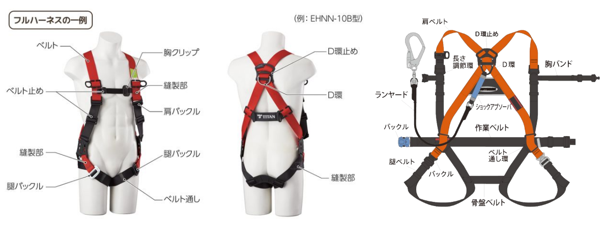

- **ベルト部**  
  身体に装着し、墜落時の荷重を支える部分

- **バックル**  
  ベルトを固定し、適切な装着状態を保持する部品

- **D環**  
  ランヤードや安全ブロックを接続する金具

- **D環止め**  
  D環を所定の位置に保持する部品

- **ランヤード**  
  フルハーネスと取り付け設備を接続し、  墜落時にはショックアブソーバーにより衝撃を緩和する

---

## 各種フルハーネスの形状

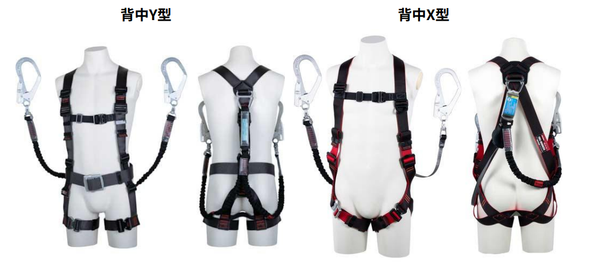

フルハーネスには、D環の位置やベルトの構成により、背中Y型、背中X型がありますが、これらは外観や装着感に違いはありますが、**安全性能そのものに差はない** とされています。

---

## 2. ランヤードの種類及び構造

「ランヤード」とは、  
合成繊維製のロープまたはストラップに、  
**フック・D環・巻取器・ショックアブソーバ・伸縮調節器**などの部品を取り付けた、  
**墜落制止用器具における「命綱部分」**です。

作業者が墜落した際、  
ランヤードはフルハーネスと取付設備をつなぎ、  
**墜落距離を制御し、衝撃を低減する役割**を担います。

そのため、  
作業床の高さ、取付位置、作業内容などに応じて、  
**適切な種類のランヤードを選定することが重要**です。

---

### ランヤードの種類

ランヤードには、主に次の3種類があります。

- ロープ式  
- ストラップ式  
- ストラップ（帯ロープ）巻取式  

以下、それぞれの構造と特徴を説明します。

#### ■ ロープ式ランヤード

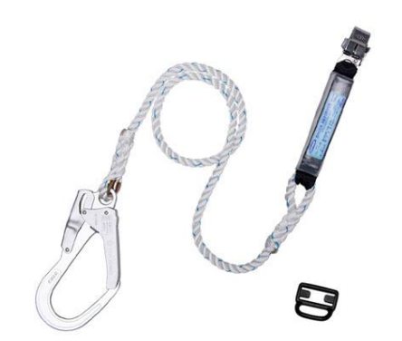

ロープ式は、**直径10～16mmのナイロンロープ**を使用したランヤードです。
一般高所用安全帯では以下のいずれかが用いられ、**柱上用安全帯では主に直径16mmの3ツ打ロープ**が採用されています。

- 3ツ打ロープ  
- 8ツ打ロープ  

#### 特徴
- 摩耗や劣化の状態を目視で確認しやすい  
- 耐久性が高く、強度の変化が比較的緩やか  
- 巻取り機構がないため、長さ調整の自由度は低い  

#### ■ ストラップ式ランヤード

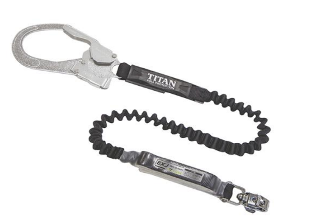

ストラップ式は、**ナイロン製の織機ベルト**を使用したランヤードです。
現在では、一般高所用安全帯においてロープ式に代わって多く使用されています。

#### 特徴
- 柔らかく、取り回しがしやすい  
- 作業中の引っ掛かりが少ない  
- 8ツ打ロープと同様にソフトな使用感がある  
- **摩耗や紫外線による強度低下が比較的早いため、こまめな点検と早期交換が必要**

#### ■ ストラップ（帯ロープ）巻取式ランヤード

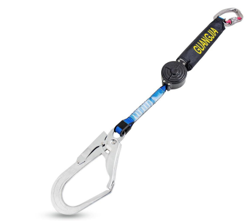

ストラップ（帯ロープ）巻取式は、**巻取式安全帯専用のストラップランヤード**です。
芯糸に高強度アラミド繊維を使用し、その外側をポリエステル繊維で被覆した構造となっており、**薄型で初期強度が高く、巻取り収納に適した細幅ベルト**です。

#### 特徴
- 巻取り機構により、余長が自動的に調整される  
- 作業時の足元の引っ掛かりが少ない  
- 初期強度が高く、作業性に優れる  

ただし、アラミド繊維は **紫外線暴露や屈曲の繰り返しにより、強度が比較的早いペースで低下**します。
そのため、ストラップ表面の摩耗や傷、劣化状態を重点的に確認し、**損傷が認められる場合は早期に新しい巻取式ランヤードへ交換**してください。

---

###  コネクタ

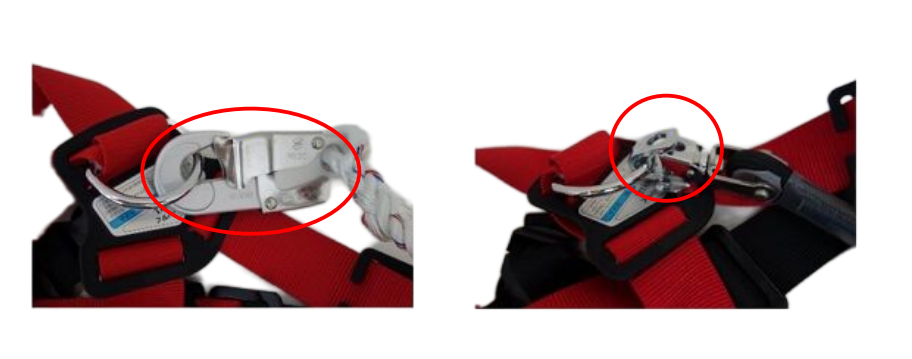

コネクタとは、**フルハーネス・胴ベルト・ランヤードなどを相互に接続するための金具**です。作業中および墜落時には、ランヤードから伝わる荷重が直接かかる重要な部品です。

コネクタには、  
フック、カラビナ、専用連結金具などがあり、用途や接続先に応じて適切な形状のものが使用されます。

#### 特徴
- ランヤードとD環・親綱などを確実に接続できる  
- 着脱が容易で、作業中の掛け替えが可能  
- ロック機構により、使用中の外れを防止する構造  

---

###  フック

フックは、**コネクタの一種であり、ランヤードを構成する重要な部品の一つ**です。  
ランヤードを、取り付け設備や胴ベルト、またはフルハーネスに接続された **D環などの環状部** に掛けるための**環状の金属製器具**を指します。

#### 構造
フックは、主に次の部位で構成されています。

- **片開環**  
  フックの開閉部。押し開くことで環に掛け、手を離すと閉じる構造。

- **補助環**  
  フック本体とランヤードを接続する部分。

- **基孔径**  
  補助環部分の穴径。ランヤードや金具との接続寸法に関係する。

- **全長**  
  フック全体の長さ。使用環境や接続対象に応じてサイズが選定される。

#### 特徴
- 取り付け設備やD環に素早く掛け替えができる  
- 片手操作が可能な構造のものが多い  
- 作業中の外れを防ぐため、一定のばね力で閉じる構造  

---

#### ショックアブソーバ

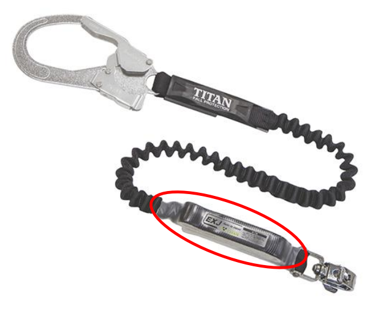

ショックアブソーバは**墜落を制止する際に発生する衝撃を緩和するための器具**です。  
ランヤードに組み込まれており、墜落時に内部の縫製部などが段階的に裂けることで作業者の身体にかかる衝撃荷重を低減します。

#### 種類と性能要件

ショックアブソーバには、自由落下距離と制止時の最大衝撃荷重に応じた区分があります。

#### ■ 第一種ショックアブソーバ
- **自由落下距離：1.8m以下**
- **墜落制止時の衝撃荷重：4.0kN以下**

#### ■ 第二種ショックアブソーバ
- **自由落下距離：4.0m以下**
- **墜落制止時の衝撃荷重：6.0kN以下**

:::tip 補足
※ 1kN（キロニュートン）は約102kgfに相当します。  
そのため、4.0kNは約400kgf、6.0kNは約600kgfの力に相当します。  
法令・規格により、作業条件に応じた種別のショックアブソーバを選定する必要があります。
:::

#### 透明カバーについての注意

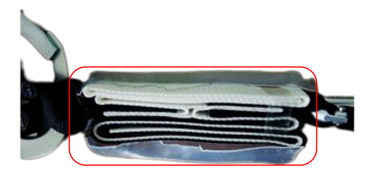

**ショックアブソーバの透明カバーは切断禁止です。**  
この透明カバーは、内部の縫製状態を確認し、使用前点検を行うために設けられています。  
そのため、カバーを切断した時点で使用不可となり、切断後は未使用であっても廃棄対象となります。

※実際に**透明カバーを切断したことで、未使用のフルハーネス一式が使用不能になった事例** もあります。

---

## 3. フルハーネスの装着方法

### 1. 作業内容に応じた器具の選定
フルハーネス型墜落制止用器具にはさまざまな種類があるため、作業内容や作業環境に応じて、適切なタイプの器具を選定します。

### 2. 体重などに応じた器具の選定
墜落制止用器具には、使用可能な最大質量（**85kg または 100kg（特注品を除く）**）が定められています。  
そのため、**使用者の体重と装備品を含めた合計質量が、使用可能な最大質量を超えないよう**に器具を選定する必要があります。

また、サイズの基準や装着時の各ベルトの伸縮箇所・調整方法はメーカーによって異なる場合があるため、  
使用者の体格に合ったものを選定することが重要です。

#### 適用サイズ表
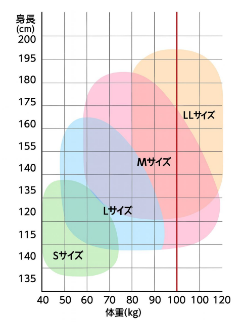

---

### 3. 墜落制止用器具の装着

#### （1）事前確認
取扱説明書を確認し、安全上必要な部品がすべて揃っているかを確認します。

#### （2）フルハーネス型の装着
フルハーネス型については、墜落制止時にハーネスがずり上がり、安全な姿勢が保持できなくなることのないよう、**緩みのない状態で確実に装着**します。
また、胸ベルトなど安全上必要な部品を取り外して使用してはいけません。

#### （3）胴ベルト型の装着（使用が認められる場合）
胴ベルト型については、できるだけ腰骨に近い位置で、墜落制止時に足部方向へ抜けない位置に装着し、かつ胸部へずれ上がらないよう確実に装着します。

#### （4）バックルの確認
バックルは正しく使用し、ベルトの端部はベルト通しに確実に通します。 
誤った装着を防ぐため、ワンタッチバックルなど誤装着が起こりにくい構造のものを使用することが望ましいです。
フルハーネス型の場合、通常2か所以上のバックルがありますが、それぞれの組み合わせを誤らないよう注意して装着します。

#### （5）ワークポジショニング用器具の確認
ワークポジショニング用器具は、伸縮調節器を環に正しく掛け外れ止め装置の動作を確認するとともに、  ベルトの端部や作業服が巻き込まれていないことを目視で確認します。

#### （6）誤使用防止
ワークポジショニング作業の際、フック等を誤って環以外の部分に掛けてしまうことを防ぐため、環またはその付近のベルトには、フックを掛けられる形状の器具を取り付けないようにします。

#### （7）装着後の点検　　
装着後は地上において、それぞれの使用条件の状態で体重をかけ各部に異常がないかを確認します。

#### （8）使用しないときの処置
装着後、墜落制止用器具を使用しないときはフック等を環に掛ける、または収納袋に収めるなどしてランヤードが垂れ下がらないようにします。
ワークポジショニング用器具のロープについても肩に掛ける、またはフックを環に掛け伸縮調節器によりロープの長さを調整し垂れ下がらないようにします。

---

## フルハーネスの装着手順（例）

### 01
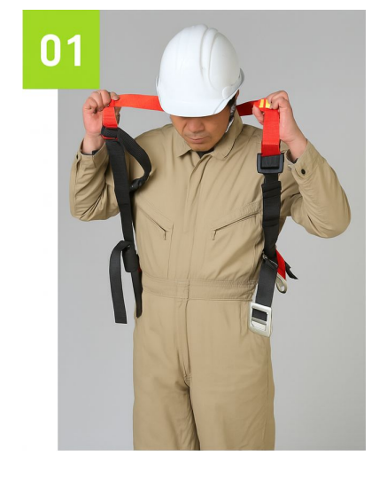

肩ベルトに両腕を通します。

---

### 02
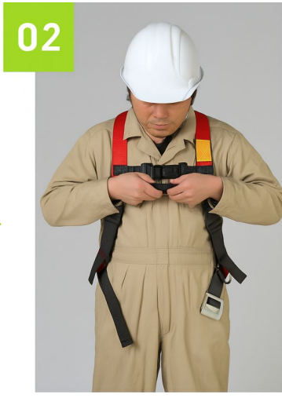

胸ベルトの差し込みバックルを留め、仮の長さに調整します。

---

### 03
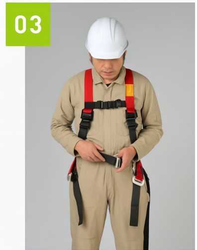

胴ベルトをバックルに通し、身体に密着する位置で長さを調整します。

---

### 04
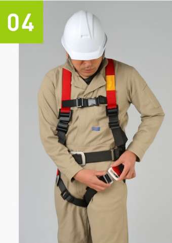

左右の腿ベルトのバックルを留め、それぞれ長さを調整します。

---

### 05
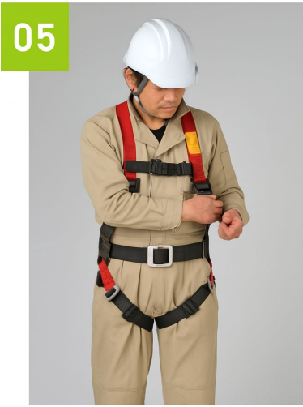

左右の肩ベルトの長さを調整します。

---

### 06
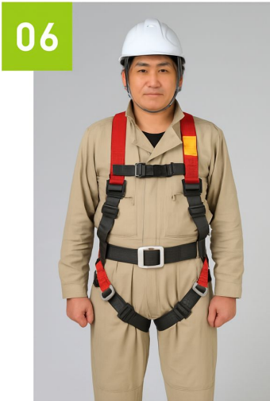

全体のフィット感を再度確認し、装着完了です。

---

## ４. ランヤードの選定

### ショックアブソーバの選定

ランヤードに備えられるショックアブソーバは、  **作業時にフックを掛ける高さ**や**作業内容**に応じて、第一種または第二種を適切に選定する必要があります。

---

#### ■ 第一種ショックアブソーバを選定する場合

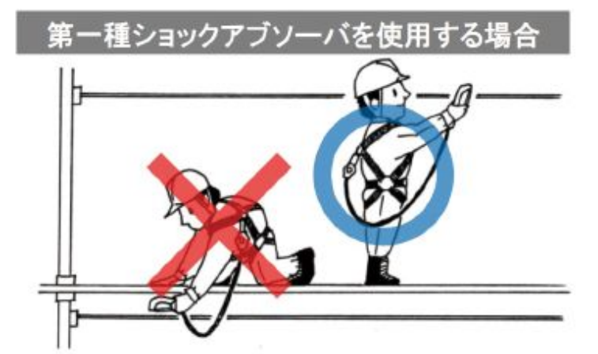

腰の高さ以上にフック等を掛けて作業を行うことが可能な場合は、**第一種ショックアブソーバ**を選定します。
第一種ショックアブソーバは、自由落下距離が比較的短くなる作業条件を前提としており、腰以上の位置で確実にフックを掛けて作業する場合に適しています。

---

#### ■ 第二種ショックアブソーバを選定する場合

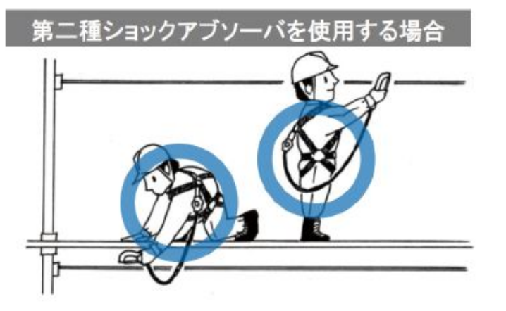

鉄骨組立作業などにおいて、**足元にフック等を掛けて作業を行う必要がある場合**は、フルハーネス型を選定するとともに、**第二種ショックアブソーバ**を選定します。

また、腰以上にフックを掛ける作業と足元にフックを掛ける作業を**混在して行う場合**も同様に第二種ショックアブソーバを選定します。第二種ショックアブソーバは **6kN規格**であり胴ベルト型には適さないため**フルハーネス型と組み合わせて使用することが前提**となります。

---

### 体重等に応じた器具の選定

墜落制止用器具には、**使用可能な最大質量**が定められています。  
一般的には **85kg または 100kg（特注品を除く）** が上限となっており、器具を使用する際は、**使用者本人の体重と装備品の合計質量**が、この使用可能な最大質量を超えないように器具を選定する必要があります。

使用可能な最大質量は、ショックアブソーバ本体の表示ラベルに明記されています。  
作業前には必ずラベルを確認し、使用条件に適合しているかを確認してください。

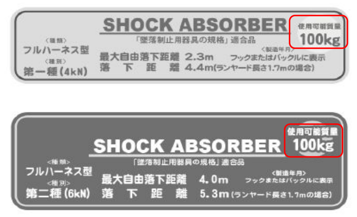

なお、ヘルメットや工具、腰道具などの装備品も質量に含まれます。  
見た目では判断せず、**装備を含めた合計質量**で確認することが重要です。

---

## 5. 作業場所の高さや作業内容に応じた器具の選定

作業場所の高さや作業内容によって、適切なランヤードの種類や使用方法は異なります。  
作業前には、想定される作業条件を整理したうえで、最適な器具を選定する必要があります。

### ランヤードに表示された標準的な条件での落下距離を確認する
ランヤードには、標準的な使用条件における落下距離が示されています。  
主に作業を行う場所の**高さや足元状況**を踏まえ、落下距離に余裕があるかを確認します。

### ロック機構付き巻取式ランヤードの使用
ロック機構付き巻取式ランヤードは、通常のランヤードと比較して**落下距離が短く抑えられる特性**があります。そのため、主に作業を行う場所の高さが比較的低い場合に使用が推奨されます。

### 移動時のフックの掛替え対策
移動時のフック掛替え時の**墜落リスクを低減**するため、二つのフックを交互に使用する「二丁掛け（ダブルランヤード）」を用いる方法があります。

### フルハーネス型での二丁掛け作業
フルハーネス型で二丁掛け作業を行う場合は、**二本の墜落制止用ランヤード**を使用します。

※ 二丁掛け用（ダブルランヤード）のショックアブソーバは、フックの掛け方によっては**機能しない恐れ**があるため、使用方法には十分注意が必要です。（次ページ参照）

---

### ランヤードの取付け例（正しい例）

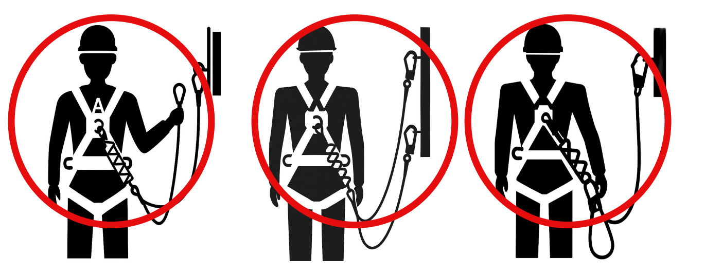

上図は、ショックアブソーバが**正しく機能する**取付け例です。  
いずれも、ショックアブソーバが確実に展開できる構成となっています。

---

### ランヤードの取付け例（誤った例）

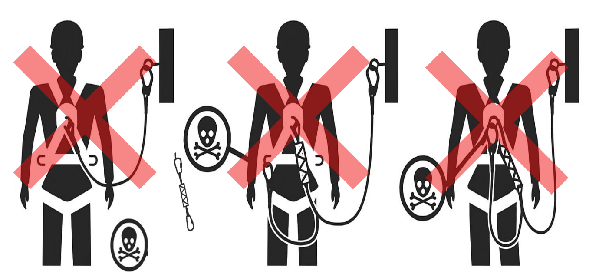

上図のように、誤った使い方をすると**本来の衝撃吸収性能が発揮されません**。
 

 ## 6. 落下制止用器具の取付け設備

### 取付け設備の基本要件
ランヤードが外れたり、抜けたりするおそれがなく、墜落制止時の衝撃に対して十分に耐え得る堅固な構造であることが必要です。  
取付け設備の強度が判断できない場合には、フック等を取り付けてはなりません。

作業の都合上、やむを得ず強度が不明な取付け設備にフック等を取り付けなければならない場合には、フック等をできる限り高い位置に取り付けるなどし、取付け設備が有する強度の範囲内に墜落制止時の衝撃荷重を抑える処置を講じます。

### 鋭利部への対策
落下制止用器具の取付け設備の近傍に鋭い角がある場合には、ランヤードのロープ等が直接鋭い角に当たらないよう、養生等の処置を講じます。

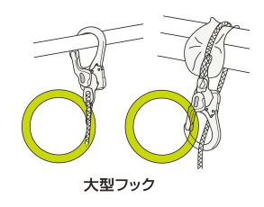

---

## 7. 落下制止用器具の使用方法

### フックの取付け位置
フックは、墜落時の衝撃を抑えるため、**腰より上の高い位置**に取り付けます。  
また、フックを掛ける対象物は、墜落阻止時の衝撃に十分耐えうる強度を有するものを選定してください。

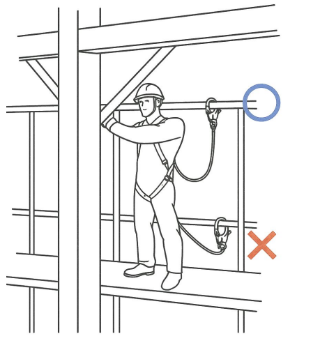

### フックの向き
フックは、**まっすぐ下向き**になるように取り付けます。

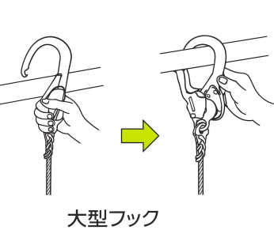

### 造物への取付け時の注意
垂直構造物や斜材等に取り付ける場合は、墜落制止時にランヤードがずれたり、こすれたりしないようにします。

### 振子状態の防止
落下制止用器具は、可能な限り、墜落した場合に振子状態となって物体に激突しない位置に取り付けます。

### 補助ロープの取扱い
補助ロープは移動時の掛替え用として使用するものであり、作業時には使用しないようにします。

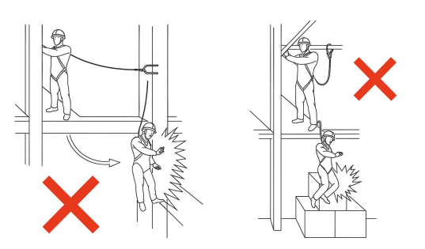
---

## 8. フック等の使用方法

フック等は、ランヤードのロープ等の取付け部やかぎ部の中心に掛かる引張荷重で性能が規定された器具です。  
曲げ荷重や、外れ止め装置への外力に対して大きな荷重に耐えられる構造ではないことを理解したうえで使用します。

回し掛けは、フック等に横方向の曲げ荷重を与えたり、取付け設備の鋭角部での応力集中により破断するおそれがあるため、できる限り避けます。  
やむを得ず回し掛けを行う場合は、これらの問題点を十分理解し、回避できるよう注意して使用します。

ランヤードのロープ等がねじれた状態でフック等の外れ止め装置に絡むと、外れ止め装置が変形・破断し、外れるおそれがあるため注意が必要です。

また、ランヤードのフック取付け部付近にショックアブソーバがある形状のものは、回し掛けによってショックアブソーバが機能しなくなるおそれがあるため、回し掛けを行ってはなりません。

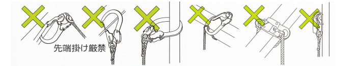

---

## 9. 垂直親綱への取付け

垂直親綱に落下制止用器具のフック等を取り付ける場合は、親綱に設けられた取付け設備にフック等を掛けて使用します。一本の垂直親綱を使用する作業者数は、**原則として一人**とします。

垂直親綱に取り付けた取付け設備の位置は、ランヤードとフルハーネス等を結合する環の位置より下にならないようにして使用します。

落下制止用器具は、可能な限り、墜落した場合に振子状態となって物体に激突しない位置に取り付けます。

長い合成繊維ロープの垂直親綱の下端付近で使用する場合は、墜落制止時に親綱の伸びが大きくなるため、下方の障害物に接触しないよう十分注意します。

---

## 10. 水平親綱への取付け

水平親綱は、墜落制止用器具を取り付ける構造物が近くにない場合や、作業工程上横方向への移動が多い場合に使用します。ランヤードとフルハーネスを結合する環よりも高い位置に水平親綱を設置し、そこへフック等を掛けて使用します。

作業場所の構造上、低い位置に親綱を設置する必要がある場合は、短いランヤードやロック機能付き巻取り式ランヤードを使用するなど、落下距離を小さくする措置を講じます。

水平親綱を使用する作業者は、**原則として1スパンにつき1人**とします。

---

###  二丁掛けに関する注意

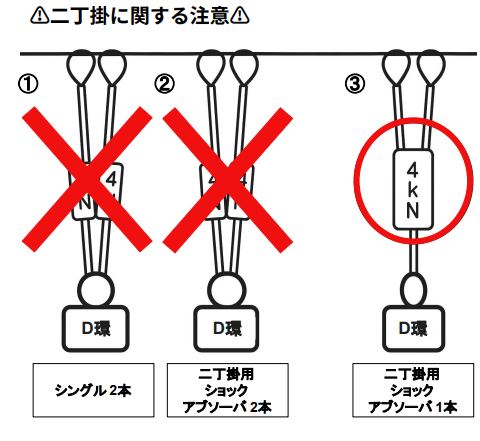

図の①・②のような二丁掛け方法では、落下時にショックアブソーバーが十分に機能せず、**一つあたりの上限値（4kN）の約2倍にあたる約8kNの衝撃荷重がかかる**可能性があるという実験報告があります。

#### ■ 理由
ショックアブソーバーは、一定以上の力が加わることで作動する仕組みです。  
しかし、2本が独立したタイプ（①・②）の場合、それぞれのコードに力が分散されてしまい、落下してもショックアブソーバーが作動するために必要な力が加わらない恐れがあります。

**2本同時に掛けて作業してよいのは③のタイプのみです。**

※①・②のタイプでも、**作業時は1本掛けで使用し、移動時のみ掛け替えのためにもう1本を使う**方法であれば問題ありません。

---

## 11. その他の注意事項

### ①ワークポジショニング作業用ロープ以外でのU字つり厳禁

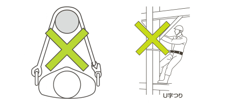

一般的なランヤードは、ロープ式・ストラップ式を問わず**U字つり用途として使用することは想定されていません。**

U字つりは身体を支えて姿勢を保持する目的で使用されるため、垂直方向への強度や耐久性が求められます。しかし、通常のランヤードは**墜落制止を目的として設計された器具**であり、長時間の体重支持には適していません。

誤った使用は器具の破損や重大な事故につながる恐れがあるため、**身体を預ける用途では必ずワークポジショニング作業用ロープを使用してください。**

### ②墜落制止用器具のランヤード・フックを掛け下げず、引っ掛かりを防止する

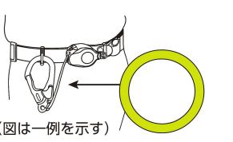

狭い通路などを歩行している際、ランヤードやフックが構造物や足場材に引っ掛かると、思わぬ転倒やバランスの崩れにつながります。

使用しないときは、ロープやストラップ、フックを**収納袋や装備の中に収める、もしくは身体に密着させて携行**し、周囲に突出しない状態を保ちましょう。

---

### ③ロック機能付きストラップ巻取り式ランヤードによる急な危険

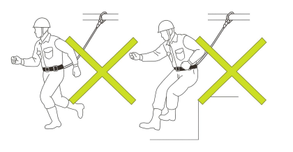

ロック機能付きのストラップ巻取り式ランヤードは、**自動車のシートベルトと同様に急激な動きでロックが作動する構造**になっています。

そのため、走る・飛び降りるなどの急な動作を行うと、不意にロックがかかり身体の動きを拘束される可能性があります。これにより姿勢を崩し、転倒や墜落のリスクが高まります。

---

### ④火気や熱源などに触れさせない

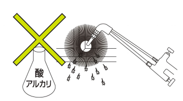

ロープ・ストラップ・ベルトの多くはナイロンなどの**合成繊維で作られており、熱や化学物質に弱い特性**があります。

火気・高熱・溶接の火花に触れると繊維が溶けたり強度が低下し、外観に異常がなくても本来の性能を発揮できなくなる恐れがあります。また、酸・アルカリなどの化学薬品も劣化の原因となります。

特に溶接作業の周辺では、**スパッタ（溶接時に飛散する金属粒）による損傷**を防ぐため、器具を保護する措置を講じてください。

---

## 12. 点検・保守・保管

墜落制止用器具の性能を維持し、安全に使用し続けるためには、**適切な点検・保守・保管の実施が不可欠**です。  
これらは責任者を定めて確実に行い、管理台帳などに結果を記録しておきましょう。

### ①点検

点検は、**日常点検のほかに定期的な詳細点検を実施すること**が原則です。  
定期点検は、メーカーの基準に従った点検基準に基づいて行い、**間隔は半年以内**を目安とします。

また、取扱説明書に記載されている安全上必要な部品がすべて揃っているかも必ず確認してください。

#### ■ 主な点検項目
- ベルトの摩耗、傷、ねじれ、塗料や薬品による変色・硬化・溶解  
- 縫製部の摩耗、切断、ほつれ  
- 金具類の摩耗、変形、錆、腐食、樹脂コーティングの劣化、電気ショートによる溶融  
- 回転部や摺動部の状態、リベットやバネの異常の有無  
- ランヤードの摩耗、素線切れ、熱・薬品による損傷、キンク（より戻り）による変形、ショックアブソーバーの状態  
- 巻取り式ストラップの巻込み・引き出しの状態、およびロック機能の作動状況  

部品の使用限界は、材質・構造・使用条件によって異なります。損傷の程度に応じて適切に判断してください。

特に次の箇所は劣化しやすいため、入念に確認することが重要です。

- ランヤードのロープは摩耗が進みやすいため、**1年以上使用している場合は短い間隔で目視点検**を行う  
- ワークポジショニング用ロープは電柱などとの接触で摩耗しやすく、**こまめな日常点検が必要**  
- フック周辺は損傷しやすいため重点的に確認する  
- 工具ホルダー装着時は、ホルダーに隠れる部分のベルト摩耗も確認する  

---

### ②保守

保守は、定期的かつ必要に応じて実施します。  
なお、メーカーが組み合わせて販売している製品を**分解して他社製品と組み合わせることは禁止**されています。これは設計外の使用となり、安全性が保証されないためです。

#### ■ 清掃・手入れの基本
- ベルトやランヤードのロープに汚れが付着した場合は、ぬるま湯または中性洗剤で洗浄し、十分にすすいだ後、**直射日光を避けて風通しのよい場所で自然乾燥**させる  
  ※ショックアブソーバーは水に浸さないよう注意する  
- ベルトやロープに塗料が付着した場合は、無理に溶剤で除去しない  
- 金具が水に濡れた場合は乾いた布で拭き取り、防錆のため薄く油を塗布する  

#### ■ 部品交換と機能確認
- 回転部や摺動部には定期的に注油し、砂や泥は事前に除去する  
- ランヤードのロープは部品の中でも寿命が短いため、摩耗が確認された場合はロープまたはランヤード全体を交換する  
- 交換は**必ず製造者が推奨する方法**で実施する  
- 巻取り器は、ロープの巻込み・引き出し・ロック機能を確認し、外装の破損や取付ネジの緩み、金属部の著しい摩耗や腐食がないか点検する  

---

### ③保管

墜落制止用器具は、次の条件を満たす場所に保管してください。

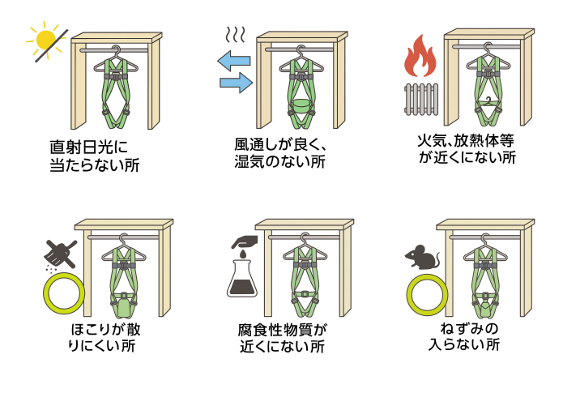

不適切な環境での保管は、素材の劣化や金属部の腐食を招き、器具の性能低下につながります。使用しない期間であっても、適切な環境管理を徹底しましょう。

---

## 13. 廃棄基準

墜落制止用器具は使用者の命を守る重要な保護具です。  
異常や損傷が認められる器具を使い続けることは重大な事故につながるため、**廃棄基準を明確に理解し、該当する場合は直ちに使用を中止してください。**

### ■ 廃棄の基本基準
1. **一度でも落下時の衝撃が加わったものは使用してはいけません。**  
   外観に異常が見られなくても、内部構造が損傷している可能性があります。

2. 点検の結果、異常が確認されたもの、または摩耗・傷などの劣化が著しいものは使用してはいけません。

---

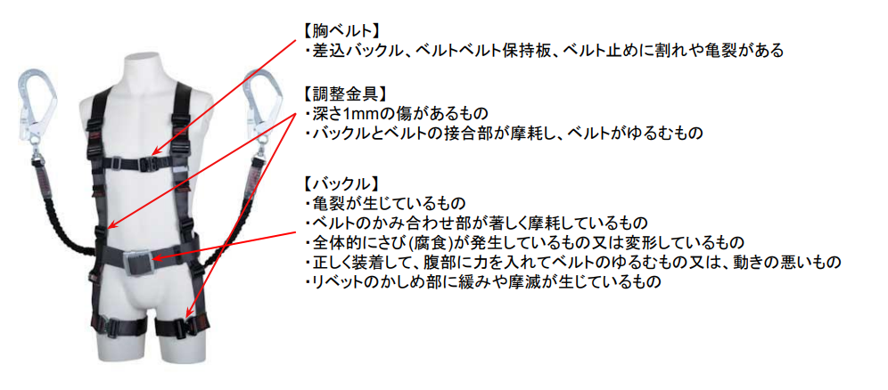

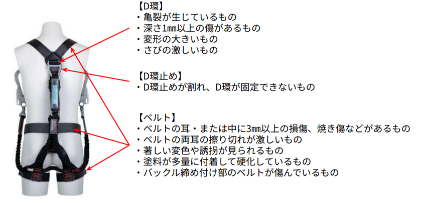

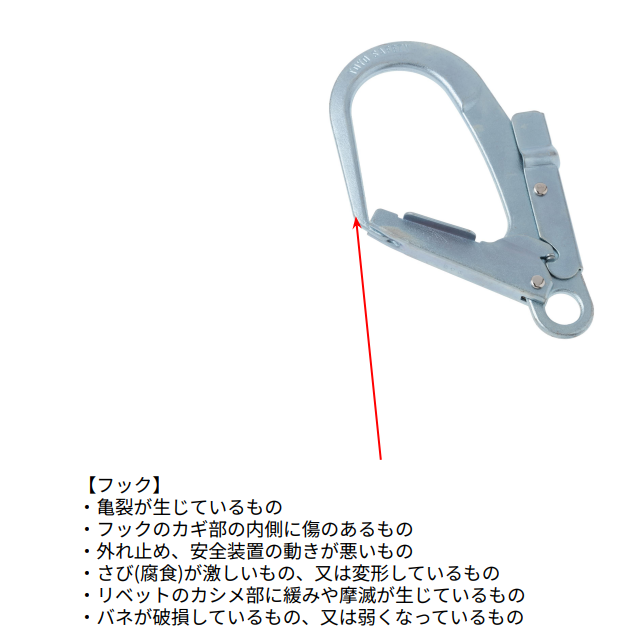

## 14. 昇降・通行時等の措置、周辺機器の使用

作業現場における昇降や通行時は、状況に応じて適切な保護具や設備を使用し、安全を確保することが重要です。ここでは、墜落制止用器具の考え方と周辺機器の取り扱いについて解説します。

### ① 作業と昇降・通行は異なる概念

墜落制止用器具は**作業時に使用が義務付けられる保護具**であり、作業と通行・昇降（昇降設備の健全性を確認しながら移動する場合を含む）は基本的に異なる概念として扱われます。

一方で、はしごなどフックを掛ける場所がない環境では、墜落制止用器具の使用が著しく困難となる場合があります。そのような場合は、**保護帽の着用など代替措置を講じる必要があります。**

### ② 垂直親綱・安全ブロック・垂直レール使用時の考え方

垂直親綱、安全ブロック、または垂直レールを用いて昇降する場合、**墜落制止機能そのものは求められません。**

ISO規格でも示されているように、これらの設備に子綱やスライド式墜落制止用器具を介してフルハーネスの胸部等に設けたコネクタへ直結し、適切な落下試験などによって安全性が確認されている場合は、**当該子綱およびスライド式器具はフルハーネス型のランヤードとして扱われます。**

つまり、設備と器具が一体として安全性を確保する構造になっていることが重要です。

### ③ 移動ロープの位置付け

送電線用鉄塔などの建設工事で使用される移動ロープは、**ランヤードではなく親綱として位置付けられます。**

ただし、移動ロープとフルハーネス型をキーロック方式安全器具などで直結し、さらに移動ロープにショックアブソーバーが設けられている場合には、**当該安全器具はフルハーネス型のランヤードに該当します。**

このとき、移動ロープに備えられたショックアブソーバーは、**第二種ショックアブソーバーに準じた機能**を有するものとされます。

--