# 第3章　労働災害の防止に関する知識

## 1. 労働災害発生状況

労働災害の発生件数は長期的に見ると減少傾向にありますが、**死亡者数についてはここ10年ほど高止まりし、微増傾向**にあります。

令和4年の労働災害による死傷者数は**132,355人**、死亡者数は**774人**にのぼっており、依然として多くの災害が発生している状況です。

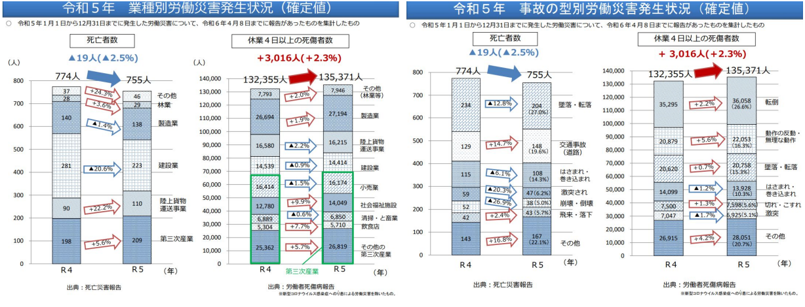

#### ■ 業種別の傾向
業種別に見ると、建設業や製造業、陸上貨物運送事業などで多くの労働災害が発生しています。  
また、第三次産業においても災害件数は増加しており、**業種を問わず安全対策の重要性が高まっている**ことが分かります。

#### ■ 事故の型別の傾向
事故の型別では、**転倒・墜落転落・はさまれ巻き込まれ・動作の反動**などが主な原因となっています。  
これらは日常的な作業の中で発生しやすく、基本的な安全対策の徹底によって防止できるケースも少なくありません。

---

###  ①墜落・転落災害の現状

墜落・転落災害については、足場関連の規則改正などにより防止対策が進められています。  
また、高さ2m以上の箇所での墜落制止用器具の使用も定着してきました。

しかし、**使用する器具や装着方法が適切でない場合**、墜落時の衝撃によって内臓破裂や脊椎損傷などが発生し、死亡や重大な後遺症につながる災害も多く報告されています。

これが、**フルハーネス型墜落制止用器具の使用が推奨される主な理由**です。

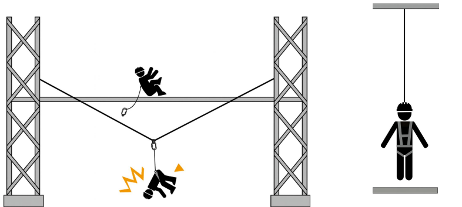

---

### ②災害分析の結果から

一般に、多くの労働災害の直接原因は  
**「不安全行動」と「不安全状態」** にあると分析されています。

例えば、ビルの事務所内を歩いている場合、床があるため通常は下に落下することはありません。これは「不安全状態」が存在しないためです。

では、同じ高さでも建設中のフロアだった場合はどうでしょうか。

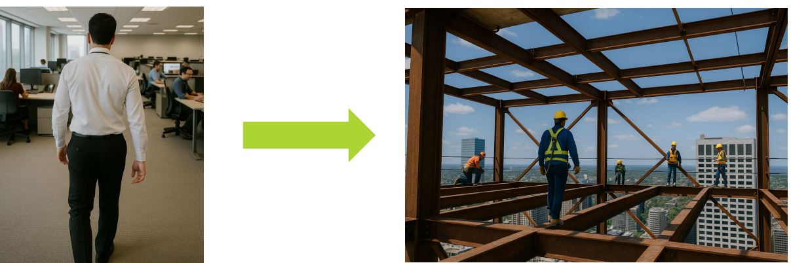

鉄骨上で作業する際には、二丁掛け式（ダブルランヤード式）の使用や安全ネットの設置など、墜落を防止するためのルールが定められています。  
これは明確な墜落リスクという「不安全状態」が存在するためです。

このような環境で、墜落制止用器具やヘルメットを装着しない、フックを掛けずに移動するなどの行為は、**不安全行動**に該当します。

> **「不安全状態」と「不安全行動」が同時に存在すると、事故や災害は発生しやすくなります。**  
> 逆に、どちらか一方でも減らすことができれば、災害リスクは大きく低減できます。

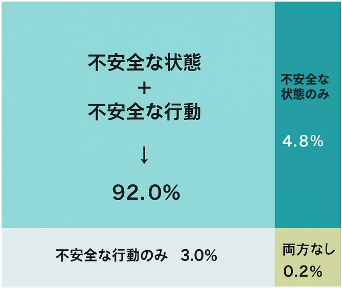

:::tip 
安全化とは、現場に存在する「不安全な状態」や「不安全な行動」を具体的に減らしていくことを意味します。
:::

---

### ③人間の判断が災害を引き起こす

災害分析では「不安全状態」と「不安全行動」が重要な要素とされていますが、特に建設現場では不安全状態を完全に排除することは容易ではありません。  
工程上の制約や作業特性、さらに季節や天候などの外的要因にも影響されるためです。

そこで注目すべきもう一つの要因が、**人の判断と行動**です。

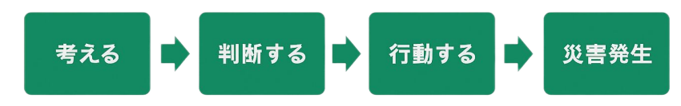

人は「自分は大丈夫」と判断し、近道や効率を優先した行動を取ることで、労働災害の発生確率を高めてしまうことがあります。

一般的に「不安全行動」が災害の原因とされますが、その前段階には必ず**誤った判断**が存在します。

- 法律や規則を守らない  
- 事業所のルールを守らない  
- 自分勝手な解釈をする  

これらを許す意識がある限り、労働災害は発生し続けます。

悪気のない「うっかり」「ぼんやり」「勘違い」といった人間らしさも災害の要因となりますが、全体に占める割合はそれほど大きくないと考えられています。

むしろ、

- 作業開始前点検を「面倒」「大丈夫」として実施しない  
- 巡視時の点検を形だけで終わらせる  

といった行動が、不安全状態を見逃す原因になります。結果として、不安全状態の多くも人間が引き起こしていると言えるでしょう。

管理が不十分な場合、「不安全行動」と「不安全状態」はさらに発生しやすくなります。  
しかし、その管理も最終的には人の思考・判断・行動に依存しています。
「めんどくさい」「自分は大丈夫」この意識を捨てることができれば、多くの労働災害を防ぐことができます。

---

## 2. 労働安全衛生法令の遵守等

高所作業における墜落・転落災害や落下物による事故を防止するため、労働安全衛生法令では事業者に対して必要な措置を講じることを義務付けています。現場では法令の内容を正しく理解し、確実に実行することが重要です。

### ① 高所作業における墜落防止措置

労働安全衛生規則では、**高さが2m以上で墜落のおそれがある箇所**において、次のような措置を講じることが示されています。

- 足場を組み立てる  
- 手すり等（開口部や足場の端部など）を設置する  

これらの対策が困難な場合は、

> **防網を設置し、要求性能を満たす墜落制止用器具を使用させるなど、墜落による危険を防止するための措置を講じなければなりません。**

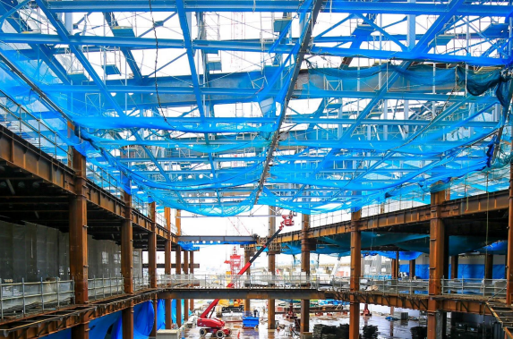

### ② 足場施工に関する指針

足場（足場機能を有する支保工を含む）の施工は、以下の指針に基づいて行われます。

- 「足場からの墜落・転落災害防止総合対策推進要綱（厚生労働省）」  
- 「手すり先行工法等に関するガイドライン（厚生労働省）」  

また、墜落制止用器具の使用や**近道行動の禁止**など、高所作業に関する安全教育を繰り返し実施し、工事関係者全員の安全意識向上を図る必要があります。

さらに、**足場など仮設物の点検を強化**するとともに、墜落制止用器具の使用状況を確認するなど、管理監督を徹底します。

> ※点検には「元請け点検」と「使用者点検」の2種類があります。

低所からの墜落であっても重大災害につながることがあるため、はしごや脚立の安全な取り扱いと作業開始前点検を確実に行いましょう。

---

## 3. 落下物による危険防止のための措置

### ① 飛来物への対策（安衛則538条）

労働安全衛生規則では、作業によって物体が飛来し労働者に危険を及ぼすおそれがある場合、

> **飛来防止設備を設け、保護具を使用させるなど、危険防止のための措置を講じなければならない**  
と定められています。

#### 主な設備例
- 飛散防止シート  
- 落下物防止ネット（防網）

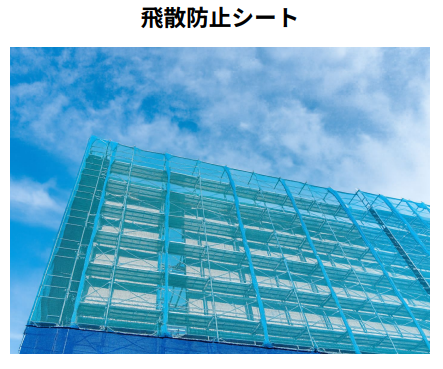    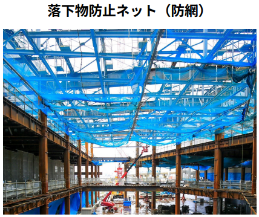

### ② 落下物への対策（安衛則537条）

事業者は、物体の落下による危険がある場合、**防網の設置や立入区域の設定**などの措置を講じなければなりません。

#### 主な設備例
- 垂直ネット  
- 朝顔（あさがお）

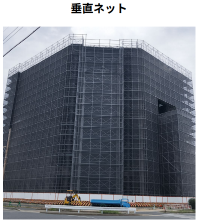 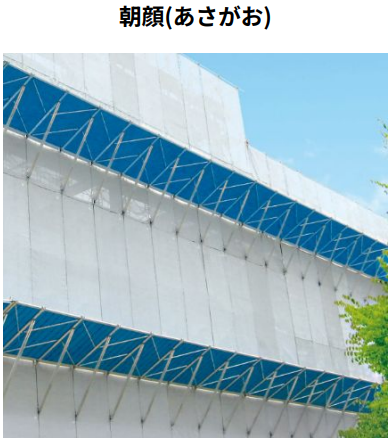

### ③ 足場からの落下防止措置

足場からの落下防止には、**垂直ネットの設置または高さ10cm以上の巾木の取り付け**が義務付けられています。

落下を完全に防止できない場合は、必要な範囲を立入禁止措置とし、第三者災害の防止を図ります。

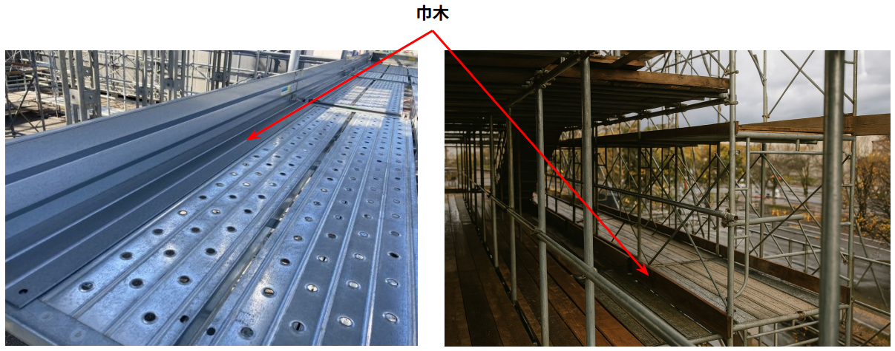

## 4. 労働安全衛生法令の遵守等（電気災害防止）

電気設備や電動工具を使用する現場では、感電災害を防止するための対策が不可欠です。労働安全衛生法令に基づき、適切な設備の設置と安全な作業方法を徹底しましょう。

---

### ① 電動工具の接地（アース）の設置

シングル絶縁の工具・器具は、**必ず接地（アース）を設けて使用します。**
アース線が接続されていない場合、漏電時に人体が電流の通り道となり、感電する危険があります。  
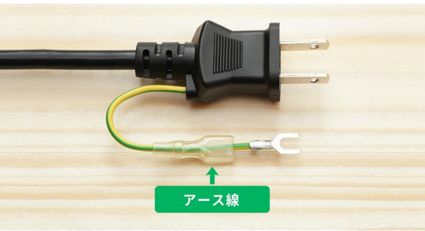

---

### ② 感電防止用漏電遮断器の使用

感電災害を防ぐため、**漏電遮断器（漏電ブレーカー）を使用**します。  
配電盤だけでなく、電工ドラムや延長コードなどにも設置することが望ましいとされています。

漏電遮断器は、異常電流を検知した際に自動的に電源を遮断し、重大事故の発生を防止します。

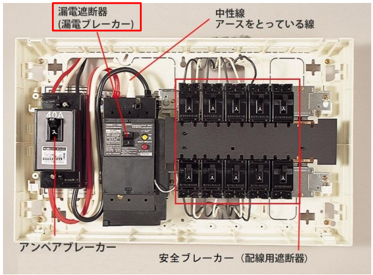
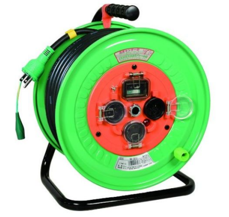

---

### ③ 濡れた手や足で電気機器を扱わない

濡れた手や足（靴）で電気機器を扱うと皮膚の電気抵抗が低下し、感電時の危険性が高まります。

特に感電のおそれがある端子の接続作業などでは、**乾燥した手で作業し、感電防止用の絶縁手袋を使用**してください。

必要に応じて絶縁性の高い保護具を着用し、安全を確保しましょう。

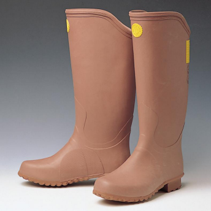

---

### ④ 架空電線付近での作業時の対策

架空電線の近くで作業する場合は、接触事故を防ぐため次の措置を講じます。

- 上空施設の位置を明示する看板の設置  
- 防護カバーの取り付け  
- 高さ制限装置の設置  
- 建設機械の旋回範囲や立入禁止区域の設定  
- 現場への明示および誘導員・監視員の配置  

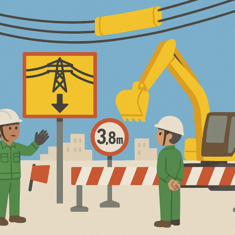

---

### ⑤ 電柱周辺の配電線への注意

一般的な電柱には、上方に**6,600ボルトの高圧線**、下方に**100～200ボルトの低圧線**が設置されています。

柱上作業では、作業姿勢を安定させるための**ワークポジショニング用器具**と、墜落制止用器具の双方を使用します。

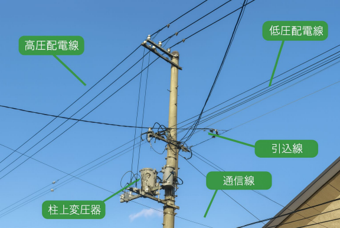

---

### ⑥ 低圧電気特別教育の受講

開閉器（ブレーカー等）の操作といった**軽微な電気作業であっても、「低圧電気特別教育」の受講が必要**です。  
これは電気工事士の有資格者であっても例外ではありません。

電気作業に従事する場合は、必要な資格・教育を事前に確認しましょう。

---

### ⑦ 導電体に囲まれた場所での電気溶接作業

鋼管足場や鉄骨上など、導電体に囲まれた狭い環境で電気溶接作業を行う場合は、感電リスクが高まります。

- 溶接棒の接触防止  
- アース（帰線）クランプの適切な取り付け位置の確認  

などを徹底し、作業者自身だけでなく**周囲の作業者の感電防止にも配慮**してください。

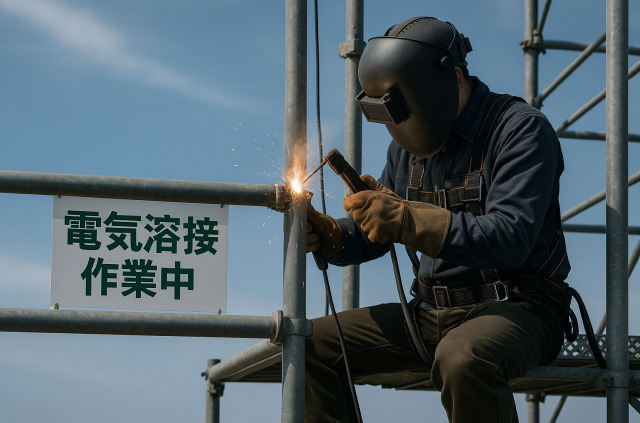

---

## 5. 保護帽の使用方法及び保守点検の方法

保護帽（ヘルメット）は、飛来・落下物や墜落時の衝撃から頭部を守るために必ず着用する保護具です。規格に適合したものを選定し、正しい方法で使用・管理することが重要です。

### ① 構造規格（保護帽の規格）

#### ■第四条
物体の飛来または落下による危険を防止するための保護帽は、**帽体・着装体・あごひも**を備え、次の要件に適合する必要があります。

- 着装体のヘッドバンドは、着用者の頭部に合わせて調整できること  
- 着装体の環ひもは、環の大きさを調整できない構造であること  

#### ■第五条
墜落による危険を防止するための保護帽は、**帽体・衝撃吸収ライナー・あごひも**を備え、帽体外面からリベットなどの突起物が**6mm以上突出していない構造**でなければなりません。

#### ■第九条

保護帽には、見やすい箇所に以下の表示が必要です。

- 製造者名  
- 製造年月日  
- 飛来・落下物用、または墜落時保護用である旨  

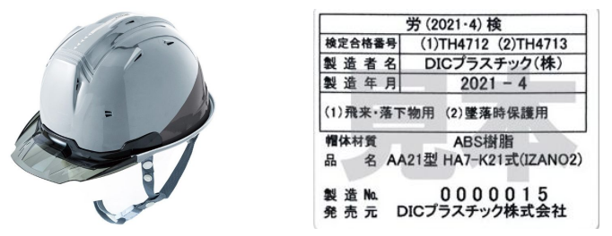

---

### ②使用方法と点検

保護帽の性能を十分に発揮させるため、正しい着用と定期点検を徹底します。

#### 正しい着用方法
- ヘッドバンドは頭の大きさに合わせて確実に調整する  
- 保護帽は**真っ直ぐ深く被り**、後ろへ傾けない  
- あごひもは取扱説明書に従って適切に締める  

---

### ③耐用年数の目安

保護帽は外見に異常がなくても、紫外線や経年劣化により強度が低下します。

- **熱可塑性樹脂製**：異常がなくても **3年以内**  
- **FRP等の熱硬化性樹脂製**：**5年以内**  
- **着装体**：**1年以内の交換を推奨**

#### ■交換の目安
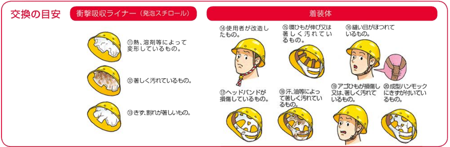

#### ■破棄の目安
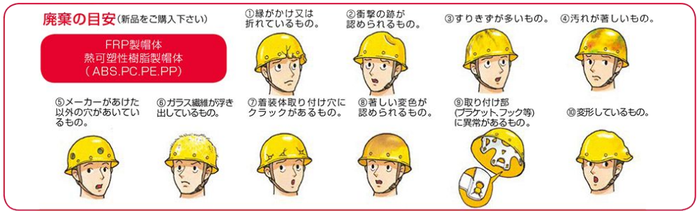

---

### ④事前に対応を決めておく

災害発生時に迅速に行動できるよう、救助方法や連絡体制を事前に整備しておくことが重要です。

1. 災害時に慌てないよう、救出方法など必要な対応をあらかじめ決めておきます。  
   また、一次救命措置や骨折・出血時の応急手当の訓練も定期的に計画・実施してください。

2. 墜落制止用器具を使用している場合は、**宙づり状態となった被災者の救助方法**を想定し、必要な用具を準備しておきます。

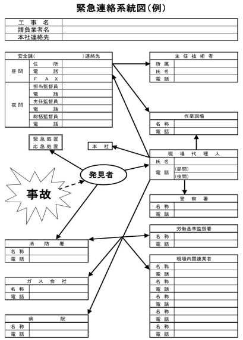

---

### ④事故発生時の留意点

事故が発生した際は、二次災害を防ぎながら冷静に対応することが求められます。

1. 自力で脱出できない場合は直ちに助けを呼び、可能な範囲で装備を外して身体への負担を軽減します。  

2. 被災者の吊り上げ・吊り下げには相当の人数が必要です。不確実と判断した場合は、**救助を試みる前に消防へ連絡**してください。  

3. 意識を失わせないためには、ロープ（トラロープ・スリング・親綱など）を活用し、足で踏ん張って身体を支えられる状態にすることが効果的です。  

4. クレーンによる救助が想定される場合は、事前に災害場面を想定した訓練を実施しておきましょう。

:::tip 補助スリング使用例（うっ血防止ストラップ）
あらかじめ装着している左右の補助スリングを取り出し、踏ん張れる程度の長さに調整して留め具で固定して使用します。
:::

---

## 6 災害事例から学ぶ安全対策

過去の労働災害を分析すると、事故には一定の傾向があり、適切な対策を講じることで多くの災害は未然に防ぐことが可能です。本章では、災害の種類や発生状況、実際の事故事例を通じて、安全対策の重要性を理解します。

---

### ① 災害の種類

過去の労働災害は、「事故の型」として主に以下の21種類に分類されています。

1. 墜落・転落  
2. 転倒  
3. 激突  
4. 飛来・落下  
5. 崩壊・倒壊  
6. 激突され  
7. はさまれ・巻き込まれ  
8. 切れ・こすれ  
9. 踏み抜き  
10. おぼれ  
11. 高温・低温物との接触  
12. 有害物等との接触  
13. 感電  
14. 爆発  
15. 破裂  
16. 火災  
17. 交通事故（道路）  
18. 交通事故（その他）  
19. 動作の反動・無理な動作  
20. その他  
21. 分類不能  

---

### ② 災害発生状況

各産業における事故の発生状況を把握することで、どのような災害リスクが高いのかを理解できます。特に建設業では**墜落・転落**の割合が高く、重点的な対策が求められます。

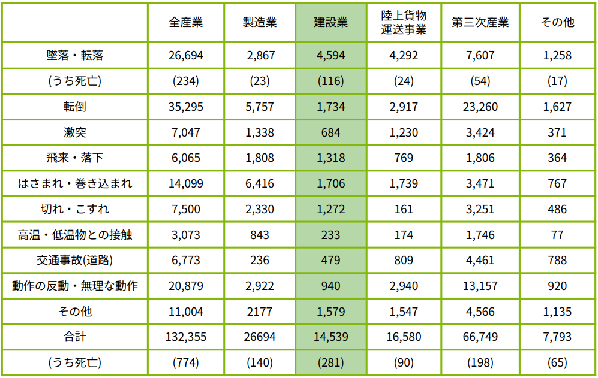

---

### ③ 災害事例と対策

#### ■事例①：送電鉄塔での墜落事故

【災害発生状況】  
電力会社の変電所で鉄塔間を移動する訓練中、作業者が**高さ約10mの電線から墜落**し宙づり状態となりました。  
約10分後には意識不明となり、約30分後に救助されましたが死亡が確認されています。

【原因】  
- フルハーネスを着用していなかった可能性  
- 宙づり状態となった際の救助が困難だった  

【対策】  
- 高所作業では**フルハーネスの着用を必須**とする  
- 宙づりによる血流障害を防ぐため、**サスペンショントラウマ対策（うっ血防止ストラップ等）**を準備する  
- 迅速に救助できる体制を事前に整備する  

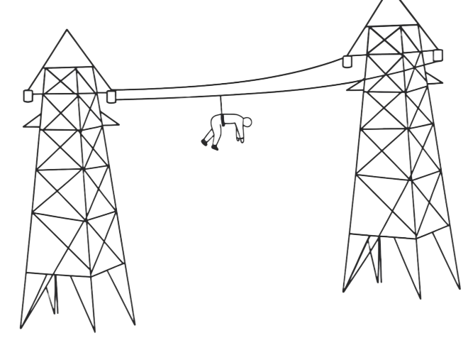

---

#### ■事例②：仮設足場からの墜落事故

【災害発生状況】  
大型ソーラーパネル建物外側の鉄骨塗装準備作業中、作業者が**高さ13mの仮設足場とパネルの間（約115cm）**で作業していました。  
足を載せていた鉄骨や根がらみから滑落し、地面に墜落。頭部外傷により死亡しました。

【原因】  
- 落下防止網や墜落制止用器具を使用していなかった  
- 本来足場として使用しない部材に乗って作業していた  

【対策】  
- 作業床の下に**落下防止網を設置**する  
- 作業者に**墜落制止用器具を確実に使用させる**  
- 無理な姿勢での作業を排除し、安全な作業床を設置する  

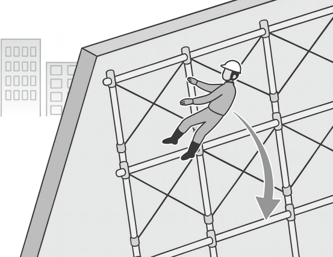

---

#### ■事例③：足場解体中の転落事故

【災害発生状況】  
マンション改修工事における足場解体作業中、資材の受け渡し後に次の足場材を受け取るため移動した際、作業者が足場から転落しました。  
移動時には**2丁掛けの墜落制止用器具の掛け替え**が必要な状況でした。  
また、日没により現場は薄暗くなっていました。

【原因】  
1. 2丁掛け器具が適切に使用されていなかった  
   - 未使用側のフックを掛ける前に既存フックを外した  
   - フックが完全に掛かっていなかった可能性  

2. 照度不足  
   - 親綱や足元が十分に視認できなかった  

3. 監視体制の不足  
   - 専任の監視人がおらず、作業主任者が兼務していた  

【対策】  
- 作業前に**2丁掛けの正しい使用方法を相互確認**する  
- 手元・足元が明確に見える照度を確保する（照明設備の設置）  
- 専任監視人を配置し、監視体制を強化する  

---

### ④ 墜落時の衝撃の大きさ

【人が5mの高さから落下した場合】

- 落下時間：約1.01秒  
- 衝突速度：**秒速9.9m（約35.6km/h）**

これは、**全力疾走して壁に衝突するのに近い衝撃**です。

衝撃力は次の式で表されます。

> F = mv² / l  

※停止までの距離（l）が短いほど、衝撃力は大きくなります。

また、質量が大きいほど衝撃も増加するため、**体重が重い人ほど受けるダメージは大きくなります。**

---

### ⑤ ショックアブソーバーの役割

高速で走行する新幹線は、駅に停止するはるか手前からブレーキをかけ、長い距離を使ってゆっくり減速します。これは乗客に強い衝撃が加わらないようにするためです。

ショックアブソーバーもこれと同じ考え方で設計されています。墜落時に急激に停止すると身体に非常に大きな力がかかりますが、ショックアブソーバーは減速にかかる時間と距離を意図的に長くすることで、その衝撃を分散し、人体へのダメージを軽減します。

つまり、「一瞬で止める」のではなく「時間をかけて止める」ことで安全性を高めているのです。

特に落下距離が長くなる作業では、それだけ停止までに必要なエネルギーも大きくなるため、状況に応じた性能のショックアブソーバーを選定することが重要です。適切な装備の選択は、重大災害の防止に直結します。

---

