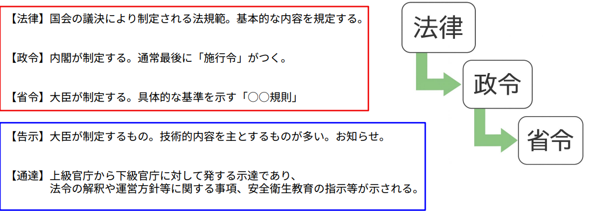

# 第4章　関係法令
---

## 1. 日本の法体系

国や国民をあるべき姿に導くために、日本国憲法が存在しています。  
そして、その憲法を具体的に実現するために、各種の法律が定められています。  
安全衛生に関するルールも、この法体系に基づいて構成されています。

#### ■ 法律
国会の議決によって制定される法規範であり、国の制度や安全衛生の基本的な内容を規定します。

#### ■ 政令
内閣が制定するもので、法律を実行するための具体的事項を定めます。通常、名称の最後に「施行令」が付きます。

#### ■ 省令
各省の大臣が制定し、より具体的な基準や技術的内容を示します。安全衛生分野では「○○規則」といった名称が多く見られます。

#### ■ 告示
大臣が制定するもので、主に技術的事項や運用上の基準などを周知するためのものです。

#### ■ 通達
上級官庁から下級官庁へ発出される指示であり、法令の解釈や運用方針、安全衛生教育の指針などが示されます。

---

## 2. 法令条文の読み方

法令を正しく理解するためには、条文の構造を把握しておくことが重要です。

- **条（じょう）**：基本単位。「第○条」や「第○条の2」などの形式があります。  
- **項（こう）**：条の中の区分。第1項は「1」を省略し、第2項から数字が付きます。  
- **号（ごう）**：項の中で内容を列挙する際に用いられます（①、②など）。  

※条文中の括弧書きは本文の補足であることが多いため、本文を理解した後に読むと理解しやすくなります。

#### ■ 法令に決まりが無い場合は対応しなくてよいのか？

1972年（昭和47年）に労働安全衛生法が制定されて以降、死亡者・死傷者数は大きく減少しています。これは、それ以前に多発していた労働災害の統計や発生原因を基にルールが整備されてきたためです。

つまり、多数の死亡事故や重大災害が発生した分野から優先的に法令化されているため、**すべての作業場面が網羅されているわけではありません。**

したがって、法令に明確な規定がない場合でも、作業上の危険が予測されるときは、事業者が自主的にルールを定めて災害を防止する必要があります。  
その具体的な手法の一つが**リスクアセスメント**です。

---

## 3. 労働安全衛生法

【法律】労働安全衛生法（昭和47年6月8日 法律第57号）

---

#### ■ 第1条（目的）
この法律は、労働基準法（昭和22年法律第49号）と相まって、労働災害の防止のための危害防止基準の確立、責任体制の明確化及び自主的活動の促進の措置を講ずるなど、その防止に関する総合的かつ計画的な対策を推進することにより、職場における労働者の安全と健康を確保するとともに、快適な職場環境の形成を促進することを目的としています。

---

#### ■ 第3条（事業者等の責務）
※法人や個人事業主等を事業者といいます。

事業者は、この法律で定める最低基準を守るだけでなく、快適な職場環境の実現と労働条件の改善を通じて、労働者の安全と健康を確保しなければなりません。  
また、国が実施する労働災害防止施策にも協力する義務があります。

① 機械・器具その他の設備を設計、製造、若しくは輸入する者、原材料を製造、若しくは輸入する者又は建設物を建設し、若しくは設計する者は、これらの設計・製造・輸入又は建設に際し、使用による労働災害の発生防止に資するよう努めなければなりません。  

② 建設工事の注文者等仕事を他人に請け負わせる者は、施工方法や工期などについて、安全で衛生的な作業を妨げる条件を付さないよう配慮しなければなりません。

---

#### ■ 第4条（労働者の責務）
労働者は、労働災害を防止するために必要な事項を守るだけでなく、事業者や関係者が実施する災害防止措置に協力するよう努めなければなりません。  
※必要な事項とは法令で定められた内容であり、この条文は「自己安全衛生義務」と呼ばれることがあります。

---

#### ■ 第10条（総括安全衛生管理者）
事業者は、政令で定める規模の事業場ごとに、厚生労働省令で定めるところにより**総括安全衛生管理者**を選任しなければなりません。

総括安全衛生管理者は、安全管理者・衛生管理者等を指揮し、次の業務を統括管理します。

① 労働者の危険または健康障害を防止するための措置に関すること。  
② 労働者の安全または衛生のための教育の実施に関すること。  
③ 健康診断の実施その他健康の保持増進のための措置に関すること。  
④ 労働災害の原因の調査および再発防止対策に関すること。  
⑤ その他、労働災害を防止するために必要な業務で厚生労働省令に定めるもの。  

また、総括安全衛生管理者は、当該事業場において事業の実施を統括管理する立場の者でなければなりません。

---

#### ■ 第12条の2（安全衛生推進者等）

事業者は、第11条第1項の事業場及び前条第一項の事業場以外の事業場で、厚生労働省令で定める規模のものごとに、厚生労働省令で定めるところにより、安全衛生推進者（第11条第1項の政令で定める業種以外の業種の事業場にあっては衛生推進者）を選任しなければなりません。

その者には、第10条第1項各号の業務（第25条の2第2項の規定により技術的事項を管理する者を選任した場合においては、同条第1項各号の措置に該当するものを除く。）を担当させる必要があります。なお、第11条第1項の政令で定める業種以外の事業場においては、衛生に係る業務に限られます。

:::tip 補足
安全衛生推進者は、比較的小規模な事業場でも安全活動を機能させるために設置される役割であり、現場の安全水準を維持するうえで重要な存在です。
:::

---

#### ■ 第15条（統括安全衛生責任者）

事業者で、一の場所において行う事業の仕事の一部を請負人に請け負わせているもの（当該事業の仕事の一部を請け負わせる契約が二以上あるため、その者が二以上あることとなるときは、当該請負契約のうちの最も先次の請負契約における注文者とする。以下「元方事業者」という。）のうち、建設業その他政令で定める業種に属する事業（以下「特定事業」という。）を行う者（以下「特定元方事業者」という。）は、その労働者及びその請負人（元方事業者の当該事業の仕事が数次の請負契約によって行われるときは、当該請負人の請負契約の後次のすべての請負契約の当事者である請負人を含む。以下「関係請負人」という。）の労働者が当該場所において作業を行うときは、これらの労働者の作業が同一の場所において行われることによって生ずる労働災害を防止するため、統括安全衛生責任者を選任しなければなりません。

また、その者に元方安全衛生管理者の指揮をさせるとともに、第三十条第一項各号の事項を統括管理させなければなりません。

ただし、これらの労働者の数が政令で定める数未満であるときは、この限りではありません。

:::tip 補足  
複数企業が同一現場で作業する場合、指揮命令系統を一本化することが重大災害の防止につながります。
:::

---

#### ■ 第16条（安全衛生責任者）※建設業・造船業

第15条第1項又は第3項の場合において、これらの規定により統括安全衛生責任者を選任すべき事業者以外の請負人で、当該仕事を自ら行うものは、安全衛生責任者を選任し、その者に統括安全衛生責任者との連絡その他の厚生労働省令で定める事項を行わせなければなりません。

② 前項の規定により安全衛生責任者を選任した請負人は、同項の事業者に対し、遅滞なく、その旨を通報しなければなりません。

:::tip 補足  
統括責任者と各請負企業の責任者が連携することで、安全管理の抜け漏れを防止します。
:::

---

#### ■ 第20条（事業者の講ずべき措置等）

事業者は、次の危険を防止するため必要な措置を講じなければなりません。

一、機械、器具その他の設備（以下「機械等」という。）による危険  
二、爆発性の物、発火性の物、引火性の物等による危険  
三、電気、熱その他のエネルギーによる危険  

:::tip 補足  
設備・エネルギーに起因する事故は重篤化しやすいため、事前対策が最も重要です。
:::
---

#### ■ 第21条

事業者は、掘削、採石、荷役、伐木等の業務における作業方法から生ずる危険を防止するために必要な措置を講じなければなりません。

② 事業者は、労働者が墜落するおそれのある場所、土砂等が崩壊するおそれのある場所等に係る危険を防止するため必要な措置を講じなければなりません。

---

#### ■ 第22条

事業者は、次の健康障害を防止するため必要な措置を講じなければなりません。

一、原材料、ガス、蒸気、粉じん、酸素欠乏空気、病原体等による健康障害  
二、放射線、高温、低温、超音波、騒音、振動、異常気圧等による健康障害  
三、計器監視、精密工作等の作業による健康障害  
四、排気、排液又は残さい物による健康障害  

---

#### ■ 第23条

事業者は、労働者を就業させる建設物その他の作業場について、通路、床面、階段等の保全並びに換気、採光、照明、保温、防湿、休養、避難及び清潔に必要な措置その他労働者の健康、風紀及び生命の保持のため必要な措置を講じなければなりません。

---

#### ■ 第24条

事業者は、労働者の作業行動から生ずる労働災害を防止するために必要な措置を講じなければなりません。

---

#### ■ 第25条

事業者は、労働災害発生の急迫した危険があるときは、直ちに作業を中止し、労働者を作業場から退避させる等必要な措置を講じなければなりません。

:::important 重要
危険時に「作業を止める」判断ができる体制は、安全管理の基本です。
:::

---

#### ■ 第25条の2

建設業その他政令で定める業種に属する事業の仕事で、政令で定めるものを行う事業者は、爆発、火災等が生じたことに伴い労働者の救護に関する措置がとられる場合における労働災害の発生を防止するため、次の措置を講じなければなりません。

一、労働者の救護に関し必要な機械等の備付け及び管理を行うこと。  
二、労働者の救護に関し必要な事項についての訓練を行うこと。  
三、前二号に掲げるもののほか、爆発、火災等に備えて、労働者の救護に関し必要な事項を行うこと。  

---

#### ■ 第26条

労働者は、事業者が第20条から第25条まで及び前条第1項の規定に基づき講ずる措置に応じて、必要な事項を守らなければなりません。

:::tip 補足  
安全は事業者だけでなく、労働者自身の遵守によって成り立ちます。
:::

---

#### ■ 第59条（安全衛生教育）

事業者は、労働者を雇い入れたときは、当該労働者に対し、厚生労働省令で定めるところにより、その従事する業務に関する安全又は衛生のための教育を行なわなければなりません。

② 前項の規定は、労働者の作業内容を変更したときについて準用します。  
③ 事業者は、危険又は有害な業務で、厚生労働省令で定めるものに労働者をつかせるときは、厚生労働省令で定めるところにより、当該業務に関する安全又は衛生のための特別の教育を行なわなければなりません。

※解釈：第②項の「作業内容の変更」には転勤等作業上の変更も含まれます。建設業では作業現場の変更（新規現場）が該当します。

#### ■ 第60条

事業者は、その事業場の業種が政令で定めるものに該当するときは、新たに職務につくこととなった職長その他の作業中の労働者を直接指導又は監督する者（作業主任者を除く。）に対し、次の事項について、厚生労働省令で定めるところにより、安全又は衛生のための教育を行なわなければなりません。

一、作業方法の決定及び労働者の配置に関すること。  
二、労働者に対する指導又は監督の方法に関すること。  
三、前二号に掲げるもののほか、労働災害を防止するために必要な事項で、厚生労働省令で定めるもの。  

:::tip 補足
現場の安全レベルは管理監督者の力量に大きく左右されるため、職長教育は極めて重要です。
:::

---

#### ■ 【政令】労働安全衛生法施行令 第13条（厚生労働大臣が定める規格又は安全装置を具備すべき機械等）

③ 法第四十二条の政令で定める機械等は、次に掲げる機械等（本邦の地域内で使用されないことが明らかな場合を除く。）とする。  

1～27（略）  
28　墜落制止用器具  

※高所作業においては、適切な規格を満たした墜落制止用器具の使用が義務付けられています。

---

#### ■ 【省令】労働安全衛生規則 第13条

法第五十九条第三項の厚生労働省令で定める危険又は有害な業務は、次のとおりとする。  

1～38（略）  

39　足場の組立て、解体又は変更の作業に係る業務  
（地上又は堅固な床上における補助作業の業務を除く。）  

40　高さが二メートル以上の箇所であって作業床を設けることが困難なところにおいて、昇降器具を用いて労働者が身体を保持しつつ行う作業（ロープ高所作業）に係る業務  

41　高さが2m以上の箇所であって、作業床を設けることが困難なところにおいて、墜落制止用器具のうちフルハーネス型のものを用いて行う作業に係る業務  

※これらの業務は「特別教育」の対象となり、従事前に教育を受ける必要があります。

---

#### ■ 第37条（特別教育の科目の省略）

事業者は、法第五十九条第三項の特別の教育（以下「特別教育」という。）の科目の全部又は一部について十分な知識及び技能を有していると認められる労働者については、当該科目についての特別教育を省略することができる。  

注）解釈：上位資格取得者や当該教育を既に受講している者等が対象。

---

#### ■ 第38条（特別教育の記録の保存）

事業者は、特別教育を行ったときは、当該特別教育の受講者、科目等の記録を作成して、これを三年間保存しておかなければならない。

※教育記録は監査や労災発生時の重要資料となるため、確実に管理する必要があります。

---

#### ■ 第39条（特別教育の細目）

前二条及び第592条の7に定めるもののほか、第36条第1号から第13号まで、第27号、第30号から第36号まで、第39号及び第41号に掲げる業務に係る特別教育の実施について必要な事項は、厚生労働大臣が定める。

---

#### ■ 第194条の22（要求性能墜落制止用器具等の使用）

事業者は、高所作業車（作業床が接地面に対し垂直にのみ上昇し又は下降する構造のものを除く。）を用いて作業を行うときは、当該高所作業車の作業床上の労働者に要求性能墜落制止用器具等を使用させなければならない。  

② 前項の労働者は、要求性能墜落制止用器具等を使用しなければならない。

---

#### ■ 第518条（作業床の設置等）

事業者は、高さが二メートル以上の箇所（作業床の端、開口部等を除く。）で作業を行う場合において墜落により労働者に危険を及ぼすおそれのあるときは、足場を組み立てる等の方法により作業床を設けなければならない。  

② 事業者は、前項の規定により作業床を設けることが困難なときは、防網を張り、労働者に要求性能墜落制止用器具等を使用させる等、墜落による労働者の危険を防止するための措置を講じなければならない。  

注）防網の設置または墜落制止用器具の使用は代替措置として認められる。

---

#### ■ 第519条（開口部等の囲い等）

事業者は、高さが二メートル以上の作業床の端、開口部等で墜落により労働者に危険を及ぼすおそれのある箇所には、囲い、手すり、覆い等を設けなければならない。  

② 囲い等を設けることが著しく困難なとき又は作業の必要上臨時に囲い等を取りはずすときは、防網を張り、労働者に要求性能墜落制止用器具等を使用させる等の措置を講じなければならない。

---

#### ■ 第520条（墜落制止用器具等の使用）

労働者は、第五百十八条第二項及び前条第二項の場合において、要求性能墜落制止用器具等の使用を命じられたときは、これを使用しなければならない。

※安全装備の着用は努力義務ではなく「義務」です。

---

#### ■ 第521条（墜落制止用器具等の取付設備等）

事業者は、高さが二メートル以上の箇所で作業を行う場合において、労働者に要求性能墜落制止用器具等を使用させるときは、安全に取り付けるための設備等を設けなければならない。  

② 事業者は、取付設備等の異常の有無について、随時点検しなければならない。

---

#### ■ 第522条（悪天候時の作業禁止）

事業者は、高さが二メートル以上の箇所で作業を行う場合において、強風、大雨、大雪等の悪天候のため、当該作業の実施について危険が予想されるときは、当該作業に労働者を従事させてはならない。

※天候リスクは重大災害につながりやすく、早期判断が重要です。

---

#### ■ 第523条（照度の保持）

事業者は、高さが二メートル以上の箇所で作業を行うときは、当該作業を安全に行うため必要な照度を保持しなければならない。

---

#### ■ 第524条（スレート等の屋根上の危険の防止）

事業者は、スレート、木毛板等の材料でふかれた屋根の上で作業を行う場合において、踏み抜きにより労働者に危険を及ぼすおそれのあるときは、幅が三十センチメートル以上の歩み板を設け、防網を張る等踏み抜きによる労働者の危険を防止するための措置を講じなければならない。

---

#### ■ 第525条（作業床）

事業者は、高さが二メートル以上の箇所（作業床の端、開口部等を除く。）で作業を行なう場合には、足場を組み立てる等の方法により作業床を設けなければならない。

ただし、作業床を設けることが著しく困難なときは、防網を張り、労働者に要求性能墜落制止用器具等を使用させる等、墜落による労働者の危険を防止するための措置を講じなければならない。

作業床は高所作業における基本的な安全設備です。安定した足場を確保することで、転落・踏み外しといったリスクを大幅に低減できます。設置が難しい場合でも代替措置を必ず講じる必要があります。

---

#### ■ 第526条（昇降するための設備の設置等）

事業者は、高さ又は深さが一・五メートルをこえる箇所で作業を行なうときは、当該作業に従事する労働者が安全に昇降するための設備等を設けなければならない。

ただし、安全に昇降するための設備等を設けることが作業の性質上著しく困難なときは、この限りではない。

② 前項の作業に従事する労働者は、同項本文の規定により安全に昇降するための設備等が設けられたときは、当該設備等を使用しなければならない。

安全な昇降設備（はしご、階段、昇降設備など）の設置は、作業中だけでなく移動時の事故防止にも直結します。特に「慣れているから使わない」といった行動は重大災害につながるため、設置された設備は必ず使用しなければなりません。

---

#### ■ 労働安全衛生法令について

労働安全衛生法（以下「安衛法」）は、労働基準法第五章の「安全及び衛生」を分離独立させて制定されたものです。  
（労働基準法の第42条〜第55条までの14条は現在削除されています。）

なお、現在も年少者や女性についての規定は労働基準法に残っています。  
したがって、安全衛生は安衛法だけではなく、労働基準法と一体的に運営していく必要があります。

---

#### ■ 注意：安衛法令は「強行法規」ともいわれます

安衛法令は当事者同士の合意にかかわらず適用される規定であり、このような法規を「強行法規」と呼びます。主に弱者保護を目的としており、「知らなかった」では済まされない法令でもあります。

法令を理解していない場合、「知らない人が悪い」と判断される可能性があります。特に「労働者は〜しなければならない」と定められている条文に違反した場合、労働者自身が処罰の対象となることもあります。

---

#### ■ 法令独特の表現に注意する

例えば次の条文です。

> 「事業者は、前項の規定により作業床を設けることが困難なときは、防網を張り、労働者に要求性能墜落制止用器具等を使用させる等、墜落による労働者の危険を防止するための措置を講じなければならない。」

これは第518条第2項の条文ですが、「防網を張り、労働者に要求性能墜落制止用器具等」とある部分を正しく理解していないと対策を誤ります。

ここでの「、」は**どちらかを選択できる**という意味であり、防網と墜落制止用器具の両方を必ず設置しなければならないという意味ではありません。現場の状況に応じて、より安全性の高い方法を選定することが重要です。

---

#### ■ 第二十四条

安衛則第三十六条第四十一号に掲げる業務に係る特別（新設）教育は、**学科教育および実技教育**により行うものとする。

② 前項の学科教育は、次の表の上欄に掲げる科目に応じ、それぞれ同表の中欄に掲げる範囲について、同表の下欄に掲げる時間以上行うものとする。

### ① 学科教育

| 科目 | 範囲 | 時間 |
|------|------|------|
| 作業に関する知識 | ①作業に用いる設備の種類、構造及び取扱い方法 ②作業に用いる設備の点検及び整備の方法 ③作業の方法 | 1時間 |
| 墜落制止用器具（フルハーネス型のものに限る。以下同じ。）に関する知識 | ①墜落制止用器具のフルハーネス及びランヤードの種類及び構造 ②墜落制止用器具のフルハーネスの装着の方法 ③墜落制止用器具のランヤードの取付け設備等への取付け方法及び選定方法 ④墜落制止用器具の点検及び整備の方法 ⑤墜落制止用器具の関連器具の使用方法 | 2時間 |
| 労働災害の防止に関する知識 | ①墜落による労働災害の防止のための措置 ②落下物による危険防止のための措置 ③感電防止のための措置 ④保護帽の使用方法及び保守点検の方法 ⑤事故発生時の措置 ⑥その他作業に伴う災害及びその防止方法 | 1時間 |
| 関係法令 | 安衛法、安衛令及び安衛則中の関係条項 | 0.5時間 |

---

③ 第一項の実技教育は、次の表の上欄に掲げる科目に応じ、それぞれ同表の中欄に掲げる範囲について、同表の下欄に掲げる時間以上行うものとする。

### ② 実技教育

| 科目 | 範囲 | 時間 |
|------|------|------|
| 労働災害の防止に関する知識（実技） | ①墜落による労働災害の防止のための措置 ②落下物による危険防止のための措置 ③感電防止のための措置 ④保護帽の使用方法及び保守点検の方法 ⑤事故発生時の措置 ⑥その他作業に伴う災害及びその防止方法 | 1時間 |
---

**補足**  
特別教育は、単なる知識の習得にとどまらず、実際の作業環境を想定した理解と安全行動の定着を目的としています。特にフルハーネス型墜落制止用器具を使用する作業では、正しい装着・点検・使用方法を習得していない場合、重大災害につながる可能性があるため、学科と実技の両方を確実に実施することが重要です。

---