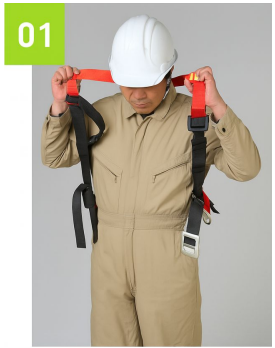
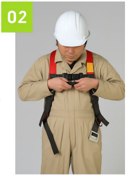
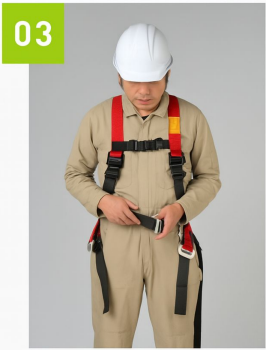
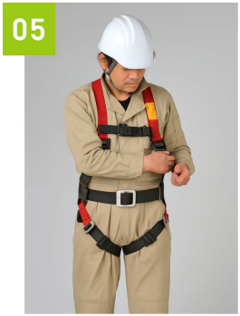
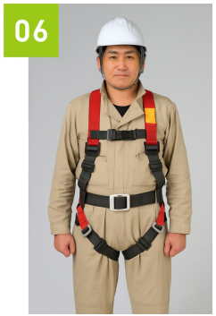
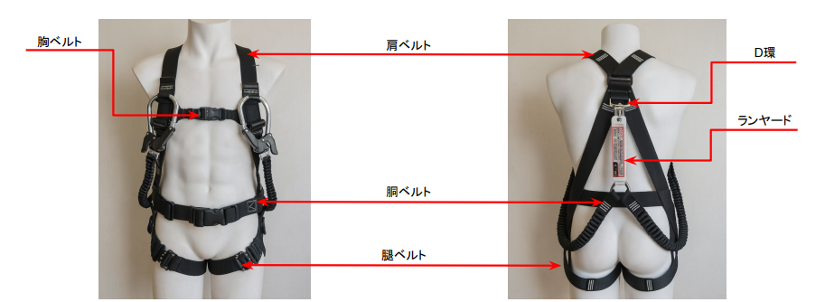
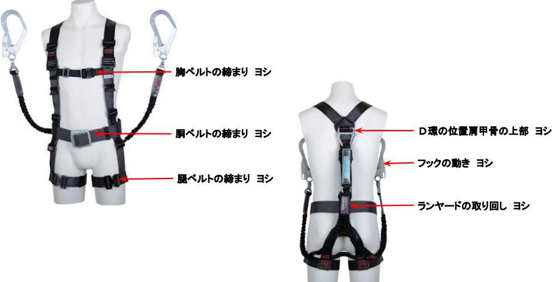
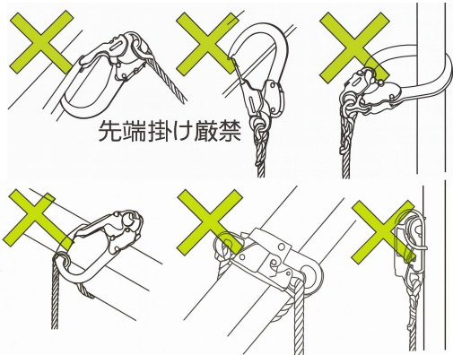

# 第5章　実習
---

## 1. フルハーネスの装着方法

### ① 作業開始前点検

墜落制止用器具を使用する作業では、不良品の使用による事故を防止するため、作業開始前の点検が不可欠です。  
点検では「指差し呼称」と「記録」を徹底し、異常の早期発見に努めましょう。

| 区分 | 点検項目 | 結果 |
|------|---------|------|
| 親綱 | 1スパン10m以下で弛みなく緊張されているか | |
| 親綱 | 摩耗、損傷、劣化、変形、変色等はないか | |
| 墜落制止用器具 | 各ベルト部に損傷、劣化、変色等はないか | |
| 墜落制止用器具 | バックル、D環に損傷、劣化、変形はないか | |
| 墜落制止用器具 | ランヤードに摩耗、損傷、劣化、変形、変色等はないか | |
| 墜落制止用器具 | フックに損傷、劣化、変形はないか | |
| 墜落制止用器具 | 各ベルトが緩んでいないか | |
| 墜落制止用器具 | D環の位置は肩甲骨の少し上方にあるか | |
| 保護帽 | 墜落用保護帽を使用しているか | |
| 保護帽 | 帽体に損傷、変形、劣化はないか | |
| 保護帽 | 衝撃吸収ライナー等に損傷はないか | |
| 保護帽 | あごひもは確実に締めているか | |
| 安全靴 | 適切なサイズを使用しているか | |
| 安全靴 | 靴ひもは確実に締めているか | |

※「使用開始年月」を必ず記録しておきましょう。

#### ■ 使用期限の目安
ロープ・ランヤード・ストラップは使用開始から**2年**、その他の器具は**3年**が目安とされています（メーカー・業界団体自主基準）。  
ただし、異常が確認された場合は期限に関わらず直ちに交換してください。

---

### ② フルハーネス型墜落制止用器具の装着

#### ■ 装着手順

  
肩ベルトに両腕を通します。

  
胸ベルトの差込バックルを確実に留め、体に合わせて長さを調整します。

  
胴ベルトをバックルに通し、適切な位置で固定します。

  
左右の腿ベルトを締め、緩みがないよう調整します。

  
左右の肩ベルトの長さを調整し、体に密着させます。

  
全体を再確認し、ねじれや緩みがないことを確認して装着完了です。

#### ■ 実技のポイント

二人一組で互いに指差し呼称を行い、客観的に確認し合いましょう。  
フルハーネスは体格に合わせた調整が必要なため装着に時間がかかります。共用は避け、可能な限り個人専用とすることが望ましいです。

#### ■ 装着チェック項目

- ヘルメットは真っ直ぐ装着しているか  
- あご紐は緩んでいないか  
- 上着の収まりは良いか  
- 袖口のボタンは留まっているか  
- 保護手袋を着用しているか  
- ズボンの裾はまとまっているか  
- 胸ベルトは確実に締まっているか  
- 腿ベルトは確実に締まっているか  
- D環は肩甲骨上部に位置しているか  
- フックの動きは良好か  
- ランヤードはD環に正しく接続されているか  
- ランヤードの取り回しに問題はないか  
- 安全靴の紐は緩んでいないか  

#### ■ 各部名称の確認

各部の名称と役割を理解しておくことで、正しい装着と迅速な点検が可能になります。

#### ■ 装着状態の確認例

- 胸ベルトの締まり：ヨシ  
- 胴ベルトの締まり：ヨシ  
- 腿ベルトの締まり：ヨシ  
- D環の位置：肩甲骨上部で良し  
- フックの動き：ヨシ  
- ランヤードの取り回し：ヨシ  

---

### ③ 墜落制止用器具のフックの取付け

墜落制止用器具を使用する際は、フックを正しく取り付けなければ外れて墜落する危険があります。

#### ■ 重要ポイント

① 墜落時、フックには**鉛直方向に荷重**がかかります。  
側面方向に力がかかると外れやすくなるため注意が必要です。  

② 作業開始前点検では、フックを取付設備に掛けて引っ張り、確実に固定されているか確認してください。  
墜落時は下向きに力がかかることを常に意識しましょう。

---

フルハーネスの正しい装着と確実な点検は、墜落災害を防ぐ最も基本的な安全行動です。  
作業前のわずかな確認が重大事故の防止につながることを理解し、必ず実施してください。
