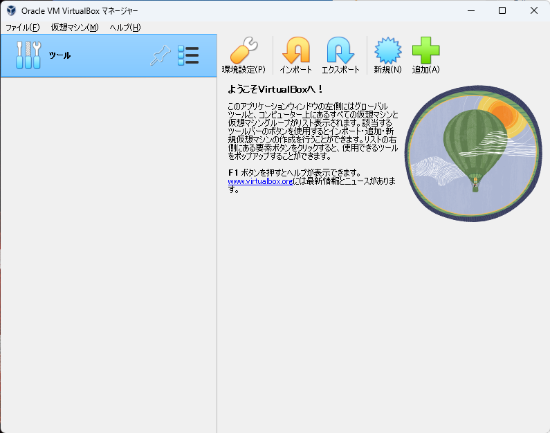
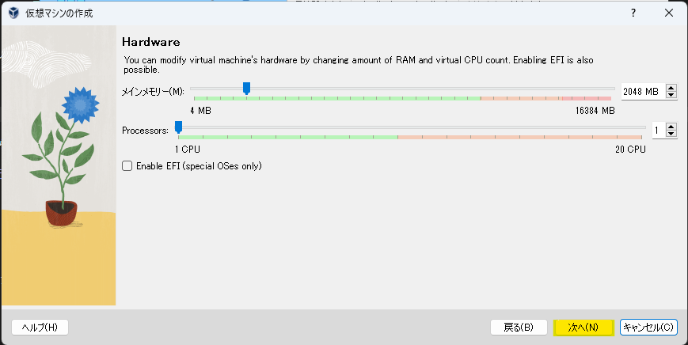
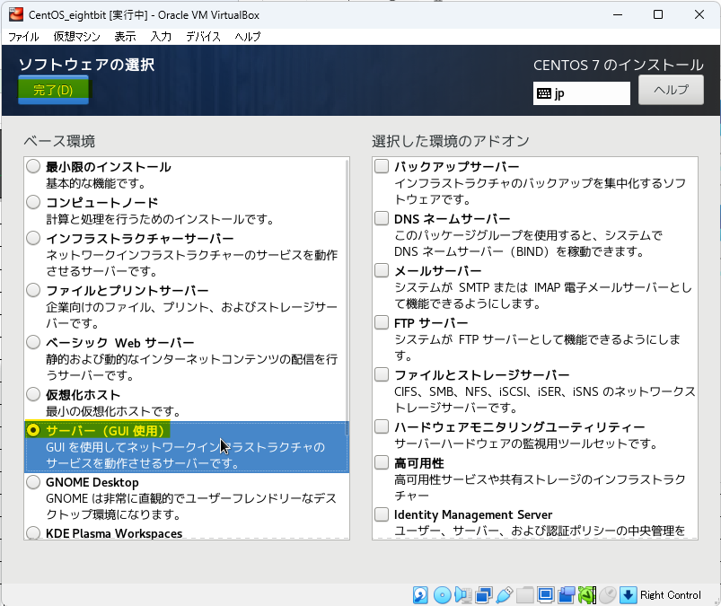

# Linux基礎 CentOS9

    
導入

    

## 環境確認

### 1. CentOSイメージファイル  

仮想マシンにインストールするイメージファイルです  
約 **10GB** のファイルですので、予めダウンロードしてデスクトップ等、わかりやすい場所に移動しておきましょう  

※実行する必要はありません

[CentOSイメージファイル](https://ftp.iij.ad.jp/pub/linux/centos-stream/9-stream/BaseOS/x86_64/iso/CentOS-Stream-9-latest-x86_64-dvd1.iso)

### 2. VirtualBox

**まずはお使いのPCにインストールされているかを確認して下さい**  
仮想環境を構築するためのアプリケーションです  
WindowsPCの中に仮想的にCentOS(LinuxPC)を構築します  
ダウンロード完了したら実行し、インストールまで済ませましょう  

[VirtualBoxインストーラ](https://download.virtualbox.org/virtualbox/7.0.18/VirtualBox-7.0.18-162988-Win.exe)

### 3. teraterm

VirtualBox上に構築した仮想マシンに対して、SSH接続して操作するためのアプリケーションです  

:::note
SSH（Secure Shell）とは、ネットワークを介して別のコンピューターやネットワーク機器などを操作するために使われるプロトコルです。
:::

ダウンロード完了したら実行し、インストールまで済ませましょう

[teratermインストーラ](https://github.com/TeraTermProject/teraterm/releases/download/v5.2/teraterm-5.2.exe)

    

    
1. 仮想マシン作成手順

    

### 仮想マシン作成

**VirtualBoxマネージャ画面**  

VirtualBoxを起動し、以下の画面を表示したら**右上**の `新規` をクリック

**仮想マシン概要設定画面**  

黄色いハイライト部分を画面と同じ様に設定しましょう
- 名前 → 仮想マシンの名前(任意の名前で構いません)
- タイプ → **Linux**
- バージョン → **Red Hat 9.x (64bit)**

設定したら `次へ` をクリック

**ハードウェアリソース設定画面1**  

メモリ容量とCPU割当の設定画面です  
特に変更せずに `次へ` をクリック

**ハードウェアリソース設定画面2**  

ストレージ容量設定画面です  
黄色ハイライトの箇所を `16.00 GB` に設定して `次へ` をクリック

**仮想マシン設定概要画面**

作成する仮想マシンの概要を確認する画面です  
以下の画像と比較し、大きな差異がない事を確認し、`完了` をクリック

**VirtualBoxマネージャ画面**  

左側に赤い帽子の項目が表示されます(これが一つの仮想マシンです)  
該当項目を右クリックし、`設定` をクリック

**仮想マシン設定画面(ストレージ)**

`ストレージ` > `空` > 右上の`◎` を順にクリック

以下の選択項目からは `ディスクファイルを選択` をクリックし、  
[導入](#1-centosイメージファイル)でダウンロードしたCentOSのイメージファイルを選択します  

イメージファイルを選択後、元の画面に戻ります  
黄色ハイライト部分が `CentOS-Stream9-...` のような表記になっている事を確認して下さい

同画面左の `ネットワーク` > `割り当て` のドロップダウンリストを開き、  
**ブリッジアダプター** を選択して `OK` をクリックして下さい

以上で仮想マシンの作成は完了です
    

    
2. CentOSインストール手順

    

### CentOSインストール

以下の画面から作成した仮想マシンをクリックした状態で右上の `起動` をクリック

**仮想マシン画面**

仮想マシンは別ウィンドウで動作を確認することができます  
最初に以下の画面が表示されるので、一度画面をクリックし、`↑` キーを押し、  
 `Install CentOS 9` にカーソルを合わせた状態で `Enter` キーを押して下さい

 :::caution
仮想マシンの画面をクリックすると**ホストOS側(Windows)のマウス**が動かせなくなります  
これは**右の** `ctrl` キーを押すことで解消します  
 :::

**CentOSインストール画面**

しばらく待つと以下のような画面が表示されます  
言語選択では特に理由がない限り `日本語` を選択し、`続行` をクリック

<!-- 
:::caution
この次の手順は、インストールする環境に合わせて以下どちらかを参照して下さい
:::
 

    
GUIを使用する場合

    

以下の画面になったら黄色ハイライトの `ソフトウェアの選択` をクリック  

以下の画面が表示されるので、`サーバー(GUI 使用)` を選択し、`完了` をクリック

    

 -->
<!--

    
GUIを使用しない場合

    

 -->
黄色ハイライトの `ソフトウェアの選択` をクリック  

以下の画面が表示されるので、`Minimal Install` を選択し、`完了` をクリック

<!--
    

 -->

`インストール先` をクリック

以下の画面が表示されたら、**特に何も操作せず** `完了` をクリック

 `ROOTパスワード` をクリック

黄色ハイライト部分に `root` と入力し、  
 `パスワードによるroot SSHログインを許可` にチェックを入れて
`完了` を**2回**クリック  

:::danger
ここでは仮想マシンの管理者ユーザのパスワードを設定しています  
設定したパスワードを忘れてしまうと1からCentOSをインストールすることになります  
本来好ましくありませんが、研修中に**ログインできない**等の余計なトラブル防止のため、パスワードは `root` に設定しましょう  

`パスワードによるroot SSHログインを許可`   
とは皆さんが作成した仮想マシンにトラブルが発生した際、講師のPCからアクセスするために必要な設定です    
チェックを入れないと対応が大幅に遅れてしまうため、忘れないようにして下さい  
:::

`ユーザの作成` をクリック

以下の画面が表示されたら黄色ハイライト部分に任意の値を入力して下さい  
こちらは**一般ユーザ**ですが、**ユーザ名**、**パスワード**は忘れないようにメモしておきましょう
入力できたら `完了` をクリック

以下の画面で黄色ハイライト部分が同じような表示になっている事を確認し、 `インストールの開始` をクリック  
インストールが始まりますがしばらく時間がかかります  
:::note
GUIを使用しない(**Minimal Install**)の場合は比較的短時間で完了します  
:::

インストールが完了すると以下のように**右下**に `再起動` ボタンが表示されるのでクリック  

<!-- 
:::caution
この次の手順は、インストールする環境に合わせて以下どちらかを参照して下さい
:::

    
GUIを使用する場合

    

再起動後、以下の画面が表示されるので先ほど設定した**一般ユーザ**のパスワードを入力し、`サインイン` をクリック

初回起動時のみ以下の画面が表示されます  
`必要ありません` をクリック

以下のデスクトップ画面が表示されればインストールは完了です

    

    
GUIを使用しない場合

    

 -->
再起動後、以下の画面が表示されるので  
`localhost login:` に先ほど設定した**一般ユーザ名**入力し、`Enter`  

下に `Password:` と表示されるので**一般ユーザ**のパスワード入力し、`Enter`
:::caution
パスワードを入力する際、一見キーボードが反応していないように思えますが、入力はされています  
ユーザのパスワードを盗み見られる事を忌避し、パスワードは画面には表示されない仕様です  
:::

`[ユーザ名@localhost ~]$` の表示が出ていればサインインは完了です  

<!-- 
    

 -->
    

    
3. SSH接続手順

    

### SSH接続

:::caution
この次の手順は、インストールする環境に合わせて以下どちらかを参照して下さい
:::
<!--

    
GUIを使用する場合

    

仮想マシンデスクトップ画面下部の `端末` をクリック

以下の黒い画面が表示されたら `ip a`と入力して `Enter` キーを押し、  
画面と同じような結果が出てくることを確認して下さい  

次に黄色ハイライト部分を確認し、その仮想マシンに割り当てられている **IPアドレス** を控えておきましょう

    

    
GUIを使用しない場合

    

 -->
`[ユーザ名@localhost ~]$` が表示されている状態で `ip a`と入力して `Enter` キーを押し、  
画面と同じような結果が出てくることを確認して下さい   

次に黄色ハイライト部分を確認し、その仮想マシンに割り当てられている **IPアドレス** を控えておきましょう

<!-- 
    

 -->

teratermを起動し、**ホスト** 欄に先ほど確認した IPアドレス を入力して `OK` をクリック

初回接続時のみ以下の画面が表示されます  
特に何も操作せず `続行` をクリック

ご自身で設定した **一般ユーザ** のユーザ名とパスワードを入力し、`OK` をクリック

以下の黒い画面が表示されれば **SSH接続** は完了です

    

上記の手順が完了したら以下の動画で学習を進めて下さい  

[**【Linux動画リンク】**](https://drive.google.com/drive/folders/14_1YP1DNkI2bV8HTzek4C0i73et3iTvt?usp=sharing)

:::caution
動画内の講師と同じようにコマンドを打ちながら学習を進めてください  
コマンド入力は必ずテラタームで入力するようにお願いします  
:::

    
課題

    

## 概要
virtualbox上に2台のマシンを作成します  
1台は**DNSサーバ**の役割を、もう1台は**WEBサーバ**の役割を持たせましょう  
 
最終的に以下の要件を満たすこと  
1. ホスト(Windows)PCのブラウザで任意のドメインを入力
2. DNSサーバで名前解決を行う
3. ホストPCのブラウザにWordpressで作成したホームページが表示される

## 環境構成

## 進め方
- CentOSはMinimal Installで進めて下さい  
- 知らない単語は調べましょう
- web上の特定の手順を鵜呑みにしないようにしましょう
- 詰まってしまった場合は講師まで連絡しましょう

    
Step1 (Webサーバ構築)

    

virtualboxでcentos Stream9のマシンを構築し、LAMP環境を構成してください  
 

### 1. LAMP環境構築
|LAMP|ソフトウェア名称|
|:---:|---|
|L|**L**inux (CentOS Stream9)|
|A|**A**pache|
|M|**M**ySQL|
|P|**p**hp|

上記のアプリを**バージョンに注意して**インストールしましょう  
MySQL, phpに関しては指定のバージョンをインストールするために**リポジトリ**のインストールが必ず必要です

:::caution
※各種ソフトウェアバージョン指定   

|ソフトウェア|バージョン指定|
|--|--|
|PHP |8.3以上|
|MySQL |8.4以上|
|ワードプレス|最新バージョン|
:::

### 2.  wordpressインストール ~ 動作確認

LAMP環境ができましたら、Wordpressをダウンロードし、  
windowsPCのブラウザからホームページを見れるようにしてください  
以上でStep1は完了です  

:::note
#### その他必須設定
- **selinux**無効化
- **firewall**でhttpを許可
- Wordpress用データベースの作成およびユーザの作成&権限追加
- wordpressディレクトリの**所有者変更**
- httpd.conf **ドキュメントルート**の変更
:::

    

    
Step2 (DNSサーバ構築)

    

virtualboxでcentos Stream9のマシンを構築し、
BIND(**named-chroot**)をインストールしてDNSサーバを構築して下さい  

:::caution
※**named** と **named-chroot** がインストールされますが、**named-chroot** のみを使用して下さい
:::

:::tip
#### 必須設定
- **selinux**無効化
- **firewall**でdnsを許可
- zoneファイル作成 & 所有者変更
- named.conf の編集
- resolv.conf の編集(ローカル環境における名前解決確認時に設定が必要です)
:::

:::note
#### 構築が完了したら
1. 設定したドメインがローカルで名前解決ができるかどうか、**nslookup**コマンドを使用して確認しましょう  
2. windowsPCから同じ様に**nslookup**コマンドで確認しましょう(Windows側のDNS設定が必要です)  
3. windowsPCのブラウザから設定したドメインにアクセスしてwordpressの画面が表示されることを確認しましょう
:::

    

    

