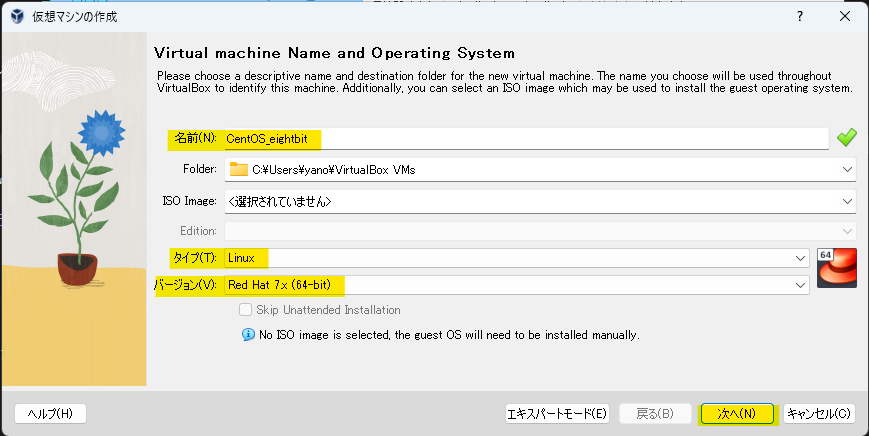

# Linux基礎 CentOS7

    
導入

    

## 環境確認

### 1. CentOSイメージファイル  

仮想マシンにインストールするイメージファイルです  
約 **4GB** のファイルですので、予めダウンロードしてデスクトップ等、わかりやすい場所に移動しておきましょう  

※実行する必要はありません

[CentOSイメージファイル](//ftp.iij.ad.jp/pub/linux/centos/7.9.2009/isos/x86_64/CentOS-7-x86_64-DVD-2207-02.iso)

### 2. VirtualBox

**まずはお使いのPCにインストールされているかを確認して下さい**  
仮想環境を構築するためのアプリケーションです  
WindowsPCの中に仮想的にCentOS(LinuxPC)を構築します  
ダウンロード完了したら実行し、インストールまで済ませましょう  

[VirtualBoxインストーラ](https://download.virtualbox.org/virtualbox/7.0.14/VirtualBox-7.0.14-161095-Win.exe)

### 3. teraterm

VirtualBox上に構築した仮想マシンに対して、SSH接続して操作するためのアプリケーションです  

:::note
SSH（Secure Shell）とは、ネットワークを介して別のコンピューターやネットワーク機器などを操作するために使われるプロトコルです。
:::

ダウンロード完了したら実行し、インストールまで済ませましょう

[teratermインストーラ](https://github.com/TeraTermProject/osdn-download/releases/download/teraterm-5.0/teraterm-5.0.exe)

    

    
1. 仮想マシン作成手順

    

### 仮想マシン作成

**VirtualBoxマネージャ画面**  

VirtualBoxを起動し、以下の画面を表示したら**右上**の `新規` をクリック

**仮想マシン概要設定画面**  

黄色いハイライト部分を画面と同じ様に設定しましょう
- 名前 → 仮想マシンの名前(任意の名前で構いません)
- タイプ → **Linux**
- バージョン → **Red Hat 7.x (64bit)**

設定したら `次へ` をクリック

**ハードウェアリソース設定画面1**  

メモリ容量とCPU割当の設定画面です  
特に変更せずに `次へ` をクリック

**ハードウェアリソース設定画面2**  

ストレージ容量設定画面です  
黄色ハイライトの箇所を `16.00 GB` に設定して `次へ` をクリック

**仮想マシン設定概要画面**

作成する仮想マシンの概要を確認する画面です  
以下の画像と比較し、大きな差異がない事を確認し、`完了` をクリック

**VirtualBoxマネージャ画面**  

左側に赤い帽子の項目が表示されます(これが一つの仮想マシンです)  
該当項目を右クリックし、`設定` をクリック

**仮想マシン設定画面(ストレージ)**

`ストレージ` > `空` > 右上の`◎` を順にクリック

以下の選択項目からは `ディスクファイルを選択` をクリックし、  
[導入](#1-centosイメージファイル)でダウンロードしたCentOSのイメージファイルを選択します  

イメージファイルを選択後、元の画面に戻ります  
黄色ハイライト部分が `CentOS-7-x86_64...` のような表記になっている事を確認して下さい

同画面左の `ネットワーク` > `割り当て` のドロップダウンリストを開き、  
**ブリッジアダプター** を選択して `OK` をクリックして下さい

以上で仮想マシンの作成は完了です
    

    
2. CentOSインストール手順

    

### CentOSインストール

以下の画面から作成した仮想マシンをクリックした状態で右上の `起動` をクリック

**仮想マシン画面**

仮想マシンは別ウィンドウで動作を確認することができます  
最初に以下の画面が表示されるので、一度画面をクリックし、`↑` キーを押し、  
 `Install CentOS 7` にカーソルを合わせた状態で `Enter` キーを押して下さい

 :::caution
仮想マシンの画面をクリックすると**ホストOS側(Windows)のマウス**が動かせなくなります  
これは**右の** `ctrl` キーを押すことで解消します  
 :::

**CentOSインストール画面**

しばらく待つと以下のような画面が表示されます  
言語選択では特に理由がない限り `日本語` を選択し、`続行` をクリック

以下の画面になったら黄色ハイライトの `ソフトウェアの選択` をクリック  

:::note
GUIを使用しない場合、この手順の実施は必要ありません
:::

以下の画面が表示されるので、`サーバー(GUI 使用)` を選択し、`完了` をクリック

`インストール先` をクリック

以下の画面が表示されたら、**特に何も操作せず** `完了` をクリック

`ネットワークとホスト名` をクリック

右上のスイッチを `オフ` から `オン` に切り替え、  
黄色ハイライト部分の **「接続済みです」の表示** と **IPアドレス** が振られている事を確認しましょう  
確認できたら `完了` をクリック

以下の画面で黄色ハイライト部分が同じような表示になっている事を確認し、 `インストールの開始` をクリック

インストールが始まりますがしばらく時間がかかります  
待っている間にユーザの設定を終わらせましょう  

まずは `ROOTパスワード` をクリック

黄色ハイライト部分に `root` と入力し、`完了` を**2回**クリック

:::danger
ここでは仮想マシンの管理者ユーザのパスワードを設定しています  
設定したパスワードを忘れてしまうと1からCentOSをインストールすることになります  
本来好ましくありませんが、研修中に**ログインできない**等の余計なトラブル防止のため、簡単なパスワードを設定しましょう  
:::

`ユーザの作成` をクリック

以下の画面が表示されたら黄色ハイライト部分に任意の値を入力して下さい  
こちらは**一般ユーザ**ですが、**ユーザ名**、**パスワード**は忘れないようにメモしておきましょう
入力できたら `完了` をクリック

インストールが完了すると以下のように**右下**に `再起動` ボタンが表示されるのでクリック  

再起動すると以下のような画面が表示されます  
まずは `LICENSE INFORMATION` をクリック

以下の画面では下部の `ライセンス契約に同意します` にチェックを入れ、`完了` をクリック

黄色ハイライト部分を確認し、右下の `設定の完了` をクリック

しばらくするとログイン画面に先ほど設定した**一般ユーザ**が表示されるので、  
該当アカウントをクリック

同様に先ほど設定した**一般ユーザ**のパスワードを入力し、`サインイン` をクリック

初回起動時のみ以下の画面が表示されます  
同様の設定になっていることを確認し、 `次へ` をクリック

同様の設定になっていることを確認し、 `次へ` をクリック

同様の設定になっていることを確認し、 `次へ` をクリック

`スキップ` をクリック

`CentOS Linux を使い始める` をクリック

続けて以下の画面が表示されますが、右上の `✕` で閉じます

以下のデスクトップ画面が表示されればインストールは完了です

    

    
3. SSH接続手順

    

### SSH接続

仮想マシンデスクトップ左上の `アプリケーション` > `システムツール` > `端末` をクリック

以下の白い画面が表示されたら `ip a`と入力して `enter` キーを押し、  
画面と同じような結果が出てくることを確認して下さい  

次に黄色ハイライト部分を確認し、その仮想マシンに割り当てられている **IPアドレス** を控えておきましょう

teratermを起動し、**ホスト** 欄に先ほど確認した IPアドレス を入力して `OK` をクリック

初回接続時のみ以下の画面が表示されます  
特に何も操作せず `続行` をクリック

ご自身で設定した **一般ユーザ** のユーザ名とパスワードを入力し、`OK` をクリック

以下の黒い画面が表示されれば **SSH接続** は完了です

    

上記の手順が完了したら以下の動画で学習を進めて下さい  

[**【Linux動画リンク】**](https://drive.google.com/drive/folders/14_1YP1DNkI2bV8HTzek4C0i73et3iTvt?usp=sharing)

:::caution
動画内の講師と同じようにコマンドを打ちながら学習を進めてください  
コマンド入力は必ずテラタームで入力するようにお願いします  
:::

    
課題

    

## 概要
virtualbox上に2台のマシンを作成します  
1台は**DNSサーバ**の役割を、もう1台は**WEBサーバ**の役割を持たせましょう  
 
最終的に以下の要件を満たすこと  
1. ホスト(Windows)PCのブラウザで任意のドメインを入力
2. DNSサーバで名前解決を行う
3. ホストPCのブラウザにWordpressで作成したホームページが表示される

## 環境構成

## 進め方
- 知らない単語は調べましょう
- web上の特定の手順を鵜呑みにしないようにしましょう
- 詰まってしまった場合は講師まで連絡しましょう

    
Step1 (Webサーバ構築)

    

virtualboxでcentos7のマシンを1台構築し、LAMP環境を構成してください  
（インストール中サーバGUIを使用するにはチェックを入れないでください）  

### 1. LAMP環境構築
|LAMP|ソフトウェア名称|
|:---:|---|
|L|**L**inux (CentOS７.9)|
|A|**A**pache|
|M|**M**ySQL|
|P|**p**hp|

上記のアプリを**バージョンに注意して**インストールしましょう  
MySQL, phpに関しては指定のバージョンをインストールするために**リポジトリ**のインストールが必ず必要です

:::caution
※各種ソフトウェアバージョン指定   

|ソフトウェア|バージョン指定|
|--|--|
|PHP |8.0以上|
|MySQL |8.0以上|
|ワードプレス|最新バージョン|
:::

### 2.  wordpressインストール ~ 動作確認

LAMP環境ができましたら、Wordpressをダウンロードし、  
windowsPCのブラウザからホームページを見れるようにしてください  
以上でStep1は完了です  

:::note
#### その他必須設定
- **selinux**無効化
- **firewall**でhttpを許可
- Wordpress用データベースの作成およびユーザの作成&権限追加
- wordpressディレクトリの**所有者変更**
- httpd.conf **ドキュメントルート**の変更
:::

    

    
Step2 (DNSサーバ構築)

    

BIND(**named-chroot**)をインストールしてDNSサーバを構築して下さい  

:::tip
#### 必須設定
- **selinux**無効化
- **firewall**でdnsを許可
- zoneファイル作成 & 権限変更
- named.conf の編集
- resolv.conf の編集
:::

:::note
#### 構築が完了したら
1. 設定したドメインがローカルで名前解決ができるかどうか、**nslookup**コマンドを使用して確認しましょう  
2. windowsPCから同じ様に**nslookup**コマンドで確認しましょう  
3. windowsPCのブラウザから設定したドメインにアクセスしてwordpressの画面が表示されることを確認しましょう
:::

    

    

